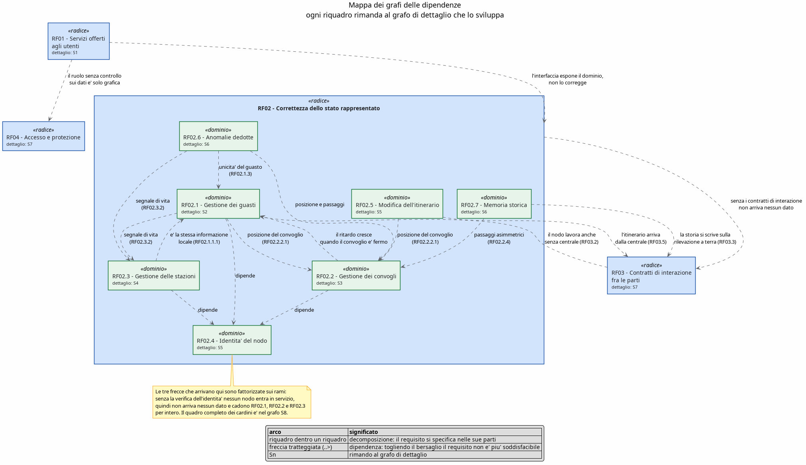
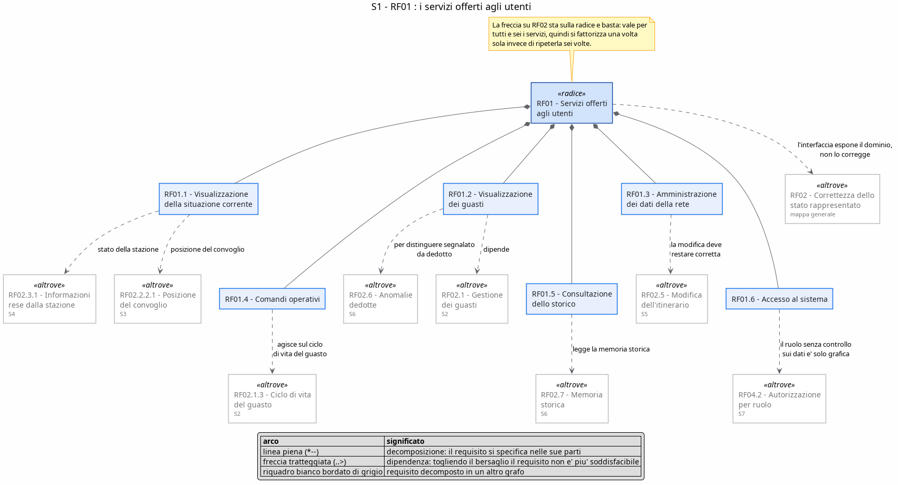
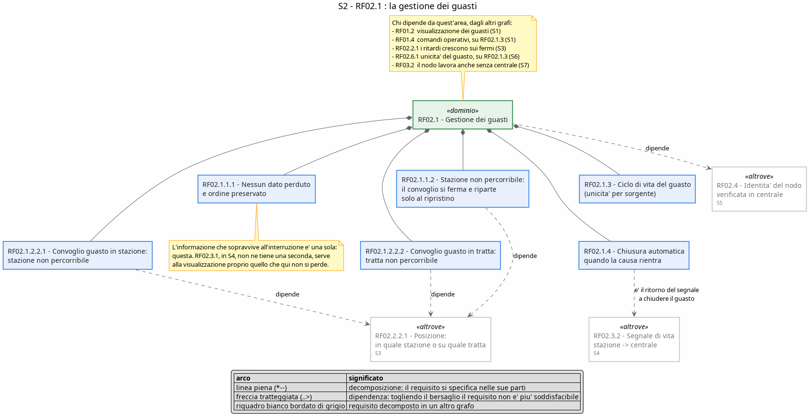
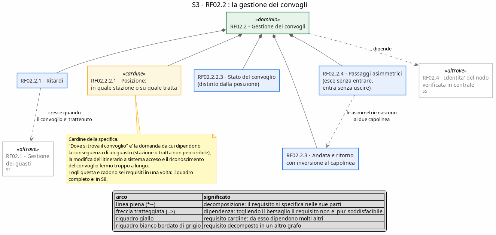
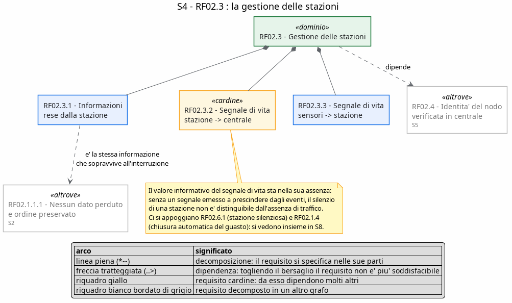
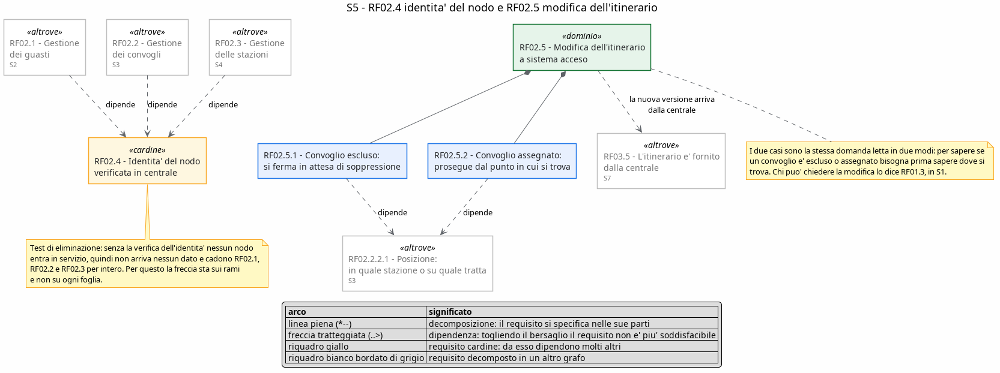
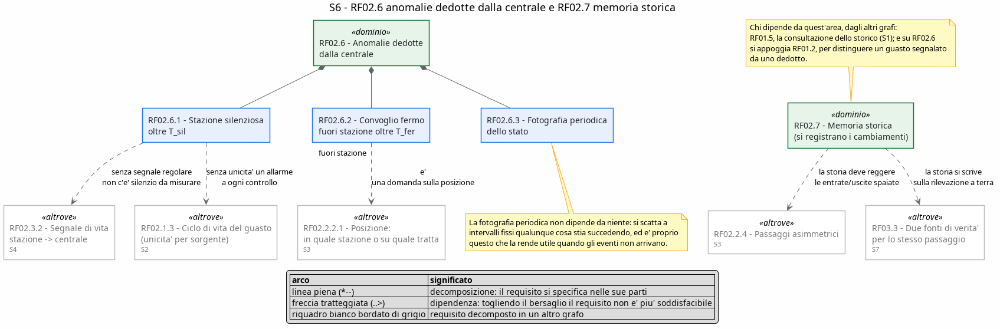
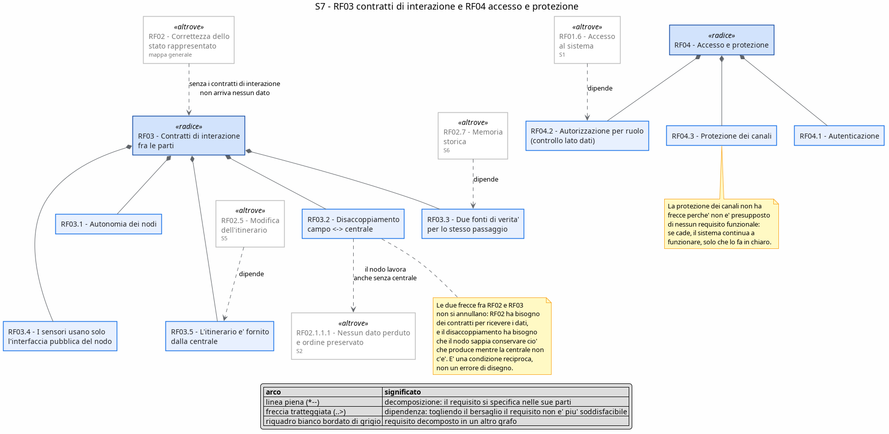
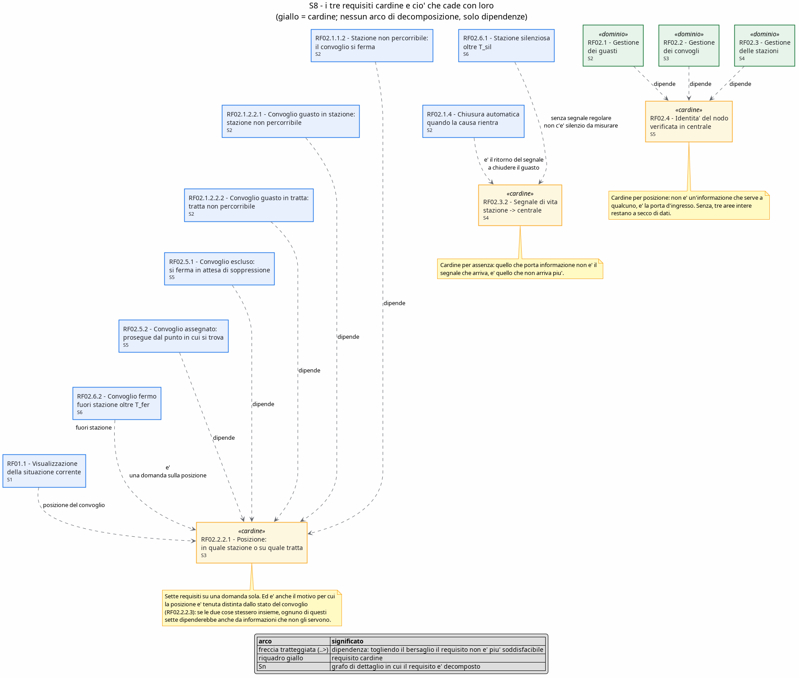

#+title: Requisiti del sistema - prospettiva di specifica
#+author: Marco

* Cosa contiene questo documento

Questo documento descrive il sistema di monitoraggio e gestione del traffico ferroviario *da fuori*:
dice che cosa il sistema deve fare e come si fa a vedere che lo sta facendo, senza mai dire con quali
mezzi lo fa.

Di un sistema si puo' parlare a tre altezze diverse:

1. *concettuale* :: si parla del dominio (treni, stazioni, corse) come se il software non esistesse;
2. *specifica* :: si parla del software, ma solo attraverso cio' che offre e cio' che promette: le
   sue interfacce, i suoi obblighi, il comportamento che un osservatore esterno puo' controllare;
3. *implementazione* :: si parla di come e' fatto dentro: moduli, classi, protocolli, tabelle.

Qui si sta *solo al livello 2*. Ogni parte del sistema e' trattata come una scatola nera con un
contratto: si dice che cosa le si puo' chiedere, che cosa e' tenuta a garantire e in che condizioni,
non che cosa succede al suo interno.

** Regole che ho seguito nello scrivere i requisiti

- ogni requisito e' *verificabile stando fuori dal sistema*: cio' che afferma si osserva su una
  schermata, su un dato consultabile o sul comportamento visibile di un nodo, mai leggendo il codice;
- non compaiono nomi di file, di classi, di funzioni, di rotte, di protocolli, di tabelle o di
  librerie; dove serve nominare qualcosa si nomina il *ruolo*, non l'oggetto che lo ricopre;
- non compare lo stato di avanzamento del lavoro: qui c'e' cio' che il sistema *deve* fare, non
  quanto ne sia stato realizzato;
- i tempi non sono numeri sparsi nel testo ma *parametri* con un nome e un valore predefinito, cosi'
  un requisito resta valido anche se il valore cambia;
- cio' che il sistema deliberatamente *non* fa e' scritto in modo esplicito, perche' un confine
  dichiarato e' parte della specifica tanto quanto una funzionalita' richiesta.

Come e' costruito il sistema dentro, e con quali tecnologie, e' materia dei documenti di
architettura: qui non se ne parla nemmeno di sfuggita.

* Perimetro del sistema e parti coinvolte

** Il confine

Sta *dentro* al sistema tutto cio' di cui questo documento detta il comportamento:

- la *centrale operativa*, che raccoglie, decide e conserva;
- i *nodi di stazione*, uno per ogni stazione della rete;
- i *nodi treno*, uno per ogni convoglio in servizio, ciascuno gemello digitale del proprio
  convoglio;
- l'*applicazione web*, unico punto da cui gli utenti guardano e comandano.

Sta *fuori* dal sistema, e viene trattato come sorgente o destinatario di eventi:

- gli *utenti* (tecnico e amministratore);
- i *sensori di binario*, installati in stazione;
- i *sensori di bordo*, installati sul convoglio;
- la *squadra di manutenzione*, che opera nel mondo fisico e non nel software;
- il *convoglio reale*, di cui il nodo treno e' la rappresentazione.

** Attori

- Tecnico :: sorveglia la rete. Vede tutto lo stato corrente e lo storico, reagisce alle emergenze
  (manda gli operatori, dichiara risolto un guasto), ma non modifica l'anagrafica della rete.
- Amministratore :: governa la rete. Puo' fare tutto quello che fa il tecnico e in piu' e' l'unico
  che puo' creare, modificare ed eliminare stazioni, convogli, collegamenti e itinerari.
- Sensore di binario :: rileva il passaggio di un convoglio in stazione e lo dichiara al nodo di
  stazione; dichiara inoltre di essere vivo e di essere guasto.
- Sensore di bordo :: rileva un guasto del convoglio e lo dichiara al nodo treno.

** Le parti del sistema viste come scatole nere

#+attr_latex: :align |p{0.16\textwidth}|p{0.34\textwidth}|p{0.36\textwidth}|
| parte              | che cosa le si puo' chiedere                                             | che cosa e' tenuta a garantire                                              |
|--------------------+--------------------------------------------------------------------------+-----------------------------------------------------------------------------|
| centrale operativa | lo stato corrente della rete, lo storico, l'esecuzione dei comandi        | che cio' che mostra corrisponda a cio' che i nodi le hanno detto e che non perda i dati di transito |
| nodo di stazione   | quali convogli ha sui binari, qual e' il suo stato operativo             | di dichiarare ogni transito rilevato, di sopravvivere alla caduta del collegamento e di non perdere nulla nel frattempo |
| nodo treno         | dove si trova, come sta, quanto ritardo ha accumulato                    | di percorrere l'itinerario assegnato e di obbedire agli ordini che riceve dalla centrale |
| applicazione web   | di mostrare lo stato e di inoltrare i comandi permessi al ruolo          | di mostrare informazione aggiornata e di non offrire comandi che il ruolo non puo' esercitare |

Il fatto che ogni convoglio e ogni stazione siano parti *distinte e autonome*, e non pezzi di un
unico simulatore, non e' un dettaglio realizzativo: e' un obbligo osservabile, ed e' scritto come
requisito in RF03.1.

* Glossario dei termini di dominio

- Stazione :: nodo della rete in cui i convogli entrano, sostano ed escono. Ha un nome, una
  posizione geografica e uno stato operativo.
- Tratta elementare :: collegamento diretto fra due stazioni adiacenti, senza fermate intermedie.
  E' l'unita' con cui si compone un percorso.
- Itinerario :: sequenza ordinata di stazioni che un convoglio deve percorrere, con il tempo di
  percorrenza previsto fra una tappa e la successiva. Nelle schermate e' chiamato anche *tratta*.
- Capolinea :: prima e ultima stazione di un itinerario.
- Direzione :: verso di percorrenza dell'itinerario, *andata* o *ritorno*.
- Corsa :: percorrenza dell'itinerario da un capolinea all'altro in una direzione.
- Convoglio :: il treno in servizio, identificato da un numero. Ha una posizione, uno stato, un
  ritardo accumulato e un numero di passeggeri a bordo.
- Transito :: passaggio di un convoglio per una stazione. E' di due tipi, *entrata* e *uscita*, ed e'
  sempre riferito a un istante.
- Telemetria :: dichiarazione periodica con cui il convoglio comunica come sta e dove si trova.
- Battito :: segnale periodico con cui un nodo dichiara di essere vivo. Il suo valore informativo sta
  nell'assenza: e' il silenzio a dire qualcosa.
- Guasto :: condizione anomala aperta su una sorgente (una stazione, un convoglio, una tratta), con
  un tipo, una severita', un istante di apertura e uno stato di lavorazione.
- Allarme :: il guasto cosi' come viene presentato all'operatore.
- Ripristino :: dichiarazione che la condizione anomala e' rientrata e che cio' che era bloccato puo'
  riprendere.
- Ritardo :: differenza fra l'avanzamento previsto della corsa e quello effettivo, espressa in
  minuti e riferita al singolo convoglio.
- Sosta :: permanenza del convoglio in stazione fra l'entrata e l'uscita.

* Vocabolario degli stati osservabili

Gli stati sono parte della specifica, non della realizzazione: sono le parole con cui il sistema
risponde alla domanda "come sta questa cosa adesso", e chi legge una schermata deve poterle
interpretare senza ambiguita'.

** Stato del convoglio

#+attr_latex: :align |p{0.22\textwidth}|p{0.68\textwidth}|
| stato      | significato                                                                    |
|------------+--------------------------------------------------------------------------------|
| FERMO      | e' in sosta in una stazione, oppure e' trattenuto e non puo' ripartire          |
| IN_VIAGGIO | sta percorrendo una tratta elementare fra due stazioni                         |
| EMERGENZA  | e' aperto un guasto che lo riguarda; la corsa e' sospesa dove si trovava        |
| SOPPRESSO  | la corsa e' stata annullata: il convoglio non viaggia piu' e non riprendera'    |

Lo stato e la posizione sono due informazioni *ortogonali*: un convoglio in emergenza resta nel punto
della corsa in cui si trovava, e quando l'emergenza rientra riprende da li'. Per questo la
specifica non ammette di dedurre l'uno dall'altra.

** Stato operativo della stazione

La stazione e' vista da due punti di osservazione, che dispongono di informazione diversa. Non e' una
contraddizione: e' la conseguenza di che cosa ciascuno dei due puo' sapere.

#+attr_latex: :align |p{0.26\textwidth}|p{0.20\textwidth}|p{0.40\textwidth}|
| stato        | chi lo puo' dichiarare | significato                                                              |
|--------------+------------------------+--------------------------------------------------------------------------|
| ONLINE       | la stazione, la centrale | la stazione e' viva, raggiungibile e percorribile                        |
| GUASTA       | la stazione, la centrale | la stazione non e' percorribile: i convogli non ci entrano e non ne escono |
| OFFLINE      | solo la centrale       | la stazione non da' piu' notizie di se'                                   |
| MANUTENZIONE | solo la centrale       | la squadra e' stata mandata sul posto e sta lavorando                    |

*Perche' la stazione non dichiara OFFLINE e MANUTENZIONE*: il primo e' un giudizio che si puo' dare
solo da fuori, perche' una stazione che si credesse offline avrebbe comunque il canale per dirlo, e
allora non lo sarebbe; il secondo e' la conseguenza di una decisione presa da un utente, di cui la
stazione e' destinataria e non autrice.

* Parametri temporali

I requisiti che parlano di tempo si riferiscono a questi parametri e non a numeri fissi. Il valore
predefinito e' quello con cui il sistema e' consegnato; cambiarlo non cambia la specifica.

#+attr_latex: :align |p{0.10\textwidth}|p{0.60\textwidth}|p{0.16\textwidth}|
| simbolo | significato                                                                   | valore predefinito |
|---------+-------------------------------------------------------------------------------+--------------------|
| P_tel   | periodo con cui il convoglio dichiara la propria telemetria                   | 5 s                |
| P_bat   | periodo del battito della stazione verso la centrale                          | 10 s               |
| P_kal   | periodo del segnale di vita dei sensori verso la stazione                     | 10 s               |
| T_sil   | silenzio oltre il quale la centrale considera caduta una stazione             | 30 s               |
| T_fer   | permanenza di un convoglio fuori stazione oltre la quale scatta l'anomalia    | 90 s               |
| P_ria   | periodo della fotografia completa spinta verso le schermate                   | 10 s               |
| T_ric   | intervallo fra due tentativi di recupero dell'itinerario da parte del convoglio | 15 s             |

Vincolo fra i parametri: deve valere =T_sil > P_bat=, con un margine che tolleri almeno un battito
perso, altrimenti una singola consegna in ritardo verrebbe scambiata per una caduta. Allo stesso
modo =T_fer= deve essere maggiore del piu' lungo tempo di percorrenza previsto fra due stazioni,
altrimenti una corsa normale verrebbe segnalata come anomalia.

* Come si legge un requisito

Ogni requisito e' scritto con questi campi, e quelli che non servono vengono omessi:

- *enunciato* :: cosa il sistema deve fare, in una frase, al presente indicativo;
- *soggetto* :: chi ha l'obbligo (quale parte del sistema) e nei confronti di chi;
- *precondizione* :: in quali condizioni il requisito si applica;
- *esito atteso* :: cosa deve risultare vero quando il requisito e' soddisfatto;
- *verifica* :: come lo si controlla da fuori, senza guardare dentro al sistema;
- *dipende da* :: quale altro requisito deve valere perche' questo abbia senso.

La numerazione e' gerarchica e la gerarchia significa *decomposizione*: =RF0X.Y= e' una parte di
=RF0X=, e =RF0X= e' soddisfatto quando lo sono tutte le sue parti. La *dipendenza* e' un'altra
relazione: "A dipende da B" vuol dire che togliendo B il requisito A non e' piu' soddisfacibile
(test di eliminazione). Le due relazioni sono distinte anche nel grafo in fondo al documento.

* RF01 - Servizi offerti agli utenti

*Enunciato*: il sistema espone a tecnico e amministratore, attraverso un'unica applicazione web, la
situazione corrente della rete, la sua storia e i comandi previsti per il loro ruolo.

*Nota di lettura*: RF01 non stabilisce nessuna verita' sul dominio, la *espone*. Se lo stato
descritto da RF02 e' sbagliato, RF01 mostra correttamente un dato sbagliato: per questo ogni ramo di
RF01 dipende dal corrispondente ramo di RF02.

** RF01.1 - Visualizzazione della situazione corrente
*** RF01.1.1 - Mappa del traffico
- enunciato: la posizione dei convogli e' rappresentata su una mappa geografica, insieme al percorso
  che stanno seguendo e al loro stato.
- verifica: si guarda la mappa mentre un convoglio percorre una tratta e si controlla che il simbolo
  si sposti nella direzione giusta e che il colore o l'etichetta cambino quando cambia lo stato.
- dipende da: RF02.2.2.

*** RF01.1.2 - Elenco dei convogli
- enunciato: per ogni convoglio sono visibili il numero, la stazione o la tratta su cui si trova, lo
  stato, il ritardo accumulato e i passeggeri a bordo.
- verifica: si confronta la riga dell'elenco con quello che il convoglio sta effettivamente facendo
  in quel momento.
- dipende da: RF02.2.

*** RF01.1.3 - Elenco delle stazioni
- enunciato: per ogni stazione sono visibili lo stato operativo, i convogli fermi sui binari in quel
  momento, quelli attesi in ingresso e quelli attesi in uscita.
- verifica: si fa entrare un convoglio in stazione e si controlla che compaia fra i presenti e sparisca
  dagli attesi in ingresso.
- dipende da: RF02.3.1.

*** RF01.1.4 - Aggiornamento continuo
- enunciato: le schermate si aggiornano da sole mentre l'operatore le guarda, senza che lui debba
  ricaricare la pagina o chiedere l'aggiornamento.
- esito atteso: un evento rilevante (un transito, un cambio di stato, un guasto, l'esito di un
  comando) e' visibile sulla schermata entro pochi secondi dal momento in cui accade; inoltre, ogni
  =P_ria=, la schermata riceve una fotografia completa dello stato corrente.
- *distinzione che conta*: l'aggiornamento e' *spinto dal sistema quando l'evento accade*, non
  ottenuto da interrogazioni a orologio da parte della schermata. La fotografia periodica non e' il
  meccanismo di aggiornamento: serve a riallineare chi si e' collegato dopo o ha perso qualcosa.
- verifica: si tiene aperta la schermata senza toccarla e si provoca un evento; deve comparire da
  solo. Poi si apre una seconda schermata a evento gia' avvenuto: entro =P_ria= deve mostrare lo
  stesso stato della prima.

*** RF01.1.5 - Indicatori di sintesi
- enunciato: una schermata di riepilogo riassume in pochi numeri i convogli in circolazione, le
  stazioni operative, i guasti aperti e il ritardo medio.
- verifica: si confrontano i numeri con il conteggio fatto a mano sugli elenchi di dettaglio.

** RF01.2 - Visualizzazione dei guasti
*** RF01.2.1 - Elenco degli allarmi aperti
- enunciato: sono visibili i guasti attivi con la sorgente (quale stazione, quale convoglio, quale
  tratta), il tipo, la severita' e l'istante di apertura.
- verifica: si provoca un guasto e si controlla che compaia nell'elenco con la sorgente giusta.
- dipende da: RF02.1.

*** RF01.2.2 - Distinzione fra guasto segnalato e guasto dedotto
- enunciato: l'elenco distingue il guasto *segnalato dal campo* (qualcuno lo ha dichiarato) da quello
  *dedotto dalla centrale* (un nodo ha smesso di dare notizie).
- *perche' e' un requisito e non un dettaglio*: sono due condizioni con cause diverse e con reazioni
  diverse. Un guasto segnalato indica un problema del nodo; un guasto dedotto puo' indicare anche
  soltanto un problema di collegamento, e chi decide se mandare la squadra deve poterli distinguere
  senza indovinare.
- verifica: si genera un guasto dichiarandolo da un sensore e uno lasciando ammutolire una stazione;
  i due allarmi risultanti devono essere distinguibili nell'elenco.
- dipende da: RF02.6.

** RF01.3 - Amministrazione dei dati della rete

*Enunciato del ramo*: la creazione, la modifica e l'eliminazione dell'anagrafica della rete sono
riservate all'amministratore; il tecnico vede tutto ma non modifica nulla.

*** RF01.3.1 - Stazioni
- enunciato: l'amministratore crea, modifica ed elimina le stazioni della rete.

*** RF01.3.2 - Convogli
- enunciato: l'amministratore crea, modifica ed elimina i convogli.

*** RF01.3.3 - Tratte elementari
- enunciato: l'amministratore crea, modifica ed elimina i collegamenti diretti fra due stazioni
  adiacenti.

*** RF01.3.4 - Itinerari e assegnazione dei convogli
- enunciato: l'amministratore compone un itinerario come sequenza ordinata di stazioni con i tempi di
  percorrenza previsti, e vi assegna sopra i convogli che devono percorrerlo.
- dipende da: RF02.5, perche' la modifica deve restare corretta anche con convogli gia' in marcia.

*** RF01.3.5 - Integrita' dei dati alle eliminazioni
- enunciato: l'eliminazione di un'entita' non lascia riferimenti pendenti, e non e' permessa finche'
  qualcosa la sta ancora usando.
- esito atteso: o l'eliminazione viene rifiutata con una spiegazione comprensibile, oppure viene
  eseguita insieme a tutto cio' che senza quell'entita' non avrebbe piu' significato.
- *perche' e' qui*: senza questo requisito la correttezza promessa da RF02 dura fino alla prima
  eliminazione.
- verifica: si prova a eliminare una stazione attraversata da un itinerario in uso e si controlla che
  il sistema non resti con itinerari che puntano al nulla.

** RF01.4 - Comandi operativi

*** RF01.4.1 - Invio della squadra di manutenzione
- enunciato: l'operatore manda la squadra su una stazione guasta.
- esito atteso: la stazione risulta in MANUTENZIONE e i nodi interessati ne sono informati.
- verifica: dopo il comando, lo stato mostrato per quella stazione cambia e il cambiamento e'
  visibile anche dal nodo di stazione.

*** RF01.4.2 - Presa in carico e chiusura di un allarme
- enunciato: l'operatore dichiara risolto un guasto.
- esito atteso: il guasto passa a chiuso, resta traccia di chi lo ha preso in carico e quando, e cio'
  che era bloccato per causa sua riprende.
- verifica: si chiude il guasto di una stazione e si controlla che i convogli trattenuti per quella
  stazione ripartano senza altri comandi.
- dipende da: RF02.1.3.

*** RF01.4.3 - Soppressione di un convoglio fermo in stazione
- enunciato: l'operatore annulla una corsa; il convoglio passa in SOPPRESSO e non viaggia piu'.
- precondizione: il convoglio e' fermo in una stazione.
- verifica: dopo il comando il convoglio non produce piu' transiti e resta nello stato SOPPRESSO
  anche dopo che l'eventuale causa del fermo e' rientrata.

** RF01.5 - Consultazione dello storico

- enunciato: sono consultabili i transiti passati, ciascuno con il convoglio, la stazione, la tratta,
  il verso (entrata o uscita) e l'istante.
- verifica: si fa compiere una corsa completa a un convoglio e si controlla che nello storico ci
  siano tutti i suoi passaggi, nell'ordine in cui sono avvenuti.
- dipende da: RF02.7.

** RF01.6 - Accesso al sistema

- enunciato: l'uso dell'applicazione richiede di identificarsi; l'identita' accompagna tutte le
  operazioni successive e termina con l'uscita esplicita.
- verifica: senza essersi identificati non si ottiene nessun dato; dopo l'uscita le stesse richieste
  tornano a non essere servite.
- rimando: il dettaglio dei permessi e' in RF04.

* RF02 - Correttezza dello stato rappresentato

*Enunciato*: lo stato che il sistema mostra e conserva corrisponde a quello che sta realmente
accadendo sulla rete, anche in presenza di guasti, di interruzioni del collegamento e di modifiche
fatte mentre il sistema e' in funzione.

** RF02.1 - Gestione dei guasti

*** RF02.1.1 - Guasto della stazione

**** RF02.1.1.1 - Interruzione del collegamento con la centrale

***** RF02.1.1.1.1 - Nessun dato perduto durante l'interruzione
- enunciato: mentre il collegamento con la centrale non e' disponibile, la stazione conserva
  localmente tutto cio' che produce e lo consegna quando il collegamento torna.
- precondizione: la stazione continua a funzionare e i suoi sensori continuano a rilevare.
- esito atteso: al ritorno del collegamento la centrale riceve tutti gli eventi prodotti durante
  l'interruzione, nessuno escluso.
- verifica: si interrompe il collegamento, si fanno transitare dei convogli, si ripristina il
  collegamento e si controlla che nello storico ci siano tutti i transiti avvenuti nel frattempo.

***** RF02.1.1.1.2 - Ordine di consegna preservato
- enunciato: la consegna differita rispetta l'ordine in cui gli eventi sono stati generati; se una
  singola consegna fallisce, l'evento non consegnato precede comunque quelli successivi.
- *perche' e' un requisito a se'*: senza questo vincolo l'entrata e l'uscita di uno stesso convoglio
  possono arrivare invertite, e lo storico racconterebbe un convoglio che esce da una stazione prima
  di entrarci.
- verifica: si provoca l'interruzione a meta' di una sosta e si controlla nello storico che l'entrata
  preceda l'uscita.
- dipende da: RF02.7.

**** RF02.1.1.2 - Stazione non percorribile

***** RF02.1.1.2.1 - Il convoglio diretto alla stazione guasta si ferma
- enunciato: se la prossima stazione dell'itinerario e' guasta, il convoglio non vi entra e resta
  fermo dove si trova.
- esito atteso: il convoglio risulta FERMO, la sua posizione non avanza e il ritardo cresce.
- verifica: si dichiara guasta la stazione successiva a quella di un convoglio in marcia e si osserva
  che il convoglio si arresta prima di entrarci.
- dipende da: RF02.2.2.1.

***** RF02.1.1.2.2 - Riparte solo al ripristino
- enunciato: il convoglio trattenuto riprende la corsa quando arriva il ripristino di quella
  stazione, non prima e non per scadenza di un tempo.
- verifica: si lascia il guasto aperto a lungo e si controlla che il convoglio non riparta da solo;
  poi si dichiara risolto il guasto e si controlla che riparta senza altri comandi.

***** RF02.1.1.2.3 - Il blocco vale anche per chi e' gia' fermo li'
- enunciato: un convoglio gia' in sosta nella stazione che si guasta non riparte finche' il guasto e'
  aperto.
- *perche' e' un requisito a se'*: senza di esso il guasto bloccherebbe solo chi arriva dopo, e la
  stazione non risulterebbe davvero non percorribile.
- verifica: si guasta una stazione con un convoglio gia' in sosta e si controlla che non esca a fine
  sosta.

*** RF02.1.2 - Guasto del convoglio

**** RF02.1.2.1 - Il guasto viene registrato in centrale
- enunciato: quando un convoglio si guasta, la centrale apre e conserva il guasto corrispondente.
- verifica: si dichiara un guasto da un sensore di bordo e lo si ritrova nell'elenco degli allarmi
  con il convoglio come sorgente.

**** RF02.1.2.2 - Conseguenze del guasto

***** RF02.1.2.2.1 - Convoglio guasto *in stazione*: la stazione diventa non percorribile
- enunciato: se il convoglio si guasta mentre e' fermo in una stazione, quella stazione risulta
  guasta.
- dipende da: RF02.2.2.1, perche' la conseguenza si sceglie in base a dove si trova il convoglio.

***** RF02.1.2.2.2 - Convoglio guasto *in tratta*: la tratta diventa non percorribile
- enunciato: se il convoglio si guasta fra due stazioni, e' la tratta elementare che sta percorrendo
  a risultare non percorribile; nessuna stazione cambia stato.
- verifica: si guasta un convoglio a meta' percorrenza e si controlla che le due stazioni agli
  estremi restino operative.
- dipende da: RF02.2.2.1.

*** RF02.1.3 - Ciclo di vita del guasto
- enunciato: un guasto ha uno stato di lavorazione (aperto, preso in carico, chiuso), un
  assegnatario e una traccia di come e' evoluto; sulla stessa sorgente e per lo stesso motivo non
  esiste piu' di un guasto aperto per volta.
- *perche' l'unicita' e' un requisito*: le anomalie dedotte vengono ricontrollate a ritmo periodico,
  e senza unicita' la stessa condizione genererebbe un allarme nuovo a ogni controllo, rendendo
  l'elenco inutilizzabile proprio quando serve.
- verifica: si lascia una condizione anomala aperta per alcuni minuti e si controlla che l'elenco
  contenga una sola riga per quella sorgente.

*** RF02.1.4 - Chiusura automatica quando la causa rientra
- enunciato: un guasto aperto perche' un nodo taceva si chiude da solo quando il nodo torna a dare
  notizie, senza bisogno dell'intervento di un operatore.
- *perche'*: un guasto dedotto deve essere disfatto dalla stessa deduzione che lo ha creato,
  altrimenti l'elenco degli allarmi si riempie di condizioni gia' rientrate che nessuno chiude.
- precondizione: il guasto e' stato aperto per deduzione e non per segnalazione.
- verifica: si fa tacere una stazione oltre =T_sil=, poi la si fa tornare attiva; l'allarme deve
  chiudersi da solo.
- dipende da: RF02.3.2.

** RF02.2 - Gestione dei convogli

*** RF02.2.1 - Ritardi

**** RF02.2.1.1 - Il ritardo si accumula quando il convoglio e' fermo e dovrebbe circolare
- enunciato: finche' il convoglio e' trattenuto pur avendo una tappa da percorrere, il suo ritardo
  cresce; quando circola regolarmente non cresce.
- verifica: si trattiene un convoglio per un tempo noto e si controlla che il ritardo mostrato sia
  coerente con quel tempo.
- dipende da: RF02.1, perche' il fermo nasce dai guasti.

*** RF02.2.2 - Informazioni di stato del convoglio

**** RF02.2.2.1 - Posizione
- enunciato: il convoglio dichiara in modo non ambiguo dove si trova: in quale stazione e' fermo,
  oppure fra quali due stazioni sta viaggiando e in quale direzione.
- esito atteso: la risposta alla domanda "il convoglio e' in stazione o in tratta?" e' sempre
  definita, in ogni istante della corsa.
- *nota*: questo e' il *predicato centrale della specifica*. Da "dove si trova il convoglio"
  dipendono la scelta della conseguenza di un guasto (stazione o tratta non percorribile), la
  gestione della modifica dell'itinerario a sistema acceso e il riconoscimento dell'anomalia del
  convoglio fermo troppo a lungo. Se questa informazione non e' affidabile, cadono sei requisiti
  insieme.
- verifica: si segue una corsa completa e si controlla che la posizione dichiarata non abbia mai
  valori intermedi incoerenti (per esempio "in stazione" con stazione non indicata).

**** RF02.2.2.2 - Ritardo accumulato
- enunciato: il convoglio dichiara il ritardo accumulato dall'inizio della corsa.
- dipende da: RF02.2.1.

**** RF02.2.2.3 - Stato del convoglio
- enunciato: il convoglio dichiara come sta, con uno dei valori del vocabolario degli stati, e questa
  informazione e' distinta dalla posizione.
- verifica: si mette un convoglio in emergenza a meta' tratta; alla chiusura dell'emergenza deve
  riprendere dalla stessa tratta e non da un'altra posizione.

**** RF02.2.2.4 - Velocita' e passeggeri a bordo
- enunciato: il convoglio dichiara la velocita' corrente e il numero di passeggeri a bordo.
- *nota di ambito*: sono valori simulati che rendono leggibile la corsa sulla mappa; non provengono
  da nessuna rilevazione reale e non alimentano nessuna decisione del sistema.

*** RF02.2.3 - Andata e ritorno sullo stesso itinerario
- enunciato: raggiunto il capolinea, il convoglio inverte la marcia e ripercorre l'itinerario in
  senso contrario; il tempo di percorrenza di ogni tappa e' quello previsto per il verso che sta
  percorrendo.
- esito atteso: la corsa e' continua, senza che il convoglio scompaia e riappaia all'altro capolinea.
- verifica: si segue un convoglio fino al capolinea e si controlla che la direzione dichiarata passi
  da andata a ritorno e che le tappe successive siano quelle dell'itinerario percorse a rovescio.

*** RF02.2.4 - Passaggi asimmetrici in stazione
- enunciato: un convoglio puo' uscire da una stazione senza esservi entrato, e puo' entrare in una
  stazione senza uscirne.
- precondizione: il primo caso si presenta alla stazione da cui la corsa comincia, il secondo al
  capolinea in cui la corsa si conclude prima dell'inversione.
- *perche' va scritto*: e' il caso che rompe l'abbinamento ingenuo fra entrate e uscite nello
  storico. Chi conta le coppie deve sapere che la prima e l'ultima sono spaiate per costruzione, e
  che questo non e' un errore di rilevazione.
- verifica: nello storico di una corsa completa, il primo transito della stazione di partenza e' una
  uscita e l'ultimo transito del capolinea e' una entrata.

** RF02.3 - Gestione delle stazioni

*** RF02.3.1 - Informazioni rese dalla stazione
- enunciato: la stazione sa dire quali convogli ha sui binari in questo momento, chi e' entrato e
  quando, chi e' uscito e quando.
- verifica: si interroga la stazione durante una sosta e si controlla che il convoglio risulti
  presente, e che risulti uscito appena dopo l'uscita.
- dipende da: RF02.1.1.1.1 — l'informazione locale che serve alla visualizzazione *e' la stessa* che
  permette alla stazione di sopravvivere a un'interruzione del collegamento. Non sono due memorie
  distinte, ed e' un vincolo di specifica: se fossero due potrebbero divergere.

*** RF02.3.2 - Segnale di vita verso la centrale
- enunciato: la stazione emette un battito periodico verso la centrale, con periodo =P_bat=, anche
  quando non ha nulla da dichiarare.
- *perche' anche quando non c'e' niente da dire*: senza un segnale emesso a prescindere dagli eventi,
  il silenzio di una stazione non e' distinguibile dall'assenza di traffico su quella stazione.
- verifica: si osserva l'ultima notizia ricevuta da una stazione senza traffico e si controlla che
  non invecchi mai piu' di =P_bat=.

*** RF02.3.3 - Segnale di vita dei sensori verso la stazione
- enunciato: i sensori dichiarano periodicamente alla stazione di essere vivi, con periodo =P_kal=;
  se uno smette, la stazione lo considera guasto e lo segnala alla centrale.
- esito atteso: la stazione con un sensore muto dichiara il proprio stato come GUASTA.
- verifica: si sospende il segnale di vita di un sensore e si controlla che entro la soglia la
  stazione risulti guasta nelle schermate.

*** RF02.3.4 - Stato che la stazione dichiara di se'
- enunciato: la stazione dichiara di se' soltanto ONLINE o GUASTA.
- rimando: la motivazione e' nella sezione sul vocabolario degli stati osservabili.

** RF02.4 - Identita' del nodo di campo
*** RF02.4.1 - L'identita' dichiarata viene verificata
- enunciato: un nodo che entra in servizio dichiara la propria identita' alla centrale, che la
  verifica sull'anagrafica della rete prima di accettarne qualsiasi dato.
- *perche'*: senza questa verifica chiunque avvii un nodo con un'identita' inventata inquina lo stato
  della centrale con la telemetria di un convoglio che non esiste, e la correttezza promessa da RF02
  non e' piu' difendibile.
- verifica: si avvia un nodo con un'identita' presente in anagrafica (entra in servizio) e uno con
  un'identita' inventata (non entra).

*** RF02.4.2 - Esito negativo: il nodo non entra in servizio
- enunciato: se l'identita' non e' riconosciuta, il nodo non entra in servizio e termina, invece di
  restare attivo senza poter comunicare.
- *perche' terminare e non restare in attesa*: un nodo acceso ma non riconosciuto e' indistinguibile
  da un nodo sano dal punto di vista di chi guarda i processi, ed e' una sorgente di confusione
  durante la diagnosi.

*** RF02.4.3 - Portata della dipendenza
Non e' un requisito a se': e' la regola di lettura del grafo. Senza RF02.4 nessun nodo entra in
servizio, quindi non arriva nessun dato e cadono per intero RF02.1, RF02.2 e RF02.3. Per questo nel
grafo la dipendenza e' disegnata una volta sola sui tre rami invece che su ogni foglia.

** RF02.5 - Modifica dell'itinerario a sistema acceso

*Enunciato del ramo*: l'amministratore puo' cambiare le stazioni attraversate da un itinerario e i
convogli assegnati mentre i convogli sono gia' in marcia, e il sistema resta coerente.

*** RF02.5.1 - Convoglio escluso dall'itinerario
- enunciato: se dopo la modifica un convoglio non e' piu' assegnato ad alcun itinerario, smette di
  viaggiare e resta fermo in attesa di essere soppresso.
- esito atteso: il convoglio non produce piu' transiti e non avanza; resta visibile nelle schermate,
  perche' un convoglio fermo su un binario e' un fatto che l'operatore deve vedere.
- *punto delicato della specifica*: la notifica della modifica deve raggiungere *anche* i convogli
  che la modifica esclude. Un convoglio escluso a cui nessuno dice niente continuerebbe a percorrere
  l'itinerario vecchio senza saperlo, ed e' il caso peggiore possibile, perche' il sistema mostrerebbe
  uno stato plausibile ma falso.
- verifica: si toglie da un itinerario un convoglio in marcia e si controlla che entro pochi istanti
  si arresti.

*** RF02.5.2 - Convoglio ancora assegnato
- enunciato: se dopo la modifica il convoglio e' ancora assegnato all'itinerario, prosegue sul nuovo
  itinerario a partire dal punto in cui la modifica lo ha colto, conservando direzione e ritardo
  accumulato.
- precondizione: la stazione da cui il convoglio e' appena passato appartiene ancora al nuovo
  itinerario.
- esito atteso: la posizione mostrata non compie salti; il convoglio non ricomincia la corsa da capo.
- caso limite: se la stazione da cui e' appena passato non fa piu' parte dell'itinerario, il convoglio
  riprende dal capolinea del nuovo itinerario, perche' non esiste un punto di ripresa sensato.
- verifica: si modifica l'itinerario mentre un convoglio e' a meta' percorrenza e si controlla che la
  posizione mostrata subito dopo sia coerente con quella di prima.
- dipende da: RF02.2.2.1.

** RF02.6 - Anomalie dedotte dalla centrale

*Enunciato del ramo*: la centrale riconosce da sola le anomalie che i nodi di campo non sono in grado
di segnalare, a partire dalla propria caduta.

*Perche' esiste questo ramo*: un nodo guasto puo' non essere in condizione di dire di esserlo. Se il
sistema si fidasse solo delle segnalazioni, il caso peggiore (il nodo che smette del tutto) sarebbe
anche l'unico invisibile.

*** RF02.6.1 - Stazione silenziosa oltre la soglia
- enunciato: se una stazione non da' notizie di se' per piu' di =T_sil=, la centrale la considera
  caduta, la mostra come OFFLINE e apre un guasto su di essa.
- verifica: si sospende l'attivita' di una stazione e si controlla che entro =T_sil= risulti OFFLINE
  con un allarme aperto.
- dipende da: RF02.3.2, perche' senza un segnale regolare non c'e' un silenzio da misurare.
- si chiude da solo per RF02.1.4.

*** RF02.6.2 - Convoglio fermo fuori stazione oltre la soglia
- enunciato: se un convoglio resta fermo fra due stazioni per piu' di =T_fer=, la centrale apre un
  allarme su di esso.
- precondizione: il convoglio non e' in una stazione e non e' soppresso.
- verifica: si blocca un convoglio a meta' tratta e si controlla che dopo =T_fer= compaia l'allarme.
- dipende da: RF02.2.2.1, perche' "fuori stazione" e' una domanda sulla posizione.

*** RF02.6.3 - Fotografia periodica dello stato
- enunciato: ogni =P_ria= la centrale rende disponibile alle schermate una fotografia completa dello
  stato corrente della rete.
- *a cosa serve*: a riallineare chi si e' collegato dopo che gli eventi erano gia' avvenuti, o chi ne
  ha persi. Non e' il meccanismo con cui le schermate si aggiornano (RF01.1.4), e' la rete di
  sicurezza sotto di esso.

** RF02.7 - Memoria storica

- enunciato: oltre allo stato corrente, il sistema conserva la traccia di cio' che e' accaduto:
  transiti, cambi di stato dei convogli e delle stazioni, guasti, assegnazioni degli operatori e
  itinerari percorsi.
- esito atteso: la storia e' consultabile anche dopo che i nodi che l'hanno prodotta sono stati
  spenti e riavviati.
- *regola di registrazione*: la storia registra i *cambiamenti*, non i campionamenti. Un convoglio
  che dichiara la propria telemetria a ritmo regolare per un'ora, senza mai cambiare stato, deve
  lasciare una sola riga di storia e non una per ogni dichiarazione. Senza questa regola lo storico
  cresce in proporzione al tempo invece che agli avvenimenti, e diventa illeggibile proprio dove
  serve.
- verifica: si lascia circolare un convoglio senza eventi per qualche minuto e si controlla che lo
  storico dei suoi stati non sia cresciuto.

* RF03 - Contratti di interazione fra le parti

*Enunciato*: le parti del sistema interagiscono secondo obblighi dichiarati, in modo che ciascuna
possa funzionare, fallire e ripartire senza trascinare con se' le altre.

*Nota di lettura*: questo ramo non prescrive tecnologie. Prescrive proprieta' dell'interazione che si
osservano dall'esterno: chi deve poter sopravvivere a chi, quale informazione e' fonte di verita' per
cosa, che cosa una parte puo' e non puo' toccare dell'altra.

** RF03.1 - Autonomia dei nodi
- enunciato: ogni convoglio e ogni stazione sono parti autonome, avviabili, arrestabili e riavviabili
  una indipendentemente dall'altra.
- esito atteso: l'arresto di un nodo non ferma gli altri; la rete continua a funzionare in modo
  ridotto, con l'assenza segnalata come anomalia (RF02.6.1) e non come blocco generale.
- verifica: si arresta un solo nodo di stazione e si controlla che i convogli sulle altre tratte
  continuino a circolare e che le altre stazioni continuino a registrare transiti.

** RF03.2 - Disaccoppiamento fra campo e centrale
- enunciato: quando un nodo di campo comunica con la centrale non resta in attesa che la centrale sia
  presente per poter continuare a lavorare.
- esito atteso: con la centrale non raggiungibile, i nodi di campo continuano a rilevare, a
  registrare e ad accumulare cio' che dovranno consegnare; nessuna funzione locale si arresta.
- verifica: si rende irraggiungibile la centrale e si controlla che le stazioni continuino a
  rispondere alle interrogazioni locali e che i convogli continuino la corsa.
- dipende da: RF02.1.1.1.1.

** RF03.3 - Due fonti di verita' distinte per lo stesso passaggio
- enunciato: lo stesso passaggio fisico e' conosciuto per due vie indipendenti: la rilevazione a
  terra fatta dai sensori di stazione e la dichiarazione fatta dal convoglio. Le due vie non si
  sostituiscono a vicenda.
- ripartizione degli obblighi:
  - la rilevazione a terra e' la *fonte di verita' per la storia dei transiti*: esiste anche se il
    convoglio tace, ed e' quella che deve finire nello storico;
  - la dichiarazione del convoglio e' la *fonte di verita' per la posizione corrente*: e' disponibile
    prima e con piu' dettaglio, ed e' quella che alimenta il tempo reale.
- *perche' due e non una*: eliminando la prima si perde la storia quando il convoglio non parla;
  eliminando la seconda si perde il tempo reale fra una stazione e l'altra, dove nessun sensore vede
  niente. Sono due requisiti diversi serviti da due vie diverse, non una ridondanza da ottimizzare.
- verifica: si fa transitare un convoglio con la sua dichiarazione sospesa e si controlla che il
  transito risulti comunque nello storico.

** RF03.4 - I sensori usano solo l'interfaccia pubblica del nodo
- enunciato: i sensori dichiarano cio' che rilevano attraverso l'interfaccia che il nodo espone
  verso l'esterno, senza nessun accesso privilegiato al suo stato interno.
- *perche' e' un requisito e non una scelta interna*: e' cio' che rende il nodo verificabile. Se i
  sensori potessero modificare direttamente lo stato del nodo, il comportamento osservato durante una
  prova non sarebbe lo stesso di quello in esercizio, e la specifica non sarebbe piu' controllabile
  dall'esterno.
- esito atteso: una dichiarazione fatta a mano da uno strumento di prova e una fatta dal sensore reale
  producono nel nodo esattamente lo stesso effetto.
- verifica: si dichiara un passaggio con uno strumento esterno e si controlla che il nodo si comporti
  come se il passaggio fosse stato rilevato dal sensore.

** RF03.5 - L'itinerario e' fornito dalla centrale
- enunciato: il convoglio non conosce l'itinerario per conto proprio: lo riceve dalla centrale, che
  ne e' l'unica depositaria.
- due modalita' ammesse, entrambe valide:
  - il convoglio riceve l'itinerario completo quando entra in servizio e lo tiene per la corsa;
  - il convoglio chiede di volta in volta quale sia la prossima stazione, data la stazione in cui si
    trova e la direzione.
- *perche' l'unicita' della fonte conta*: se il convoglio conservasse un itinerario proprio, dopo una
  modifica fatta a sistema acceso esisterebbero due versioni dell'itinerario e RF02.5 non sarebbe
  garantibile.
- verifica: si modifica un itinerario e si controlla che i convogli assegnati seguano la versione
  nuova senza essere riavviati.

* RF04 - Accesso e protezione

** RF04.1 - Autenticazione
- enunciato: gli utenti sono registrati nel sistema e accedono dichiarando le proprie credenziali;
  l'accesso produce un'identita' di sessione che accompagna le operazioni successive.
- verifica: credenziali corrette danno accesso, credenziali sbagliate no, e la sessione termina con
  l'uscita.

** RF04.2 - Autorizzazione per ruolo
- enunciato: ogni operazione e' permessa o negata in base al ruolo di chi la chiede: le letture sono
  permesse a entrambi i ruoli, la modifica dell'anagrafica della rete al solo amministratore.
- *requisito fondamentale*: il controllo dei permessi e' fatto dalla parte che possiede i dati, non
  dall'interfaccia. Un'interfaccia che si limita a nascondere i comandi non consentiti non soddisfa
  questo requisito, perche' chiunque puo' formulare la stessa richiesta senza passare
  dall'interfaccia.
- verifica: si formula una richiesta di modifica con l'identita' di un tecnico *senza* usare
  l'applicazione web; deve essere rifiutata.
- eccezioni dichiarate, ciascuna con la sua motivazione:
  - l'operazione con cui ci si identifica e' necessariamente accessibile senza identita';
  - le richieste preliminari che i browser inviano prima di una chiamata vera non portano identita' e
    devono poter passare, altrimenti la chiamata vera non parte nemmeno;
  - le due sole letture di cui i nodi di campo hanno bisogno (RF03.5) restano accessibili senza
    identita' di utente: i nodi non sono utenti e non si identificano con credenziali, la loro
    verifica e' quella dell'identita' di nodo (RF02.4). Sono letture, non modifiche, ed e' un confine
    che vale la pena tenere stretto a due sole operazioni.

** RF04.3 - Protezione dei canali
- enunciato: il sistema puo' funzionare con tutti i canali di comunicazione protetti, in modo che il
  contenuto scambiato fra le parti non sia leggibile ne' alterabile da un osservatore della rete.
- esito atteso: la protezione e' una condizione dell'*intero* sistema e non della singola parte: o
  tutti i canali sono protetti, o la garanzia non vale.
- *conseguenza da tenere presente*: se un solo canale resta in chiaro mentre gli altri sono protetti,
  cio' che si osserva non e' un errore di sicurezza ma un nodo che non riesce a entrare in servizio.
  E' un sintomo che punta lontano dalla causa, e va messo per iscritto qui perche' e' proprio in
  fase di verifica che si presenta.
- verifica: attivata la protezione, tutti i nodi entrano in servizio e il sistema si comporta come
  senza protezione, a meno dei tempi.

* Requisiti non funzionali osservabili

Sono proprieta' del sistema nel suo insieme. Le tengo separate dai requisiti funzionali perche' non
descrivono una funzione, ma una qualita' che ogni funzione deve avere.

#+attr_latex: :align |p{0.07\textwidth}|p{0.17\textwidth}|p{0.31\textwidth}|p{0.29\textwidth}|
| #     | requisito                     | enunciato                                                                                       | come si verifica                                                                 |
|-------+-------------------------------+-------------------------------------------------------------------------------------------------+------------------------------------------------------------------------------------|
| RNF01 | prontezza                     | un evento accaduto sul campo e' visibile all'operatore entro pochi secondi                       | si cronometra la distanza fra l'evento provocato e la sua comparsa sulla schermata   |
| RNF02 | nessuna perdita dei transiti  | nessun transito rilevato va perduto, nemmeno in presenza di interruzioni del collegamento        | si contano i transiti provocati e li si ritrova tutti nello storico                  |
| RNF03 | degradazione per parti        | il guasto di una parte riduce le funzioni disponibili ma non ferma il sistema                    | si arrestano nodi uno alla volta e si controlla cosa resta funzionante               |
| RNF04 | riservatezza                  | il contenuto scambiato fra le parti non e' leggibile da un osservatore della rete                | si osserva il traffico con la protezione attiva                                      |
| RNF05 | numerosita' dei nodi          | il sistema regge piu' stazioni e piu' convogli contemporaneamente, senza modifiche               | si avviano piu' istanze e si controlla che ciascuna sia distinguibile e indipendente |
| RNF06 | riavviabilita'                | un nodo riavviato torna in servizio da solo e si riallinea, senza interventi manuali             | si arresta e si riavvia un nodo mentre il sistema e' in funzione                     |

* Scenari di verifica

Gli scenari servono a controllare i requisiti *insieme*, come li vede un utente. Ogni scenario e'
scritto con la situazione di partenza, l'evento che lo innesca e il comportamento atteso passo per
passo.

** SV01 - Stazione non percorribile e successivo ripristino

- situazione :: un convoglio sta percorrendo la tratta che porta alla stazione B; in B c'e' gia' un
  altro convoglio in sosta.
- evento :: B viene dichiarata guasta.
- comportamento atteso ::
  1. B risulta GUASTA nelle schermate e compare un allarme con B come sorgente;
  2. il convoglio in arrivo si ferma prima di entrare in B e passa a FERMO;
  3. il convoglio gia' in sosta in B non riparte a fine sosta;
  4. il ritardo di entrambi cresce finche' restano fermi;
  5. l'operatore manda la squadra: B passa a MANUTENZIONE;
  6. l'operatore dichiara risolto il guasto: B torna ONLINE, l'allarme risulta chiuso e conservato
     nella storia;
  7. entrambi i convogli riprendono la corsa dal punto in cui erano, senza altri comandi.
- requisiti coperti :: RF01.2.1, RF01.4.1, RF01.4.2, RF02.1.1.2, RF02.1.3, RF02.2.1.1.

** SV02 - Interruzione del collegamento fra stazione e centrale

- situazione :: la stazione A e' operativa e i convogli transitano regolarmente.
- evento :: il collegamento fra A e la centrale viene interrotto.
- comportamento atteso ::
  1. A continua a rilevare i transiti e a rispondere alle interrogazioni locali;
  2. la centrale, passato =T_sil=, mostra A come OFFLINE e apre un allarme;
  3. nel frattempo transitano dei convogli da A;
  4. il collegamento viene ripristinato;
  5. la centrale riceve tutti i transiti avvenuti durante l'interruzione, nell'ordine giusto;
  6. l'allarme aperto per silenzio si chiude da solo e A torna ONLINE.
- requisiti coperti :: RF02.1.1.1, RF02.1.4, RF02.6.1, RF03.2, RNF02.

** SV03 - Guasto del convoglio, in stazione e in tratta

- situazione :: due convogli, uno fermo nella stazione C e uno a meta' della tratta D-E.
- evento :: entrambi dichiarano un guasto di bordo.
- comportamento atteso ::
  1. per il primo, la stazione C risulta non percorribile;
  2. per il secondo, e' la tratta D-E a risultare non percorribile, mentre D ed E restano operative;
  3. entrambi i convogli passano a EMERGENZA e restano dove sono;
  4. i due allarmi risultano segnalati dal campo e non dedotti.
- requisiti coperti :: RF01.2.2, RF02.1.2, RF02.2.2.1.

** SV04 - Convoglio fermo fra due stazioni

- situazione :: un convoglio e' fermo fra due stazioni per una causa qualsiasi.
- evento :: passa il tempo =T_fer= senza che si muova.
- comportamento atteso ::
  1. la centrale apre da sola un allarme sul convoglio, senza che nessuno lo abbia segnalato;
  2. l'allarme risulta dedotto e non segnalato;
  3. finche' la condizione resta, non ne compaiono altri sulla stessa sorgente.
- requisiti coperti :: RF02.1.3, RF02.6.2, RF01.2.2.

** SV05 - Modifica dell'itinerario a convogli in marcia

- situazione :: un itinerario con due convogli assegnati, entrambi in marcia in punti diversi.
- evento :: l'amministratore modifica la sequenza delle stazioni e toglie uno dei due convogli.
- comportamento atteso ::
  1. il convoglio rimasto assegnato prosegue sul nuovo itinerario dal punto in cui si trovava, senza
     salti di posizione e conservando il ritardo;
  2. il convoglio escluso si ferma e resta in attesa di soppressione, restando visibile;
  3. nessuno dei due continua a percorrere l'itinerario vecchio.
- requisiti coperti :: RF01.3.4, RF02.5, RF03.5.

** SV06 - Corsa completa con inversione al capolinea

- situazione :: un convoglio all'inizio della corsa, nella stazione di partenza.
- evento :: la corsa viene svolta per intero, andata e ritorno.
- comportamento atteso ::
  1. dalla stazione di partenza risulta una uscita senza una entrata che la preceda;
  2. per ogni stazione intermedia risultano una entrata e una uscita, in quest'ordine;
  3. al capolinea risulta una entrata; la direzione dichiarata passa da andata a ritorno;
  4. la corsa di ritorno percorre le stesse stazioni in ordine inverso;
  5. lo storico contiene tutti i transiti nell'ordine reale.
- requisiti coperti :: RF01.5, RF02.2.3, RF02.2.4, RF02.7.

** Copertura dei requisiti da parte degli scenari

| requisito | scenari che lo verificano |
|-----------+---------------------------|
| RF01.1    | SV01, SV05                |
| RF01.2    | SV01, SV03, SV04          |
| RF01.3    | SV05                      |
| RF01.4    | SV01                      |
| RF01.5    | SV06                      |
| RF01.6    | tutti (accesso preliminare) |
| RF02.1    | SV01, SV02, SV03          |
| RF02.2    | SV01, SV03, SV06          |
| RF02.3    | SV02                      |
| RF02.4    | preliminare a tutti       |
| RF02.5    | SV05                      |
| RF02.6    | SV02, SV04                |
| RF02.7    | SV02, SV06                |
| RF03      | SV02, SV05                |
| RF04      | verifica dedicata (RF04.2, RF04.3) |

* Esclusioni dichiarate

Quello che segue *non* fa parte della specifica. Lo scrivo qui perche' un confine taciuto viene
scambiato per una dimenticanza.

#+attr_latex: :align |p{0.36\textwidth}|p{0.54\textwidth}|
| cosa non e' previsto                                | perche'                                                                                                   |
|-----------------------------------------------------+-------------------------------------------------------------------------------------------------------------|
| ordine di rallentare o fermare un convoglio a piacere | il fermo di un convoglio e' sempre la conseguenza di una condizione della rete (un guasto, un itinerario che cambia), mai un comando diretto sulla marcia |
| previsione dell'orario di arrivo                     | il sistema calcola e mostra il ritardo *gia' accumulato*, che e' una misura; una stima dell'arrivo futuro sarebbe una previsione, ed e' un problema diverso |
| assegnazione del binario al singolo convoglio        | la stazione e' trattata come un unico punto di transito: si sa quali convogli ci sono, non su quale via     |
| precedenze e incroci fra convogli sulla stessa tratta | il sistema *osserva* il traffico, non lo regola: non decide chi passa per primo e non impedisce a due convogli di trovarsi sulla stessa tratta |
| gestione dei passeggeri reali                        | il numero di passeggeri e' un valore simulato che serve a rendere leggibile la corsa; non c'e' nessuna prenotazione, nessuna vendita, nessun conteggio reale |
| orario di servizio pianificato                       | gli itinerari hanno tempi di percorrenza previsti, non orari di partenza pianificati; il ritardo e' misurato rispetto alla percorrenza attesa e non rispetto a un orario ufficiale |

* Grafo delle dipendenze fra i requisiti

Convenzioni: linea piena =*--= per la *decomposizione* (il requisito si specifica nelle sue parti),
freccia tratteggiata =..>= per la *dipendenza*, cioe' "togliendo il bersaglio il requisito non e'
piu' soddisfacibile". Dove tutte le parti di un requisito dipendono dalla stessa cosa, la freccia e'
disegnata una volta sola sul padre.

Disegnato tutto insieme il grafo non si legge: quattro radici, sette aree di dominio e una trentina
di frecce su un foglio solo. Qui e' spezzato in una *mappa generale*, che tiene solo le aree e le
dipendenze fra aree, e otto *grafi di dettaglio* (=S1= ... =S8=) che si guardano uno per volta.

Due cose da sapere per leggere i grafi di dettaglio:

- un requisito che compare in un grafo ma e' *decomposto altrove* e' disegnato in bianco bordato di
  grigio, con scritto sotto in quale grafo trovarlo: cosi' ogni figura si chiude da sola e si sa
  sempre dove continuare;
- una stessa freccia puo' comparire in due grafi, una volta come uscente e una come entrante. Non e'
  una ripetizione per sbaglio: e' l'unico modo perche' chi legge il grafo del bersaglio veda da chi
  e' tenuto in piedi.

L'ultimo grafo, =S8=, non decompone niente: tiene solo le frecce di dipendenza attorno ai tre
requisiti cardine, ed e' quello da guardare per rispondere alla domanda "se questo requisito cade,
che cosa si porta dietro?".

** Mappa generale

La decomposizione di RF02 qui e' resa dal *contenimento* invece che dagli archi =*--=: le aree stanno
dentro il riquadro di RF02. E' l'unico modo per non riempire di nuovo la figura di linee lunghe.
Le frecce fra aree portano l'etichetta del requisito preciso che fa da bersaglio; da quale foglia
partano davvero si vede nel grafo di dettaglio.

#+begin_src plantuml :file rf_grafo_mappa.png
@startuml rf_grafo_mappa

skinparam backgroundColor #FEFEFE
skinparam shadowing false
skinparam ArrowColor #5F6368
skinparam rectangle {
    BackgroundColor #E8F0FE
    BorderColor #1A73E8
    FontColor #202124
}
skinparam rectangle<<radice>> {
    BackgroundColor #D2E3FC
    BorderColor #174EA6
}
skinparam rectangle<<dominio>> {
    BackgroundColor #E6F4EA
    BorderColor #137333
}
skinparam note {
    BackgroundColor #FFF9C4
    BorderColor #F9A825
}

title Mappa dei grafi delle dipendenze\nogni riquadro rimanda al grafo di dettaglio che lo sviluppa

rectangle "RF01 - Servizi offerti\nagli utenti\n<size:11>dettaglio: S1</size>" as RF01 <<radice>>

rectangle "RF02 - Correttezza dello stato rappresentato" as RF02 <<radice>> {
    rectangle "RF02.1 - Gestione dei guasti\n<size:11>dettaglio: S2</size>" as RF0201 <<dominio>>
    rectangle "RF02.2 - Gestione dei convogli\n<size:11>dettaglio: S3</size>" as RF0202 <<dominio>>
    rectangle "RF02.3 - Gestione delle stazioni\n<size:11>dettaglio: S4</size>" as RF0203 <<dominio>>
    rectangle "RF02.4 - Identita' del nodo\n<size:11>dettaglio: S5</size>" as RF0204 <<dominio>>
    rectangle "RF02.5 - Modifica dell'itinerario\n<size:11>dettaglio: S5</size>" as RF0205 <<dominio>>
    rectangle "RF02.6 - Anomalie dedotte\n<size:11>dettaglio: S6</size>" as RF0206 <<dominio>>
    rectangle "RF02.7 - Memoria storica\n<size:11>dettaglio: S6</size>" as RF0207 <<dominio>>
}

rectangle "RF03 - Contratti di interazione\nfra le parti\n<size:11>dettaglio: S7</size>" as RF03 <<radice>>
rectangle "RF04 - Accesso e protezione\n<size:11>dettaglio: S7</size>" as RF04 <<radice>>

' ---- fra le radici ----
RF01 ..> RF02 : l'interfaccia espone il dominio,\nnon lo corregge
RF01 ..> RF04 : il ruolo senza controllo\nsui dati e' solo grafica
RF02 ..> RF03 : senza i contratti di interazione\nnon arriva nessun dato

' ---- fra le aree di RF02 ----
RF0201 ..> RF0204 : dipende
RF0202 ..> RF0204 : dipende
RF0203 ..> RF0204 : dipende

RF0201 ..> RF0202 : posizione del convoglio\n(RF02.2.2.1)
RF0205 ..> RF0202 : posizione del convoglio\n(RF02.2.2.1)
RF0206 ..> RF0202 : posizione e passaggi

RF0202 ..> RF0201 : il ritardo cresce\nquando il convoglio e' fermo
RF0203 ..> RF0201 : e' la stessa informazione\nlocale (RF02.1.1.1)
RF0206 ..> RF0201 : unicita' del guasto\n(RF02.1.3)

RF0201 ..> RF0203 : segnale di vita\n(RF02.3.2)
RF0206 ..> RF0203 : segnale di vita\n(RF02.3.2)

RF0207 ..> RF0202 : passaggi asimmetrici\n(RF02.2.4)
RF0207 ..> RF03 : la storia si scrive sulla\nrilevazione a terra (RF03.3)
RF0205 ..> RF03 : l'itinerario arriva\ndalla centrale (RF03.5)
RF03 ..> RF0201 : il nodo lavora anche\nsenza centrale (RF03.2)

note bottom of RF0204
  Le tre frecce che arrivano qui sono fattorizzate sui rami:
  senza la verifica dell'identita' nessun nodo entra in servizio,
  quindi non arriva nessun dato e cadono RF02.1, RF02.2 e RF02.3
  per intero. Il quadro completo dei cardini e' nel grafo S8.
end note

legend bottom
  |= arco |= significato |
  | riquadro dentro un riquadro | decomposizione: il requisito si specifica nelle sue parti |
  | freccia tratteggiata (..>) | dipendenza: togliendo il bersaglio il requisito non e' piu' soddisfacibile |
  | Sn | rimando al grafo di dettaglio |
end legend

@enduml
#+end_src

#+RESULTS:

** S1 - RF01, i servizi offerti agli utenti

RF01 e' quello che l'utente vede: non aggiunge logica al dominio, la espone. Per questo tutte le sue
frecce escono e nessuna entra, e ogni servizio punta al requisito di dominio che lo rende possibile.

#+begin_src plantuml :file rf_grafo_s1_servizi.png
@startuml rf_grafo_s1_servizi

skinparam backgroundColor #FEFEFE
skinparam shadowing false
skinparam ArrowColor #5F6368
skinparam rectangle {
    BackgroundColor #E8F0FE
    BorderColor #1A73E8
    FontColor #202124
}
skinparam rectangle<<radice>> {
    BackgroundColor #D2E3FC
    BorderColor #174EA6
}
skinparam rectangle<<altrove>> {
    BackgroundColor #FFFFFF
    BorderColor #BDBDBD
    FontColor #757575
}
skinparam note {
    BackgroundColor #FFF9C4
    BorderColor #F9A825
}

title S1 - RF01 : i servizi offerti agli utenti

rectangle "RF01 - Servizi offerti\nagli utenti" as RF01 <<radice>>

rectangle "RF01.1 - Visualizzazione\ndella situazione corrente" as RF0101
rectangle "RF01.2 - Visualizzazione\ndei guasti" as RF0102
rectangle "RF01.3 - Amministrazione\ndei dati della rete" as RF0103
rectangle "RF01.4 - Comandi operativi" as RF0104
rectangle "RF01.5 - Consultazione\ndello storico" as RF0105
rectangle "RF01.6 - Accesso al sistema" as RF0106

RF01 *-- RF0101
RF01 *-- RF0102
RF01 *-- RF0103
RF01 *-- RF0104
RF01 *-- RF0105
RF01 *-- RF0106

' i sei servizi messi su due file: in una sola riga il grafo viene
' largo il triplo di quanto e' alto e in pagina non si legge piu'
' Questi archi “forzano” il motore di layout a disporre i nodi in un certo ordine spaziale, senza che l’utente veda nulla.'
RF0101 -[hidden]-> RF0104
RF0102 -[hidden]-> RF0105
RF0103 -[hidden]-> RF0106

' ---- quello che sta fuori da questo grafo ----
rectangle "RF02 - Correttezza dello\nstato rappresentato\n<size:11>mappa generale</size>" as RF02 <<altrove>>
rectangle "RF02.2.2.1 - Posizione\ndel convoglio\n<size:11>S3</size>" as RF02020201 <<altrove>>
rectangle "RF02.3.1 - Informazioni\nrese dalla stazione\n<size:11>S4</size>" as RF020301 <<altrove>>
rectangle "RF02.1 - Gestione\ndei guasti\n<size:11>S2</size>" as RF0201 <<altrove>>
rectangle "RF02.6 - Anomalie\ndedotte\n<size:11>S6</size>" as RF0206 <<altrove>>
rectangle "RF02.5 - Modifica\ndell'itinerario\n<size:11>S5</size>" as RF0205 <<altrove>>
rectangle "RF02.1.3 - Ciclo di vita\ndel guasto\n<size:11>S2</size>" as RF020103 <<altrove>>
rectangle "RF02.7 - Memoria\nstorica\n<size:11>S6</size>" as RF0207 <<altrove>>
rectangle "RF04.2 - Autorizzazione\nper ruolo\n<size:11>S7</size>" as RF0402 <<altrove>>

RF01 ..> RF02 : l'interfaccia espone il dominio,\nnon lo corregge

RF0101 ..> RF02020201 : posizione del convoglio
RF0101 ..> RF020301 : stato della stazione
RF0102 ..> RF0201 : dipende
RF0102 ..> RF0206 : per distinguere segnalato\nda dedotto
RF0103 ..> RF0205 : la modifica deve\nrestare corretta
RF0104 ..> RF020103 : agisce sul ciclo\ndi vita del guasto
RF0105 ..> RF0207 : legge la memoria storica
RF0106 ..> RF0402 : il ruolo senza controllo\nsui dati e' solo grafica

note top of RF01
  La freccia su RF02 sta sulla radice e basta: vale per
  tutti e sei i servizi, quindi si fattorizza una volta
  sola invece di ripeterla sei volte.
end note

legend bottom
  |= arco |= significato |
  | linea piena (*--) | decomposizione: il requisito si specifica nelle sue parti |
  | freccia tratteggiata (..>) | dipendenza: togliendo il bersaglio il requisito non e' piu' soddisfacibile |
  | riquadro bianco bordato di grigio | requisito decomposto in un altro grafo |
end legend

@enduml
#+end_src

#+RESULTS:

** S2 - RF02.1, la gestione dei guasti

Il guasto segnalato dal campo. Le conseguenze di un guasto sono tutte domande sulla posizione del
convoglio, e la chiusura automatica e' una domanda sul segnale di vita: sono i due cardini che questo
ramo consuma.

#+begin_src plantuml :file rf_grafo_s2_guasti.png
@startuml rf_grafo_s2_guasti

skinparam backgroundColor #FEFEFE
skinparam shadowing false
skinparam ArrowColor #5F6368
skinparam rectangle {
    BackgroundColor #E8F0FE
    BorderColor #1A73E8
    FontColor #202124
}
skinparam rectangle<<dominio>> {
    BackgroundColor #E6F4EA
    BorderColor #137333
}
skinparam rectangle<<cardine>> {
    BackgroundColor #FEF7E0
    BorderColor #F9A825
}
skinparam rectangle<<altrove>> {
    BackgroundColor #FFFFFF
    BorderColor #BDBDBD
    FontColor #757575
}
skinparam note {
    BackgroundColor #FFF9C4
    BorderColor #F9A825
}

title S2 - RF02.1 : la gestione dei guasti

rectangle "RF02.1 - Gestione dei guasti" as RF0201 <<dominio>>

rectangle "RF02.1.1.1 - Nessun dato perduto\ne ordine preservato" as RF02010101
rectangle "RF02.1.1.2 - Stazione non percorribile:\nil convoglio si ferma e riparte\nsolo al ripristino" as RF02010102
rectangle "RF02.1.2.2.1 - Convoglio guasto in stazione:\nstazione non percorribile" as RF0201020201
rectangle "RF02.1.2.2.2 - Convoglio guasto in tratta:\ntratta non percorribile" as RF0201020202
rectangle "RF02.1.3 - Ciclo di vita del guasto\n(unicita' per sorgente)" as RF020103
rectangle "RF02.1.4 - Chiusura automatica\nquando la causa rientra" as RF020104

RF0201 *-- RF02010101
RF0201 *-- RF02010102
RF0201 *-- RF0201020201
RF0201 *-- RF0201020202
RF0201 *-- RF020103
RF0201 *-- RF020104

' come sopra: due file invece di sei riquadri affiancati
RF02010101 -[hidden]-> RF0201020201
RF02010102 -[hidden]-> RF0201020202
RF020103 -[hidden]-> RF020104

' ---- quello che sta fuori da questo grafo ----
rectangle "RF02.2.2.1 - Posizione:\nin quale stazione o su quale tratta\n<size:11>S3</size>" as RF02020201 <<altrove>>
rectangle "RF02.3.2 - Segnale di vita\nstazione -> centrale\n<size:11>S4</size>" as RF020302 <<altrove>>
rectangle "RF02.4 - Identita' del nodo\nverificata in centrale\n<size:11>S5</size>" as RF0204 <<altrove>>

RF0201 ..> RF0204 : dipende
RF02010102 ..> RF02020201 : dipende
RF0201020201 ..> RF02020201 : dipende
RF0201020202 ..> RF02020201 : dipende
RF020104 ..> RF020302 : e' il ritorno del segnale\na chiudere il guasto

note bottom of RF02010101
  L'informazione che sopravvive all'interruzione e' una sola:
  questa. RF02.3.1, in S4, non ne tiene una seconda, serve
  alla visualizzazione proprio quello che qui non si perde.
end note

note top of RF0201
  Chi dipende da quest'area, dagli altri grafi:
  - RF01.2  visualizzazione dei guasti (S1)
  - RF01.4  comandi operativi, su RF02.1.3 (S1)
  - RF02.2.1 i ritardi crescono sui fermi (S3)
  - RF02.6.1 unicita' del guasto, su RF02.1.3 (S6)
  - RF03.2  il nodo lavora anche senza centrale (S7)
end note

legend bottom
  |= arco |= significato |
  | linea piena (*--) | decomposizione: il requisito si specifica nelle sue parti |
  | freccia tratteggiata (..>) | dipendenza: togliendo il bersaglio il requisito non e' piu' soddisfacibile |
  | riquadro bianco bordato di grigio | requisito decomposto in un altro grafo |
end legend

@enduml
#+end_src

#+RESULTS:

** S3 - RF02.2, la gestione dei convogli

Qui dentro sta RF02.2.2.1, il primo dei tre cardini: la posizione del convoglio. Le frecce che gli
arrivano da fuori sono sei e stanno tutte insieme in S8.

#+begin_src plantuml :file rf_grafo_s3_convogli.png
@startuml rf_grafo_s3_convogli

skinparam backgroundColor #FEFEFE
skinparam shadowing false
skinparam ArrowColor #5F6368
skinparam rectangle {
    BackgroundColor #E8F0FE
    BorderColor #1A73E8
    FontColor #202124
}
skinparam rectangle<<dominio>> {
    BackgroundColor #E6F4EA
    BorderColor #137333
}
skinparam rectangle<<cardine>> {
    BackgroundColor #FEF7E0
    BorderColor #F9A825
}
skinparam rectangle<<altrove>> {
    BackgroundColor #FFFFFF
    BorderColor #BDBDBD
    FontColor #757575
}
skinparam note {
    BackgroundColor #FFF9C4
    BorderColor #F9A825
}

title S3 - RF02.2 : la gestione dei convogli

rectangle "RF02.2 - Gestione dei convogli" as RF0202 <<dominio>>

rectangle "RF02.2.1 - Ritardi" as RF020201
rectangle "RF02.2.2.1 - Posizione:\nin quale stazione o su quale tratta" as RF02020201 <<cardine>>
rectangle "RF02.2.2.3 - Stato del convoglio\n(distinto dalla posizione)" as RF02020203
rectangle "RF02.2.3 - Andata e ritorno\ncon inversione al capolinea" as RF020203
rectangle "RF02.2.4 - Passaggi asimmetrici\n(esce senza entrare,\nentra senza uscire)" as RF020204

RF0202 *-- RF020201
RF0202 *-- RF02020201
RF0202 *-- RF02020203
RF0202 *-- RF020203
RF0202 *-- RF020204

RF020204 ..> RF020203 : le asimmetrie nascono\nai due capolinea

' ---- quello che sta fuori da questo grafo ----
rectangle "RF02.1 - Gestione\ndei guasti\n<size:11>S2</size>" as RF0201 <<altrove>>
rectangle "RF02.4 - Identita' del nodo\nverificata in centrale\n<size:11>S5</size>" as RF0204 <<altrove>>

RF0202 ..> RF0204 : dipende
RF020201 ..> RF0201 : cresce quando\nil convoglio e' trattenuto

note bottom of RF02020201
  Cardine della specifica.
  "Dove si trova il convoglio" e' la domanda da cui dipendono
  la conseguenza di un guasto (stazione o tratta non percorribile),
  la modifica dell'itinerario a sistema acceso e il riconoscimento
  del convoglio fermo troppo a lungo.
  Togli questa e cadono sei requisiti in una volta: il quadro
  completo e' in S8.
end note

legend bottom
  |= arco |= significato |
  | linea piena (*--) | decomposizione: il requisito si specifica nelle sue parti |
  | freccia tratteggiata (..>) | dipendenza: togliendo il bersaglio il requisito non e' piu' soddisfacibile |
  | riquadro giallo | requisito cardine: da esso dipendono molti altri |
  | riquadro bianco bordato di grigio | requisito decomposto in un altro grafo |
end legend

@enduml
#+end_src

#+RESULTS:

** S4 - RF02.3, la gestione delle stazioni

Il secondo cardine e' qui: il segnale di vita della stazione. Il suo valore informativo sta
nell'assenza, ed e' per questo che due requisiti di aree diverse ci si appoggiano.

#+begin_src plantuml :file rf_grafo_s4_stazioni.png
@startuml rf_grafo_s4_stazioni

skinparam backgroundColor #FEFEFE
skinparam shadowing false
skinparam ArrowColor #5F6368
skinparam rectangle {
    BackgroundColor #E8F0FE
    BorderColor #1A73E8
    FontColor #202124
}
skinparam rectangle<<dominio>> {
    BackgroundColor #E6F4EA
    BorderColor #137333
}
skinparam rectangle<<cardine>> {
    BackgroundColor #FEF7E0
    BorderColor #F9A825
}
skinparam rectangle<<altrove>> {
    BackgroundColor #FFFFFF
    BorderColor #BDBDBD
    FontColor #757575
}
skinparam note {
    BackgroundColor #FFF9C4
    BorderColor #F9A825
}

title S4 - RF02.3 : la gestione delle stazioni

rectangle "RF02.3 - Gestione delle stazioni" as RF0203 <<dominio>>

rectangle "RF02.3.1 - Informazioni\nrese dalla stazione" as RF020301
rectangle "RF02.3.2 - Segnale di vita\nstazione -> centrale" as RF020302 <<cardine>>
rectangle "RF02.3.3 - Segnale di vita\nsensori -> stazione" as RF020303

RF0203 *-- RF020301
RF0203 *-- RF020302
RF0203 *-- RF020303

' ---- quello che sta fuori da questo grafo ----
rectangle "RF02.1.1.1 - Nessun dato perduto\ne ordine preservato\n<size:11>S2</size>" as RF02010101 <<altrove>>
rectangle "RF02.4 - Identita' del nodo\nverificata in centrale\n<size:11>S5</size>" as RF0204 <<altrove>>

RF0203 ..> RF0204 : dipende
RF020301 ..> RF02010101 : e' la stessa informazione\nche sopravvive all'interruzione

note bottom of RF020302
  Il valore informativo del segnale di vita sta nella sua assenza:
  senza un segnale emesso a prescindere dagli eventi, il silenzio
  di una stazione non e' distinguibile dall'assenza di traffico.
  Ci si appoggiano RF02.6.1 (stazione silenziosa) e RF02.1.4
  (chiusura automatica del guasto): si vedono insieme in S8.
end note

legend bottom
  |= arco |= significato |
  | linea piena (*--) | decomposizione: il requisito si specifica nelle sue parti |
  | freccia tratteggiata (..>) | dipendenza: togliendo il bersaglio il requisito non e' piu' soddisfacibile |
  | riquadro giallo | requisito cardine: da esso dipendono molti altri |
  | riquadro bianco bordato di grigio | requisito decomposto in un altro grafo |
end legend

@enduml
#+end_src

#+RESULTS:

** S5 - RF02.4 e RF02.5, chi entra nel sistema e chi cambia strada

Due aree piccole ma messe insieme non per comodita': una dice a quali condizioni un nodo entra in
servizio, l'altra a quali condizioni un itinerario puo' cambiare mentre il sistema e' acceso. Sono le
due porte del sistema, una in ingresso e una in corsa.

#+begin_src plantuml :file rf_grafo_s5_identita_itinerario.png
@startuml rf_grafo_s5_identita_itinerario

skinparam backgroundColor #FEFEFE
skinparam shadowing false
skinparam ArrowColor #5F6368
skinparam rectangle {
    BackgroundColor #E8F0FE
    BorderColor #1A73E8
    FontColor #202124
}
skinparam rectangle<<dominio>> {
    BackgroundColor #E6F4EA
    BorderColor #137333
}
skinparam rectangle<<cardine>> {
    BackgroundColor #FEF7E0
    BorderColor #F9A825
}
skinparam rectangle<<altrove>> {
    BackgroundColor #FFFFFF
    BorderColor #BDBDBD
    FontColor #757575
}
skinparam note {
    BackgroundColor #FFF9C4
    BorderColor #F9A825
}

title S5 - RF02.4 identita' del nodo e RF02.5 modifica dell'itinerario

' ---- RF02.4 : la porta d'ingresso ----
rectangle "RF02.4 - Identita' del nodo\nverificata in centrale" as RF0204 <<cardine>>

rectangle "RF02.1 - Gestione\ndei guasti\n<size:11>S2</size>" as RF0201 <<altrove>>
rectangle "RF02.2 - Gestione\ndei convogli\n<size:11>S3</size>" as RF0202 <<altrove>>
rectangle "RF02.3 - Gestione\ndelle stazioni\n<size:11>S4</size>" as RF0203 <<altrove>>

RF0201 ..> RF0204 : dipende
RF0202 ..> RF0204 : dipende
RF0203 ..> RF0204 : dipende

' ---- RF02.5 : il cambio di itinerario ----
rectangle "RF02.5 - Modifica dell'itinerario\na sistema acceso" as RF0205 <<dominio>>
rectangle "RF02.5.1 - Convoglio escluso:\nsi ferma in attesa di soppressione" as RF020501
rectangle "RF02.5.2 - Convoglio assegnato:\nprosegue dal punto in cui si trova" as RF020502

RF0205 *-- RF020501
RF0205 *-- RF020502

rectangle "RF02.2.2.1 - Posizione:\nin quale stazione o su quale tratta\n<size:11>S3</size>" as RF02020201 <<altrove>>
rectangle "RF03.5 - L'itinerario e' fornito\ndalla centrale\n<size:11>S7</size>" as RF0305 <<altrove>>

RF020501 ..> RF02020201 : dipende
RF020502 ..> RF02020201 : dipende
RF0205 ..> RF0305 : la nuova versione arriva\ndalla centrale

note bottom of RF0204
  Test di eliminazione: senza la verifica dell'identita' nessun nodo
  entra in servizio, quindi non arriva nessun dato e cadono RF02.1,
  RF02.2 e RF02.3 per intero. Per questo la freccia sta sui rami
  e non su ogni foglia.
end note

note bottom of RF0205
  I due casi sono la stessa domanda letta in due modi: per sapere se
  un convoglio e' escluso o assegnato bisogna prima sapere dove si
  trova. Chi puo' chiedere la modifica lo dice RF01.3, in S1.
end note

legend bottom
  |= arco |= significato |
  | linea piena (*--) | decomposizione: il requisito si specifica nelle sue parti |
  | freccia tratteggiata (..>) | dipendenza: togliendo il bersaglio il requisito non e' piu' soddisfacibile |
  | riquadro giallo | requisito cardine: da esso dipendono molti altri |
  | riquadro bianco bordato di grigio | requisito decomposto in un altro grafo |
end legend

@enduml
#+end_src

#+RESULTS:

** S6 - RF02.6 e RF02.7, cio' che la centrale deduce e cio' che ricorda

Le anomalie dedotte non sono segnalate da nessuno: la centrale le ricava da un silenzio o da un
fermo che dura troppo. La memoria storica e' l'altra faccia della stessa cosa: e' quello che resta
quando il momento e' passato.

#+begin_src plantuml :file rf_grafo_s6_anomalie_storia.png
@startuml rf_grafo_s6_anomalie_storia

skinparam backgroundColor #FEFEFE
skinparam shadowing false
skinparam ArrowColor #5F6368
skinparam rectangle {
    BackgroundColor #E8F0FE
    BorderColor #1A73E8
    FontColor #202124
}
skinparam rectangle<<dominio>> {
    BackgroundColor #E6F4EA
    BorderColor #137333
}
skinparam rectangle<<altrove>> {
    BackgroundColor #FFFFFF
    BorderColor #BDBDBD
    FontColor #757575
}
skinparam note {
    BackgroundColor #FFF9C4
    BorderColor #F9A825
}

title S6 - RF02.6 anomalie dedotte dalla centrale e RF02.7 memoria storica

rectangle "RF02.6 - Anomalie dedotte\ndalla centrale" as RF0206 <<dominio>>
rectangle "RF02.6.1 - Stazione silenziosa\noltre T_sil" as RF020601
rectangle "RF02.6.2 - Convoglio fermo\nfuori stazione oltre T_fer" as RF020602
rectangle "RF02.6.3 - Fotografia periodica\ndello stato" as RF020603

RF0206 *-- RF020601
RF0206 *-- RF020602
RF0206 *-- RF020603

rectangle "RF02.7 - Memoria storica\n(si registrano i cambiamenti)" as RF0207 <<dominio>>

' ---- quello che sta fuori da questo grafo ----
rectangle "RF02.2.2.1 - Posizione:\nin quale stazione o su quale tratta\n<size:11>S3</size>" as RF02020201 <<altrove>>
rectangle "RF02.3.2 - Segnale di vita\nstazione -> centrale\n<size:11>S4</size>" as RF020302 <<altrove>>
rectangle "RF02.1.3 - Ciclo di vita del guasto\n(unicita' per sorgente)\n<size:11>S2</size>" as RF020103 <<altrove>>
rectangle "RF02.2.4 - Passaggi asimmetrici\n<size:11>S3</size>" as RF020204 <<altrove>>
rectangle "RF03.3 - Due fonti di verita'\nper lo stesso passaggio\n<size:11>S7</size>" as RF0303 <<altrove>>

RF020601 ..> RF020302 : senza segnale regolare\nnon c'e' silenzio da misurare
RF020601 ..> RF020103 : senza unicita' un allarme\na ogni controllo
RF020602 ..> RF02020201 : "fuori stazione" e'\nuna domanda sulla posizione
RF0207 ..> RF020204 : la storia deve reggere\nle entrate/uscite spaiate
RF0207 ..> RF0303 : la storia si scrive\nsulla rilevazione a terra

note bottom of RF020603
  La fotografia periodica non dipende da niente: si scatta a
  intervalli fissi qualunque cosa stia succedendo, ed e' proprio
  questo che la rende utile quando gli eventi non arrivano.
end note

note top of RF0207
  Chi dipende da quest'area, dagli altri grafi:
  RF01.5, la consultazione dello storico (S1); e su RF02.6
  si appoggia RF01.2, per distinguere un guasto segnalato
  da uno dedotto.
end note

legend bottom
  |= arco |= significato |
  | linea piena (*--) | decomposizione: il requisito si specifica nelle sue parti |
  | freccia tratteggiata (..>) | dipendenza: togliendo il bersaglio il requisito non e' piu' soddisfacibile |
  | riquadro bianco bordato di grigio | requisito decomposto in un altro grafo |
end legend

@enduml
#+end_src

#+RESULTS:

** S7 - RF03 e RF04, i contratti fra le parti e l'accesso

Queste due radici non si vedono da nessuna schermata, ma stanno sotto tutto il resto: RF03 dice a
quali condizioni le parti si parlano, RF04 a quali condizioni qualcuno puo' guardare e toccare.

#+begin_src plantuml :file rf_grafo_s7_contratti_accesso.png
@startuml rf_grafo_s7_contratti_accesso

skinparam backgroundColor #FEFEFE
skinparam shadowing false
skinparam ArrowColor #5F6368
skinparam rectangle {
    BackgroundColor #E8F0FE
    BorderColor #1A73E8
    FontColor #202124
}
skinparam rectangle<<radice>> {
    BackgroundColor #D2E3FC
    BorderColor #174EA6
}
skinparam rectangle<<altrove>> {
    BackgroundColor #FFFFFF
    BorderColor #BDBDBD
    FontColor #757575
}
skinparam note {
    BackgroundColor #FFF9C4
    BorderColor #F9A825
}

title S7 - RF03 contratti di interazione e RF04 accesso e protezione

rectangle "RF03 - Contratti di interazione\nfra le parti" as RF03 <<radice>>
rectangle "RF03.1 - Autonomia dei nodi" as RF0301
rectangle "RF03.2 - Disaccoppiamento\ncampo <-> centrale" as RF0302
rectangle "RF03.3 - Due fonti di verita'\nper lo stesso passaggio" as RF0303
rectangle "RF03.4 - I sensori usano solo\nl'interfaccia pubblica del nodo" as RF0304
rectangle "RF03.5 - L'itinerario e' fornito\ndalla centrale" as RF0305

RF03 *-- RF0301
RF03 *-- RF0302
RF03 *-- RF0303
RF03 *-- RF0304
RF03 *-- RF0305

' due file anche qui
RF0301 -[hidden]-> RF0304
RF0302 -[hidden]-> RF0305

rectangle "RF04 - Accesso e protezione" as RF04 <<radice>>
rectangle "RF04.1 - Autenticazione" as RF0401
rectangle "RF04.2 - Autorizzazione per ruolo\n(controllo lato dati)" as RF0402
rectangle "RF04.3 - Protezione dei canali" as RF0403

RF04 *-- RF0401
RF04 *-- RF0402
RF04 *-- RF0403

' ---- quello che sta fuori da questo grafo ----
rectangle "RF02 - Correttezza dello\nstato rappresentato\n<size:11>mappa generale</size>" as RF02 <<altrove>>
rectangle "RF02.1.1.1 - Nessun dato perduto\ne ordine preservato\n<size:11>S2</size>" as RF02010101 <<altrove>>
rectangle "RF01.6 - Accesso\nal sistema\n<size:11>S1</size>" as RF0106 <<altrove>>
rectangle "RF02.5 - Modifica\ndell'itinerario\n<size:11>S5</size>" as RF0205 <<altrove>>
rectangle "RF02.7 - Memoria\nstorica\n<size:11>S6</size>" as RF0207 <<altrove>>

RF02 ..> RF03 : senza i contratti di interazione\nnon arriva nessun dato
RF0302 ..> RF02010101 : il nodo lavora\nanche senza centrale
RF0205 ..> RF0305 : dipende
RF0207 ..> RF0303 : dipende
RF0106 ..> RF0402 : dipende

note bottom of RF0302
  Le due frecce fra RF02 e RF03
  non si annullano: RF02 ha bisogno
  dei contratti per ricevere i dati,
  e il disaccoppiamento ha bisogno
  che il nodo sappia conservare cio'
  che produce mentre la centrale non
  c'e'. E' una condizione reciproca,
  non un errore di disegno.
end note

note bottom of RF0403
  La protezione dei canali non ha
  frecce perche' non e' presupposto
  di nessun requisito funzionale:
  se cade, il sistema continua a
  funzionare, solo che lo fa in chiaro.
end note

legend bottom
  |= arco |= significato |
  | linea piena (*--) | decomposizione: il requisito si specifica nelle sue parti |
  | freccia tratteggiata (..>) | dipendenza: togliendo il bersaglio il requisito non e' piu' soddisfacibile |
  | riquadro bianco bordato di grigio | requisito decomposto in un altro grafo |
end legend

@enduml
#+end_src

#+RESULTS:

** S8 - i tre cardini

Qui non c'e' nessun arco di decomposizione: ci sono solo i tre requisiti cardine e tutto quello che
cade insieme a loro. E' il grafo da guardare per il test di eliminazione, cioe' per rispondere alla
domanda "se tolgo questo, che cosa non e' piu' soddisfacibile?".

#+begin_src plantuml :file rf_grafo_s8_cardini.png
@startuml rf_grafo_s8_cardini

skinparam backgroundColor #FEFEFE
skinparam shadowing false
skinparam ArrowColor #5F6368
skinparam rectangle {
    BackgroundColor #E8F0FE
    BorderColor #1A73E8
    FontColor #202124
}
skinparam rectangle<<dominio>> {
    BackgroundColor #E6F4EA
    BorderColor #137333
}
skinparam rectangle<<cardine>> {
    BackgroundColor #FEF7E0
    BorderColor #F9A825
}
skinparam note {
    BackgroundColor #FFF9C4
    BorderColor #F9A825
}

title S8 - i tre requisiti cardine e cio' che cade con loro\n(giallo = cardine; nessun arco di decomposizione, solo dipendenze)

' ===================== CARDINE 1 : LA POSIZIONE ========================
rectangle "RF02.1.1.2 - Stazione non percorribile:\nil convoglio si ferma\n<size:11>S2</size>" as RF02010102
rectangle "RF02.1.2.2.1 - Convoglio guasto in stazione:\nstazione non percorribile\n<size:11>S2</size>" as RF0201020201
rectangle "RF02.1.2.2.2 - Convoglio guasto in tratta:\ntratta non percorribile\n<size:11>S2</size>" as RF0201020202
rectangle "RF02.5.1 - Convoglio escluso:\nsi ferma in attesa di soppressione\n<size:11>S5</size>" as RF020501
rectangle "RF02.5.2 - Convoglio assegnato:\nprosegue dal punto in cui si trova\n<size:11>S5</size>" as RF020502
rectangle "RF02.6.2 - Convoglio fermo\nfuori stazione oltre T_fer\n<size:11>S6</size>" as RF020602
rectangle "RF01.1 - Visualizzazione\ndella situazione corrente\n<size:11>S1</size>" as RF0101

rectangle "RF02.2.2.1 - Posizione:\nin quale stazione o su quale tratta\n<size:11>S3</size>" as RF02020201 <<cardine>>

RF02010102 ..> RF02020201 : dipende
RF0201020201 ..> RF02020201 : dipende
RF0201020202 ..> RF02020201 : dipende
RF020501 ..> RF02020201 : dipende
RF020502 ..> RF02020201 : dipende
RF020602 ..> RF02020201 : "fuori stazione" e'\nuna domanda sulla posizione
RF0101 ..> RF02020201 : posizione del convoglio

' i dipendenti messi in colonna, senno' vengono tutti in fila
RF02010102 -[hidden]-> RF0201020201
RF0201020201 -[hidden]-> RF0201020202
RF0201020202 -[hidden]-> RF020501
RF020501 -[hidden]-> RF020502
RF020502 -[hidden]-> RF020602
RF020602 -[hidden]-> RF0101

' ===================== CARDINE 2 : IL SEGNALE DI VITA ==================
rectangle "RF02.6.1 - Stazione silenziosa\noltre T_sil\n<size:11>S6</size>" as RF020601
rectangle "RF02.1.4 - Chiusura automatica\nquando la causa rientra\n<size:11>S2</size>" as RF020104

rectangle "RF02.3.2 - Segnale di vita\nstazione -> centrale\n<size:11>S4</size>" as RF020302 <<cardine>>

RF020601 ..> RF020302 : senza segnale regolare\nnon c'e' silenzio da misurare
RF020104 ..> RF020302 : e' il ritorno del segnale\na chiudere il guasto

RF020601 -[hidden]-> RF020104

' ===================== CARDINE 3 : L'IDENTITA' DEL NODO ================
rectangle "RF02.1 - Gestione\ndei guasti\n<size:11>S2</size>" as RF0201 <<dominio>>
rectangle "RF02.2 - Gestione\ndei convogli\n<size:11>S3</size>" as RF0202 <<dominio>>
rectangle "RF02.3 - Gestione\ndelle stazioni\n<size:11>S4</size>" as RF0203 <<dominio>>

rectangle "RF02.4 - Identita' del nodo\nverificata in centrale\n<size:11>S5</size>" as RF0204 <<cardine>>

RF0201 ..> RF0204 : dipende
RF0202 ..> RF0204 : dipende
RF0203 ..> RF0204 : dipende

note bottom of RF02020201
  Sette requisiti su una domanda sola. Ed e' anche il motivo per cui
  la posizione e' tenuta distinta dallo stato del convoglio
  (RF02.2.2.3): se le due cose stessero insieme, ognuno di questi
  sette dipenderebbe anche da informazioni che non gli servono.
end note

note bottom of RF020302
  Cardine per assenza: quello che porta informazione non e' il
  segnale che arriva, e' quello che non arriva piu'.
end note

note bottom of RF0204
  Cardine per posizione: non e' un'informazione che serve a
  qualcuno, e' la porta d'ingresso. Senza, tre aree intere
  restano a secco di dati.
end note

legend bottom
  |= arco |= significato |
  | freccia tratteggiata (..>) | dipendenza: togliendo il bersaglio il requisito non e' piu' soddisfacibile |
  | riquadro giallo | requisito cardine |
  | Sn | grafo di dettaglio in cui il requisito e' decomposto |
end legend

@enduml
#+end_src

#+RESULTS:

