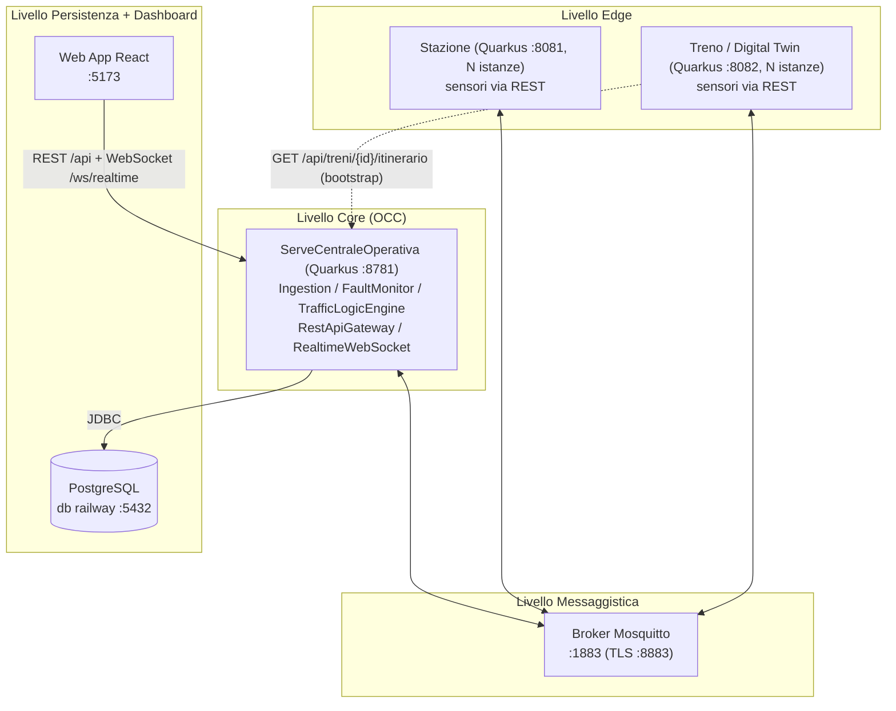
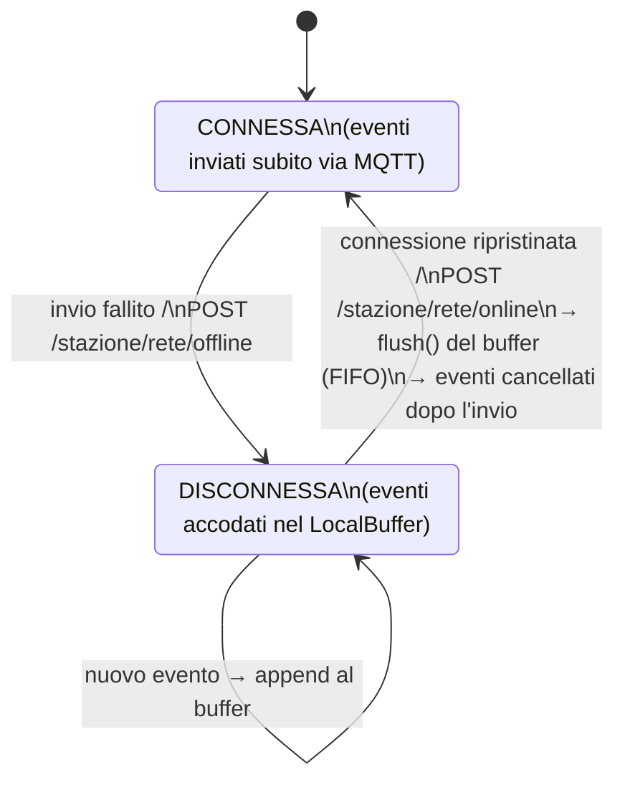
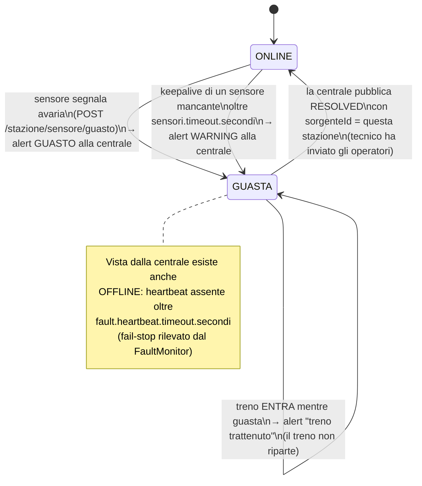
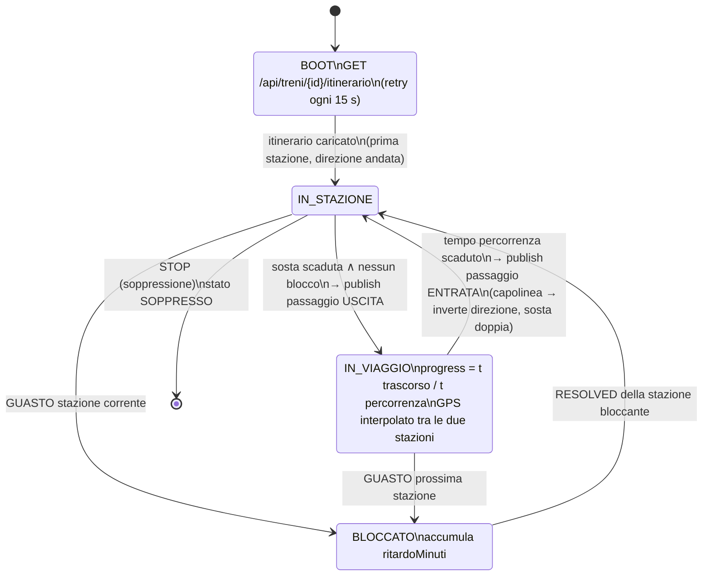
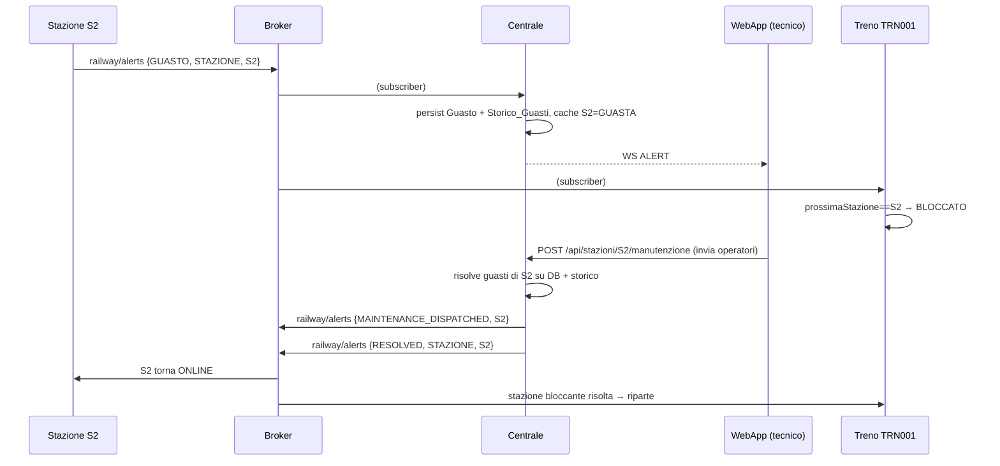

# Fatta da claude code

# Architettura Approfondita — Sistema di Monitoraggio e Gestione del Traffico Ferroviario

Questo documento descrive l'architettura *effettivamente implementata* nel codice, i protocolli
di comunicazione (topic MQTT e payload JSON), le API REST, le macchine a stati dei nodi edge
e le estensioni fatte allo schema del database centrale. È la referenza da usare per la
relazione finale e per l'interrogazione.

## 1. Vista d'insieme

Architettura gerarchica su 4 livelli, come richiesto dal testo del prof:



Scelte di fondo (da difendere in sede d'esame):

- **I sensori parlano REST** con il proprio nodo (stazione o treno): sono dispositivi locali,
  la chiamata HTTP è sincrona e semplice da simulare con `curl`/Postman. **Stazione e treno
  parlano MQTT** con la centrale: è il canale che attraversa la rete geografica, dove servono
  disaccoppiamento, pub/sub 1-a-molti e tolleranza alle disconnessioni.
- Il **treno non conosce host/porta delle stazioni**: quando transita "davanti al sensore"
  pubblica su `railway/train/{id}/passaggio`; ogni stazione è sottoscritta a quel topic con
  wildcard e *filtra* i messaggi con il proprio `stazioneId`. Questo realizza il flusso
  richiesto dal prof (treno → sensore stazione → stazione → centrale) senza accoppiamento
  punto-punto: fa tutto il broker.
- La **fonte ufficiale dei transiti storici è la stazione** (topic `transit`): così il
  meccanismo di store-and-forward della stazione protegge proprio i dati che il prof chiede
  di non perdere. Il topic `passaggio` serve alla centrale solo per aggiornare la posizione
  live del treno.

## 2. Albero dei topic MQTT

| Topic | Publisher | Subscriber | Contenuto |
|---|---|---|---|
| `railway/station/{id}/heartbeat` | Stazione (ogni 10 s) | Centrale (`railway/station/+/heartbeat`) | vitalità + stato + dimensione buffer |
| `railway/station/{id}/transit` | Stazione | Centrale | ENTRATA/USCITA treno rilevata dai sensori (storicizzata) |
| `railway/train/{id}/telemetry` | Treno (ogni 5 s) | Centrale | posizione GPS, velocità, stato, progresso, ritardo |
| `railway/train/{id}/passaggio` | Treno | Centrale **e tutte le Stazioni** (`railway/train/+/passaggio`) | il "ping di prossimità" al sensore della stazione |
| `railway/alerts` | tutti | tutti | canale eventi: guasti, risoluzioni, comandi |

### Formato dei messaggi su `railway/alerts`

Il campo discriminante è `tipoEvento`:

| tipoEvento | Chi lo emette | Effetto |
|---|---|---|
| `GUASTO` | Stazione o Treno | La centrale registra il guasto (DB+storico) e lo mostra; i treni si fermano se la sorgente è la loro prossima stazione o quella in cui si trovano |
| `RESOLVED` | Centrale (tecnico risolve / invia operatori) | La stazione sorgente torna `ONLINE`; i treni bloccati da quella stazione ripartono |
| `STOP` | Centrale (admin sopprime un treno) | Il treno `target` passa a `SOPPRESSO` e non riparte più |
| `MAINTENANCE_DISPATCHED` | Centrale | Informativo: operatori in viaggio verso la stazione |
| `ITINERARIO_AGGIORNATO` | Centrale (admin modifica tratta/treno) | Il treno `target` riscarica il proprio itinerario via REST |

Esempio di guasto stazione:

```json
{"tipoEvento":"GUASTO","sorgenteTipo":"STAZIONE","sorgenteId":"S2",
 "severita":"CRITICAL","messaggio":"Rottura binario 3","timestamp":"2026-07-19T21:00:00Z"}
```

## 3. La Stazione (nodo edge)

Componenti interni: `StationIngestion` (REST sensori), `StationGateway` (MQTT in/out),
`HeartbeatGenerator` (keepalive + svuotamento buffer), `LocalBuffer` (store-and-forward),
`DBLocale` (stato in RAM: id, stato, connessione, treni presenti, keepalive sensori).

### 3.1 Diagramma degli stati — connessione con la centrale

Questo è il diagramma a stati richiesto dalla specifica per la gestione della perdita di
connessione ("Gestione guasto nel canale informativo"):



- Ogni elemento del buffer ricorda il **canale di origine** (`transit` o `alert`) così il
  flush reinvia sul topic giusto.
- Il flush avviene: (a) subito, su `POST /stazione/rete/online`; (b) al primo heartbeat utile
  quando la connessione risulta di nuovo attiva.
- Gli endpoint `rete/offline|online` esistono per **dimostrare** il meccanismo all'esame
  senza dover staccare fisicamente il broker.

### 3.2 Diagramma degli stati — salute della stazione



### 3.3 Keepalive dei sensori (requisito "Heartbeat/Keepalive tra Stazioni e sensori")

I sensori (simulati) chiamano periodicamente `POST /stazione/sensore/heartbeat` con il
proprio `sensoreId`. La stazione tiene una mappa `sensoreId → ultimoBattito`; se un sensore
sfora `sensori.timeout.secondi` la stazione segnala **una sola volta** un guasto WARNING
alla centrale ("se una Stazione non ricevesse i Keep Alive da uno o più sensori,
segnalerebbe lo stato di guasta alla Centrale Operativa").

## 4. Il Treno (digital twin)

Il treno è un processo indipendente con un **motore a eventi discreti**
(`TrainJourneyEngine`): esattamente ciò che il prof chiede per la sufficienza
("ecosistema di agenti").
- considera che la macchina a stati serve per simulare un comportamento coerente che farebbe il tre, in un programma reale basterebbe 
  dei sensori che inviano le informazioni direttamente che sarebbero già coerenti con il comportamento reale del treno, al massimo. 
  Oppure la macchina a stati può essere implementata per controllare il corretto comportamento del treno di modo che il machinista non 
  faccia di testa propria e spacchi tutto, alcune cose sono performate dalla realta come la simulazione di alcuni stati deve esere lasciata alla realtà
  


Dettagli:

- **Tempi scalati**: `tempoPercorrenzaMinuti * 60 / viaggio.fattore.accelerazione` secondi
  reali (default fattore 10: una tratta da 65 minuti si percorre in 6 minuti e mezzo di demo).
- **Prima partenza**: pubblica solo USCITA — è il caso previsto dal prof "un treno può uscire
  da una stazione senza entrarvi (stazione di partenza del viaggio)".
- **Capolinea**: il treno entra e (finché non inverte) non esce — "entrare senza uscirvi".
  L'inversione percorre l'itinerario al contrario (`direzione: ritorno`), come richiesto
  ("sia all'andata, che al ritorno").
- **Ritardi**: quando è bloccato da un guasto accumula `ritardoMinuti` (in tempo simulato),
  che viaggia dentro telemetria e passaggi e finisce nei KPI della dashboard.

## 5. La Centrale Operativa

- **IngestionService** (MQTT → DB/cache/WS): telemetria, heartbeat, transiti (apertura alla
  ENTRATA, chiusura del transito aperto alla USCITA — con i casi limite: USCITA senza
  ENTRATA crea un transito "lampo"; al capolinea il transito resta aperto), passaggi
  (aggiornano posizione/tratta corrente del treno), allarmi.
- **TrafficLogicEngine**: cache in RAM di treni/stazioni/guasti, letta dalle API REST —
  il "Traffic Logic Engine" dello schema a blocchi del prof.
- **FaultMonitor** (`@Scheduled` ogni 10 s), il "Fault Manager":
  1. stazioni senza heartbeat oltre soglia → stato `OFFLINE` + guasto automatico
     (rilevamento **fail-stop**: la centrale non capirebbe altrimenti se la stazione è
     guasta o se i treni non transitano — citazione evidenziata nel testo del prof);
  2. treni con velocità 0 (o telemetria assente) fuori stazione oltre soglia → allarme
     "treno fermo tra due stazioni" (requisito Alerting);
  3. snapshot KPI via WebSocket — realizza il "interrogare il DB ogni 10 secondi" della
     specifica per il tempo reale.
- **RestApiGateway**: tutte le API del frontend (dashboard, CRUD tratte/treni/stazioni,
  transiti, allarmi, comandi tecnico/admin) + le API di supporto ai nodi edge
  (`/api/treni/{id}/itinerario`, `/api/prossima-stazione`).
- **Gestione guasti end-to-end** (unica CRUD propagata ai microservizi, come da specifica):



## 6. Estensioni allo schema del DB centrale

Lo schema concettuale resta quello di `schema.sql` (documentazione); Hibernate
(`generation=update`) genera le tabelle dalle entity. Colonne **aggiunte** rispetto allo
schema originale, con motivazione:

| Tabella | Colonne nuove | Perché |
|---|---|---|
| `Stazione` | `latitudine`, `longitudine`, `binari` | la mappa del frontend ha bisogno di coordinate persistenti (prima erano solo in RAM e andavano perse) |
| `Tratte` | `tempoPercorrenzaMinuti` | serve al calcolo dei ritardi e al motore di simulazione del treno ("la tratta possiede orari corretti di percorrenza") |
| `Guasti_Pervenuti_da_treni_o_Staz` | `tipo`, `severita`, `sorgenteTipo`, `sorgenteId`, `messaggio`, `ts_apertura`, `ts_risoluzione` | senza la sorgente persistita la centrale non poteva pubblicare un RESOLVED indirizzabile (il bug per cui le stazioni non tornavano mai ONLINE) |
| `Utenti` | `password` | variante 2 del prof: autenticazione tradizionale login/password con utenti nel server |

Utenti di prova (`import.sql` / `populate_db.sql`): `MAT001`/admin (amministratore),
`MAT003` (tecnico), password `password`.

## 7. Autenticazione e TLS

- Login: `POST /api/auth/login {username=matricola, password}` → `{token, user}`; ruoli DB
  `admin → amministratore`, altri → `tecnico` (variante 2, nessuna penalità).
- TLS (variante 6, −5 punti se assente): vedi `doc/TLS.md` — Mosquitto espone anche il
  listener TLS 8883 con certificati self-signed; i tre servizi hanno il profilo Quarkus
  `%tls` (`-Dquarkus.profile=tls`) che sposta MQTT su 8883 con truststore PEM e accende
  HTTPS sulla centrale.

## 8. Requisiti del prof → dove sono implementati

| Requisito | Dove |
|---|---|
| Sensori ingresso/uscita, eccezioni partenza/capolinea | `StationIngestion` + `IngestionService.onTransit` |
| Caching locale e reinvio (guasti temporanei) | `LocalBuffer` + `StationGateway.flush()` + stati §3.1 |
| Guasto permanente → operatori → ripristino | `POST /api/stazioni/{id}/manutenzione` + flusso §5 |
| Treni trattenuti in stazione guasta | alert GUASTO dalla stazione all'ENTRATA + `TrainGateway` |
| Heartbeat stazione↔centrale (fail-stop) | `HeartbeatGenerator` + `FaultMonitor.controllaHeartbeat` |
| Keepalive sensori↔stazione | `POST /stazione/sensore/heartbeat` + controllo §3.3 |
| Treno = processo indipendente con eventi discreti | `TrainJourneyEngine` §4 |
| Prossima stazione fornita dalla centrale | `GET /api/prossima-stazione?treno&stazione&direzione` |
| Ingestion MQTT / Processing ritardi / Storage / Alerting | `IngestionService` / ritardi twin+KPI / Panache / `FaultMonitor` |
| Tratte andata/ritorno per convoglio | `Itinerari` + `Itinerario_Tratta` + inversione del twin |
| Tecnico: vista traffico + invio operatori | pagine Dashboard/Allarmi + manutenzione |
| Admin: CRUD tratte, modifica stazioni dei treni, soppressione | `AdminPage` + CRUD `/api/tratte`, `/api/treni`, `/api/stazioni` |
| MQTT edge→core, HTTP per gli utenti web | tutta l'architettura §1 |
| TLS (variante 6) | `doc/TLS.md` + profilo `%tls` |
