#+LATEX_HEADER: \usepackage{tabularx}
#+LATEX_HEADER: \usepackage{longtable}
#+LATEX_HEADER: \newcolumntype{Y}{>{\raggedright\arraybackslash}X}
#+LATEX_HEADER: \newcolumntype{L}[1]{>{\raggedright\arraybackslash}p{#1}}
#+begin_comment
sas#+title:Monitoraggio e gestione del traffico ferroviario Documentazione
// per mermid mettere il codice solo nel file .org e poi usare la foto del mermid compilato nel latex
//nota: se non compilo/eseguo almeno un codice al salvataggio non mi fa la creazione del pdf
C-c C-x v per aprire un'immagine linkata in emacs
C-c C-, per inserire un blocco di codice velocemente
C-c C-c per compilare il codice
#+end_comment
* Introduzione Descrizione Generale
Cio che è realizzato è al fine della gestione di una rete ferroviaria e, in particolare, la gestione
delle stazioni, dei treni che compongono tale rete.
La gestione della rete è fornita attraverso in un app web che fornisce il neccessarrio per il monitoraggio e l'amiinistrazione della rete
#+begin_comment
i Diagrammi di sequenza e delle classi
I diagrammi di sequenza stanno nel capitolo /Progettazione/, insieme alle macchine a stati e ai diagrammi delle classi: sono tre letture dello stesso codice e tenerle vicine e' l'unico modo per confrontarle.
#+end_comment
* Specifica
** Modellazione per casi d'uso

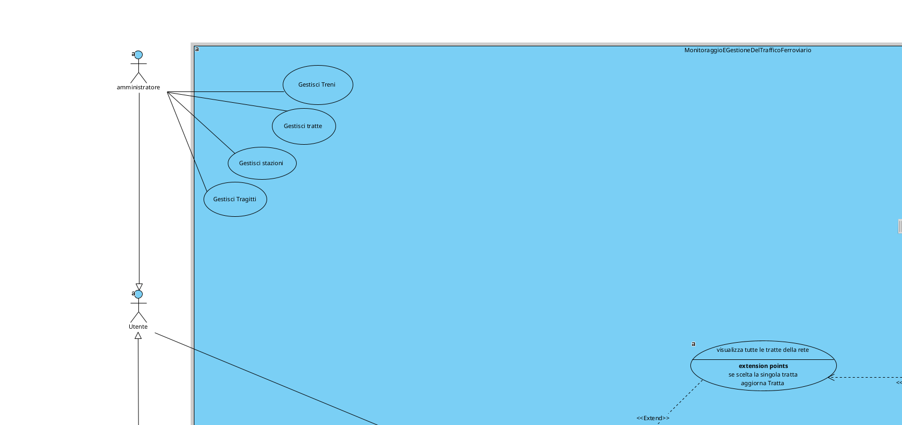

** Glossario dei termini di dominio

- Stazione :: nodo della rete in cui i convogli entrano, sostano ed escono. Ha un nome, una
  posizione geografica e uno stato operativo.
- Tratta elementare :: collegamento diretto fra due stazioni adiacenti, senza fermate intermedie.
  E' l'unita' con cui si compone un percorso.
- Itinerario :: sequenza ordinata di stazioni che un convoglio deve percorrere, con il tempo di
  percorrenza previsto fra una tappa e la successiva. Nelle schermate e' chiamato anche *tratta*.
- Capolinea :: prima e ultima stazione di un itinerario.
- Direzione :: verso di percorrenza dell'itinerario, *andata* o *ritorno*.
- Corsa :: percorrenza dell'itinerario da un capolinea all'altro in una direzione.
- Convoglio :: il treno in servizio, identificato da un numero. Ha una posizione, uno stato, un
  ritardo accumulato e un numero di passeggeri a bordo.
- Transito :: passaggio di un convoglio per una stazione. E' di due tipi, *entrata* e *uscita*, ed e'
  sempre riferito a un istante.
- Telemetria :: dichiarazione periodica con cui il convoglio comunica come sta e dove si trova.
- Battito :: segnale periodico con cui un nodo dichiara di essere vivo. Il suo valore informativo sta
  nell'assenza: e' il silenzio a dire qualcosa.
- Guasto :: condizione anomala aperta su una sorgente (una stazione, un convoglio, una tratta), con
  un tipo, una severita', un istante di apertura e uno stato di lavorazione.
- Allarme :: il guasto cosi' come viene presentato all'operatore.
- Ripristino :: dichiarazione che la condizione anomala e' rientrata e che cio' che era bloccato puo'
  riprendere.
- Ritardo :: differenza fra l'avanzamento previsto della corsa e quello effettivo, espressa in
  minuti e riferita al singolo convoglio.
- Sosta :: permanenza del convoglio in stazione fra l'entrata e l'uscita.
- Servizio di identita' :: la parte del sistema che custodisce gli utenti, ne verifica le
  credenziali e rilascia gli attestati di accesso. E' l'unico posto in cui una password viene
  digitata e l'unico che la conosce.
- Attestato di accesso :: cio' che l'utente ottiene identificandosi e che deve esibire a ogni
  richiesta successiva. Dice chi e' e che ruolo ha, ha una durata limitata e chi lo riceve puo'
  controllarne da solo l'autenticita', senza interpellare il servizio di identita'.
- Rinnovo :: sostituzione di un attestato in scadenza con uno nuovo, fatta senza chiedere di
  nuovo le credenziali all'utente. Serve perche' una sessione di lavoro dura piu' di un
  attestato.
** Vocabolario degli stati osservabili

#+begin_comment
 sono le parole con cui il sistema
risponde alla domanda "come sta questa cosa adesso", e chi legge una schermata deve poterle
interpretare senza ambiguita'.

#+end_comment

*** Stato del convoglio

#+attr_latex: :align |p{0.22\textwidth}|p{0.68\textwidth}|
| stato      | significato                                                                    |
|------------+--------------------------------------------------------------------------------|
| FERMO      | e' in sosta in una stazione, oppure e' trattenuto e non puo' ripartire          |
| IN_VIAGGIO | sta percorrendo una tratta elementare fra due stazioni                         |
| EMERGENZA  | e' aperto un guasto che lo riguarda; la corsa e' sospesa dove si trovava        |
| SOPPRESSO  | la corsa e' stata annullata: il convoglio non viaggia piu' e non riprendera'    |

*** Stato operativo della stazione

La stazione e' vista da due punti di osservazione, che dispongono di informazione diversa. Non e' una
contraddizione: e' la conseguenza di che cosa ciascuno dei due puo' sapere.

#+attr_latex: :align |p{0.26\textwidth}|p{0.20\textwidth}|p{0.40\textwidth}|
| stato        | chi lo puo' dichiarare | significato                                                              |
|--------------+------------------------+--------------------------------------------------------------------------|
| ONLINE       | la stazione, la centrale | la stazione e' viva, raggiungibile e percorribile                        |
| GUASTA       | la stazione, la centrale | la stazione non e' percorribile: i convogli non ci entrano e non ne escono |
| OFFLINE      | solo la centrale       | la stazione non da' piu' notizie di se'                                   |
| MANUTENZIONE | solo la centrale       | la squadra e' stata mandata sul posto e sta lavorando                    |
#+begin_comment
(non ho capito)
*Perche' la stazione non dichiara OFFLINE e MANUTENZIONE*: il primo e' un giudizio che si puo' dare
solo da fuori, perche' una stazione che si credesse offline avrebbe comunque il canale per dirlo, e
allora non lo sarebbe; il secondo e' la conseguenza di una decisione presa da un utente, di cui la
stazione e' destinataria e non autrice.
#+end_comment

** Come si legge un requisito

Ogni requisito e' scritto con questi campi, e quelli che non servono vengono omessi:

- *enunciato* :: cosa il sistema deve fare, in una frase, al presente indicativo;
- *soggetto* :: chi ha l'obbligo (quale parte del sistema) e nei confronti di chi;
- *precondizione* :: in quali condizioni il requisito si applica;
- *esito atteso* :: cosa deve risultare vero quando il requisito e' soddisfatto;
- *dipende da* :: quale altro requisito deve valere perche' questo abbia senso;
- *stato di implementazione* :: quanto di quel requisito il sistema realizzato soddisfa davvero.

Lo stato di implementazione ha tre soli valori:

- *completo* :: il sistema fa quello che il requisito chiede, per intero;
- *parziale* :: ne fa una parte, e accanto al valore c'e' sempre scritto quale pezzo manca;
- *non realizzato* :: nessuna parte del sistema lo soddisfa.

Sui requisiti che ne raggruppano altri lo stato non e' un giudizio a se': segue la decomposizione,
quindi un ramo e' completo solo quando lo sono tutte le sue parti. E' la stessa cosa che dicono le
tabelle /Riepilogo requisiti/ (in fondo a questo capitolo per le macchine a stati, in fondo a
/Progettazione/ per i diagrammi di sequenza), messa pero' accanto all'enunciato, dove serve mentre
lo si legge.

La numerazione è gerarchica per raggruppamenti e, come suvisto, presenta anche le dipendenze

#+begin_comment
La numerazione e' gerarchica e la gerarchia significa *decomposizione*: =RF0X.Y= e' una parte di
=RF0X=, e =RF0X= e' soddisfatto quando lo sono tutte le sue parti. La *dipendenza* e' un'altra
relazione: "A dipende da B" vuol dire che togliendo B il requisito A non e' piu' soddisfacibile
(test di eliminazione). Le due relazioni sono distinte anche nel grafo in fondo al capitolo.

Dal punto di vista della logica formale e booleana, il tuo ragionamento non fa una piega: se la soddisfazione di $RF0X$ è definita come $RF0X = RF0X.1 \land RF0X.2$, rimuovere $RF0X.1$ rende $RF0X$ irrealizzabile. Quindi, applicando il "test di eliminazione" alla lettera, sembra esistere una dipendenza.Tuttavia, nell'Ingegneria dei Requisiti (e nella teoria dei grafi applicata al software), la decomposizione e la dipendenza vengono tenute rigorosamente distinte. Il motivo è concettuale, metodologico e pratico.1. Identità vs Accoppiamento EsternoDecomposizione (Relazione Strutturale / Part-Of):$RF0X.1$ non è un requisito "esterno" o "separato", ma è un costituente interno di $RF0X$. Rimuovere $RF0X.1$ non significa far fallire un prerequisito di $RF0X$, ma ridefinire o distruggere l'identità stessa di $RF0X$.Dipendenza (Relazione Funzionale / Depends-On):Collega due requisiti semanticamente autonomi. Se $RF05$ ("Mostra posizione treno") dipende da $RF02$ ("Ricevi coordinate GPS"), i due requisiti esistono separatamente. Se elimini $RF02$, $RF05$ continua a esistere come concetto, ma non ha più i dati per funzionare.
#+end_comment

** RF01 - Servizi offerti agli utenti

*Enunciato*: il sistema espone a tecnico e amministratore, attraverso un'unica applicazione web, la
situazione corrente della rete, la sua storia e i comandi previsti per il loro ruolo.

*Nota di lettura*: RF01 non stabilisce nessuna verita' sul dominio, la *espone*. Se lo stato
descritto da RF02 e' sbagliato, RF01 mostra correttamente un dato sbagliato: per questo ogni ramo di
RF01 dipende dal corrispondente ramo di RF02.

*Stato di implementazione*: parziale — la visualizzazione, l'amministrazione dei dati, lo storico e
l'accesso ci sono per intero; i tre comandi operativi di RF01.4 fanno la cosa principale ma nessuno
dei tre e' completo.

*** RF01.1 - Visualizzazione della situazione corrente

*Stato di implementazione*: completo, tutte e cinque le voci.

**** RF01.1.1 - Mappa del traffico
- enunciato: la posizione dei convogli e' rappresentata su una mappa geografica, insieme al percorso
  che stanno seguendo e al loro stato.
- dipende da: RF02.2.2.
- stato di implementazione: completo. Il convoglio viene disegnato sulla posizione interpolata fra
  le due stazioni della tratta che sta percorrendo, con sopra il percorso e il colore dello stato.

**** RF01.1.2 - Elenco dei convogli
- enunciato: per ogni convoglio sono visibili il numero, la stazione o la tratta su cui si trova, lo
  stato, il ritardo accumulato e i passeggeri a bordo.
- dipende da: RF02.2.
- stato di implementazione: completo.

**** RF01.1.3 - Elenco delle stazioni
- enunciato: per ogni stazione sono visibili lo stato operativo, i convogli fermi sui binari in quel
  momento, quelli attesi in ingresso e quelli attesi in uscita.
- dipende da: RF02.3.1.
- stato di implementazione: completo. Lo stato operativo lo tiene la centrale, i convogli sui binari
  li dichiara il nodo di stazione: la schermata mette insieme le due cose.

**** RF01.1.4 - Aggiornamento continuo
- enunciato: le schermate si aggiornano da sole mentre l'operatore le guarda, senza che lui debba
  ricaricare la pagina o chiedere l'aggiornamento.
- esito atteso: un evento rilevante (un transito, un cambio di stato, un guasto, l'esito di un
  comando) e' visibile sulla schermata entro pochi secondi dal momento in cui accade; inoltre, ogni
  =P_ria=, la schermata riceve una fotografia completa dello stato corrente.
- *distinzione che conta*: l'aggiornamento e' *spinto dal sistema quando l'evento accade*, non
  ottenuto da interrogazioni a orologio da parte della schermata. La fotografia periodica non e' il
  meccanismo di aggiornamento: serve a riallineare chi si e' collegato dopo o ha perso qualcosa.
- stato di implementazione: completo, ed e' completa anche la distinzione qui sopra: l'evento viene
  spinto sulla websocket nel momento in cui accade, e la fotografia periodica viaggia sullo stesso
  canale senza che il browser chieda niente.

**** RF01.1.5 - Indicatori di sintesi
- enunciato: una schermata di riepilogo riassume in pochi numeri i convogli in circolazione, le
  stazioni operative, i guasti aperti e il ritardo medio.
- stato di implementazione: completo. I numeri li calcola la centrale e viaggiano dentro la stessa
  fotografia periodica di RF01.1.4, quindi si aggiornano da soli come il resto.

*** RF01.2 - Visualizzazione dei guasti

*Stato di implementazione*: completo, entrambe le voci.

**** RF01.2.1 - Elenco degli allarmi aperti
- enunciato: sono visibili i guasti attivi con la sorgente (quale stazione, quale convoglio, quale
  tratta), il tipo, la severita' e l'istante di apertura.
- dipende da: RF02.1.
- stato di implementazione: completo.

**** RF01.2.2 - Distinzione fra guasto segnalato e guasto dedotto
- enunciato: l'elenco distingue il guasto *segnalato dal campo* (qualcuno lo ha dichiarato) da quello
  *dedotto dalla centrale* (un nodo ha smesso di dare notizie).
- *perche' e' un requisito e non un dettaglio*: sono due condizioni con cause diverse e con reazioni
  diverse. Un guasto segnalato indica un problema del nodo; un guasto dedotto puo' indicare anche
  soltanto un problema di collegamento, e chi decide se mandare la squadra deve poterli distinguere
  senza indovinare.
- dipende da: RF02.6.
- stato di implementazione: completo. L'API e gli eventi in tempo reale portano l'origine
  dell'allarme, e la schermata la mostra esplicitamente come "segnalato dal campo" oppure
  "dedotto dalla centrale".

*** RF01.3 - Amministrazione dei dati della rete

*Enunciato del ramo*: la creazione, la modifica e l'eliminazione dell'anagrafica della rete sono
riservate all'amministratore; il tecnico vede tutto ma non modifica nulla.

*Stato di implementazione*: completo, tutte e cinque le voci.

**** RF01.3.1 - Stazioni
- enunciato: l'amministratore crea, modifica ed elimina le stazioni della rete.
- stato di implementazione: completo.

**** RF01.3.2 - Convogli
- enunciato: l'amministratore crea, modifica ed elimina i convogli.
- stato di implementazione: completo.

**** RF01.3.3 - Tratte elementari
- enunciato: l'amministratore crea, modifica ed elimina i collegamenti diretti fra due stazioni
  adiacenti.
- stato di implementazione: completo.

**** RF01.3.4 - Itinerari e assegnazione dei convogli
- enunciato: l'amministratore compone un itinerario come sequenza ordinata di stazioni con i tempi di
  percorrenza previsti, e vi assegna sopra i convogli che devono percorrerlo.
- dipende da: RF02.5, perche' la modifica deve restare corretta anche con convogli gia' in marcia.
- stato di implementazione: completo per la parte di composizione e assegnazione; quello che succede
  ai convogli gia' in marcia e' invece il ramo RF02.5, che completo non e'.

**** RF01.3.5 - Integrita' dei dati alle eliminazioni
- enunciato: l'eliminazione di un'entita' non lascia riferimenti pendenti, e non e' permessa finche'
  qualcosa la sta ancora usando.
- esito atteso: o l'eliminazione viene rifiutata con una spiegazione comprensibile, oppure viene
  eseguita insieme a tutto cio' che senza quell'entita' non avrebbe piu' significato.
- *perche' e' qui*:
#+begin_comment
allora forse è meglio metterla in RF2 porca la miseriaccia
#+end_comment
 senza questo requisito la correttezza promessa da RF02 dura fino alla prima
  eliminazione.
- stato di implementazione: completo. Ogni eliminazione o viene rifiutata dicendo il motivo (la
  stazione ancora usata da una tratta, la tratta ancora usata da un itinerario o gia' finita nei
  transiti storici), oppure porta via con se' i record che senza quell'entita' non vorrebbero piu'
  dire niente. Una parte della garanzia pero' la tengono i vincoli del database e non i controlli
  scritti a mano.

*** RF01.4 - Comandi operativi

*Stato di implementazione*: parziale — tutti e tre i comandi fanno la cosa principale, nessuno dei
tre la fa per intero.

**** RF01.4.1 - Invio della squadra di manutenzione
- enunciato: l'operatore manda la squadra su una stazione guasta.
- esito atteso: la stazione risulta in MANUTENZIONE e i nodi interessati ne sono informati.
- stato di implementazione: parziale. Il comando parte, il campo viene avvisato, i guasti aperti
  sulla stazione vengono chiusi e la stazione passa a MANUTENZIONE; solo che il ritorno a ONLINE sta
  dentro la stessa chiamata, a pochi millisecondi di distanza. Lo stato attraversa il canale ma non
  dura: la stazione non /risulta/ in manutenzione a nessuno che la guardi. Per soddisfare il
  requisito il ritorno andrebbe staccato dal comando e legato alla fine vera dell'intervento.

**** RF01.4.2 - Presa in carico e chiusura di un allarme
- enunciato: l'operatore dichiara risolto un guasto.
- esito atteso: il guasto passa a chiuso, resta traccia di chi lo ha preso in carico e quando, e cio'
  che era bloccato per causa sua riprende.
- dipende da: RF02.1.3.
- stato di implementazione: parziale. La chiusura c'e' e funziona, e cio' che era trattenuto
  riprende davvero la corsa; la presa in carico no. Ne' l'operatore ne' il momento in cui se n'e'
  occupato vengono scritti da nessuna parte, quindi a guasto chiuso non si sa piu' chi lo ha chiuso.

**** RF01.4.3 - Soppressione di un convoglio fermo in stazione
- enunciato: l'operatore annulla una corsa; il convoglio passa in SOPPRESSO e non viaggia piu'.
- precondizione: il convoglio e' fermo in una stazione.
- stato di implementazione: parziale. L'effetto e' quello richiesto, ma la precondizione non viene
  verificata da nessuna parte: il comando sopprime anche un convoglio in mezzo a una tratta, e la
  sopprimibilita' resta affidata al buon senso di chi preme il bottone.

*** RF01.5 - Consultazione dello storico

- enunciato: sono consultabili i transiti passati, ciascuno con il convoglio, la stazione, la tratta,
  il verso (entrata o uscita) e l'istante.
- dipende da: RF02.7.
- stato di implementazione: completo.

*** RF01.6 - Accesso al sistema

- enunciato: l'uso dell'applicazione richiede di identificarsi; l'identita' accompagna tutte le
  operazioni successive e termina con l'uscita esplicita.
- l'identificazione avviene *fuori dall'applicazione*, sulla schermata del servizio di identita':
  l'applicazione non raccoglie e non vede mai le credenziali, riceve solo l'attestato di accesso.
- rimando: il dettaglio dei permessi e' in RF04.
- stato di implementazione: completo. L'identificazione avviene sulla schermata del servizio di
  identita', l'applicazione riceve solo l'attestato e l'uscita esplicita chiude la sessione.

** RF02 - Correttezza dello stato rappresentato
#+begin_comment
forse sarebbe stato meglio mettere questa parte come regole di dominio dopo lo studio del dominio
#+end_comment
*Enunciato*: lo stato che il sistema mostra e conserva corrisponde a quello che sta realmente
accadendo sulla rete, anche in presenza di guasti, di interruzioni del collegamento e di modifiche
fatte mentre il sistema e' in funzione.

*Stato di implementazione*: parziale. Sono completi il ramo dei convogli (RF02.2), quello delle
stazioni (RF02.3), l'identita' dei nodi di campo (RF02.4) e le anomalie che la centrale deduce da
sola (RF02.6). Non sono realizzate le conseguenze del guasto del convoglio sull'infrastruttura
(RF02.1.2.2) e la ripresa dal punto giusto dopo una modifica dell'itinerario (RF02.5.2); sono
parziali il ciclo di vita del guasto, che non registra la presa in carico (RF02.1.3), e la memoria
storica, che di cinque cose ne scrive tre (RF02.7).

*** RF02.1 - Gestione dei guasti

*Stato di implementazione*: parziale — il guasto della stazione e la chiusura automatica ci sono;
restano fuori le conseguenze del guasto del convoglio (RF02.1.2.2) e la presa in carico nel ciclo di
vita del guasto (RF02.1.3).

**** RF02.1.1 - Guasto della stazione

*Stato di implementazione*: parziale, per il solo RF02.1.1.2.3.

***** RF02.1.1.1 - Interruzione del collegamento con la centrale

*Stato di implementazione*: completo.

****** RF02.1.1.1.1 - Nessun dato perduto durante l'interruzione
- enunciato: mentre il collegamento con la centrale non e' disponibile, la stazione conserva
  localmente tutto cio' che produce e lo consegna quando il collegamento torna.
- precondizione: la stazione continua a funzionare e i suoi sensori continuano a rilevare.
- esito atteso: al ritorno del collegamento la centrale riceve tutti gli eventi prodotti durante
  l'interruzione, nessuno escluso.
- stato di implementazione: completo, nei limiti della precondizione. Il nodo continua a rilevare e
  accoda cio' che non riesce a consegnare, e svuota la coda quando il collegamento torna. La coda
  pero' vive in memoria: vale finche' il nodo resta acceso, un suo riavvio si porterebbe via quello
  che non era ancora partito.

****** RF02.1.1.1.2 - Ordine di consegna preservato
- enunciato: la consegna differita rispetta l'ordine in cui gli eventi sono stati generati; se una
  singola consegna fallisce, l'evento non consegnato precede comunque quelli successivi.
- *perche' e' un requisito a se'*: senza questo vincolo l'entrata e l'uscita di uno stesso convoglio
  possono arrivare invertite, e lo storico racconterebbe un convoglio che esce da una stazione prima
  di entrarci.
- dipende da: RF02.7.
- stato di implementazione: completo. L'evento che non riesce a partire rientra in *testa* alla
  coda, ed e' esattamente questo che impedisce a un'uscita di precedere la propria entrata.

***** RF02.1.1.2 - Stazione non percorribile

*Stato di implementazione*: parziale, per il solo RF02.1.1.2.3.

****** RF02.1.1.2.1 - Il convoglio diretto alla stazione guasta si ferma
- enunciato: se la prossima stazione dell'itinerario e' guasta, il convoglio non vi entra e resta
  fermo dove si trova.
- esito atteso: il convoglio risulta FERMO, la sua posizione non avanza e il ritardo cresce.
- dipende da: RF02.2.2.1.
- stato di implementazione: completo.

****** RF02.1.1.2.2 - Riparte solo al ripristino
- enunciato: il convoglio trattenuto riprende la corsa quando arriva il ripristino di quella
  stazione, non prima e non per scadenza di un tempo.
- stato di implementazione: completo. Lo sblocco arriva solo con il ripristino e riprende la fase
  che era in corso: nel codice non c'e' nessun tempo massimo che faccia ripartire il convoglio da
  solo.

****** RF02.1.1.2.3 - Il blocco vale anche per chi e' gia' fermo li'
- enunciato: un convoglio gia' in sosta nella stazione che si guasta non riparte finche' il guasto e'
  aperto.
- *perche' e' un requisito a se'*: senza di esso il guasto bloccherebbe solo chi arriva dopo, e la
  stazione non risulterebbe davvero non percorribile.
- stato di implementazione: parziale. Il convoglio gia' in sosta viene trattenuto, ma per un'altra
  strada: si tiene l'elenco delle stazioni che ha visto dichiararsi guaste e lo ricontrolla quando
  sta per ripartire. E' il controllo alla ripartenza a tenerlo fermo, non la stazione che smette di
  essere percorribile, e la differenza si vede quando l'avviso non gli arriva.

**** RF02.1.2 - Guasto del convoglio

*Stato di implementazione*: parziale — il guasto viene registrato, le conseguenze sull'infrastruttura
no.

***** RF02.1.2.1 - Il guasto viene registrato in centrale
- enunciato: quando un convoglio si guasta, la centrale apre e conserva il guasto corrispondente.
- stato di implementazione: completo.

***** RF02.1.2.2 - Conseguenze del guasto

*Stato di implementazione*: non realizzato, in nessuno dei due casi.

****** RF02.1.2.2.1 - Convoglio guasto *in stazione*: la stazione diventa non percorribile
- enunciato: se il convoglio si guasta mentre e' fermo in una stazione, quella stazione risulta
  guasta.
- dipende da: RF02.2.2.1, perche' la conseguenza si sceglie in base a dove si trova il convoglio.
- stato di implementazione: non realizzato. Il convoglio che si guasta congela se' stesso ma non
  contagia l'infrastruttura: in centrale solo un guasto dichiarato con sorgente STAZIONE e severita'
  critica porta la stazione a GUASTA, quindi dopo un guasto di bordo la stazione resta percorribile e
  gli altri convogli ci entrano tranquillamente.

****** RF02.1.2.2.2 - Convoglio guasto *in tratta*: la tratta diventa non percorribile
- enunciato: se il convoglio si guasta fra due stazioni, e' la tratta elementare che sta percorrendo
  a risultare non percorribile; nessuna stazione cambia stato.
- dipende da: RF02.2.2.1.
- stato di implementazione: non realizzato, per lo stesso motivo di RF02.1.2.2.1. L'allarme si apre
  sul convoglio, ma la tratta non ha nessuno stato di percorribilita' che qualcuno cambi: continua a
  risultare libera e nessun altro convoglio viene fermato. Vale anche per l'allarme che la centrale
  deduce da sola (RF02.6.2).

**** RF02.1.3 - Ciclo di vita del guasto
- enunciato: un guasto ha uno stato di lavorazione (aperto, preso in carico, chiuso), un
  assegnatario e una traccia di come e' evoluto; sulla stessa sorgente e per lo stesso motivo non
  esiste piu' di un guasto aperto per volta.
- *perche' l'unicita' e' un requisito*: le anomalie dedotte vengono ricontrollate a ritmo periodico,
  e senza unicita' la stessa condizione genererebbe un allarme nuovo a ogni controllo, rendendo
  l'elenco inutilizzabile proprio quando serve.
- stato di implementazione: parziale. L'unicita' del guasto aperto per sorgente c'e', da qualunque
  parte arrivi il guasto, ed e' quella che tiene leggibile l'elenco; apertura e chiusura lasciano
  traccia nello storico. Gli stati pero' sono due e non tre, perche' il guasto porta solo un
  "risolto" vero o falso, e l'assegnatario non viene mai valorizzato: la colonna e la tabella delle
  assegnazioni esistono nello schema ma restano vuote.

**** RF02.1.4 - Chiusura automatica quando la causa rientra
- enunciato: un guasto aperto perche' un nodo taceva si chiude da solo quando il nodo torna a dare
  notizie, senza bisogno dell'intervento di un operatore.
- *perche'*: un guasto dedotto deve essere disfatto dalla stessa deduzione che lo ha creato,
  altrimenti l'elenco degli allarmi si riempie di condizioni gia' rientrate che nessuno chiude.
- precondizione: il guasto e' stato aperto per deduzione e non per segnalazione.
- dipende da: RF02.3.2.
- stato di implementazione: completo. Il battito che torna richiude il guasto dedotto sulla stazione
  e il convoglio che riprende a muoversi richiude il proprio, in tutti e due i casi senza che nessuno
  debba premere niente; la chiusura automatica riguarda solo i guasti che la centrale ha dedotto,
  come dice la precondizione.

*** RF02.2 - Gestione dei convogli

*Stato di implementazione*: completo.

**** RF02.2.1 - Ritardi

*Stato di implementazione*: completo.

***** RF02.2.1.1 - Il ritardo si accumula quando il convoglio e' fermo e dovrebbe circolare
- enunciato: finche' il convoglio e' trattenuto pur avendo una tappa da percorrere, il suo ritardo
  cresce; quando circola regolarmente non cresce.
- dipende da: RF02.1, perche' il fermo nasce dai guasti.
- stato di implementazione: completo.

**** RF02.2.2 - Informazioni di stato del convoglio

*Stato di implementazione*: completo, tutte e quattro le informazioni.

***** RF02.2.2.1 - Posizione
- enunciato: il convoglio dichiara in modo non ambiguo dove si trova: in quale stazione e' fermo,
  oppure fra quali due stazioni sta viaggiando e in quale direzione.
- esito atteso: la risposta alla domanda "il convoglio e' in stazione o in tratta?" e' sempre
  definita, in ogni istante della corsa.
- *nota*: questo e' il *predicato centrale della specifica*. Da "dove si trova il convoglio"
  dipendono la scelta della conseguenza di un guasto (stazione o tratta non percorribile), la
  gestione della modifica dell'itinerario a sistema acceso e il riconoscimento dell'anomalia del
  convoglio fermo troppo a lungo. Se questa informazione non e' affidabile, cadono sei requisiti
  insieme.
- stato di implementazione: completo. Il convoglio dichiara o la stazione in cui e' fermo o la
  tratta che sta percorrendo con la direzione, e la centrale la corregge con i passaggi rilevati a
  terra.

***** RF02.2.2.2 - Ritardo accumulato
- enunciato: il convoglio dichiara il ritardo accumulato dall'inizio della corsa.
- dipende da: RF02.2.1.
- stato di implementazione: completo.

***** RF02.2.2.3 - Stato del convoglio
- enunciato: il convoglio dichiara come sta, con uno dei valori del vocabolario degli stati, e questa
  informazione e' distinta dalla posizione.
- stato di implementazione: completo, e la distinzione dalla posizione e' rispettata anche a
  database, dove la colonna dello stato accetta solo i quattro valori del vocabolario.

***** RF02.2.2.4 - Velocita' e passeggeri a bordo
- enunciato: il convoglio dichiara la velocita' corrente e il numero di passeggeri a bordo.
- *nota di ambito*: sono valori simulati che rendono leggibile la corsa sulla mappa; non provengono
  da nessuna rilevazione reale e non alimentano nessuna decisione del sistema.
- stato di implementazione: completo, con l'ambito dichiarato qui sopra: sono numeri generati dal
  convoglio a ogni fermata.

**** RF02.2.3 - Andata e ritorno sullo stesso itinerario
- enunciato: raggiunto il capolinea, il convoglio inverte la marcia e ripercorre l'itinerario in
  senso contrario; il tempo di percorrenza di ogni tappa e' quello previsto per il verso che sta
  percorrendo.
- esito atteso: la corsa e' continua, senza che il convoglio scompaia e riappaia all'altro capolinea.
- stato di implementazione: completo. Al capolinea la direzione si inverte, l'itinerario viene
  ripercorso al contrario e ogni tappa usa il tempo di percorrenza del verso che sta percorrendo.

**** RF02.2.4 - Passaggi asimmetrici in stazione
- enunciato: un convoglio puo' uscire da una stazione senza esservi entrato, e puo' entrare in una
  stazione senza uscirne.
- precondizione: il primo caso si presenta alla stazione da cui la corsa comincia, il secondo al
  capolinea in cui la corsa si conclude prima dell'inversione.
- *perche' va scritto*: e' il caso che rompe l'abbinamento ingenuo fra entrate e uscite nello
  storico. Chi conta le coppie deve sapere che la prima e l'ultima sono spaiate per costruzione, e
  che questo non e' un errore di rilevazione.
- stato di implementazione: completo. I due casi sono gestiti e non scartati: l'uscita senza entrata
  diventa un transito puntuale, in cui entrata e uscita coincidono, e l'entrata senza uscita resta un
  transito aperto. Nello storico pero' non sono marcati come caso a se': chi conta le coppie deve
  saperlo da qui.

*** RF02.3 - Gestione delle stazioni

*Stato di implementazione*: completo.

**** RF02.3.1 - Informazioni rese dalla stazione
- enunciato: la stazione sa dire quali convogli ha sui binari in questo momento, chi e' entrato e
  quando, chi e' uscito e quando.
- dipende da: RF02.1.1.1.1 — l'informazione locale che serve alla visualizzazione *e' la stessa* che
  permette alla stazione di sopravvivere a un'interruzione del collegamento. Non sono due memorie
  distinte, ed e' un vincolo di specifica: se fossero due potrebbero divergere.
- stato di implementazione: completo, vincolo compreso: la fotografia che la stazione tiene in
  memoria e' la stessa che risponde alle interrogazioni locali e che alimenta la coda di RF02.1.1.1.1.

**** RF02.3.2 - Segnale di vita verso la centrale
- enunciato: la stazione emette un battito periodico verso la centrale, con periodo =P_bat=, anche
  quando non ha nulla da dichiarare.
- *perche' anche quando non c'e' niente da dire*: senza un segnale emesso a prescindere dagli eventi,
  il silenzio di una stazione non e' distinguibile dall'assenza di traffico su quella stazione.
- stato di implementazione: completo.

**** RF02.3.3 - Segnale di vita dei sensori verso la stazione
- enunciato: i sensori dichiarano periodicamente alla stazione di essere vivi, con periodo =P_kal=;
  se uno smette, la stazione lo considera guasto e lo segnala alla centrale.
- esito atteso: la stazione con un sensore muto dichiara il proprio stato come GUASTA.
- stato di implementazione: completo, esito compreso. Il limite del meccanismo e' che la stazione
  non sa quanti sensori dovrebbero esserci: li conosce solo quando la chiamano, quindi un sensore che
  non ha mai battuto non puo' risultare guasto.

**** RF02.3.4 - Stato che la stazione dichiara di se'
- enunciato: la stazione dichiara di se' soltanto ONLINE o GUASTA.
- rimando: la motivazione e' nella sezione sul vocabolario degli stati osservabili.
- stato di implementazione: completo. Il nodo dichiara due stati, la centrale ne tiene quattro:
  l'asimmetria voluta dal requisito c'e' tutta.

*** RF02.4 - Identita' del nodo di campo

*Stato di implementazione*: completo.

**** RF02.4.1 - L'identita' dichiarata viene verificata
- enunciato: un nodo che entra in servizio dichiara la propria identita' alla centrale, che la
  verifica sull'anagrafica della rete prima di accettarne qualsiasi dato.
- *perche'*: senza questa verifica chiunque avvii un nodo con un'identita' inventata inquina lo stato
  della centrale con la telemetria di un convoglio che non esiste, e la correttezza promessa da RF02
  non e' piu' difendibile.
- stato di implementazione: completo. Il nodo chiede alla centrale se esiste e non manda niente
  finche' non ha avuto la risposta: la verifica non puo' auto-validarsi con il primo dato che arriva.

**** RF02.4.2 - Esito negativo: il nodo non entra in servizio
- enunciato: se l'identita' non e' riconosciuta, il nodo non entra in servizio e termina, invece di
  restare attivo senza poter comunicare.
- *perche' terminare e non restare in attesa*: un nodo acceso ma non riconosciuto e' indistinguibile
  da un nodo sano dal punto di vista di chi guarda i processi, ed e' una sorgente di confusione
  durante la diagnosi.
- stato di implementazione: completo. Il nodo non riconosciuto termina con codice di uscita 1, non
  resta acceso in attesa.

**** RF02.4.3 - Portata della dipendenza
Non e' un requisito a se': e' la regola di lettura del grafo. Senza RF02.4 nessun nodo entra in
servizio, quindi non arriva nessun dato e cadono per intero RF02.1, RF02.2 e RF02.3. Per questo nel
grafo la dipendenza e' disegnata una volta sola sui tre rami invece che su ogni foglia.

*Stato di implementazione*: non ne ha uno proprio, non essendo un requisito; vale quello di RF02.4.1
e RF02.4.2.

*** RF02.5 - Modifica dell'itinerario a sistema acceso
#+begin_comment
mancano la condizione di esistenza delle tratte per qualsiasi modifica all'itinerario che si voglia fare
#+end_comment
*Enunciato del ramo*: l'amministratore puo' cambiare le stazioni attraversate da un itinerario e i
convogli assegnati mentre i convogli sono gia' in marcia, e il sistema resta coerente.

*Stato di implementazione*: parziale — il convoglio escluso e' gestito, quello che resta assegnato
riparte dal capolinea invece che da dove si trovava.

**** RF02.5.1 - Convoglio escluso dall'itinerario
- enunciato: se dopo la modifica un convoglio non e' piu' assegnato ad alcun itinerario, smette di
  viaggiare e resta fermo in attesa di essere soppresso.
- esito atteso: il convoglio non produce piu' transiti e non avanza; resta visibile nelle schermate,
  perche' un convoglio fermo su un binario e' un fatto che l'operatore deve vedere.
- *punto delicato della specifica*: la notifica della modifica deve raggiungere *anche* i convogli
  che la modifica esclude. Un convoglio escluso a cui nessuno dice niente continuerebbe a percorrere
  l'itinerario vecchio senza saperlo, ed e' il caso peggiore possibile, perche' il sistema mostrerebbe
  uno stato plausibile ma falso.
- stato di implementazione: completo, punto delicato compreso: l'avviso parte anche verso i convogli
  che la modifica esclude, e chi resta senza itinerario si dichiara fermo invece di continuare a
  raccontare di essere in marcia.

**** RF02.5.2 - Convoglio ancora assegnato
- enunciato: se dopo la modifica il convoglio e' ancora assegnato all'itinerario, prosegue sul nuovo
  itinerario a partire dal punto in cui la modifica lo ha colto, conservando direzione e ritardo
  accumulato.
- precondizione: la stazione da cui il convoglio e' appena passato appartiene ancora al nuovo
  itinerario.
- esito atteso: la posizione mostrata non compie salti; il convoglio non ricomincia la corsa da capo.
- caso limite: se la stazione da cui e' appena passato non fa piu' parte dell'itinerario, il convoglio
  riprende dal capolinea del nuovo itinerario, perche' non esiste un punto di ripresa sensato.
- dipende da: RF02.2.2.1.
- stato di implementazione: non realizzato. L'avviso arriva e l'itinerario nuovo viene ricaricato,
  ma il viaggio viene fatto ripartire dalla prima tappa in direzione andata: il convoglio conserva il
  ritardo accumulato e non la posizione, e sulla mappa fa il salto che il requisito voleva evitare.
  In pratica il sistema si comporta *sempre* come nel caso limite, anche quando un punto di ripresa
  sensato ci sarebbe.

*** RF02.6 - Anomalie dedotte dalla centrale

*Enunciato del ramo*: la centrale riconosce da sola le anomalie che i nodi di campo non sono in grado
di segnalare, a partire dalla propria caduta.

*Perche' esiste questo ramo*: un nodo guasto puo' non essere in condizione di dire di esserlo. Se il
sistema si fidasse solo delle segnalazioni, il caso peggiore (il nodo che smette del tutto) sarebbe
anche l'unico invisibile.

*Stato di implementazione*: completo, tutti e tre.

**** RF02.6.1 - Stazione silenziosa oltre la soglia
- enunciato: se una stazione non da' notizie di se' per piu' di =T_sil=, la centrale la considera
  caduta, la mostra come OFFLINE e apre un guasto su di essa.
- dipende da: RF02.3.2, perche' senza un segnale regolare non c'e' un silenzio da misurare.
- si chiude da solo per RF02.1.4.
- stato di implementazione: completo, e il guasto aperto non resta dentro la centrale: viene
  pubblicato verso il campo, cosi' i convogli diretti alla stazione caduta si fermano come se il
  guasto lo avesse dichiarato lei.

**** RF02.6.2 - Convoglio fermo fuori stazione oltre la soglia
- enunciato: se un convoglio resta fermo fra due stazioni per piu' di =T_fer=, la centrale apre un
  allarme su di esso.
- precondizione: il convoglio non e' in una stazione e non e' soppresso.
- dipende da: RF02.2.2.1, perche' "fuori stazione" e' una domanda sulla posizione.
- stato di implementazione: completo per quanto riguarda l'allarme; quello che l'allarme *non* fa
  e' rendere non percorribile la tratta, ed e' il limite di RF02.1.2.2.2.

**** RF02.6.3 - Fotografia periodica dello stato
- enunciato: ogni =P_ria= la centrale rende disponibile alle schermate una fotografia completa dello
  stato corrente della rete.
- *a cosa serve*: a riallineare chi si e' collegato dopo che gli eventi erano gia' avvenuti, o chi ne
  ha persi. Non e' il meccanismo con cui le schermate si aggiornano (RF01.1.4), e' la rete di
  sicurezza sotto di esso.
- stato di implementazione: completo. La fotografia porta i numeri di sintesi e anche l'elenco
  completo di convogli e stazioni, quindi rimette a posto il browser e non solo i contatori.

*** RF02.7 - Memoria storica

- enunciato: oltre allo stato corrente, il sistema conserva la traccia di cio' che e' accaduto:
  transiti, cambi di stato dei convogli e delle stazioni, guasti, assegnazioni degli operatori e
  itinerari percorsi.
- esito atteso: la storia e' consultabile anche dopo che i nodi che l'hanno prodotta sono stati
  spenti e riavviati.
- *regola di registrazione*: la storia registra i *cambiamenti*, non i campionamenti. Un convoglio
  che dichiara la propria telemetria a ritmo regolare per un'ora, senza mai cambiare stato, deve
  lasciare una sola riga di storia e non una per ogni dichiarazione. Senza questa regola lo storico
  cresce in proporzione al tempo invece che agli avvenimenti, e diventa illeggibile proprio dove
  serve.
- stato di implementazione: parziale. Delle cinque cose elencate nell'enunciato ne vengono scritte
  tre — transiti, cambi di stato dei convogli e delle stazioni, guasti — e vengono scritte ai
  cambiamenti e non a ogni campionamento, quindi la regola di registrazione e' rispettata. Gli
  itinerari percorsi e le assegnazioni degli operatori no: le due tabelle esistono nello schema ma
  non le scrive nessuno, compaiono solo nelle cancellazioni di pulizia.

** RF03 - Contratti di interazione fra le parti
#+begin_comment
anche queste sarebbero regole di dominio
#+end_comment
*Enunciato*: le parti del sistema interagiscono secondo obblighi dichiarati, in modo che ciascuna
possa funzionare, fallire e ripartire senza trascinare con se' le altre.

*Nota di lettura*: questo ramo non prescrive tecnologie. Prescrive proprieta' dell'interazione che si
osservano dall'esterno: chi deve poter sopravvivere a chi, quale informazione e' fonte di verita' per
cosa, che cosa una parte puo' e non puo' toccare dell'altra.

*Stato di implementazione*: completo.

*** RF03.1 - Autonomia dei nodi
- enunciato: ogni convoglio e ogni stazione sono parti autonome, avviabili, arrestabili e riavviabili
  una indipendentemente dall'altra.
- esito atteso: l'arresto di un nodo non ferma gli altri; la rete continua a funzionare in modo
  ridotto, con l'assenza segnalata come anomalia (RF02.6.1) e non come blocco generale.
- stato di implementazione: completo. Ogni convoglio e ogni stazione sono processi a se', si
  avviano con il proprio identificativo passato da riga di comando e se ne possono tenere accesi
  quanti se ne vuole sulla stessa macchina.

*** RF03.2 - Disaccoppiamento fra campo e centrale
- enunciato: quando un nodo di campo comunica con la centrale non resta in attesa che la centrale sia
  presente per poter continuare a lavorare.
- esito atteso: con la centrale non raggiungibile, i nodi di campo continuano a rilevare, a
  registrare e ad accumulare cio' che dovranno consegnare; nessuna funzione locale si arresta.
- dipende da: RF02.1.1.1.1.
- stato di implementazione: completo. Fra campo e centrale c'e' sempre il broker, quindi nessuno dei
  due aspetta l'altro: il nodo pubblica e va avanti.

*** RF03.3 - Due fonti di verita' distinte per lo stesso passaggio
- enunciato: lo stesso passaggio fisico e' conosciuto per due vie indipendenti: la rilevazione a
  terra fatta dai sensori di stazione e la dichiarazione fatta dal convoglio. Le due vie non si
  sostituiscono a vicenda.
- ripartizione degli obblighi:
  - la rilevazione a terra e' la *fonte di verita' per la storia dei transiti*: esiste anche se il
    convoglio tace, ed e' quella che deve finire nello storico;
  - la dichiarazione del convoglio e' la *fonte di verita' per la posizione corrente*: e' disponibile
    prima e con piu' dettaglio, ed e' quella che alimenta il tempo reale.
- *perche' due e non una*: eliminando la prima si perde la storia quando il convoglio non parla;
  eliminando la seconda si perde il tempo reale fra una stazione e l'altra, dove nessun sensore vede
  niente. Sono due requisiti diversi serviti da due vie diverse, non una ridondanza da ottimizzare.
- stato di implementazione: completo, ripartizione degli obblighi compresa: le due vie arrivano in
  centrale su canali distinti e restano trattate separatamente, nessuna delle due sovrascrive
  l'altra.

*** RF03.4 - I sensori usano solo l'interfaccia pubblica del nodo
- enunciato: i sensori dichiarano cio' che rilevano attraverso l'interfaccia che il nodo espone
  verso l'esterno, senza nessun accesso privilegiato al suo stato interno.
- *perche' e' un requisito e non una scelta interna*: e' cio' che rende il nodo verificabile. Se i
  sensori potessero modificare direttamente lo stato del nodo, il comportamento osservato durante una
  prova non sarebbe lo stesso di quello in esercizio, e la specifica non sarebbe piu' controllabile
  dall'esterno.
- esito atteso: una dichiarazione fatta a mano da uno strumento di prova e una fatta dal sensore reale
  producono nel nodo esattamente lo stesso effetto.
- stato di implementazione: completo, sia per i sensori di binario sia per quelli di bordo: passano
  tutti dalle sole chiamate che il nodo espone verso l'esterno, e infatti tutte le prove dei guasti
  si fanno da li'.

*** RF03.5 - L'itinerario e' fornito dalla centrale
- enunciato: il convoglio non conosce l'itinerario per conto proprio: lo riceve dalla centrale, che
  ne e' l'unica depositaria.
- due modalita' ammesse, entrambe valide:
  - il convoglio riceve l'itinerario completo quando entra in servizio e lo tiene per la corsa;
  - il convoglio chiede di volta in volta quale sia la prossima stazione, data la stazione in cui si
    trova e la direzione.
- *perche' l'unicita' della fonte conta*: se il convoglio conservasse un itinerario proprio, dopo una
  modifica fatta a sistema acceso esisterebbero due versioni dell'itinerario e RF02.5 non sarebbe
  garantibile.
- stato di implementazione: completo. Delle due modalita' ammesse e' realizzata la prima: il
  convoglio riceve l'itinerario intero quando entra in servizio e lo richiede di nuovo a ogni
  modifica. Anche la seconda esiste ed e' funzionante — c'e' l'operazione che risponde "data questa
  stazione e questa direzione, qual e' la prossima" — ma nessuno la usa: e' li' perche' il requisito
  le dichiara entrambe valide.

** RF04 - Accesso e protezione

*Stato di implementazione*: parziale — accesso e permessi sono completi, la protezione dei canali si
ferma dove dice il limite dichiarato in RF04.3.

*** RF04.1 - Autenticazione
- enunciato: gli utenti sono registrati presso il servizio di identita' e accedono dichiarando li'
  le proprie credenziali; l'accesso produce un attestato che accompagna le operazioni successive.
- *requisito fondamentale*: le credenziali sono conosciute da una parte sola. Chi custodisce i dati
  della rete non conserva password e non ne verifica nessuna: si limita a controllare che
  l'attestato esibito sia autentico e non scaduto. Una realizzazione in cui la centrale confronta
  una password con una propria copia *non* soddisfa questo requisito.
- l'attestato e' verificabile da solo: chi lo riceve stabilisce se e' buono senza dover interrogare
  il servizio di identita' a ogni richiesta. E' questo che rende il controllo indipendente dalla
  disponibilita' momentanea di quel servizio.
- l'attestato ha una durata limitata (=T_att=) e viene rinnovato senza disturbare l'utente finche'
  la sessione presso il servizio di identita' resta aperta (=T_ina=, =T_ses=).
- stato di implementazione: completo, requisito fondamentale compreso: chi custodisce i dati della
  rete non conserva nessuna password e si limita a controllare la firma dell'attestato, senza
  interpellare il servizio di identita' a ogni richiesta.

*** RF04.2 - Autorizzazione per ruolo
- enunciato: ogni operazione e' permessa o negata in base al ruolo di chi la chiede: le letture sono
  permesse a entrambi i ruoli, la modifica dell'anagrafica della rete al solo amministratore.
- *requisito fondamentale*: il controllo dei permessi e' fatto dalla parte che possiede i dati, non
  dall'interfaccia. Un'interfaccia che si limita a nascondere i comandi non consentiti non soddisfa
  questo requisito, perche' chiunque puo' formulare la stessa richiesta senza passare
  dall'interfaccia.
- il ruolo e' scritto *dentro l'attestato* dal servizio di identita': chi possiede i dati lo legge
  da li' e non lo deduce da una propria tabella. Cambiare il ruolo di un utente e' un'operazione che
  si fa in un posto solo, e ha effetto dal primo attestato successivo.
- eccezioni dichiarate, ciascuna con la sua motivazione:
  - l'identificazione avviene presso il servizio di identita' e non fra le operazioni protette:
    non c'e' quindi nessuna operazione di accesso da lasciare aperta su chi possiede i dati;
  - le richieste preliminari che i browser inviano prima di una chiamata vera non portano identita' e
    devono poter passare, altrimenti la chiamata vera non parte nemmeno;
  - le due sole letture di cui i nodi di campo hanno bisogno (RF03.5) restano accessibili senza
    identita' di utente: i nodi non sono utenti e non si identificano con credenziali, la loro
    verifica e' quella dell'identita' di nodo (RF02.4). Sono letture, non modifiche, ed e' un confine
    che vale la pena tenere stretto a due sole operazioni.
- stato di implementazione: completo, con esattamente le tre eccezioni dichiarate qui sopra e
  nessun'altra. Il controllo sta dalla parte che possiede i dati e il ruolo viene letto dentro
  l'attestato: nascondere i comandi nell'interfaccia non serve a passare il controllo. Resta fuori
  la sola websocket, che non e' un'operazione sui dati ma una porta di sola lettura, ed e' un limite
  dichiarato nel capitolo /Progettazione/.

*** RF04.3 - Protezione dei canali
- enunciato: il sistema puo' funzionare con tutti i canali di comunicazione protetti, in modo che il
  contenuto scambiato fra le parti non sia leggibile ne' alterabile da un osservatore della rete.
- esito atteso: la protezione e' una condizione dell'*intero* sistema e non della singola parte: o
  tutti i canali sono protetti, o la garanzia non vale.
- *conseguenza da tenere presente*: se un solo canale resta in chiaro mentre gli altri sono protetti,
  cio' che si osserva non e' un errore di sicurezza ma un nodo che non riesce a entrare in servizio.
  E' un sintomo che punta lontano dalla causa, e va messo per iscritto qui perche' e' proprio in
  fase di verifica che si presenta.
- *limite dichiarato*: il canale verso il servizio di identita' non e' compreso nella protezione. E'
  l'unico tratto che resta in chiaro quando tutti gli altri sono protetti, ed e' proprio quello su
  cui viaggiano le credenziali: va detto, perche' altrimenti la garanzia di questo requisito
  sembrerebbe piu' ampia di quello che e'. La realizzazione e le sue conseguenze sono nel capitolo
  /Progettazione/, sezione /Autenticazione e autorizzazione/.
- stato di implementazione: parziale, ed e' parziale esattamente quanto dice il limite dichiarato.
  Con il profilo apposta tutti i canali fra le parti sono protetti — MQTT sulla porta cifrata,
  compresi i canali con cui i nodi si fanno riconoscere, e HTTPS verso la centrale, che la schermata
  segue cambiando due indirizzi senza essere ricompilata — ma il canale verso il servizio di
  identita' resta in chiaro, ed e' proprio quello su cui viaggiano le credenziali.

** Requisiti non funzionali osservabili

Sono proprieta' del sistema nel suo insieme. Le tengo separate dai requisiti funzionali perche' non
descrivono una funzione, ma una qualita' che ogni funzione deve avere.

#+attr_latex: :align |p{0.07\textwidth}|p{0.17\textwidth}|p{0.31\textwidth}|p{0.29\textwidth}|
| #     | requisito                     | enunciato                                                                                       | come si verifica                                                                 |
|-------+-------------------------------+-------------------------------------------------------------------------------------------------+------------------------------------------------------------------------------------|
| RNF01 | prontezza                     | un evento accaduto sul campo e' visibile all'operatore entro pochi secondi                       | si cronometra la distanza fra l'evento provocato e la sua comparsa sulla schermata   |
| RNF02 | nessuna perdita dei transiti  | nessun transito rilevato va perduto, nemmeno in presenza di interruzioni del collegamento        | si contano i transiti provocati e li si ritrova tutti nello storico                  |
| RNF03 | degradazione per parti        | il guasto di una parte riduce le funzioni disponibili ma non ferma il sistema                    | si arrestano nodi uno alla volta e si controlla cosa resta funzionante               |
| RNF04 | riservatezza                  | il contenuto scambiato fra le parti non e' leggibile da un osservatore della rete                | si osserva il traffico con la protezione attiva                                      |
| RNF05 | numerosita' dei nodi          | il sistema regge piu' stazioni e piu' convogli contemporaneamente, senza modifiche               | si avviano piu' istanze e si controlla che ciascuna sia distinguibile e indipendente |
| RNF06 | riavviabilita'                | un nodo riavviato torna in servizio da solo e si riallinea, senza interventi manuali             | si arresta e si riavvia un nodo mentre il sistema e' in funzione                     |

** Scenari di verifica

Gli scenari servono a controllare i requisiti *insieme*, come li vede un utente. Ogni scenario e'
scritto con la situazione di partenza, l'evento che lo innesca e il comportamento atteso passo per
passo.

*** SV01 - Stazione non percorribile e successivo ripristino

- situazione :: un convoglio sta percorrendo la tratta che porta alla stazione B; in B c'e' gia' un
  altro convoglio in sosta.
- evento :: B viene dichiarata guasta.
- comportamento atteso ::
  1. B risulta GUASTA nelle schermate e compare un allarme con B come sorgente;
  2. il convoglio in arrivo si ferma prima di entrare in B e passa a FERMO;
  3. il convoglio gia' in sosta in B non riparte a fine sosta;
  4. il ritardo di entrambi cresce finche' restano fermi;
  5. l'operatore manda la squadra: B passa a MANUTENZIONE;
  6. l'operatore dichiara risolto il guasto: B torna ONLINE, l'allarme risulta chiuso e conservato
     nella storia;
  7. entrambi i convogli riprendono la corsa dal punto in cui erano, senza altri comandi.
- requisiti coperti :: RF01.2.1, RF01.4.1, RF01.4.2, RF02.1.1.2, RF02.1.3, RF02.2.1.1.

*** SV02 - Interruzione del collegamento fra stazione e centrale

- situazione :: la stazione A e' operativa e i convogli transitano regolarmente.
- evento :: il collegamento fra A e la centrale viene interrotto.
- comportamento atteso ::
  1. A continua a rilevare i transiti e a rispondere alle interrogazioni locali;
  2. la centrale, passato =T_sil=, mostra A come OFFLINE e apre un allarme;
  3. nel frattempo transitano dei convogli da A;
  4. il collegamento viene ripristinato;
  5. la centrale riceve tutti i transiti avvenuti durante l'interruzione, nell'ordine giusto;
  6. l'allarme aperto per silenzio si chiude da solo e A torna ONLINE.
- requisiti coperti :: RF02.1.1.1, RF02.1.4, RF02.6.1, RF03.2, RNF02.

*** SV03 - Guasto del convoglio, in stazione e in tratta

- situazione :: due convogli, uno fermo nella stazione C e uno a meta' della tratta D-E.
- evento :: entrambi dichiarano un guasto di bordo.
- comportamento atteso ::
  1. per il primo, la stazione C risulta non percorribile;
  2. per il secondo, e' la tratta D-E a risultare non percorribile, mentre D ed E restano operative;
  3. entrambi i convogli passano a EMERGENZA e restano dove sono;
  4. i due allarmi risultano segnalati dal campo e non dedotti.
- requisiti coperti :: RF01.2.2, RF02.1.2, RF02.2.2.1.

*** SV04 - Convoglio fermo fra due stazioni

- situazione :: un convoglio e' fermo fra due stazioni per una causa qualsiasi.
- evento :: passa il tempo =T_fer= senza che si muova.
- comportamento atteso ::
  1. la centrale apre da sola un allarme sul convoglio, senza che nessuno lo abbia segnalato;
  2. l'allarme risulta dedotto e non segnalato;
  3. finche' la condizione resta, non ne compaiono altri sulla stessa sorgente.
- requisiti coperti :: RF02.1.3, RF02.6.2, RF01.2.2.

*** SV05 - Modifica dell'itinerario a convogli in marcia

- situazione :: un itinerario con due convogli assegnati, entrambi in marcia in punti diversi.
- evento :: l'amministratore modifica la sequenza delle stazioni e toglie uno dei due convogli.
- comportamento atteso ::
  1. il convoglio rimasto assegnato prosegue sul nuovo itinerario dal punto in cui si trovava, senza
     salti di posizione e conservando il ritardo;
  2. il convoglio escluso si ferma e resta in attesa di soppressione, restando visibile;
  3. nessuno dei due continua a percorrere l'itinerario vecchio.
- requisiti coperti :: RF01.3.4, RF02.5, RF03.5.

*** SV06 - Corsa completa con inversione al capolinea

- situazione :: un convoglio all'inizio della corsa, nella stazione di partenza.
- evento :: la corsa viene svolta per intero, andata e ritorno.
- comportamento atteso ::
  1. dalla stazione di partenza risulta una uscita senza una entrata che la preceda;
  2. per ogni stazione intermedia risultano una entrata e una uscita, in quest'ordine;
  3. al capolinea risulta una entrata; la direzione dichiarata passa da andata a ritorno;
  4. la corsa di ritorno percorre le stesse stazioni in ordine inverso;
  5. lo storico contiene tutti i transiti nell'ordine reale.
- requisiti coperti :: RF01.5, RF02.2.3, RF02.2.4, RF02.7.

*** Copertura dei requisiti da parte degli scenari

| requisito | scenari che lo verificano |
|-----------+---------------------------|
| RF01.1    | SV01, SV05                |
| RF01.2    | SV01, SV03, SV04          |
| RF01.3    | SV05                      |
| RF01.4    | SV01                      |
| RF01.5    | SV06                      |
| RF01.6    | tutti (accesso preliminare) |
| RF02.1    | SV01, SV02, SV03          |
| RF02.2    | SV01, SV03, SV06          |
| RF02.3    | SV02                      |
| RF02.4    | preliminare a tutti       |
| RF02.5    | SV05                      |
| RF02.6    | SV02, SV04                |
| RF02.7    | SV02, SV06                |
| RF03      | SV02, SV05                |
| RF04      | verifica dedicata (RF04.2, RF04.3) |

#+begin_comment
 Esclusioni dichiarate

Quello che segue *non* fa parte della specifica. Lo scrivo qui perche' un confine taciuto viene
scambiato per una dimenticanza.

#+attr_latex: :align |p{0.36\textwidth}|p{0.54\textwidth}|
| cosa non e' previsto                                | perche'                                                                                                   |
|-----------------------------------------------------+-------------------------------------------------------------------------------------------------------------|
| ordine di rallentare o fermare un convoglio a piacere | il fermo di un convoglio e' sempre la conseguenza di una condizione della rete (un guasto, un itinerario che cambia), mai un comando diretto sulla marcia |
| previsione dell'orario di arrivo                     | il sistema calcola e mostra il ritardo *gia' accumulato*, che e' una misura; una stima dell'arrivo futuro sarebbe una previsione, ed e' un problema diverso |
| assegnazione del binario al singolo convoglio        | la stazione e' trattata come un unico punto di transito: si sa quali convogli ci sono, non su quale via     |
| precedenze e incroci fra convogli sulla stessa tratta | il sistema *osserva* il traffico, non lo regola: non decide chi passa per primo e non impedisce a due convogli di trovarsi sulla stessa tratta |
| gestione dei passeggeri reali                        | il numero di passeggeri e' un valore simulato che serve a rendere leggibile la corsa; non c'e' nessuna prenotazione, nessuna vendita, nessun conteggio reale |
| orario di servizio pianificato                       | gli itinerari hanno tempi di percorrenza previsti, non orari di partenza pianificati; il ritardo e' misurato rispetto alla percorrenza attesa e non rispetto a un orario ufficiale |
| gestione degli utenti dall'applicazione web          | creare un operatore, cambiargli il ruolo o la password si fa sulla console del servizio di identita', non dalle schermate del sistema: l'anagrafica degli utenti non e' un'anagrafica della rete |
| identita' per i nodi di campo                        | stazioni e convogli non sono utenti e non si identificano con credenziali: la loro verifica e' quella dell'identita' di nodo (RF02.4), ed e' un confine diverso da quello di RF04.1 |

#+end_comment
** Grafo delle dipendenze fra i requisiti
#+begin_comment
// Marco: prova a capire che vantaggi procettuali ti da il grafo delle dipendenze tra i requisiti
#+end_comment

Convenzioni: linea piena =*--= per la *decomposizione* (il requisito si specifica nelle sue parti),
freccia tratteggiata =..>= per la *dipendenza*, cioe' "togliendo il bersaglio il requisito non e'
piu' soddisfacibile". Dove tutte le parti di un requisito dipendono dalla stessa cosa, la freccia e'
disegnata una volta sola sul padre.

I grafi si chiamano =G1= ... =G8= e non =S1= ... =S8= per non confonderli con le macchine a
stati della stazione, che nel capitolo /Progettazione/ portano gia' quelle sigle.

Disegnato tutto insieme il grafo non si legge: quattro radici, sette aree di dominio e una trentina
di frecce su un foglio solo. Qui e' spezzato in una *mappa generale*, che tiene solo le aree e le
dipendenze fra aree, e otto *grafi di dettaglio* (=G1= ... =G8=) che si guardano uno per volta.

Due cose da sapere per leggere i grafi di dettaglio:

- un requisito che compare in un grafo ma e' *decomposto altrove* e' disegnato in bianco bordato di
  grigio, con scritto sotto in quale grafo trovarlo: cosi' ogni figura si chiude da sola e si sa
  sempre dove continuare;
- una stessa freccia puo' comparire in due grafi, una volta come uscente e una come entrante. Non e'
  una ripetizione per sbaglio: e' l'unico modo perche' chi legge il grafo del bersaglio veda da chi
  e' tenuto in piedi.

L'ultimo grafo, =G8=, non decompone niente: tiene solo le frecce di dipendenza attorno ai tre
requisiti cardine, ed e' quello da guardare per rispondere alla domanda "se questo requisito cade,
che cosa si porta dietro?".

*** Mappa generale

La decomposizione di RF02 qui e' resa dal *contenimento* invece che dagli archi =*--=: le aree stanno
dentro il riquadro di RF02. E' l'unico modo per non riempire di nuovo la figura di linee lunghe.
Le frecce fra aree portano l'etichetta del requisito preciso che fa da bersaglio; da quale foglia
partano davvero si vede nel grafo di dettaglio.

#+begin_src plantuml :file ./immaginiDocumentazioneDelSistemaMonitoraggioEGestioneDelTrafficoFerroviario/rf_grafo_mappa.png
@startuml rf_grafo_mappa

skinparam backgroundColor #FEFEFE
skinparam shadowing false
skinparam ArrowColor #5F6368
skinparam rectangle {
    BackgroundColor #E8F0FE
    BorderColor #1A73E8
    FontColor #202124
}
skinparam rectangle<<radice>> {
    BackgroundColor #D2E3FC
    BorderColor #174EA6
}
skinparam rectangle<<dominio>> {
    BackgroundColor #E6F4EA
    BorderColor #137333
}
skinparam note {
    BackgroundColor #FFF9C4
    BorderColor #F9A825
}

title Mappa dei grafi delle dipendenze\nogni riquadro rimanda al grafo di dettaglio che lo sviluppa

rectangle "RF01 - Servizi offerti\nagli utenti\n<size:11>dettaglio: G1</size>" as RF01 <<radice>>

rectangle "RF02 - Correttezza dello stato rappresentato" as RF02 <<radice>> {
    rectangle "RF02.1 - Gestione dei guasti\n<size:11>dettaglio: G2</size>" as RF0201 <<dominio>>
    rectangle "RF02.2 - Gestione dei convogli\n<size:11>dettaglio: G3</size>" as RF0202 <<dominio>>
    rectangle "RF02.3 - Gestione delle stazioni\n<size:11>dettaglio: G4</size>" as RF0203 <<dominio>>
    rectangle "RF02.4 - Identita' del nodo\n<size:11>dettaglio: G5</size>" as RF0204 <<dominio>>
    rectangle "RF02.5 - Modifica dell'itinerario\n<size:11>dettaglio: G5</size>" as RF0205 <<dominio>>
    rectangle "RF02.6 - Anomalie dedotte\n<size:11>dettaglio: G6</size>" as RF0206 <<dominio>>
    rectangle "RF02.7 - Memoria storica\n<size:11>dettaglio: G6</size>" as RF0207 <<dominio>>
}

rectangle "RF03 - Contratti di interazione\nfra le parti\n<size:11>dettaglio: G7</size>" as RF03 <<radice>>
rectangle "RF04 - Accesso e protezione\n<size:11>dettaglio: G7</size>" as RF04 <<radice>>

' ---- fra le radici ----
RF01 ..> RF02 : l'interfaccia espone il dominio,\nnon lo corregge
RF01 ..> RF04 : il ruolo senza controllo\nsui dati e' solo grafica
RF02 ..> RF03 : senza i contratti di interazione\nnon arriva nessun dato

' ---- fra le aree di RF02 ----
RF0201 ..> RF0204 : dipende
RF0202 ..> RF0204 : dipende
RF0203 ..> RF0204 : dipende

RF0201 ..> RF0202 : posizione del convoglio\n(RF02.2.2.1)
RF0205 ..> RF0202 : posizione del convoglio\n(RF02.2.2.1)
RF0206 ..> RF0202 : posizione e passaggi

RF0202 ..> RF0201 : il ritardo cresce\nquando il convoglio e' fermo
RF0203 ..> RF0201 : e' la stessa informazione\nlocale (RF02.1.1.1)
RF0206 ..> RF0201 : unicita' del guasto\n(RF02.1.3)

RF0201 ..> RF0203 : segnale di vita\n(RF02.3.2)
RF0206 ..> RF0203 : segnale di vita\n(RF02.3.2)

RF0207 ..> RF0202 : passaggi asimmetrici\n(RF02.2.4)
RF0207 ..> RF03 : la storia si scrive sulla\nrilevazione a terra (RF03.3)
RF0205 ..> RF03 : l'itinerario arriva\ndalla centrale (RF03.5)
RF03 ..> RF0201 : il nodo lavora anche\nsenza centrale (RF03.2)

note bottom of RF0204
  Le tre frecce che arrivano qui sono fattorizzate sui rami:
  senza la verifica dell'identita' nessun nodo entra in servizio,
  quindi non arriva nessun dato e cadono RF02.1, RF02.2 e RF02.3
  per intero. Il quadro completo dei cardini e' nel grafo G8.
end note

legend bottom
  |= arco |= significato |
  | riquadro dentro un riquadro | decomposizione: il requisito si specifica nelle sue parti |
  | freccia tratteggiata (..>) | dipendenza: togliendo il bersaglio il requisito non e' piu' soddisfacibile |
  | Gn | rimando al grafo di dettaglio |
end legend

@enduml
#+end_src

#+RESULTS:
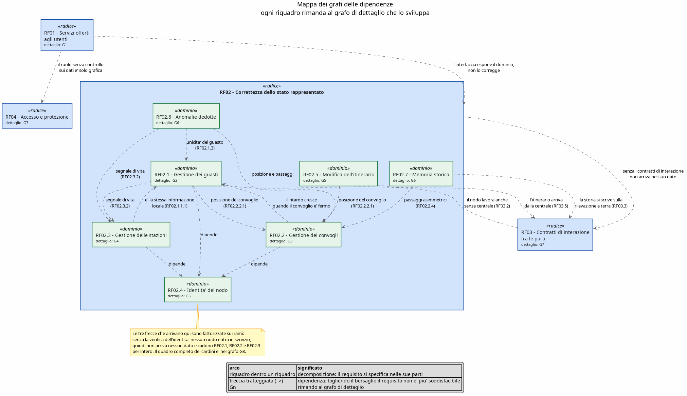

*** G1 - RF01, i servizi offerti agli utenti

RF01 e' quello che l'utente vede: non aggiunge logica al dominio, la espone. Per questo tutte le sue
frecce escono e nessuna entra, e ogni servizio punta al requisito di dominio che lo rende possibile.

#+begin_src plantuml :file ./immaginiDocumentazioneDelSistemaMonitoraggioEGestioneDelTrafficoFerroviario/rf_grafo_s1_servizi.png
@startuml rf_grafo_s1_servizi

skinparam backgroundColor #FEFEFE
skinparam shadowing false
skinparam ArrowColor #5F6368
skinparam rectangle {
    BackgroundColor #E8F0FE
    BorderColor #1A73E8
    FontColor #202124
}
skinparam rectangle<<radice>> {
    BackgroundColor #D2E3FC
    BorderColor #174EA6
}
skinparam rectangle<<altrove>> {
    BackgroundColor #FFFFFF
    BorderColor #BDBDBD
    FontColor #757575
}
skinparam note {
    BackgroundColor #FFF9C4
    BorderColor #F9A825
}

title G1 - RF01 : i servizi offerti agli utenti

rectangle "RF01 - Servizi offerti\nagli utenti" as RF01 <<radice>>

rectangle "RF01.1 - Visualizzazione\ndella situazione corrente" as RF0101
rectangle "RF01.2 - Visualizzazione\ndei guasti" as RF0102
rectangle "RF01.3 - Amministrazione\ndei dati della rete" as RF0103
rectangle "RF01.4 - Comandi operativi" as RF0104
rectangle "RF01.5 - Consultazione\ndello storico" as RF0105
rectangle "RF01.6 - Accesso al sistema" as RF0106

RF01 *-- RF0101
RF01 *-- RF0102
RF01 *-- RF0103
RF01 *-- RF0104
RF01 *-- RF0105
RF01 *-- RF0106

' i sei servizi messi su due file: in una sola riga il grafo viene
' largo il triplo di quanto e' alto e in pagina non si legge piu'
' Questi archi “forzano” il motore di layout a disporre i nodi in un certo ordine spaziale, senza che l’utente veda nulla.'
RF0101 -[hidden]-> RF0104
RF0102 -[hidden]-> RF0105
RF0103 -[hidden]-> RF0106

' ---- quello che sta fuori da questo grafo ----
rectangle "RF02 - Correttezza dello\nstato rappresentato\n<size:11>mappa generale</size>" as RF02 <<altrove>>
rectangle "RF02.2.2.1 - Posizione\ndel convoglio\n<size:11>G3</size>" as RF02020201 <<altrove>>
rectangle "RF02.3.1 - Informazioni\nrese dalla stazione\n<size:11>G4</size>" as RF020301 <<altrove>>
rectangle "RF02.1 - Gestione\ndei guasti\n<size:11>G2</size>" as RF0201 <<altrove>>
rectangle "RF02.6 - Anomalie\ndedotte\n<size:11>G6</size>" as RF0206 <<altrove>>
rectangle "RF02.5 - Modifica\ndell'itinerario\n<size:11>G5</size>" as RF0205 <<altrove>>
rectangle "RF02.1.3 - Ciclo di vita\ndel guasto\n<size:11>G2</size>" as RF020103 <<altrove>>
rectangle "RF02.7 - Memoria\nstorica\n<size:11>G6</size>" as RF0207 <<altrove>>
rectangle "RF04.2 - Autorizzazione\nper ruolo\n<size:11>G7</size>" as RF0402 <<altrove>>

RF01 ..> RF02 : l'interfaccia espone il dominio,\nnon lo corregge

RF0101 ..> RF02020201 : posizione del convoglio
RF0101 ..> RF020301 : stato della stazione
RF0102 ..> RF0201 : dipende
RF0102 ..> RF0206 : per distinguere segnalato\nda dedotto
RF0103 ..> RF0205 : la modifica deve\nrestare corretta
RF0104 ..> RF020103 : agisce sul ciclo\ndi vita del guasto
RF0105 ..> RF0207 : legge la memoria storica
RF0106 ..> RF0402 : il ruolo senza controllo\nsui dati e' solo grafica

note top of RF01
  La freccia su RF02 sta sulla radice e basta: vale per
  tutti e sei i servizi, quindi si fattorizza una volta
  sola invece di ripeterla sei volte.
end note

legend bottom
  |= arco |= significato |
  | linea piena (*--) | decomposizione: il requisito si specifica nelle sue parti |
  | freccia tratteggiata (..>) | dipendenza: togliendo il bersaglio il requisito non e' piu' soddisfacibile |
  | riquadro bianco bordato di grigio | requisito decomposto in un altro grafo |
end legend

@enduml
#+end_src

#+RESULTS:
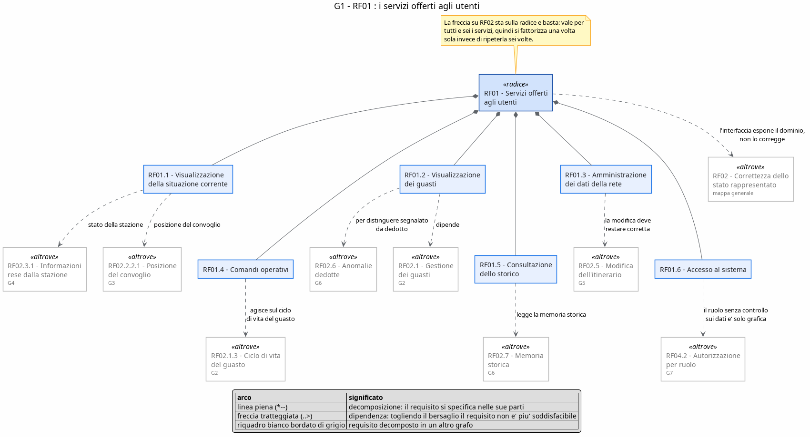

*** G2 - RF02.1, la gestione dei guasti

Il guasto segnalato dal campo. Le conseguenze di un guasto sono tutte domande sulla posizione del
convoglio, e la chiusura automatica e' una domanda sul segnale di vita: sono i due cardini che questo
ramo consuma.

#+begin_src plantuml :file ./immaginiDocumentazioneDelSistemaMonitoraggioEGestioneDelTrafficoFerroviario/rf_grafo_s2_guasti.png
@startuml rf_grafo_s2_guasti

skinparam backgroundColor #FEFEFE
skinparam shadowing false
skinparam ArrowColor #5F6368
skinparam rectangle {
    BackgroundColor #E8F0FE
    BorderColor #1A73E8
    FontColor #202124
}
skinparam rectangle<<dominio>> {
    BackgroundColor #E6F4EA
    BorderColor #137333
}
skinparam rectangle<<cardine>> {
    BackgroundColor #FEF7E0
    BorderColor #F9A825
}
skinparam rectangle<<altrove>> {
    BackgroundColor #FFFFFF
    BorderColor #BDBDBD
    FontColor #757575
}
skinparam note {
    BackgroundColor #FFF9C4
    BorderColor #F9A825
}

title G2 - RF02.1 : la gestione dei guasti

rectangle "RF02.1 - Gestione dei guasti" as RF0201 <<dominio>>

rectangle "RF02.1.1.1 - Nessun dato perduto\ne ordine preservato" as RF02010101
rectangle "RF02.1.1.2 - Stazione non percorribile:\nil convoglio si ferma e riparte\nsolo al ripristino" as RF02010102
rectangle "RF02.1.2.2.1 - Convoglio guasto in stazione:\nstazione non percorribile" as RF0201020201
rectangle "RF02.1.2.2.2 - Convoglio guasto in tratta:\ntratta non percorribile" as RF0201020202
rectangle "RF02.1.3 - Ciclo di vita del guasto\n(unicita' per sorgente)" as RF020103
rectangle "RF02.1.4 - Chiusura automatica\nquando la causa rientra" as RF020104

RF0201 *-- RF02010101
RF0201 *-- RF02010102
RF0201 *-- RF0201020201
RF0201 *-- RF0201020202
RF0201 *-- RF020103
RF0201 *-- RF020104

' come sopra: due file invece di sei riquadri affiancati
RF02010101 -[hidden]-> RF0201020201
RF02010102 -[hidden]-> RF0201020202
RF020103 -[hidden]-> RF020104

' ---- quello che sta fuori da questo grafo ----
rectangle "RF02.2.2.1 - Posizione:\nin quale stazione o su quale tratta\n<size:11>G3</size>" as RF02020201 <<altrove>>
rectangle "RF02.3.2 - Segnale di vita\nstazione -> centrale\n<size:11>G4</size>" as RF020302 <<altrove>>
rectangle "RF02.4 - Identita' del nodo\nverificata in centrale\n<size:11>G5</size>" as RF0204 <<altrove>>

RF0201 ..> RF0204 : dipende
RF02010102 ..> RF02020201 : dipende
RF0201020201 ..> RF02020201 : dipende
RF0201020202 ..> RF02020201 : dipende
RF020104 ..> RF020302 : e' il ritorno del segnale\na chiudere il guasto

note bottom of RF02010101
  L'informazione che sopravvive all'interruzione e' una sola:
  questa. RF02.3.1, in G4, non ne tiene una seconda, serve
  alla visualizzazione proprio quello che qui non si perde.
end note

note top of RF0201
  Chi dipende da quest'area, dagli altri grafi:
  - RF01.2  visualizzazione dei guasti (G1)
  - RF01.4  comandi operativi, su RF02.1.3 (G1)
  - RF02.2.1 i ritardi crescono sui fermi (G3)
  - RF02.6.1 unicita' del guasto, su RF02.1.3 (G6)
  - RF03.2  il nodo lavora anche senza centrale (G7)
end note

legend bottom
  |= arco |= significato |
  | linea piena (*--) | decomposizione: il requisito si specifica nelle sue parti |
  | freccia tratteggiata (..>) | dipendenza: togliendo il bersaglio il requisito non e' piu' soddisfacibile |
  | riquadro bianco bordato di grigio | requisito decomposto in un altro grafo |
end legend

@enduml
#+end_src

#+RESULTS:
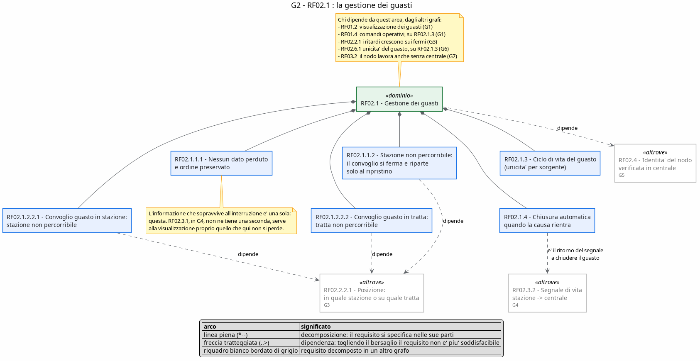

*** G3 - RF02.2, la gestione dei convogli

Qui dentro sta RF02.2.2.1, il primo dei tre cardini: la posizione del convoglio. Le frecce che gli
arrivano da fuori sono sei e stanno tutte insieme in G8.

#+begin_src plantuml :file ./immaginiDocumentazioneDelSistemaMonitoraggioEGestioneDelTrafficoFerroviario/rf_grafo_s3_convogli.png
@startuml rf_grafo_s3_convogli

skinparam backgroundColor #FEFEFE
skinparam shadowing false
skinparam ArrowColor #5F6368
skinparam rectangle {
    BackgroundColor #E8F0FE
    BorderColor #1A73E8
    FontColor #202124
}
skinparam rectangle<<dominio>> {
    BackgroundColor #E6F4EA
    BorderColor #137333
}
skinparam rectangle<<cardine>> {
    BackgroundColor #FEF7E0
    BorderColor #F9A825
}
skinparam rectangle<<altrove>> {
    BackgroundColor #FFFFFF
    BorderColor #BDBDBD
    FontColor #757575
}
skinparam note {
    BackgroundColor #FFF9C4
    BorderColor #F9A825
}

title G3 - RF02.2 : la gestione dei convogli

rectangle "RF02.2 - Gestione dei convogli" as RF0202 <<dominio>>

rectangle "RF02.2.1 - Ritardi" as RF020201
rectangle "RF02.2.2.1 - Posizione:\nin quale stazione o su quale tratta" as RF02020201 <<cardine>>
rectangle "RF02.2.2.3 - Stato del convoglio\n(distinto dalla posizione)" as RF02020203
rectangle "RF02.2.3 - Andata e ritorno\ncon inversione al capolinea" as RF020203
rectangle "RF02.2.4 - Passaggi asimmetrici\n(esce senza entrare,\nentra senza uscire)" as RF020204

RF0202 *-- RF020201
RF0202 *-- RF02020201
RF0202 *-- RF02020203
RF0202 *-- RF020203
RF0202 *-- RF020204

RF020204 ..> RF020203 : le asimmetrie nascono\nai due capolinea

' ---- quello che sta fuori da questo grafo ----
rectangle "RF02.1 - Gestione\ndei guasti\n<size:11>G2</size>" as RF0201 <<altrove>>
rectangle "RF02.4 - Identita' del nodo\nverificata in centrale\n<size:11>G5</size>" as RF0204 <<altrove>>

RF0202 ..> RF0204 : dipende
RF020201 ..> RF0201 : cresce quando\nil convoglio e' trattenuto

note bottom of RF02020201
  Cardine della specifica.
  "Dove si trova il convoglio" e' la domanda da cui dipendono
  la conseguenza di un guasto (stazione o tratta non percorribile),
  la modifica dell'itinerario a sistema acceso e il riconoscimento
  del convoglio fermo troppo a lungo.
  Togli questa e cadono sei requisiti in una volta: il quadro
  completo e' in G8.
end note

legend bottom
  |= arco |= significato |
  | linea piena (*--) | decomposizione: il requisito si specifica nelle sue parti |
  | freccia tratteggiata (..>) | dipendenza: togliendo il bersaglio il requisito non e' piu' soddisfacibile |
  | riquadro giallo | requisito cardine: da esso dipendono molti altri |
  | riquadro bianco bordato di grigio | requisito decomposto in un altro grafo |
end legend

@enduml
#+end_src

#+RESULTS:
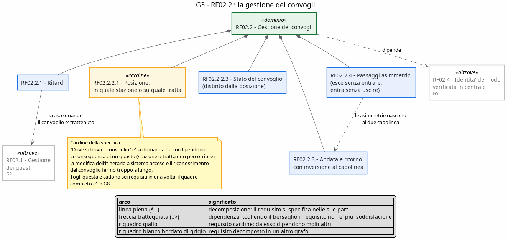

*** G4 - RF02.3, la gestione delle stazioni

Il secondo cardine e' qui: il segnale di vita della stazione. Il suo valore informativo sta
nell'assenza, ed e' per questo che due requisiti di aree diverse ci si appoggiano.

#+begin_src plantuml :file ./immaginiDocumentazioneDelSistemaMonitoraggioEGestioneDelTrafficoFerroviario/rf_grafo_s4_stazioni.png
@startuml rf_grafo_s4_stazioni

skinparam backgroundColor #FEFEFE
skinparam shadowing false
skinparam ArrowColor #5F6368
skinparam rectangle {
    BackgroundColor #E8F0FE
    BorderColor #1A73E8
    FontColor #202124
}
skinparam rectangle<<dominio>> {
    BackgroundColor #E6F4EA
    BorderColor #137333
}
skinparam rectangle<<cardine>> {
    BackgroundColor #FEF7E0
    BorderColor #F9A825
}
skinparam rectangle<<altrove>> {
    BackgroundColor #FFFFFF
    BorderColor #BDBDBD
    FontColor #757575
}
skinparam note {
    BackgroundColor #FFF9C4
    BorderColor #F9A825
}

title G4 - RF02.3 : la gestione delle stazioni

rectangle "RF02.3 - Gestione delle stazioni" as RF0203 <<dominio>>

rectangle "RF02.3.1 - Informazioni\nrese dalla stazione" as RF020301
rectangle "RF02.3.2 - Segnale di vita\nstazione -> centrale" as RF020302 <<cardine>>
rectangle "RF02.3.3 - Segnale di vita\nsensori -> stazione" as RF020303

RF0203 *-- RF020301
RF0203 *-- RF020302
RF0203 *-- RF020303

' ---- quello che sta fuori da questo grafo ----
rectangle "RF02.1.1.1 - Nessun dato perduto\ne ordine preservato\n<size:11>G2</size>" as RF02010101 <<altrove>>
rectangle "RF02.4 - Identita' del nodo\nverificata in centrale\n<size:11>G5</size>" as RF0204 <<altrove>>

RF0203 ..> RF0204 : dipende
RF020301 ..> RF02010101 : e' la stessa informazione\nche sopravvive all'interruzione

note bottom of RF020302
  Il valore informativo del segnale di vita sta nella sua assenza:
  senza un segnale emesso a prescindere dagli eventi, il silenzio
  di una stazione non e' distinguibile dall'assenza di traffico.
  Ci si appoggiano RF02.6.1 (stazione silenziosa) e RF02.1.4
  (chiusura automatica del guasto): si vedono insieme in G8.
end note

legend bottom
  |= arco |= significato |
  | linea piena (*--) | decomposizione: il requisito si specifica nelle sue parti |
  | freccia tratteggiata (..>) | dipendenza: togliendo il bersaglio il requisito non e' piu' soddisfacibile |
  | riquadro giallo | requisito cardine: da esso dipendono molti altri |
  | riquadro bianco bordato di grigio | requisito decomposto in un altro grafo |
end legend

@enduml
#+end_src

#+RESULTS:
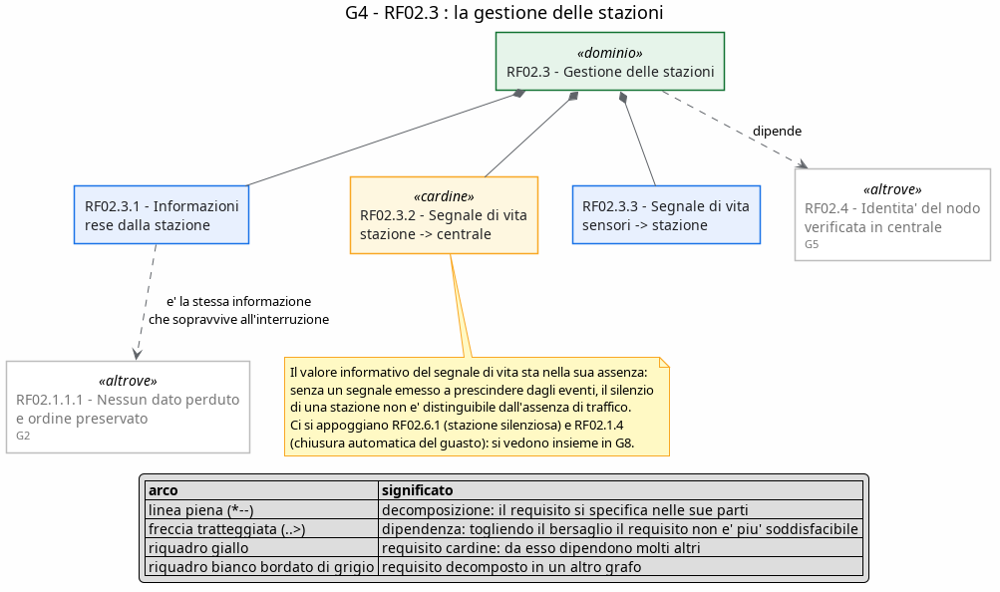

*** G5 - RF02.4 e RF02.5, chi entra nel sistema e chi cambia strada

Due aree piccole ma messe insieme non per comodita': una dice a quali condizioni un nodo entra in
servizio, l'altra a quali condizioni un itinerario puo' cambiare mentre il sistema e' acceso. Sono le
due porte del sistema, una in ingresso e una in corsa.

#+begin_src plantuml :file ./immaginiDocumentazioneDelSistemaMonitoraggioEGestioneDelTrafficoFerroviario/rf_grafo_s5_identita_itinerario.png
@startuml rf_grafo_s5_identita_itinerario

skinparam backgroundColor #FEFEFE
skinparam shadowing false
skinparam ArrowColor #5F6368
skinparam rectangle {
    BackgroundColor #E8F0FE
    BorderColor #1A73E8
    FontColor #202124
}
skinparam rectangle<<dominio>> {
    BackgroundColor #E6F4EA
    BorderColor #137333
}
skinparam rectangle<<cardine>> {
    BackgroundColor #FEF7E0
    BorderColor #F9A825
}
skinparam rectangle<<altrove>> {
    BackgroundColor #FFFFFF
    BorderColor #BDBDBD
    FontColor #757575
}
skinparam note {
    BackgroundColor #FFF9C4
    BorderColor #F9A825
}

title G5 - RF02.4 identita' del nodo e RF02.5 modifica dell'itinerario

' ---- RF02.4 : la porta d'ingresso ----
rectangle "RF02.4 - Identita' del nodo\nverificata in centrale" as RF0204 <<cardine>>

rectangle "RF02.1 - Gestione\ndei guasti\n<size:11>G2</size>" as RF0201 <<altrove>>
rectangle "RF02.2 - Gestione\ndei convogli\n<size:11>G3</size>" as RF0202 <<altrove>>
rectangle "RF02.3 - Gestione\ndelle stazioni\n<size:11>G4</size>" as RF0203 <<altrove>>

RF0201 ..> RF0204 : dipende
RF0202 ..> RF0204 : dipende
RF0203 ..> RF0204 : dipende

' ---- RF02.5 : il cambio di itinerario ----
rectangle "RF02.5 - Modifica dell'itinerario\na sistema acceso" as RF0205 <<dominio>>
rectangle "RF02.5.1 - Convoglio escluso:\nsi ferma in attesa di soppressione" as RF020501
rectangle "RF02.5.2 - Convoglio assegnato:\nprosegue dal punto in cui si trova" as RF020502

RF0205 *-- RF020501
RF0205 *-- RF020502

rectangle "RF02.2.2.1 - Posizione:\nin quale stazione o su quale tratta\n<size:11>G3</size>" as RF02020201 <<altrove>>
rectangle "RF03.5 - L'itinerario e' fornito\ndalla centrale\n<size:11>G7</size>" as RF0305 <<altrove>>

RF020501 ..> RF02020201 : dipende
RF020502 ..> RF02020201 : dipende
RF0205 ..> RF0305 : la nuova versione arriva\ndalla centrale

note bottom of RF0204
  Test di eliminazione: senza la verifica dell'identita' nessun nodo
  entra in servizio, quindi non arriva nessun dato e cadono RF02.1,
  RF02.2 e RF02.3 per intero. Per questo la freccia sta sui rami
  e non su ogni foglia.
end note

note bottom of RF0205
  I due casi sono la stessa domanda letta in due modi: per sapere se
  un convoglio e' escluso o assegnato bisogna prima sapere dove si
  trova. Chi puo' chiedere la modifica lo dice RF01.3, in G1.
end note

legend bottom
  |= arco |= significato |
  | linea piena (*--) | decomposizione: il requisito si specifica nelle sue parti |
  | freccia tratteggiata (..>) | dipendenza: togliendo il bersaglio il requisito non e' piu' soddisfacibile |
  | riquadro giallo | requisito cardine: da esso dipendono molti altri |
  | riquadro bianco bordato di grigio | requisito decomposto in un altro grafo |
end legend

@enduml
#+end_src

#+RESULTS:
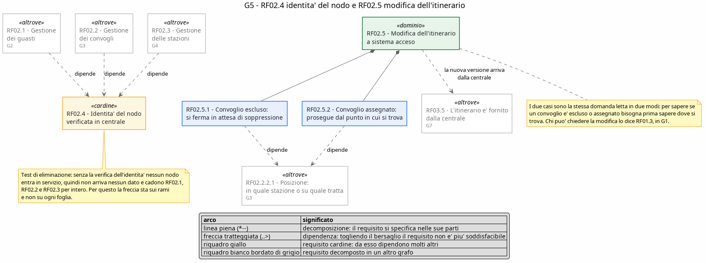

*** G6 - RF02.6 e RF02.7, cio' che la centrale deduce e cio' che ricorda

Le anomalie dedotte non sono segnalate da nessuno: la centrale le ricava da un silenzio o da un
fermo che dura troppo. La memoria storica e' l'altra faccia della stessa cosa: e' quello che resta
quando il momento e' passato.

#+begin_src plantuml :file ./immaginiDocumentazioneDelSistemaMonitoraggioEGestioneDelTrafficoFerroviario/rf_grafo_s6_anomalie_storia.png
@startuml rf_grafo_s6_anomalie_storia

skinparam backgroundColor #FEFEFE
skinparam shadowing false
skinparam ArrowColor #5F6368
skinparam rectangle {
    BackgroundColor #E8F0FE
    BorderColor #1A73E8
    FontColor #202124
}
skinparam rectangle<<dominio>> {
    BackgroundColor #E6F4EA
    BorderColor #137333
}
skinparam rectangle<<altrove>> {
    BackgroundColor #FFFFFF
    BorderColor #BDBDBD
    FontColor #757575
}
skinparam note {
    BackgroundColor #FFF9C4
    BorderColor #F9A825
}

title G6 - RF02.6 anomalie dedotte dalla centrale e RF02.7 memoria storica

rectangle "RF02.6 - Anomalie dedotte\ndalla centrale" as RF0206 <<dominio>>
rectangle "RF02.6.1 - Stazione silenziosa\noltre T_sil" as RF020601
rectangle "RF02.6.2 - Convoglio fermo\nfuori stazione oltre T_fer" as RF020602
rectangle "RF02.6.3 - Fotografia periodica\ndello stato" as RF020603

RF0206 *-- RF020601
RF0206 *-- RF020602
RF0206 *-- RF020603

rectangle "RF02.7 - Memoria storica\n(si registrano i cambiamenti)" as RF0207 <<dominio>>

' ---- quello che sta fuori da questo grafo ----
rectangle "RF02.2.2.1 - Posizione:\nin quale stazione o su quale tratta\n<size:11>G3</size>" as RF02020201 <<altrove>>
rectangle "RF02.3.2 - Segnale di vita\nstazione -> centrale\n<size:11>G4</size>" as RF020302 <<altrove>>
rectangle "RF02.1.3 - Ciclo di vita del guasto\n(unicita' per sorgente)\n<size:11>G2</size>" as RF020103 <<altrove>>
rectangle "RF02.2.4 - Passaggi asimmetrici\n<size:11>G3</size>" as RF020204 <<altrove>>
rectangle "RF03.3 - Due fonti di verita'\nper lo stesso passaggio\n<size:11>G7</size>" as RF0303 <<altrove>>

RF020601 ..> RF020302 : senza segnale regolare\nnon c'e' silenzio da misurare
RF020601 ..> RF020103 : senza unicita' un allarme\na ogni controllo
RF020602 ..> RF02020201 : "fuori stazione" e'\nuna domanda sulla posizione
RF0207 ..> RF020204 : la storia deve reggere\nle entrate/uscite spaiate
RF0207 ..> RF0303 : la storia si scrive\nsulla rilevazione a terra

note bottom of RF020603
  La fotografia periodica non dipende da niente: si scatta a
  intervalli fissi qualunque cosa stia succedendo, ed e' proprio
  questo che la rende utile quando gli eventi non arrivano.
end note

note top of RF0207
  Chi dipende da quest'area, dagli altri grafi:
  RF01.5, la consultazione dello storico (G1); e su RF02.6
  si appoggia RF01.2, per distinguere un guasto segnalato
  da uno dedotto.
end note

legend bottom
  |= arco |= significato |
  | linea piena (*--) | decomposizione: il requisito si specifica nelle sue parti |
  | freccia tratteggiata (..>) | dipendenza: togliendo il bersaglio il requisito non e' piu' soddisfacibile |
  | riquadro bianco bordato di grigio | requisito decomposto in un altro grafo |
end legend

@enduml
#+end_src

#+RESULTS:
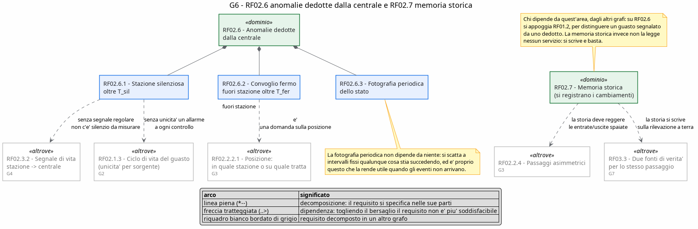

*** G7 - RF03 e RF04, i contratti fra le parti e l'accesso

Queste due radici non si vedono da nessuna schermata, ma stanno sotto tutto il resto: RF03 dice a
quali condizioni le parti si parlano, RF04 a quali condizioni qualcuno puo' guardare e toccare.

#+begin_src plantuml :file ./immaginiDocumentazioneDelSistemaMonitoraggioEGestioneDelTrafficoFerroviario/rf_grafo_s7_contratti_accesso.png
@startuml rf_grafo_s7_contratti_accesso

skinparam backgroundColor #FEFEFE
skinparam shadowing false
skinparam ArrowColor #5F6368
skinparam rectangle {
    BackgroundColor #E8F0FE
    BorderColor #1A73E8
    FontColor #202124
}
skinparam rectangle<<radice>> {
    BackgroundColor #D2E3FC
    BorderColor #174EA6
}
skinparam rectangle<<altrove>> {
    BackgroundColor #FFFFFF
    BorderColor #BDBDBD
    FontColor #757575
}
skinparam note {
    BackgroundColor #FFF9C4
    BorderColor #F9A825
}

title G7 - RF03 contratti di interazione e RF04 accesso e protezione

rectangle "RF03 - Contratti di interazione\nfra le parti" as RF03 <<radice>>
rectangle "RF03.1 - Autonomia dei nodi" as RF0301
rectangle "RF03.2 - Disaccoppiamento\ncampo <-> centrale" as RF0302
rectangle "RF03.3 - Due fonti di verita'\nper lo stesso passaggio" as RF0303
rectangle "RF03.4 - I sensori usano solo\nl'interfaccia pubblica del nodo" as RF0304
rectangle "RF03.5 - L'itinerario e' fornito\ndalla centrale" as RF0305

RF03 *-- RF0301
RF03 *-- RF0302
RF03 *-- RF0303
RF03 *-- RF0304
RF03 *-- RF0305

' due file anche qui
RF0301 -[hidden]-> RF0304
RF0302 -[hidden]-> RF0305

rectangle "RF04 - Accesso e protezione" as RF04 <<radice>>
rectangle "RF04.1 - Autenticazione\n(credenziali note a una parte sola)" as RF0401
rectangle "RF04.2 - Autorizzazione per ruolo\n(controllo lato dati)" as RF0402
rectangle "RF04.3 - Protezione dei canali" as RF0403

RF04 *-- RF0401
RF04 *-- RF0402
RF04 *-- RF0403

RF0402 ..> RF0401 : il ruolo si legge\ndall'attestato

' ---- quello che sta fuori da questo grafo ----
rectangle "RF02 - Correttezza dello\nstato rappresentato\n<size:11>mappa generale</size>" as RF02 <<altrove>>
rectangle "RF02.1.1.1 - Nessun dato perduto\ne ordine preservato\n<size:11>G2</size>" as RF02010101 <<altrove>>
rectangle "RF01.6 - Accesso\nal sistema\n<size:11>G1</size>" as RF0106 <<altrove>>
rectangle "RF02.5 - Modifica\ndell'itinerario\n<size:11>G5</size>" as RF0205 <<altrove>>
rectangle "RF02.7 - Memoria\nstorica\n<size:11>G6</size>" as RF0207 <<altrove>>

RF02 ..> RF03 : senza i contratti di interazione\nnon arriva nessun dato
RF0302 ..> RF02010101 : il nodo lavora\nanche senza centrale
RF0205 ..> RF0305 : dipende
RF0207 ..> RF0303 : dipende
RF0106 ..> RF0402 : dipende

note bottom of RF0302
  Le due frecce fra RF02 e RF03
  non si annullano: RF02 ha bisogno
  dei contratti per ricevere i dati,
  e il disaccoppiamento ha bisogno
  che il nodo sappia conservare cio'
  che produce mentre la centrale non
  c'e'. E' una condizione reciproca,
  non un errore di disegno.
end note

note bottom of RF0403
  La protezione dei canali non ha
  frecce perche' non e' presupposto
  di nessun requisito funzionale:
  se cade, il sistema continua a
  funzionare, solo che lo fa in chiaro.
end note

legend bottom
  |= arco |= significato |
  | linea piena (*--) | decomposizione: il requisito si specifica nelle sue parti |
  | freccia tratteggiata (..>) | dipendenza: togliendo il bersaglio il requisito non e' piu' soddisfacibile |
  | riquadro bianco bordato di grigio | requisito decomposto in un altro grafo |
end legend

@enduml
#+end_src

#+RESULTS:
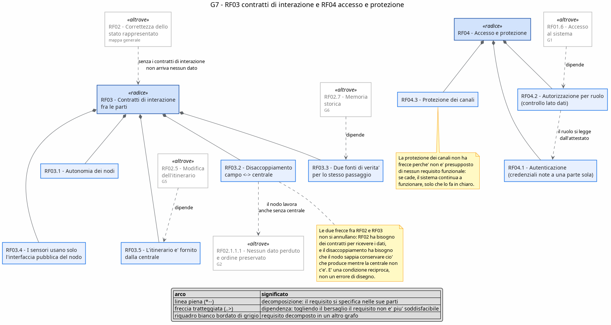

*** G8 - i tre cardini

Qui non c'e' nessun arco di decomposizione: ci sono solo i tre requisiti cardine e tutto quello che
cade insieme a loro. E' il grafo da guardare per il test di eliminazione, cioe' per rispondere alla
domanda "se tolgo questo, che cosa non e' piu' soddisfacibile?".

#+begin_src plantuml :file ./immaginiDocumentazioneDelSistemaMonitoraggioEGestioneDelTrafficoFerroviario/rf_grafo_s8_cardini.png
@startuml rf_grafo_s8_cardini

skinparam backgroundColor #FEFEFE
skinparam shadowing false
skinparam ArrowColor #5F6368
skinparam rectangle {
    BackgroundColor #E8F0FE
    BorderColor #1A73E8
    FontColor #202124
}
skinparam rectangle<<dominio>> {
    BackgroundColor #E6F4EA
    BorderColor #137333
}
skinparam rectangle<<cardine>> {
    BackgroundColor #FEF7E0
    BorderColor #F9A825
}
skinparam note {
    BackgroundColor #FFF9C4
    BorderColor #F9A825
}

title G8 - i tre requisiti cardine e cio' che cade con loro\n(giallo = cardine; nessun arco di decomposizione, solo dipendenze)

' ===================== CARDINE 1 : LA POSIZIONE ========================
rectangle "RF02.1.1.2 - Stazione non percorribile:\nil convoglio si ferma\n<size:11>G2</size>" as RF02010102
rectangle "RF02.1.2.2.1 - Convoglio guasto in stazione:\nstazione non percorribile\n<size:11>G2</size>" as RF0201020201
rectangle "RF02.1.2.2.2 - Convoglio guasto in tratta:\ntratta non percorribile\n<size:11>G2</size>" as RF0201020202
rectangle "RF02.5.1 - Convoglio escluso:\nsi ferma in attesa di soppressione\n<size:11>G5</size>" as RF020501
rectangle "RF02.5.2 - Convoglio assegnato:\nprosegue dal punto in cui si trova\n<size:11>G5</size>" as RF020502
rectangle "RF02.6.2 - Convoglio fermo\nfuori stazione oltre T_fer\n<size:11>G6</size>" as RF020602
rectangle "RF01.1 - Visualizzazione\ndella situazione corrente\n<size:11>G1</size>" as RF0101

rectangle "RF02.2.2.1 - Posizione:\nin quale stazione o su quale tratta\n<size:11>G3</size>" as RF02020201 <<cardine>>

RF02010102 ..> RF02020201 : dipende
RF0201020201 ..> RF02020201 : dipende
RF0201020202 ..> RF02020201 : dipende
RF020501 ..> RF02020201 : dipende
RF020502 ..> RF02020201 : dipende
RF020602 ..> RF02020201 : "fuori stazione" e'\nuna domanda sulla posizione
RF0101 ..> RF02020201 : posizione del convoglio

' i dipendenti messi in colonna, senno' vengono tutti in fila
RF02010102 -[hidden]-> RF0201020201
RF0201020201 -[hidden]-> RF0201020202
RF0201020202 -[hidden]-> RF020501
RF020501 -[hidden]-> RF020502
RF020502 -[hidden]-> RF020602
RF020602 -[hidden]-> RF0101

' ===================== CARDINE 2 : IL SEGNALE DI VITA ==================
rectangle "RF02.6.1 - Stazione silenziosa\noltre T_sil\n<size:11>G6</size>" as RF020601
rectangle "RF02.1.4 - Chiusura automatica\nquando la causa rientra\n<size:11>G2</size>" as RF020104

rectangle "RF02.3.2 - Segnale di vita\nstazione -> centrale\n<size:11>G4</size>" as RF020302 <<cardine>>

RF020601 ..> RF020302 : senza segnale regolare\nnon c'e' silenzio da misurare
RF020104 ..> RF020302 : e' il ritorno del segnale\na chiudere il guasto

RF020601 -[hidden]-> RF020104

' ===================== CARDINE 3 : L'IDENTITA' DEL NODO ================
rectangle "RF02.1 - Gestione\ndei guasti\n<size:11>G2</size>" as RF0201 <<dominio>>
rectangle "RF02.2 - Gestione\ndei convogli\n<size:11>G3</size>" as RF0202 <<dominio>>
rectangle "RF02.3 - Gestione\ndelle stazioni\n<size:11>G4</size>" as RF0203 <<dominio>>

rectangle "RF02.4 - Identita' del nodo\nverificata in centrale\n<size:11>G5</size>" as RF0204 <<cardine>>

RF0201 ..> RF0204 : dipende
RF0202 ..> RF0204 : dipende
RF0203 ..> RF0204 : dipende

note bottom of RF02020201
  Sette requisiti su una domanda sola. Ed e' anche il motivo per cui
  la posizione e' tenuta distinta dallo stato del convoglio
  (RF02.2.2.3): se le due cose stessero insieme, ognuno di questi
  sette dipenderebbe anche da informazioni che non gli servono.
end note

note bottom of RF020302
  Cardine per assenza: quello che porta informazione non e' il
  segnale che arriva, e' quello che non arriva piu'.
end note

note bottom of RF0204
  Cardine per posizione: non e' un'informazione che serve a
  qualcuno, e' la porta d'ingresso. Senza, tre aree intere
  restano a secco di dati.
end note

legend bottom
  |= arco |= significato |
  | freccia tratteggiata (..>) | dipendenza: togliendo il bersaglio il requisito non e' piu' soddisfacibile |
  | riquadro giallo | requisito cardine |
  | Gn | grafo di dettaglio in cui il requisito e' decomposto |
end legend

@enduml
#+end_src

#+RESULTS:
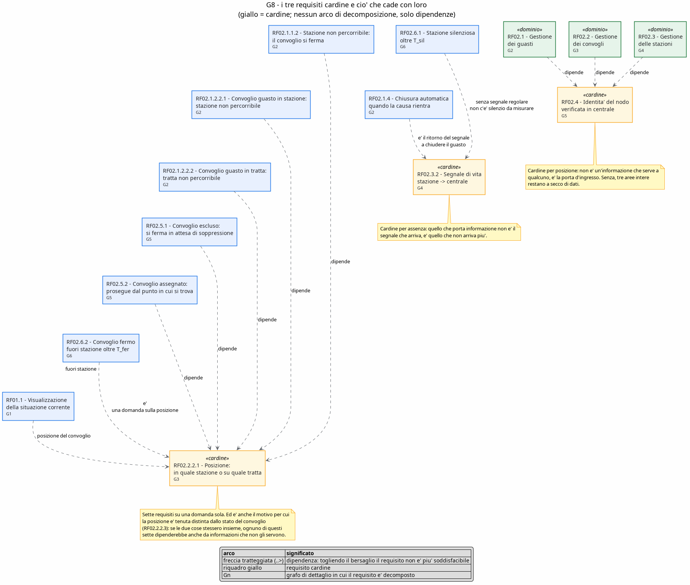

** Riepilogo requisiti - macchine a stati

È la lettura al contrario delle righe "requisiti coperti" che stanno sopra ogni diagramma del
capitolo /Progettazione/: qui si parte dal requisito e si trovano le macchine, lì si parte dalla
macchina e si trovano i requisiti. T = treno, S = stazione, M = centrale, e i numeri sono quelli
delle macchine a stati, non quelli dei grafi G1...G8 di questa specifica.

Un requisito è in *coperto da* quando le macchine elencate lo soddisfano per intero, in
*parzialmente* quando ci contribuiscono senza chiuderlo da sole. Le righe vuote in entrambe le
colonne sono i requisiti che il sistema realizzato non soddisfa: sono lasciate apposta, perché una
tabella che non le mostra racconta una copertura che non c'è.

Questa tabella però non va letta come lo *stato di implementazione* scritto accanto a ogni
requisito: lì la domanda è "il sistema lo fa?", qui è "quale macchina lo mostra?", e le due risposte
non coincidono sempre. Un paio di requisiti sono realizzati per intero senza che nessuna macchina li
chiuda, perché a tenerli sono i vincoli del database (RF01.3.5) o il modo in cui il dato viene
scritto (RF02.2.4). Dove i due giudizi divergono vale quello scritto accanto al requisito.

#+ATTR_LATEX: :environment longtable :align L{0.13\textwidth}L{0.13\textwidth}L{0.13\textwidth}L{0.48\textwidth} :font \small
| requisito    | coperto da  | parzialmente | nota                                                                        |
|--------------+-------------+--------------+-------------------------------------------------------------------------------|
| RF01.1.1     | M11         | T8, M3       | T8 e M3 producono la posizione, M11 è il canale che la spinge alla mappa      |
| RF01.1.2     | M11         | T8, M3       |                                                                               |
| RF01.1.3     | M11, M12    | S11          | i presenti sui binari li sa il nodo (S11), gli stati la centrale (M12)        |
| RF01.1.4     | M11         |              | il websocket: l'evento arriva quando accade, non a interrogazione             |
| RF01.1.5     | M11         | M8           | i numeri di sintesi li calcola il watchdog ogni 10 secondi                    |
| RF01.2.1     | M11         | M7           |                                                                               |
| RF01.2.2     |             | M6, M8, M11  | M6 è la porta del segnalato, M8 quella del dedotto, ma le due origini finiscono nello stesso tipo e l'elenco non le separa |
| RF01.3       | M9, M10     |              | M9 decide chi può, M10 esegue                                                 |
| RF01.3.5     |             | M10          | l'integrità alle eliminazioni la tengono i vincoli del db, non una macchina   |
| RF01.4.1     |             | M10, M12, S9 | il comando parte da M10, il nodo lo riceve in S9 e M11 ne annuncia il cambio di stato, ma MANUTENZIONE dura quanto la chiamata: l'evento parte, lo stato no |
| RF01.4.2     |             | M10, M7, T9, S9 | la chiusura c'è e il ripristino sblocca chi era trattenuto; la presa in carico no, nessun operatore viene registrato |
| RF01.4.3     |             | M10, T6, T9  | l'effetto c'è, la precondizione "fermo in stazione" non viene verificata      |
| RF01.5       | M10, M5     |              | M5 scrive lo storico, M10 lo serve alla dashboard                             |
| RF01.6       | M9          |              |                                                                               |
| RF02.1.1.1.1 | S4, S5      | S7           | è il caching locale con reinvio in massa                                      |
| RF02.1.1.1.2 | S4, S5      |              | il rientro in TESTA alla coda è ciò che conserva l'ordine                     |
| RF02.1.1.2.1 | T5, T9, T11 | S8           |                                                                               |
| RF02.1.1.2.2 | T5, T9, T11 | S9, M10      | riparte al ripristino, non per scadenza di un tempo                           |
| RF02.1.1.2.3 |             | S8, T11      | chi era già in sosta viene trattenuto solo se ripassa dall'alert di S8        |
| RF02.1.2.1   | M6, M7, M13 | T10, M3      |                                                                               |
| RF02.1.2.2.1 |             |              | non coperto da nessuna macchina: vedi la nota qui sotto                       |
| RF02.1.2.2.2 |             | M8           | M8 apre solo un allarme sul convoglio, la tratta resta percorribile           |
| RF02.1.3     |             | M7, M6, M8   | l'unicità per sorgente c'è ed è ciò che tiene leggibile l'elenco; mancano lo stato "preso in carico" e l'assegnatario |
| RF02.1.4     | M4, M3      | M8           | il battito che torna chiude il guasto dedotto sulla stazione (M4), il convoglio che riprende a muoversi chiude il proprio (M3): in tutti e due i casi solo quelli con il prefisso della centrale |
| RF02.2.1.1   | T5          | T9, T11      |                                                                               |
| RF02.2.2.1   | T5, M3      | T7, T8, M5   | il cardine della specifica: sei macchine ci si appoggiano                     |
| RF02.2.2.2   | T5, M3      | T8           |                                                                               |
| RF02.2.2.3   | T6, M13     | M3           | lo stato è tenuto distinto dalla posizione, come chiede il requisito          |
| RF02.2.2.4   | T8          |              | valori simulati, non alimentano nessuna decisione                             |
| RF02.2.3     | T7          |              |                                                                               |
| RF02.2.4     |             | T7           | i passaggi spaiati nascono ai capolinea, nessuna macchina li tratta a parte   |
| RF02.3.1     | S11, M5     | S6, S8       |                                                                               |
| RF02.3.2     | S3, M4      | M8           | S3 emette il battito, M8 ne misura il silenzio                                |
| RF02.3.3     | S7          | S6           |                                                                               |
| RF02.3.4     | S10, M12    |              | due stati sul nodo, quattro in centrale: è la asimmetria voluta dal requisito |
| RF02.4.1     | T2, S2, M2  | T1, S1       | i due lati della stessa conversazione MQTT                                    |
| RF02.4.2     | T1, S1      |              | il nodo non riconosciuto termina con codice 1, non resta acceso               |
| RF02.5.1     | T9, T5, M10 | T4, T6       | la fase SENZA_ITINERARIO e' il "resta fermo in attesa": senza di essa il convoglio escluso continuava a dichiararsi in marcia |
| RF02.5.2     |             | T3, T9, M10  | l'itinerario nuovo arriva, ma il viaggio riparte dalla prima tappa            |
| RF02.6.1     | M8          | S3, M12      |                                                                               |
| RF02.6.2     | M8          |              |                                                                               |
| RF02.6.3     | M8          | M11          | M8 scatta la fotografia, M11 la porta al browser                              |
| RF02.7       |             | M5, M3, M13  | si registrano i cambiamenti e non i campionamenti, ma solo per transiti, stati e guasti: assegnazioni degli operatori e itinerari percorsi non vengono mai scritti |
| RF03.1       | T1, S1, M1  |              | tre processi distinti, avviabili e arrestabili uno per volta                  |
| RF03.2       | S4          | S5, S7       |                                                                               |
| RF03.3       | M5          | T8, S8       | M5 è il punto in cui le due fonti restano trattate separatamente              |
| RF03.4       | T10, S6     |              | i sensori entrano solo dalle API REST del nodo                                |
| RF03.5       | M10         | T3           |                                                                               |
| RF04.1       | M9          |              |                                                                               |
| RF04.2       | M9          | M10          | il controllo è sul lato che possiede i dati, non sull'interfaccia             |
| RF04.3       |             |              | non è una macchina: è il profilo =%tls= sui canali, vedi la sezione /Topic/   |
#+begin_comment
I requisiti scoperti sono da tenere presenti, non sono una svista della tabella:
- RF02.1.2.2.1 e RF02.1.2.2.2: un convoglio che si guasta congela sé stesso (T4, T6) ma non rende
  non percorribile né la stazione né la tratta. Nella centrale solo un alert con sorgenteTipo
  STAZIONE e severità CRITICAL porta la stazione a GUASTA, quindi il contagio dal convoglio
  all'infrastruttura non esiste.
- RF02.5.2: dopo ITINERARIO_AGGIORNATO il treno svuota l'itinerario e riavvia il viaggio, e
  =avviaViaggio()= riparte da =indiceStazione= uguale a zero, quindi l'itinerario nuovo non viene ripreso dal
  punto in cui il convoglio si trovava.
- RF02.2.4: i passaggi asimmetrici avvengono davvero (T7 inverte al capolinea e la stazione di
  partenza produce una uscita senza entrata), ma nessuna macchina li riconosce come caso a sé: chi
  legge lo storico deve saperlo dalla specifica.
- RF01.4.2 e RF02.1.3, la parte sulla presa in carico: il ciclo di vita del guasto ha due stati e non
  tre, perché =Guasto= porta solo il booleano =risolto=, e l'assegnatario non viene mai scritto. La
  colonna =OperatoreCheSeNeStaOccupandoFK= e la tabella =Storico_Assegnazioni_Guasti= esistono nello
  schema ma restano vuote: =Guasto.operatore= non è valorizzato da nessuna parte del codice. Chiuso un
  allarme non si sa più chi lo ha chiuso.
- RF01.4.1: =dispacciaManutenzione= imposta MANUTENZIONE e rimette ONLINE dentro la stessa chiamata.
  I due passaggi adesso vengono annunciati sulla websocket (evento =STATION_STATUS=), ma partono a
  distanza di pochi millisecondi l'uno dall'altro, quindi il browser riceve MANUTENZIONE e subito
  dopo ONLINE: lo stato attraversa il canale e non resta piu' confinato dentro il metodo, pero'
  quanto a durata resta invisibile. Il requisito chiede che la stazione /risulti/ in manutenzione,
  e per essere soddisfatto davvero il ritorno a ONLINE andrebbe staccato dal comando e legato alla
  fine effettiva dell'intervento.
- RF01.4.3: la precondizione "il convoglio è fermo in una stazione" non è verificata: il comando
  sopprime anche un convoglio in mezzo a una tratta.
- RF01.2.2: la centrale distingue davvero il guasto dedotto da quello segnalato, ma solo al proprio
  interno e con un prefisso nel testo del messaggio (=Heartbeat assente:= per la stazione,
  =Convoglio fermo:= per il treno). Il tipo non lo indovina piu' leggendo il messaggio: lo dichiara
  la sorgente nel campo =tipoGuasto=, e in mancanza lo decide il tipo di sorgente. Resta pero' che
  il fail-stop dedotto e il sensore guasto segnalato dalla stazione hanno tutti e due tipo
  =sensore_offline=, e il DTO degli allarmi non porta nessun campo sull'origine: le due strade
  finiscono ancora indistinguibili nell'elenco.
- RF02.7, per due delle cinque cose elencate nell'enunciato: =Storico_Itinerari= e
  =Storico_Assegnazioni_Guasti= non vengono mai scritte (compaiono solo nelle DELETE di pulizia),
  quindi gli itinerari percorsi e le assegnazioni degli operatori non lasciano storia.
- RF04.3: la protezione dei canali è una configurazione, non un comportamento, e per questo non ha
  una macchina a stati che la descriva.
#+end_comment
* Progettazione
** Diagramma delle componenti
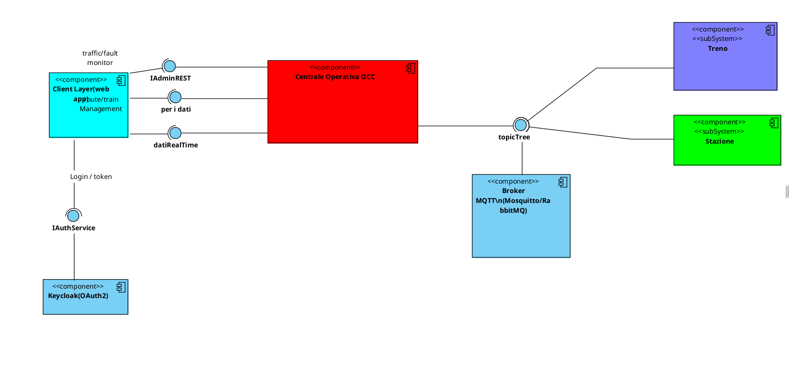
** Stack tecnologico
#+begin_comment
// bo roba ovvia e troppo prolissa
Tutta la parte server è Java 25 con Quarkus 3.37.3, compilata con Maven (ogni modulo ha il
suo =mvnw=). Centrale, Stazione e Treno sono tre progetti separati ma con lo stesso stack:
cambiano solo le estensioni che ognuno si porta dentro.
#+begin_comment
Usare lo stesso framework per tutti
e tre è stato comodo per tre motivi concreti:
- la messaggistica MQTT si *dichiara* invece di programmarla: con =quarkus-messaging-mqtt=
  (SmallRye Reactive Messaging) i canali stanno in =application.properties= e nel codice
  restano solo =@Incoming=, =@Outgoing= e gli =Emitter= per i topic che dipendono dal
  destinatario; non ho scritto una riga di client MQTT a mano;
- la configurazione ha i *profili*, e il profilo =%tls= mi ha permesso di aggiungere la
  cifratura (variante 6) senza duplicare niente: stesso jar, =-Dquarkus.profile=tls= e tutti
  i canali passano dalla 1883 alla 8883;
- =@Scheduled= dà i job periodici che il sistema usa in tre punti (heartbeat della stazione,
  keepalive dei sensori, watchdog della Centrale) senza scrivere thread e timer a mano.
Le differenze fra i tre nodi sono solo di estensioni. La Centrale è l'unica con
=hibernate-orm-panache= e =jdbc-postgresql= (l'unico database vero), con
=quarkus-websockets= per spingere gli aggiornamenti alla web app e con =quarkus-rest= per
l'API dell'operatore. Treno e Stazione hanno il minimo: MQTT, =quarkus-arc= (la CDI, che uso
per tenere =TrainDB= e =DBLocale= come singleton in memoria), lo scheduler e un
=quarkus-rest= che serve solo ai sensori, più un =HttpClient= del JDK (=SecureHttpClient=)
per scaricare l'itinerario dalla Centrale.

L'autenticazione non è scritta da me: è delegata a *Keycloak 26*, che gira in Docker e fa da
Identity Provider OAuth2 / OpenID Connect. Lato Centrale l'unica cosa aggiunta è l'estensione
=quarkus-oidc=, che scarica le chiavi pubbliche del realm e verifica da sola la firma dei
token; lato web app non ho aggiunto nessuna libreria, il dialogo OIDC è un file di
duecento righe (=src/api/keycloak.ts=) scritto con le API di crittografia del browser. Il
perchè di questa scelta e come funziona il flusso stanno nella sezione /Autenticazione e
autorizzazione/ più avanti.

Il lato web è React 18 con TypeScript, buildato da Vite: =react-router-dom= per le pagine,
=zustand= per lo stato globale (=authStore= per la sessione, =railwayStore= per i dati della
rete), =lucide-react= per le icone. Non ho usato librerie di mappe: la mappa della rete è
disegnata a mano in SVG dentro =TrafficMapPage=, con le coordinate delle stazioni prese dal
database. Verso la Centrale ci sono due canali: la =fetch= nativa per le REST e una
=WebSocket= nativa incapsulata in =WebSocketClient=, che si riconnette da sola quando cade;
entrambi gli URL vengono da variabili d'ambiente di Vite (=VITE_API_BASE_URL=,
=VITE_WS_URL=), così per passare al profilo TLS non serve ricompilare.
#+end_comment

#+ATTR_LATEX: :environment longtable :align L{0.24\textwidth}L{0.36\textwidth}L{0.32\textwidth} :font \small
| a che serve                   | tecnologia                                                         | dove                                                        |
|-------------------------------+--------------------------------------------------------------------+-------------------------------------------------------------|
| runtime dei nodi              | Java 25, Quarkus 3.37.3, Maven                                     | Centrale, Stazioni, Treni                                   |
| messaggistica campo/centrale  | MQTT su Eclipse Mosquitto in Docker (1883, 8883 TLS), payload JSON  | tutti i nodi                                                |
| chiamate sincrone             | JAX-RS (=quarkus-rest= + Jackson)                                  | =/api= della Centrale, =/stazione= e =/treno= per i sensori  |
| aggiornamento della dashboard | WebSocket (=quarkus-websockets=)                                   | =/ws/realtime= della Centrale                               |
| persistenza                   | PostgreSQL 15 in Docker, Hibernate ORM con Panache                 | solo Centrale                                               |
| stato dei nodi di campo       | strutture in memoria (singleton CDI)                               | =TrainDB=, =DBLocale=, =LocalBuffer=                        |
| interfaccia utente            | React 18, TypeScript, Vite, zustand                                | web app                                                     |
| identita' e autenticazione    | Keycloak 26 in Docker, OAuth2 / OIDC, Authorization Code + PKCE     | realm =railway=, =quarkus-oidc=, =src/api/keycloak.ts=       |
| autorizzazione                | ruoli di realm nel token, filtro JAX-RS sui percorsi                | =FiltroAutorizzazione=                                      |
| cifratura dei canali          | TLS con CA privata (=gen-certs.sh=)                                | profilo =%tls= (MQTT 8883, HTTPS 8444)                       |
| test                          | JUnit 5 e RestAssured, Vitest con Testing Library                  | moduli Java, web app                                        |
| database dei test             | H2 in memoria, schema rigenerato a ogni esecuzione                 | =src/test/resources/application.properties= della Centrale  |

#+begin_comment
Sul deploy non c'è niente di sofisticato, ed è voluto: le tre cose che non ho scritto io
girano in Docker (=postgres:15= e =quay.io/keycloak/keycloak:26.0= nel =docker-compose.yml=
alla radice, =eclipse-mosquitto= nel suo dentro =BrokerMosquitto/=), mentre i nodi sono
processi normali. Ogni stazione e ogni treno è una JVM a sè,
lanciata dallo stesso =quarkus-run.jar= con l'id passato come argomento e la porta HTTP in
variabile d'ambiente: gli script =avvioStazioni.sh= e =avvioTreni.sh= fanno esattamente
questo in ciclo (stazioni da 8080, treni da 9080, un file di log per istanza). Quali nodi
far partire non è però scritto dentro gli script: la lista sta in due file di testo a parte
(=stazioni.conf= e =treni.conf=, un id per riga), così per cambiare la composizione della
rete simulata si tocca solo il dato e non la logica di avvio. È il modo più
diretto di soddisfare RF03.1, cioè che i nodi siano davvero autonomi e non thread di un
unico simulatore.
#+end_comment
Anche questa documentazione ha il suo piccolo stack: è scritta in org-mode ed esportata in
LaTeX, e i diagrammi (stati, sequenza, classi) sono sorgenti PlantUML tenuti dentro il
documento stesso e compilati in png.
** Scelte progettuali
*** Lo stato corrente della rete sta in RAM e non sul database

Il =TrafficLogicEngine= tiene tre mappe in memoria (treni, stazioni, guasti aperti) e le API di
lettura rispondono da lì. La domanda naturale è perché non interrogare direttamente PostgreSQL.

*Primo: per buona parte di quei dati il database non è un'alternativa*, perché non li contiene.
Posizione, velocità, ritardo, passeggeri, progresso lungo la tratta, stato runtime della stazione
e ultimo battito sono campi =@Transient= delle entità: nello schema non esiste nessuna colonna
corrispondente. Non è quindi una cache in senso stretto — una cache si può svuotare e ricalcolare
dalla sorgente — ma il posto in cui quello stato vive. Infatti al riavvio la rete riparte OFFLINE
e riscopre tutto dai messaggi del campo.

*Secondo: la memoria occupata cresce con la topologia della rete, non con il tempo.* Le due mappe
principali hanno una entry per stazione e una per convoglio esistente, non una per evento. Con i
numeri di una rete vera — RFI ha circa 2.200 stazioni e in Italia circolano circa 10.000 treni al
giorno — un oggetto =Treno= occupa un centinaio di byte, che diventano 400-500 contando le
stringhe referenziate e la entry della mappa: diecimila convogli stanno in *circa 5 MB*, venti
abbondando. Le stazioni sono un ordine di grandezza meno. Ciò che invece cresce senza limite è lo
storico, e quello sta solo su PostgreSQL: la divisione è limitato in RAM, illimitato su disco.

*Terzo: il costo dell'alternativa non sarebbe una SELECT in più.* La telemetria arriva ogni
=P_tel= per convoglio, cioè circa 2.000 aggiornamenti al secondo su una flotta di diecimila
treni, ai quali si aggiungono i battiti delle stazioni e i tre job del watchdog che ogni =P_ria=
scorrono l'intera rete. Persistere quel flusso significherebbe altrettanti UPDATE con commit, WAL
e tuple morte da far digerire all'autovacuum, per dati che diventano obsoleti dopo pochi secondi
e che non ha senso rendere durabili. È il caso d'uso per cui in esercizio si affianca al database
un archivio in memoria: qui la stessa funzione la assolve una =ConcurrentHashMap=, che per un
sistema a nodo singolo è la semplificazione ragionevole.
#+begin_comment
Marco : ma chissene frega il progetto non è fatto per avere più centrali cioè è ovvio
*Il limite che ne consegue non è la memoria ma la replicabilità*: lo stato vive dentro il
processo, quindi la Centrale non può essere avviata in più copie dietro un bilanciatore, perché
ognuna avrebbe la propria fotografia della rete e il watchdog aprirebbe guasti doppi (la
deduplica di =getGuastoApertoPerSorgente= vale solo all'interno di un processo). Superarlo vuol
dire spostare lo stato condiviso fuori dal processo, non spostarlo su PostgreSQL così com'è.
#+end_comment

*** I test hanno un database loro, non quello di lavoro

=src/test/resources/application.properties= della Centrale sovrascrive il datasource: i test girano
su *H2 in memoria*, con lo schema generato da Hibernate a ogni esecuzione (=drop-and-create=) e
buttato via alla fine; in =pom.xml= la dipendenza =quarkus-jdbc-h2= sta in scope =test=.

Prima quel file conteneva solo host e porta HTTP, quindi non essendoci nessun override i test
usavano lo stesso =jdbc:postgresql://localhost:5432/railway= dell'esecuzione normale. =AdminApiTest=
e =ItinerariTratteTest= creano davvero stazioni, tratte e convogli (=STAZ_TEST_xxxx=, =IT_A_xxxx=):
la pulizia finale c'e', ma vale solo se la sequenza arriva in fondo, quindi bastava un test rotto a
lasciare righe di prova dentro i dati di lavoro. In piu' senza Postgres acceso =./mvnw test= non
partiva affatto, il che rendeva vano il motivo per cui i test erano stati scritti senza Keycloak.

Due impostazioni servono per far reggere lo schema su H2: =globally-quoted-identifiers=true=, perche'
=eventi_stazioni= ha una colonna che si chiama =timestamp= e in H2 2.x e' una parola riservata, e
=sql-load-script=no-file=, per non caricare =import.sql= e lasciare che ogni test si crei quello che
gli serve. Nel log di avvio dei test si legge "Caricate 0 stazioni": e' la prova che il database e'
quello nuovo e vuoto.

** Parametri temporali

I requisiti che parlano di tempo si riferiscono a questi parametri e non a numeri fissi. Il valore
predefinito e' quello con cui il sistema e' consegnato; cambiarlo non cambia la specifica.

#+attr_latex: :align |p{0.10\textwidth}|p{0.60\textwidth}|p{0.16\textwidth}|
| simbolo | significato                                                                   | valore predefinito |
|---------+-------------------------------------------------------------------------------+--------------------|
| P_tel   | periodo con cui il convoglio dichiara la propria telemetria                   | 5 s                |
| P_bat   | periodo del battito della stazione verso la centrale                          | 10 s               |
| P_kal   | periodo del segnale di vita dei sensori verso la stazione                     | 10 s               |
| T_sil   | silenzio oltre il quale la centrale considera caduta una stazione             | 30 s               |
| T_fer   | permanenza di un convoglio fuori stazione oltre la quale scatta l'anomalia    | 90 s               |
| P_ria   | periodo della fotografia completa spinta verso le schermate                   | 10 s               |
| T_ric   | intervallo fra due tentativi di recupero dell'itinerario da parte del convoglio | 15 s             |
| T_att   | durata dell'attestato di accesso, scaduta la quale va rinnovato                | 30 min             |
| T_ina   | inattivita' oltre la quale il servizio di identita' chiude la sessione        | 60 min             |
| T_ses   | durata massima di una sessione, anche se l'utente sta lavorando               | 10 h               |

Vincolo fra i parametri: deve valere =T_sil > P_bat=, con un margine che tolleri almeno un battito
perso, altrimenti una singola consegna in ritardo verrebbe scambiata per una caduta. Allo stesso
modo =T_fer= deve essere maggiore del piu' lungo tempo di percorrenza previsto fra due stazioni,
altrimenti una corsa normale verrebbe segnalata come anomalia.

=T_fer= viene usato in due modi, e sono tutti e due dei silenzi: la *durata minima* per cui il
convoglio deve risultare immobile prima che l'anomalia scatti (il watchdog tiene da parte l'istante
in cui l'ha visto fermo la prima volta) e la soglia oltre la quale una telemetria non piu'
aggiornata vale essa stessa come immobilita'. Serve inoltre che =T_fer > P_tel=, se no una
telemetria consegnata con un attimo di ritardo verrebbe scambiata per un convoglio fermo. Sui parametri dell'accesso vale
=T_att < T_ina < T_ses=: l'attestato deve scadere molto prima della sessione, se no il rinnovo non
servirebbe a niente, e la sessione deve avere comunque una fine, se no una postazione lasciata
aperta resterebbe valida per sempre.

** Modello
Il sistema non ha un database unico ma tre livelli di persistenza, uno per tipo di nodo.
L'unico database vero e proprio è quello della Centrale (PostgreSQL, schema in
=ServeCentraleOperativa/src/main/resources/schema.sql=): è lì che stanno l'anagrafica della
rete e tutto lo storico. I nodi di campo (treno e stazione) tengono invece il loro stato in
memoria dentro le classi =TrainDB= e =DBLocale=, che sono singleton applicativi; i file
=schema.sql= dei due moduli sono il modello di come quello stato andrebbe persistito su un
db locale (a oggi il nodo che riparte riprende lo stato dalla Centrale, quindi la
persistenza locale non è stata implementata).

*** Il database della Centrale
Le tabelle si dividono in tre gruppi.

Anagrafica (i dati che l'amministratore crea dalla dashboard):
- =Stazione=: id, nome, tipo (capolinea / partenza / normale) e, come estensione,
  latitudine, longitudine e numero di binari per poterle disegnare sulla mappa
- =Tratte=: un arco fra due stazioni (=StazionePartenzaFK= -> =StazioneArrivoFK=) più il
  tempo nominale di percorrenza in minuti, che serve poi al calcolo del ritardo
- =Itinerari= e =Itinerario_Tratta=: l'itinerario di per sè è solo un id, il percorso vero
  è nella tabella associativa, che lega itinerario e tratta e in più tiene la colonna
  =ordine=. È l'unico modo per dire che la stessa tratta può stare in più itinerari e che
  dentro un itinerario le tratte hanno una sequenza
- =Treni=: stato del convoglio (attivo / fermo / rotto / in manutenzione), itinerario
  assegnato e posizione corrente. Da notare che =id_convoglio= è insieme chiave primaria e
  nome del treno (es. "IC 351"): non c'è una colonna nome separata, così il nome è univoco
  per costruzione, però diventa immutabile (per rinominare un convoglio va cancellato e
  ricreato)
- =Utenti=: anagrafica degli operatori (nome, cognome, matricola univoca, tipo). Da quando
  l'autenticazione è passata a Keycloak *non c'è più la colonna password* e su questa tabella
  non si appoggia più il login: le credenziali e i ruoli stanno nel realm. La riga resta
  perchè =Guasti= e =Storico_Assegnazioni_Guasti= hanno una chiave esterna verso
  =id_utente=, cioè servono a dire quale operatore sta seguendo un guasto; il collegamento
  fra l'utente di Keycloak e la riga qui dentro è la *matricola*, che viaggia dentro il token

Operative (le scrive il sistema, non l'amministratore):
- =Transiti=: un treno dentro una stazione, con =tempoEntrata= e =tempoUscita=. La riga
  nasce quando la stazione segnala l'entrata e viene chiusa alla segnalazione dell'uscita,
  quindi finché =tempoUscita= è null il treno è ancora in stazione. I due istanti sono quelli
  scritti dalla stazione nel messaggio di passaggio e non quelli di arrivo del messaggio: con lo
  store and forward i transiti accodati durante un'interruzione tornano tutti insieme, e datarli
  al rientro schiaccerebbe dieci minuti di passaggi sullo stesso minuto. La colonna
  =ritardoMinuti= (estensione, la crea Hibernate) è il ritardo del convoglio *nell'istante* del
  passaggio: va congelato lì perché il ritardo che sta in cache cambia di continuo, e lo storico
  deve dire quanto era in ritardo il treno quando è passato, non quanto lo è adesso
- =Guasti_Pervenuti_da_treni_o_Staz=: il guasto aperto, con tipo, severità, sorgente
  (STAZIONE o TRENO più l'id), messaggio, timestamp di apertura e di risoluzione e
  l'operatore che se ne sta occupando
- =eventi_stazioni=: log degli eventi di stazione (heartbeat perso, guasto, manutenzione).
  Non era prevista nello schema iniziale, la crea Hibernate a runtime

Storici (=Storico_Transiti=, =Storico_Guasti=, =Storico_Stato_Treni=,
=Storico_Stato_Stazioni=, =Storico_Itinerari=, =Storico_Assegnazioni_Guasti=): sono tabelle
separate in sola aggiunta, ognuna con la sua chiave =SERIAL= e un campo
=ts_storicizzazione=. La scelta è stata di non versionare le tabelle operative con dei flag
ma di copiare la riga in una tabella gemella quando lo stato cambia: le query della
dashboard sul dato corrente restano semplici e lo storico non le appesantisce.
=Storico_Transiti= porta la stessa colonna =ritardoMinuti= di =Transiti=, copiata al momento
della storicizzazione: è quella che la pagina Transiti legge, e per le righe già presenti prima
dell'aggiunta resta nulla e viene esposta come ritardo zero.

*** I db locali dei nodi di campo
Il treno ha una sola tabella, =Stato_convoglio=: direzione, stato, stazione corrente,
prossima stazione e tratta corrente. È di fatto la fotografia di dove si trova il convoglio,
la stessa che poi viene spedita in telemetria.

La stazione ne ha di più perchè deve sopravvivere alla disconnessione:
- =Stato=: nome, regione, se è funzionante e i timestamp dell'ultimo guasto
- =Tratte=: copia locale delle tratte che toccano la stazione (stessi id del db centrale)
- =Guasto_Locale_Momentaneo= e la associativa =Tratta_Guasto=: quale guasto sta bloccando
  quali tratte
- =Treno=: i treni presenti al momento, con tempo di entrata e di partenza
- =bufferChache=: la coda degli eventi prodotti mentre la Centrale non era raggiungibile,
  da rispedire in blocco al ritorno della connessione. Nel codice corrisponde alla classe
  =LocalBuffer=, che è una coda FIFO in memoria in cui ogni elemento si porta dietro anche
  il canale di destinazione ("transit" o "alert"), così al flush ogni evento riparte
  sull'emitter giusto

** Topic
La comunicazione fra i nodi passa da un broker Mosquitto (localhost:1883, oppure 8883 con
TLS sotto il profilo =%tls=). Tutti i topic stanno sotto il prefisso =railway/= e sono
organizzati per nodo: =railway/train/{id}/...= e =railway/station/{id}/...=, con l'id del
nodo dentro il topic. In questo modo chi pubblica scrive sul proprio topic personale, mentre
la Centrale si iscrive con la wildcard =+= a un livello (per esempio
=railway/train/+/telemetry=) e riceve in un unico canale i messaggi di tutti i treni,
senza dover sapere in anticipo quanti nodi ci sono nè riconfigurarsi quando se ne aggiunge
uno. Il payload è sempre JSON.

Topic del treno, tutti sotto il prefisso =railway/train/{id}/=:

#+ATTR_LATEX: :environment longtable :align L{0.25\textwidth}L{0.22\textwidth}L{0.38\textwidth} :font \small
| suffisso            | flusso                       | contenuto                                    |
|---------------------+------------------------------+----------------------------------------------|
| validation          | treno -> centrale            | richiesta di validazione dell'id all'avvio   |
| validation-response | centrale -> treno            | esito: se l'id non è a db il nodo non entra  |
| telemetry           | treno -> centrale            | posizione, fase del viaggio, stato e ritardo |
| passaggio           | treno -> centrale e stazioni | entrata/uscita del convoglio da una stazione |

Topic della stazione, sotto il prefisso =railway/station/{id}/=:

#+ATTR_LATEX: :environment longtable :align L{0.25\textwidth}L{0.22\textwidth}L{0.38\textwidth} :font \small
| suffisso            | flusso               | contenuto                                       |
|---------------------+----------------------+-------------------------------------------------|
| validation          | stazione -> centrale | come sopra, lato stazione                       |
| validation-response | centrale -> stazione | esito della validazione                         |
| heartbeat           | stazione -> centrale | battito periodico, il silenzio vale come guasto |
| transit             | stazione -> centrale | passaggio del treno visto dai sensori           |

Le due coppie =validation= / =validation-response= sono l'unico scambio di tipo
richiesta-risposta: il nodo che si avvia dichiara il proprio id, la Centrale lo cerca a
database e risponde sul topic dedicato di quel nodo (lo costruisce a mano in Java, perchè il
topic di uscita dipende dal mittente e quindi non può stare fisso nelle properties).

Fuori da questi due gruppi c'è un unico topic senza id, =railway/alerts=: è un canale
broadcast su cui girano apertura e chiusura dei guasti, e a cui sono iscritti tutti e tre i
tipi di nodo. Serve così perchè un guasto di stazione interessa tutti i treni, non solo
quello vicino. Il tipo di
messaggio si distingue con il campo =tipoEvento= del payload; siccome anche la Centrale è
iscritta al topic su cui lei stessa pubblica, negli alert che genera mette un marcatore che
le permette di riconoscere e scartare i propri messaggi, altrimenti si richiamerebbe da sola
in un ciclo.

Un messaggio =GUASTO= porta =sorgenteTipo= (STAZIONE o TRENO), =sorgenteId=, =severita=,
=messaggio= e =timestamp=, più un campo facoltativo =tipoGuasto= con cui *chi segnala dichiara di
che guasto si tratta* (a oggi lo valorizza la stazione, con =sensore_offline=, quando scade il
keepalive di un sensore di binario). È il campo che permette alla Centrale di classificare
l'allarme senza doverlo indovinare dal testo: prima bastava la parola "sensore" nella descrizione
per far passare per guasto di terra l'avaria di bordo di un convoglio, e siccome i guasti di
stazione parlano quasi sempre di sensori il tipo =stazione_guasta= non veniva quasi mai prodotto.
Se il campo manca, il tipo lo decide il tipo di sorgente, che è comunque un dato strutturato.

Il passaggio dei treni viaggia volutamente su due topic distinti: =railway/train/{id}/passaggio=
è quello che dichiara il treno, =railway/station/{id}/transit= è quello che rilevano i sensori
della stazione. Sono due punti di vista sullo stesso evento e la Centrale li tratta separatamente.

** Autenticazione e autorizzazione

*** Perchè OAuth2 e non un login fatto in casa

Il PDF ammetteva una variante: al posto di OAuth2 si poteva fare un'autenticazione
tradizionale, con la Centrale che confronta la password con una colonna della tabella
=Utenti=. La prima versione del progetto era fatta così, poi l'ho rifatta con Keycloak, e la
ragione non è "un punto in più": è che con il login tradizionale *la Centrale conosceva tutte
le password del sistema*. Un =SELECT * FROM Utenti= tirava fuori le credenziali di ogni
operatore, e le sessioni erano una mappa in RAM che un riavvio spazzava via. Adesso la
Centrale non conserva nessuna password (la colonna non esiste proprio più) e non ne verifica
nessuna: si limita a controllare che il token che le viene esibito sia firmato da chi dice lui.

Il flusso scelto è l'*Authorization Code con PKCE*, che è quello che lo standard raccomanda
per le Single Page Application. Non ho usato il grant "password" (mandare username e password
a Keycloak da una form mia), che pure sarebbe stato più comodo, per due motivi: la password
continuerebbe a passare dalla web app, esattamente come nella variante 2, ed è un grant
deprecato in OAuth 2.1. Sul client =railway-webapp= l'ho lasciato *disattivato apposta*.

*** Le parti in gioco

#+ATTR_LATEX: :environment longtable :align L{0.22\textwidth}L{0.30\textwidth}L{0.40\textwidth} :font \small
| chi                  | che ruolo ha nel flusso                       | dove sta                                              |
|----------------------+-----------------------------------------------+-------------------------------------------------------|
| Keycloak             | Identity Provider: utenti, password, ruoli    | container =railway-keycloak=, porta *8180*            |
| realm =railway=      | la configurazione: 2 ruoli, 2 client, 4 utenti | =Keycloak/realm-railway.json=, importato all'avvio    |
| =railway-webapp=     | client *pubblico* della SPA, PKCE obbligatorio | dichiarato nel realm                                  |
| =railway-centrale=   | il servizio protetto, cioè l'audience del token | dichiarato nel realm, nessun flusso abilitato        |
| web app              | chiede il token e lo esibisce a ogni chiamata  | =src/api/keycloak.ts=, =src/store/authStore.ts=       |
| Centrale             | /resource server/: verifica il token e i ruoli | =quarkus-oidc= + =FiltroAutorizzazione=               |

La porta è la *8180* e non la 8080 come in tutti i tutorial: la 8080 è la porta di default di
Quarkus, quella che una Stazione o un Treno prenderebbero se li si lanciasse dimenticando
=-Dquarkus.http.port=. Con Keycloak lì sopra si otterrebbe un "Address already in use"
difficile da collegare alla causa.

*** Il flusso, passo per passo

1. l'utente clicca /Accedi con Keycloak/. La web app genera un segreto usa e getta
   (=code_verifier=) e ne calcola l'impronta SHA-256 (=code_challenge=);
2. il browser viene mandato sulla pagina di login di Keycloak, portandosi dietro solo
   l'impronta. *La password si digita lì*: la web app non la vede mai;
3. a credenziali giuste Keycloak rimanda il browser su =/login?code=...= con un codice monouso;
4. la web app scambia quel codice per i token, esibendo il =code_verifier= originale;
5. da quel momento ogni chiamata REST porta =Authorization: Bearer <token>=. La prima è
   =GET /api/auth/me=, che serve a sapere chi è l'utente e cosa può fare.

Il senso di *PKCE* è tutto nel passo 4. Il codice del passo 3 passa dalla barra degli
indirizzi, dalla cronologia e dai log del browser: chi lo intercettasse non se ne farebbe
niente, perchè per trasformarlo in token serve anche il =code_verifier=, che non è mai uscito
dalla memoria della pagina. È il motivo per cui una SPA — il cui sorgente è pubblico e che
quindi non può custodire nessun =client_secret= — riesce a usare l'Authorization Code in
sicurezza. Che sia obbligatorio e non facoltativo lo impone il realm: una richiesta di
autorizzazione senza =code_challenge_method= viene respinta da Keycloak, non dal client.

La conversazione completa, con i partecipanti e i tre esiti del filtro, è il diagramma di
sequenza SQ13; il ciclo di vita del token visto dalla Centrale è la macchina a stati M9.

*** Come la Centrale verifica un token

La configurazione sta in =application.properties= ed è corta, ma ogni riga serve:

#+begin_example
quarkus.oidc.auth-server-url=http://localhost:8180/realms/railway
quarkus.oidc.client-id=railway-centrale
quarkus.oidc.application-type=service
quarkus.oidc.roles.role-claim-path=realm_access/roles
quarkus.oidc.token.audience=railway-centrale
quarkus.oidc.connection-delay=30S
quarkus.oidc.connection-retry-count=5
%test.quarkus.oidc.enabled=false
#+end_example

- =application-type=service= dice che la Centrale è un *resource server*: accetta token e
  basta, non fa lei il redirect verso la pagina di login. Con =web-app= proverebbe a gestire
  in proprio l'Authorization Code, che qui è compito della SPA;
- =roles.role-claim-path= è la riga senza la quale non funziona niente: Quarkus di default
  cerca i ruoli nel claim =groups=, Keycloak li scrive in =realm_access.roles=. Sbagliandola
  si ottiene un utente autenticato ma senza nessun ruolo, cioè 403 su tutto;
- =token.audience= impone che il token sia stato emesso *per queste API*: un token preso per
  un altro servizio dello stesso realm qui non vale. A metterci dentro l'audience giusta è un
  protocol mapper del client =railway-webapp=;
- =connection-delay= e =connection-retry-count= servono all'avvio: la Centrale parte insieme
  a Keycloak e deve scaricare la configurazione del realm, quindi invece di morire riprova.

La verifica vera è locale. Alla prima richiesta la Centrale scarica una volta sola le chiavi
pubbliche del realm (endpoint JWKS, che trova da sè con la discovery su
=.well-known/openid-configuration=) e da lì in poi controlla la firma RS256 in memoria, senza
richiamare Keycloak a ogni chiamata. Ne discendono due conseguenze da saper spiegare: il
costo di un controllo è quello di una verifica di firma, e se Keycloak si spegne *chi ha già
un token continua a lavorare* fino alla scadenza, mentre chi deve entrare non può.

*** Chi decide cosa: la divisione delle responsabilità

È il punto da tenere separato in testa, perchè con Keycloak il filtro fa metà del lavoro che
faceva prima:

- che il token sia *valido* — firma, scadenza, emittente, audience — lo stabilisce
  =quarkus-oidc=, prima ancora che la richiesta arrivi al filtro;
- *chi può fare cosa* lo decide =FiltroAutorizzazione=, leggendo i ruoli dal token.

Le regole di autorizzazione sono rimaste *identiche* a prima: letture a entrambi i ruoli, i
tre comandi operativi (=/sopprimi=, =/risolvi=, =/manutenzione=) a entrambi, tutte le altre
scritture al solo amministratore, le due GET dei nodi di campo aperte. È cambiata solo la
fonte della verità: non più =sessioni.trova(token)= ma =identita.hasRole(...)=. In più c'è un
controllo che prima non aveva senso: un utente di Keycloak che non abbia nessuno dei due ruoli
del realm si prende un 403, perchè esiste come utente ma non è abilitato a questa
applicazione.

Il ruolo applicativo non si deduce più dalla colonna =Utenti.tipo=, che ormai non decide più
niente: è il ruolo di realm che Keycloak ha scritto nel token.

*** Lato web app: PKCE a mano e rinnovo automatico

Il dialogo OIDC sta tutto in =src/api/keycloak.ts= ed è scritto con le API native del browser
(=crypto.getRandomValues=, =crypto.subtle.digest('SHA-256')=, =btoa=): *nessuna dipendenza npm
aggiunta*. Espone quattro funzioni — =avviaLogin=, =completaLogin=, =rinnovaToken=,
=logoutKeycloak= — e controlla il parametro =state= al ritorno, che è la protezione contro il
CSRF sul redirect.

Tre dettagli che valgono la pena:

- *il rinnovo automatico*. L'access token dura mezz'ora: senza rinnovo l'utente si vedrebbe
  comparire dei 401 mentre sta lavorando sulla dashboard. =authStore= programma un timer che
  scatta poco prima della scadenza, usa il refresh token e si riprogramma da solo;
- *il ritorno dopo un F5*. =App.tsx= ha uno stato =sessionePronta=: finchè non si è finito di
  controllare se esiste ancora una sessione valida, =ProtectedRoute= non decide. Senza,
  un banale ricaricamento sbatterebbe fuori un utente ancora autenticato;
- *il logout non è cancellare il token*. Passa dall'=end_session_endpoint= di Keycloak, che
  chiude anche la sessione di Single Sign-On. Saltando quel passaggio l'utente si ritroverebbe
  dentro al login successivo *senza che gli venga chiesta la password*, perchè per Keycloak
  sarebbe ancora collegato.

C'è anche una guardia con =useRef= dentro =LoginPage=: in sviluppo lo StrictMode di React
monta i componenti due volte e il codice di autorizzazione è monouso, quindi senza guardia il
secondo tentativo fallirebbe.

Gli indirizzi non sono fissi nel codice: =VITE_KEYCLOAK_URL=, =VITE_KEYCLOAK_REALM= e
=VITE_KEYCLOAK_CLIENT_ID= stanno nel =.env=, come già facevano quelli della Centrale.

*** Un bug che è saltato fuori per strada: il CORS era spento

Non c'entra con l'autenticazione, ma senza la correzione la web app non parlava proprio con la
Centrale. All'avvio compariva:

#+begin_example
WARN: Unrecognized configuration key "quarkus.http.cors" was provided; it will be ignored
#+end_example

Su Quarkus 3.x la chiave giusta è =quarkus.http.cors.enabled=: scritta senza suffisso veniva
*ignorata* e il filtro CORS restava spento. Il problema c'era già da prima, solo che finchè le
prove si facevano con =curl= non si vedeva.

*** Limiti dichiarati

Li scrivo qui tutti insieme perchè sono le domande che mi aspetto:

- *i token stanno nel =sessionStorage=* (muoiono con la scheda). È il compromesso standard per
  una SPA senza backend dedicato, ma qualunque script iniettato nella pagina potrebbe
  leggerli. La soluzione seria è il pattern /backend-for-frontend/, con i token custoditi da
  un servizio server-side e un cookie =HttpOnly= verso il browser: sarebbe un altro
  microservizio. Le mitigazioni scelte sono la durata breve del token e il fatto che la
  password non sia mai in ballo;
- *due anagrafiche da tenere allineate a mano*. Gli utenti stanno in Keycloak (credenziali e
  ruoli) e nella tabella =Utenti= (nome, cognome, matricola, per le chiavi esterne dei
  guasti). Il collante è la matricola e nessuno lo verifica: creando un utente dalla console
  di Keycloak senza aggiungere la riga in =Utenti=, =/api/auth/me= risponde lo stesso (ci sono
  dei fallback sui claim del token) ma restituisce come =id= la matricola invece di un
  =id_utente= vero, e l'assegnazione di un guasto a quell'operatore fallirebbe sulla chiave
  esterna. Non l'ho risolto perchè entrambe le strade hanno un costo: creare la riga al primo
  accesso significa lasciare che il database si popoli da solo, rifiutare l'accesso a chi non
  è in anagrafica significa che Keycloak da solo non basta più a dare accesso;
- *filtro sui percorsi invece delle annotazioni*. Ho tenuto =FiltroAutorizzazione=, che
  ragiona sui percorsi, invece di annotare ogni endpoint con =@RolesAllowed=, che è il modo
  idiomatico in Quarkus. Il vantaggio è che le regole sono rimaste identiche e in un posto
  solo; lo svantaggio è che è più fragile, perchè un endpoint nuovo finisce automaticamente
  nella regola "solo amministratore" per esclusione e non per una dichiarazione esplicita
  (per fortuna è il default sicuro, ma resta un default);
- *l'audience obbligatoria dipende da un mapper*. Se si modifica il client dalla console e si
  perde l'audience mapper, tutte le API rispondono 401 e la causa non è per niente ovvia;
- *Keycloak gira in =start-dev= e senza volume*: HTTP in chiaro, database H2 interno, e
  =docker-compose rm keycloak= riporta il realm a com'è nel file JSON. È voluto — il realm
  resta riproducibile da git — ma quello che si configura a mano dalla console va riesportato
  nel file, se no si perde;
- *sotto il profilo TLS Keycloak resta in HTTP*. Con =-Dquarkus.profile=tls= la Centrale
  espone HTTPS sulla 8444 e MQTT cifrato sulla 8883, ma il servizio di identità resta in
  chiaro sulla 8180. Il flusso funziona lo stesso (sono redirect di prima parte, il browser
  non li blocca), però la variante 6 adesso ha un buco che prima non aveva, visto che prima il
  login viaggiava sullo stesso canale della Centrale. È il limite già dichiarato in RF04.3;
- *i nodi di campo restano fuori*. =GET /api/prossima-stazione= e
  =GET /api/treni/{id}/itinerario= sono ancora aperte: Treno e Stazione non fanno login, la
  loro "autenticazione" è la validazione dell'ID via MQTT all'avvio (M2). Era già un limite
  dichiarato, ma in un sistema che adesso è OAuth2 ovunque stona di più: la strada pulita
  sarebbe un client =railway-edge= con grant =client_credentials=, cioè un service account per
  i nodi di campo;
- *la WebSocket =/ws/realtime= non è autenticata*: chiunque può collegarcisi e ricevere la
  telemetria in broadcast. Era così anche prima, ma adesso è l'unica porta senza controllo.
  Autenticare una WebSocket è scomodo perchè il browser non lascia mettere header sulla
  handshake, quindi il token andrebbe passato in query string o nel sottoprotocollo;
- *i test non provano la verifica della firma*. Con =@TestSecurity= e
  =%test.quarkus.oidc.enabled=false= i test verificano le regole di ruolo, non la validazione
  del JWT: quella l'ho provata a mano con =curl= (token contraffatto → 401). Un test con
  Keycloak vero (Dev Services / Testcontainers) sarebbe più completo, ma legherebbe
  =./mvnw test= alla presenza di Docker: ho preferito test che girano sempre.

** Diagrammi degli stati

*Come si leggono.* Nessun componente è una macchina sola: il treno ne ha 11, la stazione 11, la
centrale 13, e ogni diagramma ritaglia una variabile o un flusso. I richiami alle altre macchine
sono le giunzioni fra un ritaglio e l'altro, e sono quattro:

- =T2 - evento= in testa all'etichetta :: il *trigger* nasce altrove, ma l'arco resta qui: partenza
  e arrivo sono stati di questo diagramma.
- =(T11)= in coda, dopo la barra :: l'*effetto* cambia una variabile di un'altra macchina, dove lo
  stesso fatto è disegnato come transizione vera.
- riquadro grigio =<<esterna>>= raggiunto da una freccia tratteggiata :: l'arco *esce*: quel
  riquadro non è uno stato ma il segnaposto di un'altra macchina, spesso in un altro processo.
- =[... T9]= dentro una guardia :: la condizione *legge* una variabile di un'altra macchina.

Nessuno stato è condiviso fra due macchine: ogni stato è il valore di una variabile che appartiene a
una macchina sola, e i nomi che si ripetono (=Ascolto=, =Attesa=, =Errore=) sono omonimi locali.
=ONLINE= e =GUASTA= stanno sia in S10 sia in M12 perché sono due copie in processi diversi, che
devono poter divergere.

*Le tre mappe* (T0, S0, M0) non sono macchine a stati ma l'indice del gruppo: i riquadri sono
macchine e non stati, e la freccia vuol dire "avvia" o "alimenta", mai "transita in". Il processo non
lascia mai T1, e infatti in T1 le altre macchine stanno *dentro* lo stato "Servizio operativo".

*** Del Treno
- nota : gli stati del treno sono simulati, al posto delle simulazioni degli eventi nella realta tali dovrebbero essere implementati attraverso l'ascolto dei sensori di bordo
- il componente e' stato astratto in 11 macchine, ognuna con la sua sezione; la mappa qui sotto dice chi avvia chi
- si leggono in quattro gruppi: l'aggancio alla centrale (T2 e T3), il motore di viaggio che simula il convoglio (T4, T5, T7), i canali verso e dalla centrale (T8, T9, T10) e lo stato del dominio (T6, T11)
- le due variabili di stato non vanno confuse: T5 dice DOVE sta il convoglio lungo l'itinerario (faseViaggio), T6 dice COME sta (stato). Sono due campi distinti del TrainDB e cambiano per cause diverse, ed e' esattamente l'ortogonalita' che la specifica chiede in RF02.2.2.1 e RF02.2.2.3
**** mappa delle macchine
- requisiti coperti: nessuno in proprio, e' l'indice delle altre undici: i requisiti veri stanno scritti sopra le singole macchine
#+begin_src  plantuml file: treno_00_mappa_delle_macchine.png
@startuml T0 - Mappa delle macchine a stati del Treno
' =========================================================================
'  MAPPA DELLE MACCHINE A STATI DEL COMPONENTE "TRENO"
'  (modulo Treni, Quarkus, una istanza per ogni convoglio)
'
'  Questo file non descrive un comportamento: dice chi avvia chi e quali
'  macchine fanno cambiare stato al convoglio.
'
'    T1  01_macchina_ciclo_vita_treno.puml       main + ciclo keep-alive
'    T2  02_macchina_validazione_id.puml         TrainDatabaseValidator
'    T3  03_macchina_caricamento_itinerario.puml TrainJourneyEngine (REST verso la Centrale)
'    T4  04_macchina_tick_motore_viaggio.puml    TrainJourneyEngine#tick
'    T5  05_macchina_fase_viaggio.puml           TrainDB.faseViaggio
'    T6  06_macchina_stato_convoglio.puml        TrainDB.stato
'    T7  07_macchina_direzione_capolinea.puml    TrainDB.direzione e indiceStazione
'    T8  08_macchina_telemetria.puml             TrainElab.generaTelemetria
'    T9  09_macchina_alert_in_ingresso.puml      TrainGateway.riceviAlert
'    T10 10_macchina_sensori_bordo.puml          Sensori + TrainIngestion (REST :8082)
'    T11 11_macchina_stazioni_guaste.puml        TrainDB.stazioniGuaste
'
'  Lato Centrale le stesse conversazioni sono descritte in
'  ../ServerCentrale/00_mappa_delle_macchine.puml
' =========================================================================

skinparam backgroundColor #FEFEFE
skinparam state {
    BackgroundColor #E8F0FE
    BorderColor #1A73E8
    FontColor #202124
    ArrowColor #5F6368
    StartColor #34A853
}
skinparam state<<radice>> {
    BackgroundColor #D2E3FC
    BorderColor #174EA6
}
skinparam state<<dominio>> {
    BackgroundColor #E6F4EA
    BorderColor #137333
}
skinparam note {
    BackgroundColor #FFF9C4
    BorderColor #F9A825
}
hide empty description

title T0 - Mappa delle 11 macchine a stati del Treno

[*] --> T1
state "T1 - ciclo di vita del processo" as T1 <<radice>>

state "Aggancio alla Centrale" as Aggancio {
    state "T2 - validazione dell'ID" as T2
    state "T3 - caricamento dell'itinerario" as T3
}

state "Motore di viaggio (digital twin)" as Motore {
    state "T4 - tick da 1 secondo" as T4
    state "T5 - fase del viaggio" as T5
    state "T7 - direzione e capolinea" as T7
}

state "Ingresso dalla Centrale e dal campo" as Ingresso {
    state "T9 - alert dalla Centrale" as T9
    state "T10 - sensori di bordo" as T10
}

state "Verso la Centrale (MQTT)" as Uscita {
    state "T8 - telemetria" as T8
}

state "Stato del convoglio" as Dominio <<dominio>> {
    state "T6 - stato del treno" as T6
    state "T11 - stazioni guaste note" as T11
}

T1 --> Aggancio : chiede l'ID a database\ne poi l'itinerario
T1 --> Motore : sottoscrive il tick\nsu StartupEvent
T1 --> Ingresso : apre railway/alerts\ne il REST :8082
T1 --> Uscita : apre il canale\ndella telemetria

Motore --> Dominio : partenze, arrivi,\nblocchi e ritardi
Ingresso --> Dominio : soppressioni, emergenze\ne guasti delle stazioni
Dominio -[dotted]-> Uscita : ogni 5s la fotografia\ndel convoglio parte
T4 -[dashed]-> T5 : esegue la fase corrente
T9 -[dashed]-> T3 : ITINERARIO_AGGIORNATO\nfa ricaricare la tratta

note bottom of Dominio
  Le due variabili di stato sono ortogonali e vanno lette insieme:
  T5 dice DOVE si trova il convoglio lungo l'itinerario, T6 dice
  COME sta. Un treno in emergenza resta nella fase in cui era, e
  quando l'emergenza rientra riprende esattamente da li'.
end note

note right of T1
  Il treno e' l'unico componente che parla anche in REST verso la
  Centrale: l'itinerario si scarica in HTTP (T3), tutto il resto
  passa dal broker MQTT.
end note

@enduml

#+end_src

#+RESULTS:
[[file:/tmp/babel-bprr1J/plantuml-pjLcDb.png]]

**** T1 ciclo di vita del processo treno
- e' la macchina radice: legge l'ID dagli args o dalla property, aspetta il via libera della centrale e poi lascia girare tutto il resto in parallelo (main + TrainJourneyEngine.avvia)
- requisiti coperti: RF02.4.1 e RF02.4.2 parzialmente, qui c'e' solo la guardia all'avvio e la scelta di terminare invece di restare acceso senza poter comunicare; RF03.1 parzialmente, il convoglio e' un processo a se', avviabile e arrestabile da solo. La conversazione vera e' in T2
#+begin_src  plantuml file: treno_01_macchina_ciclo_vita_treno.png
@startuml T1 - Ciclo di vita del processo Treno
' =========================================================================
'  MACCHINA T1 - Ciclo di vita del processo Treno
'
'  Codice astratto:
'    it.uni.reti2.main#main, #run                 (@QuarkusMain)
'    it.uni.reti2.TrainJourneyEngine#avvia        (@Observes StartupEvent)
'    src/main/resources/application.properties    (canali MQTT, porta 8082)
'
'  E' la macchina radice: entrando in "Servizio operativo" fa girare in
'  parallelo tutte le altre. Mappa generale: 00_mappa_delle_macchine.puml
' =========================================================================

skinparam backgroundColor #FEFEFE
skinparam state {
    BackgroundColor #E8F0FE
    BorderColor #1A73E8
    FontColor #202124
    ArrowColor #5F6368
    StartColor #34A853
    EndColor #EA4335
}
skinparam state<<esterna>> {
    BackgroundColor #F1F3F4
    BorderColor #5F6368
}
skinparam note {
    BackgroundColor #FFF9C4
    BorderColor #F9A825
}
hide empty description

title T1 - Ciclo di vita del processo Treno

[*] --> Lettura

state "Lettura dell'ID" as Lettura
state "Boot Quarkus" as Boot
state "Attesa della validazione" as Attesa
state "Terminazione con errore" as Errore

state "Servizio operativo" as Operativo {
    state "T3 - caricamento dell'itinerario" as T3 <<esterna>>
    state "T4 - motore di viaggio (tick da 1s)" as T4 <<esterna>>
    state "T8 - telemetria verso la Centrale" as T8 <<esterna>>
    state "T9 - alert dalla Centrale" as T9 <<esterna>>
    state "T10 - sensori di bordo (REST e console)" as T10 <<esterna>>
}

state "Arresto" as Arresto

Lettura --> Boot : args[0] presente e diverso da "null" /\nSystem.setProperty("treno.id", id)
Lettura --> Boot : args vuoti o "null" /\nresta il valore di @ConfigProperty\ntreno.id (default TRN001)
Boot --> Attesa : StartupEvent /\ncontainer CDI, canali MQTT, REST :8082,\ntick del motore gia' sottoscritto
Attesa --> Errore : [ID nullo o vuoto] / return 1
Attesa --> Attesa : T2 - esito RIPROVA /\nsleep 5s e richiedi ancora
Attesa --> Errore : T2 - esito ID_NON_PRESENTE /\nreturn 1
Attesa --> Operativo : T2 - esito VALIDATO /\nconsole dei sensori se c'e' un terminale,\npoi keep-alive (while true, sleep 1s)
Operativo --> Arresto : SIGTERM
Errore --> [*]
Arresto --> [*] : /\nchiude i canali MQTT e il server REST

note right of Boot
  Il tick del motore parte con il container, prima della
  validazione, ma il primo controllo dentro tick() e' proprio
  trenoRiconosciuto: il motore gira a vuoto finche' la Centrale non
  conferma l'ID. Stessa cosa per la telemetria, che e' filtrata.
  I bean sono attivi, il convoglio no.
end note

note bottom of Operativo
  La console dei sensori parte su un thread daemon separato e solo
  se System.console() non e' null: dentro un container o con
  l'output rediretto lo Scanner avrebbe letto a vuoto bruciando
  CPU. Senza terminale i sensori restano attivabili via POST.
end note

@enduml

#+end_src

**** T2 validazione dell'id sul database centrale
- richiesta e risposta su MQTT: il processo prosegue solo se la centrale conferma che l'ID esiste a database, altrimenti termina con codice 1 (TrainDatabaseValidator)
- requisiti coperti: RF02.4.1 e RF02.4.2 completi per la parte del treno, l'altra meta' della conversazione e' M2 lato centrale
#+begin_src  plantuml file: treno_02_macchina_validazione_id.png
@startuml T2 - Validazione dell'ID del treno
' =========================================================================
'  MACCHINA T2 - Validazione dell'ID del treno sul database centrale
'
'  Codice astratto:
'    it.uni.reti2.TrainDatabaseValidator#verificaSeNecessario
'    it.uni.reti2.TrainDatabaseValidator#inviaRichiestaValidazione
'    it.uni.reti2.TrainDatabaseValidator#gestisciRispostaValidazione
'
'  Canali: validation-request-out  -> railway/train/{id}/validation
'          validation-response-in  <- railway/train/+/validation-response
'  Interlocutore: M2 della Centrale (ExistIdForEdge)
' =========================================================================

skinparam backgroundColor #FEFEFE
skinparam state {
    BackgroundColor #E8F0FE
    BorderColor #1A73E8
    FontColor #202124
    ArrowColor #5F6368
    StartColor #34A853
    EndColor #EA4335
}
skinparam state<<esterna>> {
    BackgroundColor #F1F3F4
    BorderColor #5F6368
}
skinparam note {
    BackgroundColor #FFF9C4
    BorderColor #F9A825
}
hide empty description

title T2 - Validazione dell'ID del treno (richiesta e risposta MQTT)

[*] --> NonVerificato

state "Non verificato\n(esito = RIPROVA)" as NonVerificato
state "Richiesta pubblicata" as Richiesta
state "Riconosciuto\n(trenoRiconosciuto = true)" as Riconosciuto
state "ID non presente\n(esito = ID_NON_PRESENTE)" as NonPresente
state "M2 - validazione lato Centrale" as M2 <<esterna>>

NonVerificato --> NonVerificato : T1 - chiede l'esito ogni 5s\n[meno di 15s dall'ultimo invio] /\nnessuna richiesta, esito RIPROVA
NonVerificato --> Richiesta : T1 - chiede l'esito ogni 5s\n[primo giro oppure 15s passati] /\npubblica {"trenoId": id}
Richiesta --> NonVerificato : nessuna risposta /\nl'esito resta RIPROVA
Richiesta --> Riconosciuto : risposta con il mio trenoId\ne esisteNelDb = true
Richiesta --> NonPresente : risposta con il mio trenoId\ne esisteNelDb = false
Richiesta -[dashed]-> M2 : richiesta di validazione

Riconosciuto --> [*] : T1 - il processo prosegue,\nsblocca il motore (T4)\ne la telemetria (T8)
NonPresente --> [*] : T1 - errore fatale, return 1

note right of Richiesta
  Il main ripete la domanda ogni 5 secondi, ma il validatore
  pubblica sul broker al massimo una richiesta ogni 15: sono due
  ritmi diversi, e il secondo serve a non intasare il broker
  quando la Centrale e' spenta e i convogli accesi sono tanti.
end note

note bottom of Riconosciuto
  E' l'unica forma di autenticazione dei nodi: un processo lanciato
  con un ID inventato non entra nella rete. Il flag trenoRiconosciuto
  non ferma solo il main, filtra anche la telemetria e il motore di
  viaggio: senza quei filtri il primo frame telemetrico avrebbe
  potuto farsi creare la riga a database e il treno si sarebbe
  auto-validato, rendendo inutile tutto il controllo.
end note

@enduml

#+end_src

**** T3 caricamento dell'itinerario
- unica conversazione REST del treno verso la centrale: GET /api/treni/{id}/itinerario, con retry ogni 15s e ricarica completa quando l'operatore cambia la tratta
- finche' l'itinerario manca il convoglio non si limita a non muoversi: si dichiara fermo (fase SENZA_ITINERARIO), se no continuerebbe a mandare telemetria da treno in marcia stando immobile
- requisiti coperti: RF03.5 completo lato treno, il convoglio non conosce l'itinerario per conto proprio ma lo riceve dalla centrale, che ne resta l'unica depositaria; RF02.5.2 parzialmente, l'itinerario nuovo viene ripreso ma il viaggio si riavvia dalla prima tappa (viaggioAvviato torna false e avviaViaggio riparte da indiceStazione = 0), quindi il "prosegue dal punto in cui la modifica lo ha colto" non c'e'
#+begin_src  plantuml file: treno_03_macchina_caricamento_itinerario.png
@startuml T3 - Caricamento dell'itinerario dalla Centrale
' =========================================================================
'  MACCHINA T3 - Caricamento dell'itinerario dalla Centrale
'
'  Codice astratto:
'    it.uni.reti2.TrainJourneyEngine#tentaCaricamentoItinerario
'    it.uni.reti2.TrainJourneyEngine#richiediRicaricaItinerario
'    it.uni.reti2.SecureHttpClient
'    centrale.url = http://localhost:8781            (application.properties)
'
'  Unica conversazione REST del treno: GET /api/treni/{id}/itinerario
'  verso M10 della Centrale. Tutto il resto passa da MQTT.
' =========================================================================

skinparam backgroundColor #FEFEFE
skinparam state {
    BackgroundColor #E8F0FE
    BorderColor #1A73E8
    FontColor #202124
    ArrowColor #5F6368
    StartColor #34A853
}
skinparam state<<esterna>> {
    BackgroundColor #F1F3F4
    BorderColor #5F6368
}
skinparam note {
    BackgroundColor #FFF9C4
    BorderColor #F9A825
}
hide empty description

title T3 - Caricamento dell'itinerario (GET /api/treni/{id}/itinerario)

[*] --> Senza

state "Senza itinerario\n(lista vuota)" as Senza
state "Richiesta in corso\n(timeout 5s)" as Richiesta
state "Itinerario caricato\n(tappe, coordinate e tempi)" as Caricato
state "M10 - gateway REST della Centrale" as M10 <<esterna>>

Senza --> Senza : T4 - tick da 1s\n[meno di 15s dall'ultimo tentativo] /\nnessuna chiamata
Senza --> Richiesta : T4 - tick da 1s\n[15s passati] / GET verso la Centrale
Richiesta --> Senza : Centrale irraggiungibile\noppure HTTP diverso da 200 /\nlog e nuovo tentativo tra 15s
Richiesta --> Senza : [meno di 2 tappe nella risposta] /\nitinerario scartato, nuovo tentativo
Richiesta --> Caricato : HTTP 200 e almeno 2 tappe /\nitinerarioId, tappe e stazioniTratta\nscritti nel TrainDB
Richiesta -[dashed]-> M10 : GET /api/treni/{id}/itinerario

Caricato --> Senza : T9 - alert ITINERARIO_AGGIORNATO /\nsvuota l'itinerario, viaggioAvviato = false,\nfase SENZA_ITINERARIO (T5), ricarica subito
Caricato --> [*] : T4 - autostart /\navviaViaggio() alla prima tappa

note right of Senza
  Senza itinerario il convoglio non si muove, ma non basta che il
  tick esca subito: prima di uscire deve DICHIARARSI fermo, cioe'
  velocita' 0, stato FERMO (T6) e fase SENZA_ITINERARIO (T5). La
  telemetria parte lo stesso ogni 5 secondi, e restando IN_VIAGGIO
  il convoglio raccontava alla Centrale di essere in marcia a una
  velocita' inventata mentre la posizione non si muoveva di un
  metro: uno stato plausibile ma falso, che nemmeno il watchdog
  poteva smentire perche' cerca convogli a velocita' zero.
  La Centrale risponde 404 finche' l'operatore non gliene assegna
  uno, e il motore riprova ogni 15 secondi.
end note

note bottom of Caricato
  L'itinerario si scarica una volta sola e vive in RAM. Quando
  l'operatore lo cambia, la Centrale non spinge la nuova tratta:
  manda solo ITINERARIO_AGGIORNATO su railway/alerts e il treno
  torna a chiederla lui. Cosi' il messaggio resta minuscolo e la
  fonte della verita' resta una sola, il database centrale.
end note

note left of Richiesta
  Il controllo sulle due tappe evita una divisione per zero e un
  viaggio senza destinazione. Sotto profilo tls la stessa GET
  diventa HTTPS sulla 8444 e il certificato viene validato contro
  la CA privata del progetto, senza cambiare una riga di questa
  macchina.
end note

@enduml

#+end_src

**** T4 tick del motore di viaggio
- il battito da 1 secondo del digital twin: sette controlli in ordine di priorita', il primo che scatta chiude il giro (TrainJourneyEngine.tick)
- requisiti coperti: nessuno per intero, e' l'orchestratore: RF02.5.1 parzialmente (lo stato SOPPRESSO porta la fase a TERMINATO) e RF02.1.2.2 parzialmente (l'EMERGENZA congela l'avanzamento, pero' congela il convoglio e non l'infrastruttura, quindi RF02.1.2.2.1 e RF02.1.2.2.2 restano scoperti)
#+begin_src  plantuml file: treno_04_macchina_tick_motore_viaggio.png
@startuml T4 - Tick del motore di viaggio
' =========================================================================
'  MACCHINA T4 - Tick del motore di viaggio (digital twin)
'
'  Codice astratto:
'    it.uni.reti2.TrainJourneyEngine#avvia   (@Observes StartupEvent)
'    it.uni.reti2.TrainJourneyEngine#tick    (Multi.ticks ogni 1s)
'    it.uni.reti2.TrainJourneyEngine#congelaAvanzamentoTratta
'
'  E' il battito del simulatore: un tick al secondo che decide, in ordine
'  di priorita', se c'e' qualcosa di piu' urgente della fase del viaggio.
'  La fase vera e propria e' in 05_macchina_fase_viaggio.puml
' =========================================================================

skinparam backgroundColor #FEFEFE
skinparam state {
    BackgroundColor #E8F0FE
    BorderColor #1A73E8
    FontColor #202124
    ArrowColor #5F6368
    StartColor #34A853
}
skinparam state<<esterna>> {
    BackgroundColor #F1F3F4
    BorderColor #5F6368
}
skinparam note {
    BackgroundColor #FFF9C4
    BorderColor #F9A825
}
hide empty description

title T4 - Tick del motore di viaggio (un passo di simulazione al secondo)

[*] --> Attesa

state "In attesa del tick" as Attesa
state "Tick in esecuzione" as Tick
state "T3 - caricamento dell'itinerario" as T3 <<esterna>>
state "T5 - fase del viaggio" as T5 <<esterna>>

Attesa --> Tick : ogni 1s

Tick --> Attesa : 1. [ricarica richiesta da T9] /\nsvuota l'itinerario, azzera il viaggio\ne si dichiara fermo (T5, T6)
Tick --> Attesa : 2. [treno non ancora riconosciuto\noppure ID vuoto] / nessuna azione
Tick --> Attesa : 3. [itinerario vuoto] /\nsi dichiara fermo (T5, T6)\ne tenta il caricamento
Tick --> Attesa : 4. [viaggio non ancora avviato] /\navviaViaggio() se autostart
Tick --> Attesa : 5. [stato SOPPRESSO] /\nvelocita' 0 e fase TERMINATO
Tick --> Attesa : 6. [stato EMERGENZA] /\ncongela l'avanzamento della tratta
Tick --> Attesa : 7. altrimenti /\nesegue la fase corrente

Tick -[dashed]-> T3 : casi 1 e 3
Tick -[dashed]-> T5 : caso 7

note right of Tick
  L'ordine dei sette controlli E' la macchina: ogni caso esce
  subito, quindi il primo che si verifica vince. Cosi' un treno
  soppresso non viene mai fatto avanzare da una fase rimasta
  indietro, e un'emergenza congela il viaggio senza dover
  toccare la fase in cui il convoglio si trovava.

  I casi 1 e 3 non escono in silenzio: chiamano
  fermaPerMancanzaItinerario(), che mette il convoglio in uno
  stato coerente con il fatto che un percorso non ce l'ha.
  Uscire senza toccare niente lasciava il convoglio a
  raccontare di essere in marcia.
end note

note bottom of Attesa
  Il flusso di tick e' sottoscritto una volta sola (tickAvviato) e
  usa onOverflow().drop(): se un giro e' lento i tick arretrati si
  buttano invece di accumularsi, altrimenti il treno avrebbe
  recuperato il tempo perso con una raffica di passi e sarebbe
  saltato da una stazione all'altra.
end note

note left of Tick
  Congelare la tratta vuol dire spostare avanti di un secondo
  l'istante di inizio: il tempo percorso resta quello, quindi il
  progressPercent non cresce. E' piu' semplice che sospendere il
  cronometro e non lascia buchi quando il viaggio riprende.
end note

@enduml

#+end_src

**** T5 fase del viaggio
- il cuore della simulazione, cioe' dove si trova il convoglio lungo l'itinerario: comprende il trattenimento per stazione guasta, il ritardo che cresce mentre e' fermo e l'attesa di un percorso quando l'itinerario non c'e'
- le fasi ammesse sono cinque, e sono i valori che =TrainDB.faseViaggio= puo' assumere: IN_STAZIONE, IN_VIAGGIO, BLOCCATO_GUASTO_STAZIONE, SENZA_ITINERARIO e TERMINATO
- requisiti coperti: RF02.2.2.1 e RF02.2.1.1 completi (dove si trova il convoglio e il ritardo che cresce mentre e' trattenuto pur avendo una tappa da percorrere), RF02.1.1.2.1 e RF02.1.1.2.2 completi insieme a T9 e T11: non entra nella stazione non percorribile e riparte solo al ripristino, non per scadenza di un tempo; RF02.5.1 completo per la parte del convoglio, che con la fase SENZA_ITINERARIO smette davvero di viaggiare invece di dichiararsi in marcia stando fermo
#+begin_src  plantuml file: treno_05_macchina_fase_viaggio.png
@startuml T5 - Fase del viaggio
' =========================================================================
'  MACCHINA T5 - Fase del viaggio del convoglio
'
'  Codice astratto:
'    it.uni.reti2.TrainDB#faseViaggio
'    it.uni.reti2.TrainJourneyEngine#avviaViaggio, #tickInStazione,
'                                   #tickInViaggio, #tickBloccato,
'                                   #arrivoInStazione,
'                                   #bloccaPerGuastoStazione, #sbloccaDaGuastoStazione,
'                                   #fermaPerMancanzaItinerario
'
'  E' il cuore del digital twin: dice DOVE si trova il convoglio lungo
'  l'itinerario. Come sta invece lo dice 06_macchina_stato_convoglio.puml,
'  che e' una variabile diversa e ortogonale a questa.
' =========================================================================

skinparam backgroundColor #FEFEFE
skinparam state {
    BackgroundColor #E8F0FE
    BorderColor #1A73E8
    FontColor #202124
    ArrowColor #5F6368
    StartColor #34A853
    EndColor #EA4335
}
skinparam note {
    BackgroundColor #FFF9C4
    BorderColor #F9A825
}
hide empty description

title T5 - Fase del viaggio (TrainDB.faseViaggio)

[*] --> IN_STAZIONE : T4 - avviaViaggio() /\nprima tappa, sosta aperta,\nprimi passeggeri a bordo

state "IN_STAZIONE\nin sosta al binario" as IN_STAZIONE
state "IN_VIAGGIO\nin marcia tra due tappe" as IN_VIAGGIO
state "BLOCCATO_GUASTO_STAZIONE\ntrattenuto, accumula ritardo" as BLOCCATO
state "SENZA_ITINERARIO\nnessun percorso assegnato,\nfermo in attesa" as SENZA
state "TERMINATO\nil tick non fa piu' nulla" as TERMINATO

IN_STAZIONE --> IN_VIAGGIO : sosta scaduta, stato FERMO e\nnessuna stazione guasta in rotta /\npubblica USCITA, avvia il cronometro
IN_VIAGGIO --> IN_STAZIONE : progressPercent >= 100 /\npubblica ENTRATA, avanza l'indice (T7),\nrinnova i passeggeri

IN_STAZIONE --> SENZA : T4 - itinerario vuoto oppure\nricarica richiesta da T9 /\nvelocita' 0, stato FERMO (T6),\nprossima stazione azzerata
IN_VIAGGIO --> SENZA : T4 - stessa cosa in mezzo a una tratta
BLOCCATO --> SENZA : T4 - stessa cosa mentre e' trattenuto
SENZA --> SENZA : T3 - GET dell'itinerario fallita /\nnuovo tentativo fra 15 secondi
SENZA --> IN_STAZIONE : T3 - itinerario ricevuto /\navviaViaggio() alla prima tappa
SENZA --> TERMINATO : T4 - stato SOPPRESSO

IN_STAZIONE --> BLOCCATO : la corrente o la prossima\nrisultano guaste (T11) /\nsalva la fase, stato FERMO
IN_VIAGGIO --> BLOCCATO : T9 - GUASTO CRITICAL della\ncorrente o della prossima /\nsalva la fase, stato FERMO
BLOCCATO --> BLOCCATO : ogni tick /\n+1 minuto di ritardo ogni\n60/fattore secondi reali
BLOCCATO --> IN_STAZIONE : T9 - RESOLVED della stazione\nbloccante [ero in sosta]
BLOCCATO --> IN_VIAGGIO : T9 - RESOLVED della stazione\nbloccante [ero in marcia] /\nstato di nuovo IN_VIAGGIO

IN_STAZIONE --> TERMINATO : prossima tappa assente\n(non accade con l'inversione al capolinea)
IN_STAZIONE --> TERMINATO : T4 - stato SOPPRESSO
IN_VIAGGIO --> TERMINATO : T4 - stato SOPPRESSO
BLOCCATO --> TERMINATO : T4 - stato SOPPRESSO
TERMINATO --> [*]

note right of BLOCCATO
  Il blocco e' una fase vera e non un semplice "non partire": serve
  perche' il treno accumuli ritardo e perche' GET /treno/viaggio
  dica anche QUALE stazione lo sta trattenendo. La fase precedente
  viene salvata da parte, cosi' allo sblocco il convoglio riprende
  esattamente da dove era, anche se era a meta' tratta.
end note

note bottom of IN_STAZIONE
  Il controllo sulle stazioni guaste si ripete a ogni partenza, non
  solo quando arriva l'allarme: se il guasto e' stato annunciato
  mentre il treno era altrove, nessuno lo aveva bloccato: la
  stazione non era ne' la corrente ne' la prossima. Senza questo
  secondo controllo sarebbe partito verso un binario inagibile.
end note

note left of IN_VIAGGIO
  Alla primissima partenza non viene pubblicata nessuna ENTRATA,
  solo la USCITA: il convoglio compare all'inizio dell'itinerario
  gia' fermo al binario, quindi per la Centrale "esce senza essere
  mai entrato". Le partenze successive sono invece sempre precedute
  dalla ENTRATA del giro prima.
end note

note top of SENZA
  E' la fase che realizza RF02.5.1: il convoglio escluso da un
  itinerario "smette di viaggiare e resta fermo in attesa di essere
  soppresso", e resta visibile perche' un treno fermo su un binario
  e' un fatto che l'operatore deve vedere. Dice anche PERCHE' e'
  fermo, e GET /treno/viaggio la espone: non e' arrivato al
  capolinea e non si e' rotto, non ha un percorso.

  Gli stati decisi da fuori non vengono toccati: un convoglio
  SOPPRESSO resta soppresso e uno in EMERGENZA resta in avaria,
  che sono informazioni piu' importanti di questa. Per questo la
  freccia parte dalle tre fasi di marcia e non da TERMINATO.
end note

@enduml

#+end_src

**** T6 stato del convoglio
- macchina di dominio: come sta il convoglio (FERMO, IN_VIAGGIO, EMERGENZA, SOPPRESSO). Sulla centrale questi valori vengono normalizzati nei quattro ammessi dalla colonna Treni.stato (M13)
- requisiti coperti: RF02.2.2.3 completo, e' lo stato del convoglio tenuto distinto dalla posizione che sta in T5, come la specifica richiede; RF02.1.2 parzialmente, qui nasce l'EMERGENZA ma la registrazione in centrale (RF02.1.2.1) sta in M6 e M13; RF02.5.1 parzialmente, SOPPRESSO e' lo stato definitivo del convoglio fermato in attesa di soppressione
#+begin_src  plantuml file: treno_06_macchina_stato_convoglio.png
@startuml T6 - Stato del convoglio
' =========================================================================
'  MACCHINA T6 - Stato del convoglio
'
'  Codice astratto:
'    it.uni.reti2.TrainDB#stato                  (default "FERMO")
'    it.uni.reti2.TrainGateway#inviaGuasto       (-> EMERGENZA)
'    it.uni.reti2.TrainGateway#riceviAlert       (STOP -> SOPPRESSO, RESOLVED -> FERMO)
'    it.uni.reti2.TrainJourneyEngine#tickInStazione, #arrivoInStazione,
'                                   #fermaPerMancanzaItinerario  (-> FERMO)
'
'  E' una macchina di dominio: dice COME sta il convoglio, mentre
'  05_macchina_fase_viaggio.puml dice DOVE si trova. Sono due variabili
'  distinte e vanno lette insieme. La proiezione sul database centrale e'
'  in ../ServerCentrale/13_macchina_stato_treno.puml
' =========================================================================

skinparam backgroundColor #FEFEFE
skinparam state {
    BackgroundColor #E8F0FE
    BorderColor #1A73E8
    FontColor #202124
    ArrowColor #5F6368
    StartColor #34A853
    EndColor #EA4335
}
skinparam note {
    BackgroundColor #FFF9C4
    BorderColor #F9A825
}
hide empty description

title T6 - Stato del convoglio (TrainDB.stato)

[*] --> FERMO : avvio del processo

state "FERMO\nin sosta o trattenuto" as FERMO
state "IN_VIAGGIO\nin marcia, velocita' 80-160" as IN_VIAGGIO
state "EMERGENZA\nguasto di bordo,\nviaggio congelato" as EMERGENZA
state "SOPPRESSO\ncorsa cancellata\n(definitivo)" as SOPPRESSO

FERMO --> IN_VIAGGIO : T5 - partenza dalla stazione
IN_VIAGGIO --> FERMO : T5 - arrivo in stazione
IN_VIAGGIO --> FERMO : T5 - blocco per stazione guasta
IN_VIAGGIO --> FERMO : T4 - itinerario mancante o ritirato /\nvelocita' 0, fase SENZA_ITINERARIO (T5)
FERMO --> IN_VIAGGIO : T5 - ripresa della marcia\ndopo lo sblocco

FERMO --> EMERGENZA : T10 - sensore di bordo /\nvelocita' 0 e GUASTO su railway/alerts
IN_VIAGGIO --> EMERGENZA : T10 - sensore di bordo /\nvelocita' 0 e GUASTO su railway/alerts
EMERGENZA --> FERMO : T9 - RESOLVED per questo treno /\npronto a ripartire

FERMO --> SOPPRESSO : T9 - STOP con target questo treno
IN_VIAGGIO --> SOPPRESSO : T9 - STOP con target questo treno
EMERGENZA --> SOPPRESSO : T9 - STOP con target questo treno
SOPPRESSO --> [*] : T4 - fase TERMINATO,\nla corsa non riparte

note right of EMERGENZA
  L'emergenza non tocca la fase del viaggio: il tick si limita a
  congelare la tratta, quindi il convoglio resta esattamente dove
  era. Quando l'operatore risolve il guasto lo stato torna FERMO e,
  se la fase era IN_VIAGGIO, e' il tick successivo a rimetterlo da
  solo in marcia dal punto in cui si era interrotto.
end note

note bottom of SOPPRESSO
  E' l'unico stato senza uscita: la corsa cancellata non riparte
  nemmeno se la Centrale risolve il guasto. Il tick lo intercetta
  prima di ogni altra cosa e porta la fase a TERMINATO.
end note

note left of FERMO
  La Centrale non registra questi quattro valori cosi' come sono:
  la colonna Treni.stato ha un CHECK e li normalizza in attivo,
  fermo, rotto e in manutenzione (M3 e M13). Il vocabolario ricco
  vive qui, a bordo; a database ne resta la proiezione.
end note

@enduml

#+end_src

**** T7 direzione di marcia e capolinea
- andata e ritorno sullo stesso itinerario: al capolinea la direzione si inverte e la sosta raddoppia, e il tempo di percorrenza si legge sulla tappa opposta
- requisiti coperti: RF02.2.3 completo (raggiunto il capolinea la marcia si inverte e ogni tappa usa il tempo di percorrenza del verso che sta percorrendo) e RF02.2.4 parzialmente, perche' e' qui che nascono i passaggi spaiati dei due capolinea; e' inoltre di supporto a RF02.2.2.1, perche' tiene coerenti indice, direzione e tempo di percorrenza, senza i quali la posizione riportata sarebbe sbagliata
#+begin_src  plantuml file: treno_07_macchina_direzione_capolinea.png
@startuml T7 - Direzione di marcia e capolinea
' =========================================================================
'  MACCHINA T7 - Direzione di marcia e inversione al capolinea
'
'  Codice astratto:
'    it.uni.reti2.TrainDB#direzione, #indiceStazione
'    it.uni.reti2.TrainJourneyEngine#arrivoInStazione
'    it.uni.reti2.TrainJourneyEngine#tappaProssima, #tempoTrattaMinuti
'    viaggio.sosta.secondi = 20                    (application.properties)
'
'  E' la macchina che realizza le tratte di andata e ritorno chieste dal
'  testo: l'itinerario e' memorizzato una volta sola e al ritorno viene
'  percorso al contrario.
' =========================================================================

skinparam backgroundColor #FEFEFE
skinparam state {
    BackgroundColor #E8F0FE
    BorderColor #1A73E8
    FontColor #202124
    ArrowColor #5F6368
    StartColor #34A853
}
skinparam note {
    BackgroundColor #FFF9C4
    BorderColor #F9A825
}
hide empty description

title T7 - Direzione di marcia e inversione al capolinea

[*] --> Andata : T4 - avviaViaggio() /\nindiceStazione = 0

state "Andata\nindici crescenti" as Andata
state "Ritorno\nindici decrescenti" as Ritorno

Andata --> Andata : T5 - arrivo in una tappa intermedia /\nindice + 1, sosta normale (20s)
Ritorno --> Ritorno : T5 - arrivo in una tappa intermedia /\nindice - 1, sosta normale (20s)

Andata --> Ritorno : T5 - arrivo con indice = ultima tappa /\ncapolinea: inversione e sosta doppia
Ritorno --> Andata : T5 - arrivo con indice = 0 /\ncapolinea: inversione e sosta doppia

note right of Ritorno
  Il viaggio non finisce mai: al capolinea il convoglio inverte e
  ricomincia. E' il motivo per cui la fase TERMINATO in pratica si
  raggiunge solo con una soppressione, e per cui la simulazione
  puo' restare accesa per tutta la durata della demo.
end note

note bottom of Andata
  Il tempo di percorrenza sta sulla tappa di partenza, ma solo in
  andata: al ritorno il segmento e' lo stesso percorso al contrario,
  quindi il tempo va letto sulla tappa di ARRIVO. Senza questa
  asimmetria l'ultima tappa avrebbe avuto tempo 0 e il ritorno
  sarebbe stato istantaneo (oltre a dividere per zero).
end note

note left of Andata
  La sosta doppia al capolinea non e' un dettaglio estetico: e' il
  tempo materiale per far scendere tutti, invertire la marcia e far
  risalire i passeggeri, che il motore rigenera a ogni ENTRATA.
end note

@enduml

#+end_src

**** T8 telemetria verso la centrale
- il frame ogni 5 secondi con posizione, velocita', progresso, ritardo e passeggeri: e' cio' che alimenta la mappa dell'operatore (TrainElab)
- requisiti coperti: RF02.2.2.1, RF02.2.2.2 e RF02.2.2.4 parzialmente (posizione, ritardo, velocita' e passeggeri: qui c'e' la sorgente del dato, mentre la correttezza e la visualizzazione si chiudono in M3 e M11), RF03.3 parzialmente perche' la dichiarazione del convoglio e' la fonte di verita' per la posizione corrente, quella che alimenta il tempo reale
#+begin_src  plantuml file: treno_08_macchina_telemetria.png
@startuml T8 - Telemetria del treno verso la Centrale
' =========================================================================
'  MACCHINA T8 - Telemetria del treno verso la Centrale
'
'  Codice astratto:
'    it.uni.reti2.TrainElab#generaTelemetria  (@Outgoing telemetry-out)
'
'  Canale: telemetry-out -> railway/train/{id}/telemetry (un frame ogni 5s)
'  Fa transitare: M3 e M13 lato Centrale (posizione e stato del convoglio)
' =========================================================================

skinparam backgroundColor #FEFEFE
skinparam state {
    BackgroundColor #E8F0FE
    BorderColor #1A73E8
    FontColor #202124
    ArrowColor #5F6368
    StartColor #34A853
}
skinparam state<<esterna>> {
    BackgroundColor #F1F3F4
    BorderColor #5F6368
}
skinparam note {
    BackgroundColor #FFF9C4
    BorderColor #F9A825
}
hide empty description

title T8 - Telemetria del treno (tick reattivo da 5 secondi)

[*] --> Attesa

state "In attesa del tick" as Attesa
state "Frame soppresso" as Soppresso
state "Frame pubblicato\n-> railway/train/{id}/telemetry" as Pubblicato
state "Canale in errore" as Errore
state "M3 - ingestione della telemetria" as M3 <<esterna>>

Attesa --> Soppresso : tick ogni 5s\n[trenoRiconosciuto = false] /\nnessun invio
Attesa --> Pubblicato : tick ogni 5s [ID validato] /\nvelocita' simulata, poi posizione,\nstato, progresso, ritardo, passeggeri,\nstazione corrente e prossima, direzione
Soppresso --> Attesa
Pubblicato --> Attesa
Pubblicato --> Errore : errore sul canale MQTT
Errore --> Attesa : retry con backoff\nda 1s a 10s, indefinitely
Pubblicato -[dashed]-> M3 : la Centrale aggiorna\nla cache e lo storico

note right of Pubblicato
  La posizione non e' piu' inventata qui: le coordinate arrivano
  dal motore di viaggio, che le interpola tra le due tappe. L'unico
  dato ancora simulato e' la velocita' istantanea, 0 se il convoglio
  non e' in marcia e un valore tra 80 e 160 km/h se lo e'.

  Il ramo casuale e' legato allo stato IN_VIAGGIO, quindi la
  verita' del frame dipende da chi quello stato lo scrive: finche'
  un convoglio senza itinerario restava IN_VIAGGIO, questo tick
  gli inventava una velocita' da treno in corsa mentre la
  posizione non cambiava di un metro. Con la fase
  SENZA_ITINERARIO di T5 il problema si risolve da solo qui.
end note

note bottom of Errore
  Come per l'heartbeat della stazione: un Multi che fallisce
  TERMINA, quindi senza retry il primo sfarfallio del broker
  avrebbe spento la telemetria per sempre e il treno sarebbe
  rimasto congelato sulla mappa dell'operatore.
end note

note left of Soppresso
  Il filtro sull'ID validato non e' una formalita': senza, un
  processo lanciato con un ID inventato avrebbe cominciato a
  mandare frame e si sarebbe fatto creare la riga a database dalla
  telemetria, auto-validandosi al giro dopo.
end note

@enduml

#+end_src

**** T9 alert in ingresso dalla centrale
- il treno in ascolto su railway/alerts: soppressioni, guasti delle stazioni, ripristini e itinerari aggiornati (TrainGateway.riceviAlert)
- requisiti coperti: RF02.5.1 completo lato treno (lo STOP con il mio target), RF02.1.1.2.1, RF02.1.1.2.2 e RF02.2.1.1 parzialmente (decide il blocco e lo sblocco, che poi esegue T5), RF02.1.2 parzialmente (dal RESOLVED si esce dall'emergenza), RF02.5.2 parzialmente (qui arriva solo l'avviso, la ricarica e' T3)
#+begin_src  plantuml file: treno_09_macchina_alert_in_ingresso.png
@startuml T9 - Alert in ingresso dalla Centrale
' =========================================================================
'  MACCHINA T9 - Alert in ingresso dalla Centrale
'
'  Codice astratto:
'    it.uni.reti2.TrainGateway#riceviAlert  (@Incoming alerts-in)
'
'  Canale: alerts-in <- railway/alerts (topic CONDIVISO: il treno vi
'  pubblica e vi e' anche sottoscritto, il discriminante e' "tipoEvento")
'  Fa transitare: T3 (itinerario), T5 (fase), T6 (stato), T11 (stazioni guaste)
' =========================================================================

skinparam backgroundColor #FEFEFE
skinparam state {
    BackgroundColor #E8F0FE
    BorderColor #1A73E8
    FontColor #202124
    ArrowColor #5F6368
    StartColor #34A853
}
skinparam state<<esterna>> {
    BackgroundColor #F1F3F4
    BorderColor #5F6368
}
skinparam note {
    BackgroundColor #FFF9C4
    BorderColor #F9A825
}
hide empty description

title T9 - Alert in ingresso dalla Centrale (railway/alerts)

[*] --> Ascolto

state "In ascolto\n<- railway/alerts" as Ascolto
state "Alert da classificare" as Classificazione
state "Corsa soppressa" as Stop
state "Stazione dichiarata guasta" as GuastoStazione
state "Ripristino di una stazione" as ResolvedStazione
state "Rientro dall'emergenza" as ResolvedTreno
state "Itinerario da ricaricare" as Itinerario

Ascolto --> Classificazione : messaggio ricevuto
Classificazione --> Ascolto : [payload non interpretabile]\noppure [evento non gestito] /\nlog, ack
Classificazione --> Stop : [STOP con target = il mio ID] /\nstato SOPPRESSO, velocita' 0 (T6)
Classificazione --> GuastoStazione : [GUASTO, sorgenteTipo STAZIONE,\nseverita' CRITICAL] /\nstazione aggiunta alle guaste (T11)
Classificazione --> ResolvedStazione : [RESOLVED, sorgenteTipo STAZIONE] /\nstazione tolta dalle guaste (T11)
Classificazione --> ResolvedTreno : [RESOLVED, sorgenteTipo TRENO,\nsorgenteId = il mio ID] /\nse ero in EMERGENZA torno FERMO (T6)
Classificazione --> Itinerario : [ITINERARIO_AGGIORNATO\ncon target = il mio ID] /\nrichiesta di ricarica (T3)

GuastoStazione --> Ascolto : [e' la corrente o la prossima] /\nblocco immediato (T5), ack
GuastoStazione --> Ascolto : [stazione fuori rotta] /\nsolo memorizzata, ack
ResolvedStazione --> Ascolto : [era la stazione bloccante] /\nsblocco e ripresa (T5), ack
ResolvedStazione --> Ascolto : [non mi bloccava] / ack
Stop --> Ascolto : / ack
ResolvedTreno --> Ascolto : / ack
Itinerario --> Ascolto : / ack

note right of Classificazione
  Il filtro tiene solo i guasti CRITICAL: un allarme WARNING non
  inibisce il binario e il convoglio tira dritto. Oggi dal campo
  partono comunque solo CRITICAL, ma il controllo resta perche' e'
  la stessa regola che la Centrale applica alle stazioni (M6): un
  guasto minore non deve fermare il traffico di tutta la tratta.
end note

note bottom of Ascolto
  Il topic e' condiviso da tutti i nodi, quindi il treno risente
  anche i guasti che ha pubblicato lui stesso: il caso GUASTO
  reagisce solo a sorgenteTipo STAZIONE, quindi i propri passano
  senza effetto. Il target, invece, e' l'unica cosa che distingue
  una soppressione destinata a me da quella di un altro convoglio.
end note

note left of ResolvedTreno
  Il treno non si ripara da solo: dall'emergenza si esce solo con
  un RESOLVED della Centrale, cioe' quando l'operatore ha davvero
  chiuso il guasto. E' la stessa regola della stazione (S9).
end note

@enduml

#+end_src

**** T10 sensori di bordo e api rest
- i sensori di bordo non toccano il modello: passano sempre dalle API REST della 8082, sia dalla console interattiva sia da un chiamante esterno
- requisiti coperti: RF03.4 completo lato treno, i sensori di bordo non toccano il modello ma passano sempre dall'interfaccia pubblica del nodo, ed e' cio' che rende il nodo verificabile dall'esterno; RF02.1.2.1 parzialmente, e' il punto in cui il guasto del convoglio nasce, mentre la registrazione e le conseguenze sono lato centrale
#+begin_src  plantuml file: treno_10_macchina_sensori_bordo.png
@startuml T10 - Sensori di bordo e API REST del treno
' =========================================================================
'  MACCHINA T10 - Sensori di bordo e API REST del treno
'
'  Codice astratto:
'    it.uni.reti2.Sensori#avviaMenu        (console interattiva, thread daemon)
'    it.uni.reti2.TrainIngestion           (@Path "/treno", porta 8082)
'    it.uni.reti2.TrainGateway#inviaGuasto, #notificaPassaggioStazione
'
'  I sensori di bordo non toccano il modello direttamente: passano sempre
'  dalle API REST, come farebbe un vero computer di bordo esterno.
' =========================================================================

skinparam backgroundColor #FEFEFE
skinparam state {
    BackgroundColor #E8F0FE
    BorderColor #1A73E8
    FontColor #202124
    ArrowColor #5F6368
    StartColor #34A853
}
skinparam state<<esterna>> {
    BackgroundColor #F1F3F4
    BorderColor #5F6368
}
skinparam note {
    BackgroundColor #FFF9C4
    BorderColor #F9A825
}
hide empty description

title T10 - Sensori di bordo e API REST (http://localhost:8082/treno)

state "Console dei sensori\n(solo con un terminale interattivo)" as Console {
    state "menu a video" as Menu
    state "POST verso le API del treno" as Post
    Menu --> Post : 1 - sensore guasto\noppure 2 - sensore passaggio
    Post --> Menu : esito stampato a video
    Menu --> [*] : 0 - esci
}

state "API REST" as Api {
    state "In ascolto sulla 8082" as Ascolto
    state "Richiesta in esame" as Esame
    state "Campi mancanti\n(400 Bad Request)" as Errore
    state "Effetto applicato\n(200 OK)" as Applicato

    [*] --> Ascolto
    Ascolto --> Esame : richiesta HTTP
    Esame --> Ascolto : GET /info, /stato, /viaggio, /tratta /\nsola lettura del TrainDB
    Esame --> Errore : POST /sensore/passaggio\nsenza stazioneId o tipo
    Esame --> Applicato : POST /sensore/guasto /\nstato EMERGENZA e GUASTO CRITICAL\nsu railway/alerts (T6)
    Esame --> Applicato : POST /sensore/passaggio /\npassaggio pubblicato su MQTT
    Esame --> Applicato : POST /tratta /\nsovrascrive stazioniTratta\ne prossimaStazione
    Errore --> Ascolto
    Applicato --> Ascolto
}

Console -[dashed]-> Api : localhost:8082

note bottom of Api
  Il passaggio forzato via REST pubblica il messaggio ma non muove
  il motore di viaggio: la Centrale vedrebbe un convoglio in una
  stazione dove il twin non e'. E' segnato nel codice come punto
  fragile, resta perche' e' comodo per provare la catena dei
  transiti senza aspettare il viaggio simulato.
end note

note right of Console
  La console e' solo una comodita' da terminale: non modifica il
  modello di nascosto, fa le stesse POST che farebbe un sensore
  esterno. Cosi' la simulazione manuale e quella automatica
  passano esattamente per lo stesso codice.
end note

note left of Api
  Nessun endpoint del treno e' protetto: il nodo si fida di chi sta
  sulla sua rete di bordo. L'autenticazione esiste solo verso
  l'operatore, sulla Centrale (M9).
end note

@enduml

#+end_src

**** T11 stazioni guaste note al treno
- macchina di entita': la storia di una stazione nella memoria del convoglio, cioe' il motivo per cui il treno non riparte verso un binario ancora inagibile
- requisiti coperti: RF02.1.1.2.1 e RF02.1.1.2.2 completi insieme a T5 e T9, RF02.1.1.2.3 parzialmente: e' la memoria che fa fermare il convoglio anche quando l'allarme era arrivato mentre stava altrove
#+begin_src  plantuml file: treno_11_macchina_stazioni_guaste.png
@startuml T11 - Stazione guasta vista dal treno
' =========================================================================
'  MACCHINA T11 - Stato di una stazione come lo conosce il treno
'
'  Codice astratto:
'    it.uni.reti2.TrainDB#stazioniGuaste      (Set concorrente)
'    it.uni.reti2.TrainDB#stazioneBloccante
'    it.uni.reti2.TrainGateway#riceviAlert
'    it.uni.reti2.TrainJourneyEngine#tickInStazione
'
'  E' una macchina di entita': la storia di UNA stazione nella memoria di
'  QUESTO convoglio. Lo stato vero del nodo e' in ../Stazione/10_macchina_stato_stazione.puml
' =========================================================================

skinparam backgroundColor #FEFEFE
skinparam state {
    BackgroundColor #E8F0FE
    BorderColor #1A73E8
    FontColor #202124
    ArrowColor #5F6368
    StartColor #34A853
}
skinparam state<<esterna>> {
    BackgroundColor #F1F3F4
    BorderColor #5F6368
}
skinparam note {
    BackgroundColor #FFF9C4
    BorderColor #F9A825
}
hide empty description

title T11 - Stazione guasta vista dal treno (insieme stazioniGuaste)

[*] --> Agibile

state "Agibile\nnon e' nell'insieme" as Agibile
state "Guasta\nnell'insieme delle guaste" as Guasta
state "Bloccante\nmi sta trattenendo" as Bloccante
state "T5 - fase del viaggio" as T5 <<esterna>>

Agibile --> Guasta : T9 - GUASTO CRITICAL\ncon sorgenteTipo STAZIONE
Guasta --> Bloccante : T9 - e' la mia corrente\noppure la mia prossima /\nblocco immediato
Guasta --> Bloccante : T5 - provo a ripartire\ne la trovo ancora guasta /\nblocco alla partenza
Guasta --> Agibile : T9 - RESOLVED\ncon sorgenteTipo STAZIONE
Bloccante --> Agibile : T9 - RESOLVED /\nsblocco e ripresa della fase
Bloccante -[dashed]-> T5 : fase BLOCCATO_GUASTO_STAZIONE\ne ritardo che cresce

note right of Guasta
  Il treno ricorda anche le stazioni guaste che non sono sulla sua
  rotta immediata: quando arrivera' a doverle affrontare le trovera'
  ancora nell'insieme e si fermera' prima di partire. Se dimenticasse
  gli allarmi "non miei" partirebbe verso un binario inagibile solo
  perche' l'annuncio e' arrivato mentre era altrove.
end note

note bottom of Bloccante
  Bloccante non e' un valore memorizzato nell'insieme: e' la
  stazione registrata in stazioneBloccante, cioe' quella per cui il
  motore ha cambiato fase. Serve perche' allo sblocco si riparta
  solo se a tornare agibile e' proprio quella che trattiene il
  convoglio, non una qualsiasi.
end note

note left of Agibile
  L'insieme e' concorrente perche' lo scrive il thread MQTT degli
  alert e lo legge il tick del motore ogni secondo: sono due thread
  diversi sullo stesso dato.
end note

@enduml

#+end_src

*** Della Stazione
- il componente e' stato astratto in 11 macchine, ognuna con la sua sezione; la mappa qui sotto dice chi avvia chi
- si leggono in quattro gruppi: l'avvio e l'aggancio alla centrale (S1 e S2), i canali verso la centrale con il caching locale (S3, S4, S5), cio' che arriva dal campo e dall'operatore (S6, S7, S8, S9) e lo stato del nodo (S10, S11)
- la stazione e' il nodo che deve sopravvivere alla caduta della rete: S4 e S5 sono esattamente la parte che il testo chiede, cioe' il caching locale con reinvio (RF02.1.1.1.1 per il non perdere niente, RF02.1.1.1.2 per il consegnarlo nell'ordine giusto)
**** mappa delle macchine
- requisiti coperti: nessuno in proprio, e' l'indice delle altre undici: i requisiti veri stanno scritti sopra le singole macchine
#+begin_src  plantuml file: stazione_00_mappa_delle_macchine.png
@startuml S0 - Mappa delle macchine a stati della Stazione
' =========================================================================
'  MAPPA DELLE MACCHINE A STATI DEL COMPONENTE "STAZIONE"
'  (modulo Stazioni, Quarkus, una istanza per ogni nodo di campo)
'
'  Questo file non descrive un comportamento: dice chi avvia chi e quali
'  macchine fanno cambiare stato al nodo.
'
'    S1  01_macchina_ciclo_vita_stazione.puml     main + ciclo keep-alive
'    S2  02_macchina_validazione_id.puml          StationDatabaseValidator
'    S3  03_macchina_heartbeat.puml               HeartbeatGenerator.generaHeartbeat
'    S4  04_macchina_connettivita_centrale.puml   connessioneCentrale + flush
'    S5  05_macchina_evento_bufferizzato.puml     entita' LocalBuffer.EventoBufferizzato
'    S6  06_macchina_sensori_rest.puml            StationIngestion (REST :8081)
'    S7  07_macchina_keepalive_sensori.puml       HeartbeatGenerator.manutenzionePeriodica
'    S8  08_macchina_ingestione_passaggi.puml     StationGateway.riceviPassaggio
'    S9  09_macchina_alert_in_ingresso.puml       StationGateway.riceviAlert
'    S10 10_macchina_stato_stazione.puml          DBLocale.stato
'    S11 11_macchina_presenza_treno.puml          DBLocale.treniPresenti
'
'  Lato Centrale le stesse conversazioni sono descritte in
'  ../ServerCentrale/00_mappa_delle_macchine.puml
' =========================================================================

skinparam backgroundColor #FEFEFE
skinparam state {
    BackgroundColor #E8F0FE
    BorderColor #1A73E8
    FontColor #202124
    ArrowColor #5F6368
    StartColor #34A853
}
skinparam state<<radice>> {
    BackgroundColor #D2E3FC
    BorderColor #174EA6
}
skinparam state<<dominio>> {
    BackgroundColor #E6F4EA
    BorderColor #137333
}
skinparam note {
    BackgroundColor #FFF9C4
    BorderColor #F9A825
}
hide empty description

title S0 - Mappa delle 11 macchine a stati della Stazione

[*] --> S1
state "S1 - ciclo di vita del processo" as S1 <<radice>>

state "Aggancio alla Centrale" as Aggancio {
    state "S2 - validazione dell'ID" as S2
}

state "Verso la Centrale (MQTT)" as VersoCentrale {
    state "S3 - heartbeat" as S3
    state "S4 - connettivita' e\nstore and forward" as S4
    state "S5 - evento bufferizzato" as S5
}

state "Dal campo (REST dei sensori e MQTT dei treni)" as DalCampo {
    state "S6 - API dei sensori" as S6
    state "S7 - keepalive dei sensori" as S7
    state "S8 - passaggi dei treni" as S8
}

state "Dalla Centrale (MQTT)" as DallaCentrale {
    state "S9 - alert in ingresso" as S9
}

state "Stato del nodo" as Dominio <<dominio>> {
    state "S10 - stato della stazione" as S10
    state "S11 - treni presenti" as S11
}

S1 --> Aggancio : chiede alla Centrale\nse l'ID esiste
S1 --> VersoCentrale : apre i canali MQTT in uscita
S1 --> DalCampo : pubblica REST :8081 e\navvia il job da 10s
S1 --> DallaCentrale : si sottoscrive a railway/alerts

DalCampo --> Dominio : guasti dei sensori,\ntransiti dei treni
DallaCentrale --> Dominio : ripristini decisi\ndall'operatore

Aggancio -[dashed]-> S3 : finche' l'ID non e' validato\nil battito resta filtrato
Dominio -[dotted]-> VersoCentrale : lo stato viaggia dentro\nogni heartbeat
DalCampo -[dotted]-> S4 : ogni evento passa dal\ncontrollo di connettivita'

note bottom of Dominio
  Il nodo di campo tiene in RAM pochissimo stato: se e' guasto
  o no, chi sta sui binari e quali eventi non sono ancora
  partiti. Tutto il resto vive sulla Centrale.
end note

note right of S1
  Da S3 a S9 girano in parallelo sui thread dei connettori
  reattivi, dello scheduler e delle richieste HTTP, e
  condividono una sola risorsa: il DBLocale in RAM
  (piu' la coda del LocalBuffer).
end note

@enduml

#+end_src

#+RESULTS:
[[file:/tmp/babel-KFq2Fi/plantuml-PDVdQy.png]]

**** S1 ciclo di vita del processo stazione
- e' la macchina radice: legge l'ID dagli args o dalla property, aspetta il via libera della centrale e poi lascia girare tutto il resto in parallelo (main)
- requisiti coperti: RF02.4.1 e RF02.4.2 parzialmente, come in T1 qui c'e' solo la guardia all'avvio e la terminazione del nodo non riconosciuto; RF03.1 parzialmente, ogni stazione e' un processo a se'. La conversazione vera e' in S2
#+begin_src  plantuml file: stazione_01_macchina_ciclo_vita_stazione.png
@startuml S1 - Ciclo di vita del processo Stazione
' =========================================================================
'  MACCHINA S1 - Ciclo di vita del processo Stazione
'
'  Codice astratto:
'    it.uni.reti2.main#main, #run                 (@QuarkusMain)
'    src/main/resources/application.properties    (canali MQTT, porta 8081)
'
'  E' la macchina radice: entrando in "Servizio operativo" fa girare in
'  parallelo tutte le altre. Mappa generale: 00_mappa_delle_macchine.puml
' =========================================================================

skinparam backgroundColor #FEFEFE
skinparam state {
    BackgroundColor #E8F0FE
    BorderColor #1A73E8
    FontColor #202124
    ArrowColor #5F6368
    StartColor #34A853
    EndColor #EA4335
}
skinparam state<<esterna>> {
    BackgroundColor #F1F3F4
    BorderColor #5F6368
}
skinparam note {
    BackgroundColor #FFF9C4
    BorderColor #F9A825
}
hide empty description

title S1 - Ciclo di vita del processo Stazione

[*] --> Lettura

state "Lettura dell'ID" as Lettura
state "Boot Quarkus" as Boot
state "Attesa della validazione" as Attesa
state "Terminazione con errore" as Errore

state "Servizio operativo" as Operativo {
    state "S3 - heartbeat verso la Centrale" as S3 <<esterna>>
    state "S4 - connettivita' e store and forward" as S4 <<esterna>>
    state "S6 - API REST dei sensori" as S6 <<esterna>>
    state "S7 - keepalive dei sensori di binario" as S7 <<esterna>>
    state "S8 - passaggi dei treni" as S8 <<esterna>>
    state "S9 - alert dalla Centrale" as S9 <<esterna>>
}

state "Arresto" as Arresto

Lettura --> Boot : args[0] presente e diverso da "null" /\nSystem.setProperty("stazione.id", id)
Lettura --> Boot : args vuoti o "null" /\nresta il valore di @ConfigProperty\nstazione.id (default S1)
Boot --> Attesa : /\ncontainer CDI, canali MQTT,\nREST :8081, bean gia' attivi
Attesa --> Errore : [ID nullo o vuoto] / return 1
Attesa --> Attesa : S2 - esito RIPROVA /\nsleep 5s e richiedi ancora
Attesa --> Errore : S2 - esito ID_NON_PRESENTE /\nreturn 1
Attesa --> Operativo : S2 - esito VALIDATO /\nil main entra nel ciclo di\nkeep-alive (while true, sleep 1s)
Operativo --> Arresto : SIGTERM
Errore --> [*]
Arresto --> [*] : /\nchiude i canali MQTT e il server REST

note right of Boot
  I bean reattivi partono con il container, quindi PRIMA che
  l'ID sia validato: i listener di railway/alerts e dei passaggi
  sono gia' in ascolto e il tick dell'heartbeat gia' scatta. Cio'
  che manca e' l'autorizzazione a parlare, non il thread: S3
  filtra i battiti finche' stazioneRiconosciuta resta false.
end note

note bottom of Operativo
  Il main non fa lavoro utile, tiene solo vivo il processo.
  Le sei macchine girano in parallelo sui thread dei connettori
  reattivi, dello scheduler e delle richieste HTTP, e comunicano
  solo attraverso il DBLocale in RAM. Il buffer degli eventi non
  inviati sta anch'esso in RAM: un riavvio lo perde (nel codice
  e' annotato lo spostamento su SQLite come lavoro futuro).
end note

@enduml

#+end_src

**** S2 validazione dell'id sul database centrale
- stesso pattern del treno, richiesta e risposta su MQTT: il nodo parte solo se la centrale conferma che l'ID esiste a database (StationDatabaseValidator)
- requisiti coperti: RF02.4.1 e RF02.4.2 completi per la parte della stazione, l'altra meta' della conversazione e' M2 lato centrale
#+begin_src  plantuml file: stazione_02_macchina_validazione_id.png
@startuml S2 - Validazione dell'ID della stazione
' =========================================================================
'  MACCHINA S2 - Validazione dell'ID della stazione sul database centrale
'
'  Codice astratto:
'    it.uni.reti2.StationDatabaseValidator#verificaSeNecessario
'    it.uni.reti2.StationDatabaseValidator#inviaRichiestaValidazione
'    it.uni.reti2.StationDatabaseValidator#gestisciRispostaValidazione
'
'  Canali: validation-request-out  -> railway/station/{id}/validation
'          validation-response-in  <- railway/station/+/validation-response
'  Interlocutore: M2 della Centrale (ExistIdForEdgeStazione)
' =========================================================================

skinparam backgroundColor #FEFEFE
skinparam state {
    BackgroundColor #E8F0FE
    BorderColor #1A73E8
    FontColor #202124
    ArrowColor #5F6368
    StartColor #34A853
    EndColor #EA4335
}
skinparam state<<esterna>> {
    BackgroundColor #F1F3F4
    BorderColor #5F6368
}
skinparam note {
    BackgroundColor #FFF9C4
    BorderColor #F9A825
}
hide empty description

title S2 - Validazione dell'ID della stazione (richiesta e risposta MQTT)

[*] --> NonVerificata

state "Non verificata\n(esito = RIPROVA)" as NonVerificata
state "Richiesta pubblicata" as Richiesta
state "Riconosciuta\n(stazioneRiconosciuta = true)" as Riconosciuta
state "ID non presente\n(esito = ID_NON_PRESENTE)" as NonPresente
state "M2 - validazione lato Centrale" as M2 <<esterna>>

NonVerificata --> NonVerificata : S1 - chiede l'esito ogni 5s\n[meno di 15s dall'ultimo invio] /\nnessuna richiesta, esito RIPROVA
NonVerificata --> Richiesta : S1 - chiede l'esito ogni 5s\n[primo giro oppure 15s passati] /\npubblica {"stazioneId": id}
Richiesta --> NonVerificata : nessuna risposta /\nl'esito resta RIPROVA
Richiesta --> Riconosciuta : risposta con il mio stazioneId\ne esisteNelDb = true
Richiesta --> NonPresente : risposta con il mio stazioneId\ne esisteNelDb = false
Richiesta -[dashed]-> M2 : richiesta di validazione

Riconosciuta --> [*] : S1 - il processo prosegue\ne sblocca l'heartbeat (S3)
NonPresente --> [*] : S1 - errore fatale, return 1

note right of Richiesta
  Due tempi diversi che spesso si confondono: il main ripete la
  domanda ogni 5 secondi, ma il validatore pubblica sul broker al
  massimo una richiesta ogni 15 secondi. Senza questo freno una
  Centrale spenta avrebbe fatto pubblicare una richiesta ogni 5
  secondi per ogni nodo di campo acceso.
end note

note bottom of Riconosciuta
  La risposta arriva sul topic con la wildcard, quindi ogni stazione
  riceve anche le risposte destinate alle altre: il confronto con il
  proprio stazioneId e' obbligatorio, altrimenti un nodo si sarebbe
  validato con la risposta di un vicino. La validazione non e'
  autenticazione vera, e' solo la prova che l'ID esiste a database:
  e' pero' l'unica cosa che impedisce a un processo lanciato con un
  ID inventato di entrare nella rete.
end note

@enduml

#+end_src

**** S3 heartbeat verso la centrale
- il battito ogni 10 secondi tiene la stazione ONLINE lato centrale, e il suo silenzio e' proprio cio' che il watchdog legge come caduta del nodo (HeartbeatGenerator)
- requisiti coperti: RF02.3.2 completo lato nodo, il battito parte ogni P_bat anche quando non c'e' niente da dichiarare, ed e' proprio questo che rende il silenzio di una stazione distinguibile dall'assenza di traffico; da solo non gestisce niente, e' il segnale il cui silenzio M8 legge come caduta (RF02.6.1)
#+begin_src  plantuml file: stazione_03_macchina_heartbeat.png
@startuml S3 - Heartbeat della stazione verso la Centrale
' =========================================================================
'  MACCHINA S3 - Heartbeat della stazione verso la Centrale
'
'  Codice astratto:
'    it.uni.reti2.HeartbeatGenerator#generaHeartbeat  (@Outgoing heartbeat-out)
'    it.uni.reti2.HeartbeatGenerator#generatePayload  (interfaccia HeartbeatKA)
'
'  Canale: heartbeat-out -> railway/station/{id}/heartbeat (un battito ogni 10s)
'  Fa transitare: M4 e M12 lato Centrale (stazione ONLINE / OFFLINE)
' =========================================================================

skinparam backgroundColor #FEFEFE
skinparam state {
    BackgroundColor #E8F0FE
    BorderColor #1A73E8
    FontColor #202124
    ArrowColor #5F6368
    StartColor #34A853
}
skinparam state<<esterna>> {
    BackgroundColor #F1F3F4
    BorderColor #5F6368
}
skinparam note {
    BackgroundColor #FFF9C4
    BorderColor #F9A825
}
hide empty description

title S3 - Heartbeat della stazione (tick reattivo da 10 secondi)

[*] --> Attesa

state "In attesa del tick" as Attesa
state "Battito soppresso" as Soppresso
state "Battito pubblicato\n-> railway/station/{id}/heartbeat" as Pubblicato
state "Canale in errore" as Errore
state "M4 - ingestione heartbeat" as M4 <<esterna>>

Attesa --> Soppresso : tick ogni 10s\n[stazioneRiconosciuta = false] /\nlog di attesa, nessun invio
Attesa --> Soppresso : tick ogni 10s\n[connessioneCentrale = false] /\nlog di offline, nessun invio
Attesa --> Pubblicato : tick ogni 10s [ID validato e rete su] /\n{stazioneId, stato, timestamp,\ntipoEvento HEARTBEAT, bufferSize}
Soppresso --> Attesa
Pubblicato --> Attesa
Pubblicato --> Errore : errore sul canale MQTT /\nconnessioneCentrale = false (S4)
Errore --> Attesa : retry con backoff\nda 1s a 10s, indefinitely
Pubblicato -[dashed]-> M4 : la Centrale rimette\nla stazione ONLINE

note right of Soppresso
  Le due soppressioni hanno significati opposti. Con l'ID non
  ancora validato il silenzio e' voluto e temporaneo: al primo
  tick dopo la conferma il battito riparte da solo, senza che
  S2 debba chiamare nessuno. Con la rete simulata giu' il
  silenzio e' proprio il comportamento da dimostrare: dopo 30
  secondi il watchdog della Centrale (M8) dichiara la stazione
  OFFLINE e apre un guasto CRITICAL.
end note

note bottom of Errore
  Un Multi che fallisce TERMINA. Senza il retry, il primo errore
  sul canale (broker riavviato, rete che sfarfalla) avrebbe spento
  il battito per sempre e la Centrale avrebbe visto la stazione
  OFFLINE fino al riavvio del processo. Il backoff riaggancia il
  canale da solo quando il broker torna disponibile.
end note

note left of Pubblicato
  Nel battito viaggia anche bufferSize, cioe' quanti eventi la
  stazione non e' ancora riuscita a consegnare: e' il modo piu'
  economico per far vedere alla Centrale che il nodo e' vivo ma
  arretrato.
end note

@enduml

#+end_src

**** S4 connettivita' verso la centrale e store and forward
- lo stato del collegamento e lo svuotamento del buffer: e' il caching locale con reinvio richiesto dal testo, con le due POST /rete per simulare la caduta durante la demo
- requisiti coperti: RF02.1.1.1.1 e RF02.1.1.1.2 completi (nessun dato perduto durante l'interruzione e ordine di consegna preservato) e RF03.2 completo lato stazione, il nodo continua a rilevare e a registrare mentre la centrale non c'e': e' esattamente il caching locale dei dati con reinvio in massa alla ripresa della connessione chiesto dal testo
#+begin_src  plantuml file: stazione_04_macchina_connettivita_centrale.png
@startuml S4 - Connettivita' verso la Centrale (store and forward)
' =========================================================================
'  MACCHINA S4 - Connettivita' verso la Centrale e store and forward
'
'  Codice astratto:
'    it.uni.reti2.DBLocale#connessioneCentrale
'    it.uni.reti2.StationGateway#inviaOppureBufferizza, #flush
'    it.uni.reti2.HeartbeatGenerator#manutenzionePeriodica
'    it.uni.reti2.StationIngestion#reteOffline, #reteOnline
'
'  E' la macchina che realizza il caching locale con reinvio chiesto dal
'  testo: quando il collegamento cade la stazione continua a lavorare e
'  accumula, quando torna riconsegna tutto in ordine.
'  Ciclo di vita del singolo evento: 05_macchina_evento_bufferizzato.puml
' =========================================================================

skinparam backgroundColor #FEFEFE
skinparam state {
    BackgroundColor #E8F0FE
    BorderColor #1A73E8
    FontColor #202124
    ArrowColor #5F6368
    StartColor #34A853
}
skinparam note {
    BackgroundColor #FFF9C4
    BorderColor #F9A825
}
hide empty description

title S4 - Connettivita' verso la Centrale (store and forward)

[*] --> Collegata : avvio del processo\n(connessioneCentrale = true)

state "Collegata\nogni evento parte subito" as Collegata
state "Isolata\nogni evento va nel buffer" as Isolata
state "Svuotamento del buffer\n(flush FIFO)" as Svuotamento

Collegata --> Isolata : eccezione dell'emitter MQTT /\nl'evento va nel buffer
Collegata --> Isolata : S3 - errore sul canale heartbeat
Collegata --> Isolata : S6 - POST /rete/offline\n(caduta simulata)
Isolata --> Svuotamento : S6 - POST /rete/online /\nflush immediato
Svuotamento --> Collegata : buffer vuoto /\ntutti gli eventi consegnati
Svuotamento --> Isolata : invio fallito /\nevento rimesso in testa,\nflush interrotto
Collegata --> Svuotamento : S7 - tick da 10s\n[buffer non vuoto] / flush

note right of Isolata
  Da sola la stazione non si dichiara mai di nuovo collegata: il
  flag torna a true solo con la POST /rete/online. E' una scelta
  della simulazione, serve a mostrare le due fasi separate durante
  la demo. L'unico automatismo e' il riaggancio del canale MQTT
  dell'heartbeat, che il retry con backoff fa da solo.
end note

note bottom of Svuotamento
  Il flush non e' dentro il flusso reattivo dell'heartbeat ma in un
  job schedulato a parte. Prima stavano insieme, dentro l'.invoke()
  del Multi: siccome un Multi che fallisce termina, al primo errore
  MQTT si fermava anche lo store and forward e gli eventi accumulati
  non sarebbero mai piu' partiti. Proprio nel momento in cui servono.
end note

note left of Collegata
  Mentre la stazione e' isolata l'invio non viene nemmeno tentato:
  si va dritti al buffer. Tentare e fallire per ogni evento avrebbe
  significato pagare il timeout del broker su ogni transito.
end note

@enduml

#+end_src

**** S5 ciclo di vita di un evento della stazione
- macchina di entita': la storia di un singolo transito o allarme dalla generazione alla consegna, compreso il rientro in TESTA alla coda quando il reinvio fallisce
- requisiti coperti: RF02.1.1.1.1 e RF02.1.1.1.2 completi, e' il dettaglio sul singolo evento di quello che S4 fa sull'intera coda: nessun dato prodotto durante la caduta va perso e il rientro in TESTA alla coda e' cio' che impedisce a una uscita di precedere la propria entrata
#+begin_src  plantuml file: stazione_05_macchina_evento_bufferizzato.png
@startuml S5 - Ciclo di vita di un evento della stazione
' =========================================================================
'  MACCHINA S5 - Ciclo di vita di un evento prodotto dalla stazione
'
'  Codice astratto:
'    it.uni.reti2.LocalBuffer                        (coda ArrayDeque)
'    it.uni.reti2.LocalBuffer.EventoBufferizzato     (canale + payload)
'    it.uni.reti2.StationGateway#inviaOppureBufferizza, #flush
'
'  E' una macchina di entita': non descrive un thread ma la storia di un
'  singolo transito o di un singolo allarme, dalla generazione fino alla
'  consegna alla Centrale. Stato del canale: 04_macchina_connettivita_centrale.puml
' =========================================================================

skinparam backgroundColor #FEFEFE
skinparam state {
    BackgroundColor #E8F0FE
    BorderColor #1A73E8
    FontColor #202124
    ArrowColor #5F6368
    StartColor #34A853
    EndColor #EA4335
}
skinparam note {
    BackgroundColor #FFF9C4
    BorderColor #F9A825
}
hide empty description

title S5 - Ciclo di vita di un evento (transito o allarme)

[*] --> Generato : S8 - transito di un treno\noppure S6/S7 - guasto rilevato

state "Generato\ncanale transit oppure alert" as Generato
state "In coda nel buffer locale" as InCoda
state "In testa alla coda" as InTesta
state "Consegnato alla Centrale" as Consegnato

Generato --> Consegnato : [connessioneCentrale = true] /\nemitter.send() riuscito
Generato --> InCoda : [connessioneCentrale = false] /\naddLast, nessun tentativo di invio
Generato --> InCoda : eccezione dell'emitter /\naddLast e connessione marcata persa

InCoda --> Consegnato : S4 - flush /\nreinvio sull'emitter del suo canale
InCoda --> InTesta : S4 - flush fallito /\naddFirst e flush interrotto
InTesta --> Consegnato : S4 - flush successivo
InTesta --> InTesta : S4 - flush fallito ancora

Consegnato --> [*] : la Centrale storicizza\nil transito o apre il guasto

note right of InTesta
  L'evento che non e' riuscito a partire torna DAVANTI a tutti,
  non in fondo. Rimetterlo in coda lo avrebbe reso il piu' recente
  e la Centrale avrebbe potuto ricevere l'USCITA di un treno prima
  della sua ENTRATA: uno storico impossibile da leggere.
end note

note bottom of InCoda
  Ogni evento in coda si porta dietro il proprio canale logico
  ("transit" oppure "alert"), altrimenti al momento del flush non
  si saprebbe piu' su quale topic rimandarlo. La coda e' un
  ArrayDeque proprio perche' serve poter inserire in testa.
end note

note left of Generato
  La coda vive in RAM: un riavvio del nodo perde gli eventi non
  ancora consegnati. Nel codice e' segnato come lavoro futuro il
  passaggio a un SQLite locale, che renderebbe il caching
  resistente anche a una caduta di alimentazione della stazione.
end note

@enduml

#+end_src

**** S6 api rest dei sensori di stazione
- i sensori di binario parlano REST, come deciso nel contratto di integrazione: qui entrano transiti, guasti, keepalive e le leve di simulazione della rete
- requisiti coperti: RF03.4 completo lato stazione (i sensori di binario dichiarano cio' che rilevano solo attraverso l'interfaccia pubblica del nodo), RF02.3.1 parzialmente (e' la porta da cui entrano i transiti, la storicizzazione e' in M5), RF02.3.3 parzialmente (qui arrivano i segnali di vita dei sensori) e RF02.1.1.2 parzialmente, perche' da qui si dichiara il guasto che rende la stazione non percorribile
#+begin_src  plantuml file: stazione_06_macchina_sensori_rest.png
@startuml S6 - API REST dei sensori di stazione
' =========================================================================
'  MACCHINA S6 - API REST del nodo Stazione (sensori e diagnostica)
'
'  Codice astratto:
'    it.uni.reti2.StationIngestion            (@Path "/stazione", porta 8081)
'
'  I sensori di binario non parlano MQTT: chiamano il nodo in REST, come
'  deciso nel contratto di integrazione. Questa macchina e' il punto in cui
'  il mondo fisico entra nel sistema.
' =========================================================================

skinparam backgroundColor #FEFEFE
skinparam state {
    BackgroundColor #E8F0FE
    BorderColor #1A73E8
    FontColor #202124
    ArrowColor #5F6368
    StartColor #34A853
}
skinparam state<<esterna>> {
    BackgroundColor #F1F3F4
    BorderColor #5F6368
}
skinparam note {
    BackgroundColor #FFF9C4
    BorderColor #F9A825
}
hide empty description

title S6 - API REST dei sensori di stazione (http://localhost:8081/stazione)

[*] --> Ascolto

state "In ascolto sulla 8081" as Ascolto
state "Richiesta in esame" as Esame
state "Campi mancanti\n(400 Bad Request)" as Errore
state "Effetto applicato\n(200 OK)" as Applicato

Ascolto --> Esame : richiesta HTTP
Esame --> Ascolto : GET /info, /stato, /buffer, /treni /\nsola lettura del DBLocale
Esame --> Errore : POST /sensore/treno senza trenoId o tipo\noppure /sensore/heartbeat senza sensoreId
Esame --> Applicato : POST /sensore/treno /\ntransito verso la Centrale (S5)
Esame --> Applicato : POST /sensore/guasto /\nguasto CRITICAL, stazione GUASTA (S10)
Esame --> Applicato : POST /sensore/heartbeat /\naggiorna sensoriUltimoBattito (S7)
Esame --> Applicato : POST /rete/offline /\nconnessioneCentrale = false (S4)
Esame --> Applicato : POST /rete/online /\nconnessione ripristinata e flush (S4)
Errore --> Ascolto
Applicato --> Ascolto

note right of Esame
  Nessuno di questi endpoint e' protetto: il nodo di campo si fida
  di chi sta sulla sua rete locale. E' una semplificazione voluta,
  l'autenticazione esiste solo verso l'operatore, sulla Centrale (M9).
end note

note bottom of Applicato
  Le due POST su /rete servono soltanto alla dimostrazione: sono la
  leva per staccare e riattaccare il nodo dalla Centrale senza dover
  spegnere davvero il broker, ed e' cosi' che si fa vedere il
  caching locale con reinvio richiesto dal testo.
end note

note left of Ascolto
  GET /stazione/buffer restituisce una COPIA della coda. Serviva
  perche' la serializzazione JSON dell'endpoint girava mentre il job
  di manutenzione svuotava la stessa coda, e la lettura falliva con
  una ConcurrentModificationException.
end note

@enduml

#+end_src

**** S7 manutenzione periodica del nodo
- il job schedulato da 10 secondi: sorveglia i keepalive dei sensori e svuota il buffer, due controlli volutamente tenuti fuori dal flusso reattivo dell'heartbeat
- requisiti coperti: RF02.3.3 completo (il sensore che smette di dichiararsi vivo oltre la soglia porta la stazione a GUASTA, che e' esattamente l'esito atteso dal requisito) e RF02.1.1.1.1 parzialmente, perche' svuota il buffer anche quando il flusso reattivo dell'heartbeat e' fermo
#+begin_src  plantuml file: stazione_07_macchina_keepalive_sensori.png
@startuml S7 - Manutenzione periodica del nodo Stazione
' =========================================================================
'  MACCHINA S7 - Manutenzione periodica del nodo (job schedulato da 10s)
'
'  Codice astratto:
'    it.uni.reti2.HeartbeatGenerator#manutenzionePeriodica  (@Scheduled 10s)
'    it.uni.reti2.HeartbeatGenerator#controllaSensori
'    it.uni.reti2.DBLocale#sensoriUltimoBattito
'    sensori.timeout.secondi = 30                            (application.properties)
'
'  E' il watchdog locale: sorveglia i sensori di binario, che sono l'unica
'  cosa che la stazione puo' vedere cadere e la Centrale no.
'  Fa transitare: S10 (stato della stazione) e S4 (svuotamento del buffer)
' =========================================================================

skinparam backgroundColor #FEFEFE
skinparam state {
    BackgroundColor #E8F0FE
    BorderColor #1A73E8
    FontColor #202124
    ArrowColor #5F6368
    StartColor #34A853
}
skinparam state<<esterna>> {
    BackgroundColor #F1F3F4
    BorderColor #5F6368
}
skinparam note {
    BackgroundColor #FFF9C4
    BorderColor #F9A825
}
hide empty description

title S7 - Manutenzione periodica del nodo (due controlli ogni 10 secondi)

[*] --> Manutenzione

state "Job di manutenzione attivo" as Manutenzione {

    state "Controllo 1 - keepalive dei sensori" as Job1 {
        state "in attesa del tick" as Attesa1
        state "scansione della mappa dei sensori" as Scan1
        Attesa1 --> Scan1 : ogni 10s
        Scan1 --> Attesa1 : [ultimo battito entro 30s] /\nnessuna azione
        Scan1 --> Attesa1 : [silenzio oltre 30s] /\nguasto CRITICAL alla Centrale\ncon tipoGuasto "sensore_offline",\nsensore rimosso dalla mappa
    }

    state "Controllo 2 - store and forward" as Job2 {
        state "in attesa del tick" as Attesa2
        state "verifica del buffer" as Scan2
        Attesa2 --> Scan2 : ogni 10s
        Scan2 --> Attesa2 : [rete giu' oppure buffer vuoto] /\nnessuna azione
        Scan2 --> Attesa2 : [rete su e buffer pieno] /\nflush degli eventi pendenti (S4)
    }

    Job1 -[hidden]down-> Job2
}

state "S10 - stato della stazione" as S10 <<esterna>>
Manutenzione -[dashed]-> S10 : il guasto del sensore\nporta la stazione a GUASTA

note right of Job1
  Il sensore silente viene tolto dalla mappa subito dopo la
  segnalazione: senza, ogni tick avrebbe generato di nuovo lo stesso
  allarme e la Centrale si sarebbe riempita di guasti identici. Il
  sensore torna sorvegliato solo se ricomincia a chiamare la POST
  /stazione/sensore/heartbeat.
end note

note bottom of Manutenzione
  La severita' e' CRITICAL perche' il testo chiede che una stazione
  che non riceve piu' i keepalive dai propri sensori si dichiari
  guasta: e' l'unico modo per far trattenere i treni in arrivo
  finche' non arriva la squadra di manutenzione.
  Il job gira con concurrentExecution = SKIP, cosi' un giro lento
  non si sovrappone al successivo.

  E' anche l'unico punto in cui il nodo dichiara il TIPO del guasto
  ("sensore_offline"), perche' e' l'unico in cui il guasto e'
  davvero di un sensore di binario: un guasto generico
  dell'infrastruttura di terra lascia il campo vuoto e per la
  Centrale resta "stazione_guasta". Prima il tipo lo indovinava la
  Centrale cercando la parola "sensore" nel testo del messaggio,
  con il risultato che quasi ogni guasto di terra diventava un
  guasto di sensore.
end note

@enduml

#+end_src

**** S8 ingestione dei passaggi dei treni
- consumo di railway/train/+/passaggio con filtro sul proprio ID e pubblicazione del transito ufficiale verso la centrale (StationGateway.riceviPassaggio)
- requisiti coperti: RF02.3.1 parzialmente (produce il transito ufficiale che poi M5 storicizza), RF03.3 parzialmente perche' e' la rilevazione a terra, cioe' la fonte di verita' per la storia dei transiti, e RF02.1.1.2.3 parzialmente: se la stazione e' GUASTA e il convoglio entra lo stesso, pubblica l'alert che lo trattiene
#+begin_src  plantuml file: stazione_08_macchina_ingestione_passaggi.png
@startuml S8 - Ingestione dei passaggi dei treni
' =========================================================================
'  MACCHINA S8 - Ingestione dei passaggi dei treni
'
'  Codice astratto:
'    it.uni.reti2.StationGateway#riceviPassaggio  (@Incoming passaggio-in)
'    it.uni.reti2.StationGateway#inviaTransito    (@Channel transit-out)
'
'  Canali: passaggio-in <- railway/train/+/passaggio  (wildcard su tutti i treni)
'          transit-out  -> railway/station/{id}/transit
'  Fa transitare: S11 (treni presenti) e, se il nodo e' guasto, S5 (allarme)
' =========================================================================

skinparam backgroundColor #FEFEFE
skinparam state {
    BackgroundColor #E8F0FE
    BorderColor #1A73E8
    FontColor #202124
    ArrowColor #5F6368
    StartColor #34A853
}
skinparam state<<esterna>> {
    BackgroundColor #F1F3F4
    BorderColor #5F6368
}
skinparam note {
    BackgroundColor #FFF9C4
    BorderColor #F9A825
}
hide empty description

title S8 - Ingestione dei passaggi dei treni (dal treno alla Centrale)

[*] --> Ascolto

state "In ascolto\n<- railway/train/+/passaggio" as Ascolto
state "Messaggio da filtrare" as Filtro
state "Passaggio mio" as Mio
state "Transito notificato\n-> railway/station/{id}/transit" as Notificato
state "S11 - treni presenti" as S11 <<esterna>>

Ascolto --> Filtro : messaggio di passaggio
Filtro --> Ascolto : [payload non interpretabile] /\nlog di errore, ack
Filtro --> Ascolto : [stazioneId di un altro nodo] /\nignora, ack
Filtro --> Mio : [stazioneId = il mio] /\nENTRATA o USCITA
Mio --> Notificato : /\naggiorna i treni presenti\ne costruisce il transito
Notificato --> Ascolto : [stazione ONLINE] / ack
Notificato --> Ascolto : [stazione GUASTA e tipo ENTRATA] /\nallarme CRITICAL: il treno\nviene trattenuto, ack
Mio -[dashed]-> S11 : ENTRATA aggiunge,\nUSCITA rimuove

note right of Filtro
  Il topic ha la wildcard sul treno, non sulla stazione: ogni nodo
  riceve i passaggi di TUTTI i convogli e tiene solo i propri. E'
  il prezzo di non avere un topic per coppia treno-stazione, che
  sarebbe stato ingestibile con N treni e M stazioni.
end note

note bottom of Notificato
  Il passaggio (railway/train/+/passaggio) e il transito
  (railway/station/{id}/transit) sono due messaggi diversi per lo
  stesso fatto fisico: il primo e' cio' che il treno dichiara, il
  secondo e' cio' che l'infrastruttura certifica. La Centrale li
  riceve entrambi (M5) e storicizza il secondo.
end note

note left of Mio
  Se la stazione e' guasta ogni treno che entra fa nascere un nuovo
  allarme: e' il modo con cui il nodo chiede alla Centrale di
  trattenerlo. La deduplica di quegli allarmi identici sta lato
  Centrale (M6), qui non si tiene traccia di chi e' gia' stato
  segnalato.
end note

@enduml

#+end_src

**** S9 alert in ingresso dalla centrale
- la stazione in ascolto su railway/alerts: la riguardano solo il ripristino e l'invio della squadra, tutto il resto del topic condiviso viene scartato
- requisiti coperti: RF02.1.1.2.2 parzialmente, la stazione da sola non si ripara: torna percorribile solo con il RESOLVED deciso dalla centrale in M10; RF01.4.1 parzialmente lato campo, perche' e' qui che arriva l'invio della squadra di manutenzione
#+begin_src  plantuml file: stazione_09_macchina_alert_in_ingresso.png
@startuml S9 - Alert in ingresso dalla Centrale
' =========================================================================
'  MACCHINA S9 - Alert in ingresso dalla Centrale
'
'  Codice astratto:
'    it.uni.reti2.StationGateway#riceviAlert  (@Incoming alerts-in)
'
'  Canale: alerts-in <- railway/alerts (topic CONDIVISO: la stazione vi
'  pubblica e vi e' anche sottoscritta, il discriminante e' "tipoEvento")
'  Fa transitare: S10 (stato della stazione)
' =========================================================================

skinparam backgroundColor #FEFEFE
skinparam state {
    BackgroundColor #E8F0FE
    BorderColor #1A73E8
    FontColor #202124
    ArrowColor #5F6368
    StartColor #34A853
}
skinparam state<<esterna>> {
    BackgroundColor #F1F3F4
    BorderColor #5F6368
}
skinparam note {
    BackgroundColor #FFF9C4
    BorderColor #F9A825
}
hide empty description

title S9 - Alert in ingresso dalla Centrale (railway/alerts)

[*] --> Ascolto

state "In ascolto\n<- railway/alerts" as Ascolto
state "Alert da classificare" as Classificazione
state "Ripristino accettato" as Ripristino
state "Squadra in arrivo" as Manutenzione
state "S10 - stato della stazione" as S10 <<esterna>>

Ascolto --> Classificazione : messaggio ricevuto
Classificazione --> Ascolto : [payload non interpretabile] /\nlog di errore, ack
Classificazione --> Ascolto : [GUASTO, STOP,\nITINERARIO_AGGIORNATO] /\nnessuna azione, ack
Classificazione --> Ascolto : [RESOLVED o MAINTENANCE_DISPATCHED\ndi un altro nodo] / ignora, ack
Classificazione --> Ripristino : [RESOLVED, sorgenteTipo STAZIONE,\nsorgenteId = il mio] /\nstato di nuovo ONLINE
Classificazione --> Manutenzione : [MAINTENANCE_DISPATCHED\ncon il mio sorgenteId] /\nsolo un log informativo
Ripristino --> Ascolto : / ack
Manutenzione --> Ascolto : / ack
Ripristino -[dashed]-> S10 : GUASTA torna ONLINE

note right of Classificazione
  railway/alerts e' un unico topic condiviso da tutti: la stazione
  risente anche i guasti che ha appena pubblicato lei stessa e
  quelli dei treni. Il filtro sul tipoEvento e sul sorgenteId e'
  l'unica cosa che impedisce a un nodo di reagire ai fatti altrui.
end note

note bottom of Ripristino
  E' l'unico modo che la stazione ha di tornare ONLINE: il guasto lo
  dichiara lei, ma a chiuderlo e' sempre l'operatore dalla Centrale.
  Un nodo che si auto-riparasse avrebbe fatto ripartire i treni
  senza che nessuno fosse andato a controllare i binari.
end note

note left of Manutenzione
  MAINTENANCE_DISPATCHED non cambia nulla nel nodo: la stazione
  resta GUASTA e i treni restano trattenuti. E' solo l'avviso che
  la squadra e' partita; sara' il successivo RESOLVED a rimetterla
  in servizio.
end note

@enduml

#+end_src

**** S10 stato operativo della stazione
- gli stati ONLINE e GUASTA come li vede il nodo: sono due e non quattro come nella cache della centrale (M12), perche' OFFLINE e MANUTENZIONE la stazione non puo' conoscerli di se stessa
- requisiti coperti: RF02.3.4 completo, il nodo dichiara di se' soltanto ONLINE e GUASTA, mentre OFFLINE e MANUTENZIONE sono giudizi che si possono dare solo da fuori e li tiene la centrale (M12)
#+begin_src  plantuml file: stazione_10_macchina_stato_stazione.png
@startuml S10 - Stato operativo della stazione
' =========================================================================
'  MACCHINA S10 - Stato operativo della stazione (come lo vede il nodo)
'
'  Codice astratto:
'    it.uni.reti2.DBLocale#stato                    (default "ONLINE")
'    it.uni.reti2.StationGateway#inviaGuasto        (CRITICAL -> GUASTA)
'    it.uni.reti2.StationGateway#riceviAlert        (RESOLVED -> ONLINE)
'
'  E' una macchina di dominio con due soli valori. La proiezione della
'  stessa stazione vista dalla Centrale ne ha quattro (ONLINE, OFFLINE,
'  GUASTA, MANUTENZIONE) ed e' descritta in
'  ../ServerCentrale/12_macchina_stato_stazione.puml
' =========================================================================

skinparam backgroundColor #FEFEFE
skinparam state {
    BackgroundColor #E8F0FE
    BorderColor #1A73E8
    FontColor #202124
    ArrowColor #5F6368
    StartColor #34A853
}
skinparam note {
    BackgroundColor #FFF9C4
    BorderColor #F9A825
}
hide empty description

title S10 - Stato operativo della stazione (DBLocale.stato)

[*] --> ONLINE : avvio del processo

state "ONLINE\nbinari agibili" as ONLINE
state "GUASTA\nnodo inagibile,\ntreni trattenuti" as GUASTA

ONLINE --> GUASTA : S6 - POST /sensore/guasto /\nallarme CRITICAL alla Centrale
ONLINE --> GUASTA : S7 - un sensore di binario\nnon batte da oltre 30s /\nallarme CRITICAL alla Centrale
GUASTA --> ONLINE : S9 - RESOLVED dalla Centrale\nper questa stazione

GUASTA --> GUASTA : S8 - un treno entra /\nnuovo allarme CRITICAL\nper trattenerlo

note right of GUASTA
  Solo i guasti CRITICAL cambiano lo stato: il gateway accetta anche
  la severita' WARNING, che lascerebbe la stazione operativa, ma
  oggi nessun punto del nodo la usa e ogni allarme parte CRITICAL.
  La distinzione conta lato Centrale, che per un WARNING non marca
  la stazione come guasta e non smentisce i suoi battiti (M6).
end note

note bottom of ONLINE
  Questo stato viaggia dentro ogni heartbeat (S3), quindi la
  Centrale lo legge anche mentre il nodo e' guasto: una stazione
  GUASTA continua a battere: e' rotta, non spenta.
  I due stati che qui non esistono sono proprio quelli che il nodo
  non puo' conoscere di se stesso: OFFLINE lo decide il watchdog
  della Centrale quando il battito manca, MANUTENZIONE lo decide
  l'operatore quando manda la squadra.
end note

@enduml

#+end_src

**** S11 presenza di un treno sui binari
- macchina di entita': la fotografia dei treni fermi sui binari, quella che risponde alla GET /stazione/treni
- requisiti coperti: RF02.3.1 completo lato nodo (quali convogli ci sono sui binari in questo momento, con l'ora di entrata e di uscita) e RF01.1.3 parzialmente, e' la fotografia in ram che risponde alla GET /stazione/treni
#+begin_src  plantuml file: stazione_11_macchina_presenza_treno.png
@startuml S11 - Presenza di un treno sui binari
' =========================================================================
'  MACCHINA S11 - Presenza di un treno sui binari della stazione
'
'  Codice astratto:
'    it.uni.reti2.DBLocale#treniPresenti          (trenoId -> istante di ENTRATA)
'    it.uni.reti2.StationGateway#riceviPassaggio
'    it.uni.reti2.StationIngestion#getTreniPresenti  (GET /stazione/treni)
'
'  E' una macchina di entita': la storia di UN convoglio rispetto a QUESTA
'  stazione. Il blocco vero del treno non avviene qui ma a bordo, in
'  ../Treno/05_macchina_fase_viaggio.puml
' =========================================================================

skinparam backgroundColor #FEFEFE
skinparam state {
    BackgroundColor #E8F0FE
    BorderColor #1A73E8
    FontColor #202124
    ArrowColor #5F6368
    StartColor #34A853
    EndColor #EA4335
}
skinparam state<<esterna>> {
    BackgroundColor #F1F3F4
    BorderColor #5F6368
}
skinparam note {
    BackgroundColor #FFF9C4
    BorderColor #F9A825
}
hide empty description

title S11 - Presenza di un treno sui binari (mappa treniPresenti)

[*] --> Assente

state "Assente\nnon e' sui miei binari" as Assente
state "Presente\ndentro da <istante>" as Presente
state "T5 - fase del viaggio del treno" as T5 <<esterna>>

Assente --> Presente : S8 - passaggio ENTRATA /\ntrenoId e istante nella mappa,\ntransito verso la Centrale
Presente --> Assente : S8 - passaggio USCITA /\ntrenoId rimosso dalla mappa,\ntransito verso la Centrale

Presente --> Presente : S8 - ENTRATA mentre la stazione\ne' GUASTA / allarme CRITICAL
Presente -[dashed]-> T5 : l'allarme fa fermare\nil convoglio a bordo

note right of Presente
  La mappa e' la fotografia del binario ed e' quello che risponde
  GET /stazione/treni. Non c'e' nessuna scadenza: se il messaggio
  di USCITA si perde, il treno resta "presente" per sempre. Con
  QoS 0 sul broker e' un caso possibile, e la fotografia locale
  puo' restare piu' ottimista della realta'.
end note

note bottom of Assente
  La stazione non tiene memoria dei treni trattenuti: pubblica un
  allarme per ognuno e finisce li'. Chi si ferma davvero e' il
  convoglio, che ascolta lo stesso topic e si mette in fase
  BLOCCATO_GUASTO_STAZIONE. E' un accoppiamento voluto: il nodo di
  terra non comanda i treni, dichiara solo di essere inagibile.
end note

@enduml

#+end_src

*** Del Server Centrale
- nota: ci sono anche due macchine relative a stazione e treno sarebbero la proiezione lato della centrale operativa
- il componente e' stato astratto in 13 macchine, ognuna con la sua sezione; la mappa qui sotto dice chi avvia chi
- si leggono in tre gruppi: quelle che consumano i topic MQTT dal campo (M2-M6), quella che sorveglia la rete da sola (M8) e quelle che servono l'operatore (M9-M11). Le ultime tre (M7, M12, M13) sono lo stato del dominio, cioe' il punto dove si vede l'effetto di tutte le altre
- M8 e' l'unica macchina che non reagisce a un messaggio ma a un silenzio: e' quella che realizza RF02.6, le anomalie che i nodi di campo non sono in grado di segnalare da soli
**** mappa delle macchine
- requisiti coperti: nessuno in proprio, e' l'indice delle altre tredici: i requisiti veri stanno scritti sopra le singole macchine
#+begin_src  plantuml file: 00_mappa_delle_macchine.png
@startuml M0 - Mappa delle macchine a stati della Centrale Operativa
' =========================================================================
'  MAPPA DELLE MACCHINE A STATI DEL COMPONENTE "SERVER CENTRALE"
'  (modulo ServeCentraleOperativa, Quarkus)
'
'  Questo file non descrive un comportamento: dice chi avvia chi e quali
'  macchine fanno cambiare stato al dominio.
'
'    M1  01_macchina_ciclo_vita_centrale.puml      main + TrafficLogicEngine.onStart
'    M2  02_macchina_validazione_id_edge.puml      ExistIdForEdge / ExistIdForEdgeStazione
'    M3  03_macchina_ingestione_telemetria.puml    IngestionService.onTelemetry
'    M4  04_macchina_ingestione_heartbeat.puml     IngestionService.onHeartbeat
'    M5  05_macchina_ingestione_transiti.puml      IngestionService.onTransit / onPassaggio
'    M6  06_macchina_ingestione_allarmi.puml       IngestionService.onAlert
'    M7  07_macchina_ciclo_vita_guasto.puml        entita' Guasto
'    M8  08_macchina_watchdog_faultmonitor.puml    FaultMonitor
'    M9  09_macchina_sessione_autorizzazione.puml  quarkus-oidc + FiltroAutorizzazione
'    M10 10_macchina_gateway_rest.puml             RestApiGateway
'    M11 11_macchina_websocket_realtime.puml       RealtimeWebSocket
'    M12 12_macchina_stato_stazione.puml           stato runtime della Stazione
'    M13 13_macchina_stato_treno.puml              stato del Treno
' =========================================================================

skinparam backgroundColor #FEFEFE
skinparam state {
    BackgroundColor #E8F0FE
    BorderColor #1A73E8
    FontColor #202124
    ArrowColor #5F6368
    StartColor #34A853
}
skinparam state<<radice>> {
    BackgroundColor #D2E3FC
    BorderColor #174EA6
}
skinparam state<<dominio>> {
    BackgroundColor #E6F4EA
    BorderColor #137333
}
skinparam state<<esterno>> {
    BackgroundColor #F1F3F4
    BorderColor #5F6368
}
skinparam note {
    BackgroundColor #FFF9C4
    BorderColor #F9A825
}
hide empty description

title M0 - Mappa delle 13 macchine a stati della Centrale Operativa

[*] --> M1
state "M1 - ciclo di vita del processo" as M1 <<radice>>

state "Ingresso dal campo (MQTT)" as Campo {
    state "M2 - validazione ID" as M2
    state "M3 - telemetria" as M3
    state "M4 - heartbeat" as M4
    state "M5 - transiti" as M5
    state "M6 - allarmi" as M6
}

state "Sorveglianza autonoma" as Sorveglianza {
    state "M8 - watchdog" as M8
}

state "Verso l'operatore (HTTP e WebSocket)" as Operatore {
    state "M9 - token e permessi" as M9
    state "M10 - gateway REST" as M10
    state "M11 - WebSocket" as M11
}

state "Keycloak\n(fuori dal processo)" as IDP <<esterno>>

state "Stato del dominio" as Dominio <<dominio>> {
    state "M7 - guasto" as M7
    state "M12 - stazione" as M12
    state "M13 - treno" as M13
}

M1 --> Campo : apre i canali MQTT
M1 --> Sorveglianza : avvia i job da 10s
M1 --> Operatore : pubblica REST e WebSocket

Campo --> Dominio : telemetria, battiti,\ntransiti e allarmi
Sorveglianza --> Dominio : fail-stop e\nguasti automatici
Operatore --> Dominio : CRUD e comandi\ndell'operatore

M9 -[dashed]-> M10 : richiesta autorizzata
Campo -[dotted]-> M11 : eventi in tempo reale
Sorveglianza -[dotted]-> M11 : snapshot dei KPI
IDP -[dotted]-> M9 : chiavi pubbliche del realm\n(scaricate una volta sola)

note bottom of Dominio
  Le tre macchine di dominio sono il punto d'incontro:
  Guasto, Stazione e Treno cambiano stato per mano di
  macchine diverse, ed e' li' che si legge l'effetto
  complessivo del sistema.
end note

note right of M1
  Da M2 a M11 girano tutte in parallelo e condividono
  due sole risorse: la cache RAM del TrafficLogicEngine
  e il database PostgreSQL.
end note

@enduml

#+end_src

#+RESULTS:
[[file:/tmp/babel-KFq2Fi/plantuml-krE321.png]]

**** M1 ciclo di vita del processo della centrale
- e' la macchina radice: da qui partono in parallelo tutte le altre (main + TrafficLogicEngine.onStart)
- requisiti coperti: nessuno in modo diretto, e' l'infrastruttura che fa partire tutte le altre: se non parte lei cadono tutti i requisiti, ma da sola non ne implementa nessuno
#+begin_src  plantuml file: 01_macchina_ciclo_vita_centrale.png
@startuml M1 - Ciclo di vita del processo Centrale Operativa
' =========================================================================
'  MACCHINA M1 - Ciclo di vita del processo della Centrale Operativa
'
'  Codice astratto:
'    it.uni.reti2.main                                   (@QuarkusMain)
'    it.uni.reti2.elaboration.TrafficLogicEngine#onStart (@Observes StartupEvent)
'    src/main/resources/application.properties           (canali MQTT e datasource)
'
'  E' la macchina radice: entrando in "Servizio operativo" fa partire in
'  parallelo tutte le altre. Mappa generale: 00_mappa_delle_macchine.puml
' =========================================================================

skinparam backgroundColor #FEFEFE
skinparam state {
    BackgroundColor #E8F0FE
    BorderColor #1A73E8
    FontColor #202124
    ArrowColor #5F6368
    StartColor #34A853
    EndColor #EA4335
}
skinparam state<<esterna>> {
    BackgroundColor #F1F3F4
    BorderColor #5F6368
}
skinparam note {
    BackgroundColor #FFF9C4
    BorderColor #F9A825
}
hide empty description

title M1 - Ciclo di vita del processo Centrale Operativa

[*] --> Avvio

state "Avvio del processo" as Avvio
state "Boot Quarkus" as Boot
state "Caricamento della cache" as Cache

state "Servizio operativo" as Operativo {
    state "M2 - validazione ID dei nodi di campo" as M2 <<esterna>>
    state "M3 - telemetria dei treni" as M3 <<esterna>>
    state "M4 - heartbeat delle stazioni" as M4 <<esterna>>
    state "M5 - transiti e passaggi" as M5 <<esterna>>
    state "M6 - allarmi dal campo" as M6 <<esterna>>
    state "M8 - watchdog FaultMonitor" as M8 <<esterna>>
    state "M9 - token e autorizzazione" as M9 <<esterna>>
    state "M10 - gateway REST" as M10 <<esterna>>
    state "M11 - WebSocket realtime" as M11 <<esterna>>
}

state "Arresto" as Arresto

Avvio --> Boot : /\ncontainer CDI, datasource PostgreSQL,\n10 canali MQTT, REST :8781,\nWebSocket /ws/realtime,\ndiscovery OIDC del realm railway
Boot --> Cache : StartupEvent /\ncarica stazioni, treni\ne guasti ancora aperti
Cache --> Operativo : cache pronta /\nil main entra nel ciclo di\nkeep-alive (while true, sleep 1s)
Operativo --> Arresto : SIGTERM
Arresto --> [*] : /\nchiude canali MQTT, sessioni\nWebSocket e datasource

note left of Cache
  Le stazioni partono tutte OFFLINE con
  ultimoHeartbeat nullo: marcarle ONLINE
  faceva vedere per 30 secondi una rete
  tutta operativa anche a nodi spenti.
end note

note bottom of Operativo
  Il main non fa lavoro utile, tiene solo vivo il processo.
  Le nove macchine girano in parallelo sui thread dei connettori
  reattivi, dello scheduler e delle richieste HTTP, e comunicano
  solo attraverso la cache RAM e il database. Le sessioni degli
  operatori non stanno piu' qui dentro: vivono in Keycloak, quindi
  un riavvio della Centrale non butta fuori nessuno.
end note

@enduml

#+end_src

**** M2 validazione dell'id dei nodi di campo
- lato centrale della verifica dell'id gia' vista nei diagrammi del treno e della stazione (ExistIdForEdge / ExistIdForEdgeStazione)
- requisiti coperti: RF02.4.1 e RF02.4.2 completi lato centrale, e' il pezzo che va davvero a leggere l'anagrafica e chiude la conversazione aperta da T2 e S2
#+begin_src  plantuml file: 02_macchina_validazione_id_edge.png
@startuml M2 - Validazione dell'ID dei nodi di campo
' =========================================================================
'  MACCHINA M2 - Validazione dell'ID dei nodi di campo (treni e stazioni)
'
'  Codice astratto:
'    it.uni.reti2.DbValidator.ExistIdForEdge         (treni)
'    it.uni.reti2.DbValidator.ExistIdForEdgeStazione (stazioni)
'
'  E' l'unica forma di autenticazione dei nodi edge: all'avvio un processo
'  Treno o Stazione chiede se il proprio ID esiste a database e parte solo
'  se riceve esisteNelDb = true. La macchina e' la stessa per i due tipi di
'  nodo, cambiano soltanto il topic e la tabella interrogata.
'
'  Lato campo: ../Treno/02_macchina_validazione_id.puml
'              ../Stazione/02_macchina_validazione_id.puml
' =========================================================================

skinparam backgroundColor #FEFEFE
skinparam state {
    BackgroundColor #E8F0FE
    BorderColor #1A73E8
    FontColor #202124
    ArrowColor #5F6368
    StartColor #34A853
}
skinparam note {
    BackgroundColor #FFF9C4
    BorderColor #F9A825
}
hide empty description

title M2 - Validazione dell'ID dei nodi di campo

[*] --> Ascolto

state "In ascolto\n<- railway/train/+/validation\n<- railway/station/+/validation" as Ascolto
state "Verifica sul database" as Verifica
state "Risposta pubblicata\n-> .../validation-response" as Risposta

Ascolto --> Verifica : richiesta di validazione
Verifica --> Ascolto : [payload non JSON o ID assente] /\nlog di errore, ack
Verifica --> Risposta : [ID presente] /\nfindById in transazione,\nesisteNelDb = true oppure false
Risposta --> Ascolto : / ack

note right of Risposta
  Effetto sul nodo di campo:
    esisteNelDb = true   il nodo parte
    esisteNelDb = false  il nodo termina con codice 1
    nessuna risposta     il nodo riprova ogni 15 secondi
end note

note bottom of Ascolto
  Il corpo sta tutto in un try/catch e l'ack parte in ogni caso.
  Senza, un solo payload malformato faceva terminare in errore il
  canale reattivo e da quel momento la Centrale non validava piu'
  nessun nodo fino al riavvio.
end note

@enduml

#+end_src

**** M3 ingestione della telemetria dei treni
- consumo del topic railway/train/+/telemetry, aggiornamento della cache e storicizzazione solo al cambio di stato (IngestionService.onTelemetry)
- e' anche il punto in cui la centrale si accorge che un convoglio dato per fermo ha ripreso a muoversi, e chiude da sola il guasto che si era aperta
- requisiti coperti: RF02.2.2.1, RF02.2.2.2 e RF02.2.2.3 completi lato centrale (posizione, ritardo e stato in cache), RF02.1.4 completo per i convogli (il guasto dedotto si richiude quando la causa rientra, gemello di quello che M4 fa per le stazioni), RF02.7 parzialmente perche' storicizza solo al cambio di stato e non a ogni frame, che e' la regola di registrazione chiesta dal requisito, RF01.1.1 e RF01.1.2 parzialmente (il dato sta qui, la spinta al browser e' M11), RF02.1.2.1 parzialmente (normalizza lo stato nei valori ammessi da M13)
#+begin_src  plantuml file: 03_macchina_ingestione_telemetria.png
@startuml M3 - Ingestione della telemetria dei treni
' =========================================================================
'  MACCHINA M3 - Ingestione della telemetria dei treni
'
'  Codice astratto:
'    it.uni.reti2.ingestion.IngestionService#onTelemetry
'    it.uni.reti2.ingestion.IngestionService#salvaStatoTreno
'    it.uni.reti2.ingestion.IngestionService#normalizzaStatoTreno
'    it.uni.reti2.ingestion.IngestionService#chiudiGuastoTrenoFermoSeRiparte
'    it.uni.reti2.ingestion.IngestionService#chiudiGuastiTrenoFermo
'    it.uni.reti2.ingestion.IngestionService#MSG_TRENO_FERMO
'
'  Canale: telemetry-in <- railway/train/+/telemetry (un frame ogni 5s per treno)
'  Fa transitare: M13 (13_macchina_stato_treno.puml) e M7 (guasto dedotto chiuso)
' =========================================================================

skinparam backgroundColor #FEFEFE
skinparam state {
    BackgroundColor #E8F0FE
    BorderColor #1A73E8
    FontColor #202124
    ArrowColor #5F6368
    StartColor #34A853
}
skinparam state<<esterna>> {
    BackgroundColor #F1F3F4
    BorderColor #5F6368
}
skinparam note {
    BackgroundColor #FFF9C4
    BorderColor #F9A825
}
hide empty description

title M3 - Ingestione della telemetria dei treni

[*] --> Ascolto

state "In ascolto\n<- railway/train/+/telemetry" as Ascolto
state "Frame in elaborazione" as Elaborazione
state "Treno aggiornato in cache" as Aggiornato
state "M13 - stato del treno" as M13 <<esterna>>
state "M7 - ciclo di vita del guasto" as M7 <<esterna>>

Ascolto --> Elaborazione : frame di telemetria
Elaborazione --> Ascolto : [JSON malformato o treno sconosciuto] /\nscarta il frame, log, ack
Elaborazione --> Aggiornato : [treno in cache] /\nnormalizza lo stato, aggiorna posizione,\nvelocita, ritardo e passeggeri
Aggiornato --> Ascolto : /\nscrive lo stato a DB, broadcast TELEMETRY, ack
Aggiornato -[dashed]-> M13 : [stato diverso dal precedente] /\nriga di Storico_Stato_Treni
Aggiornato -[dashed]-> M7 : [velocita' > 0 oppure entrato in stazione,\ne c'e' un "treno fermo" dedotto aperto] /\nchiude il guasto, RESOLVED su MQTT\ne ALERT sulla websocket

note right of Elaborazione
  La telemetria non crea piu' il treno: la cache e' la
  fotografia della tabella Treni, quindi un processo
  lanciato con un ID inventato viene ignorato. Altrimenti
  la verifica dell'ID di M2 si auto-validava, perche' il
  primo frame creava da solo la riga a database.
end note

note bottom of Aggiornato
  Stati normalizzati verso i valori ammessi dal CHECK sulla colonna:
  IN_VIAGGIO/attivo, FERMO/fermo, EMERGENZA/rotto,
  SOPPRESSO/in manutenzione, qualunque altra cosa/fermo.
  Lo storico si scrive solo al cambio di stato: altrimenti sarebbe
  una riga ogni 5 secondi per ogni convoglio.
end note

note left of M7
  E' il gemello per i convogli di cio' che M4 fa per le stazioni
  (RF02.1.4): il treno che riprende a muoversi chiude da solo il
  guasto che il watchdog gli aveva aperto. Vengono chiusi soltanto
  quelli il cui messaggio comincia per "Convoglio fermo:", cioe'
  i guasti DEDOTTI dalla Centrale; un'avaria di bordo dichiarata
  dal convoglio la chiude un operatore, esattamente come per le
  stazioni. Senza questo l'allarme restava aperto per sempre e la
  deduplica impediva di aprirne altri per quel convoglio.

  Il primo controllo e' sulla cache in RAM e non costa niente: se
  li' non c'e' un guasto aperto del tipo giusto non si tocca il
  database, se no sarebbe una query ogni cinque secondi per ogni
  convoglio della rete.
end note

@enduml

#+end_src

**** M4 ingestione degli heartbeat delle stazioni
- consumo del topic railway/station/+/heartbeat e chiusura automatica dei guasti aperti dal watchdog quando il battito torna (IngestionService.onHeartbeat)
- requisiti coperti: RF02.3.2 completo lato centrale e RF02.1.4 completo: il battito che torna riporta la stazione ONLINE e chiude da solo, senza intervento di un operatore, il guasto che il watchdog aveva dedotto dal silenzio
#+begin_src  plantuml file: 04_macchina_ingestione_heartbeat.png
@startuml M4 - Ingestione degli heartbeat delle stazioni
' =========================================================================
'  MACCHINA M4 - Ingestione degli heartbeat delle stazioni
'
'  Codice astratto:
'    it.uni.reti2.ingestion.IngestionService#onHeartbeat
'    it.uni.reti2.ingestion.IngestionService#storicizzaStatoStazione
'    it.uni.reti2.ingestion.IngestionService#chiudiGuastiHeartbeatPerso
'
'  Canale: heartbeat-in <- railway/station/+/heartbeat (un battito ogni 10s)
'  E' il contrappeso del watchdog M8: qui si chiude cio' che M8 ha aperto.
'  Fa transitare: M12 (stato stazione) e M7 (ciclo di vita del guasto)
' =========================================================================

skinparam backgroundColor #FEFEFE
skinparam state {
    BackgroundColor #E8F0FE
    BorderColor #1A73E8
    FontColor #202124
    ArrowColor #5F6368
    StartColor #34A853
}
skinparam state<<esterna>> {
    BackgroundColor #F1F3F4
    BorderColor #5F6368
}
skinparam note {
    BackgroundColor #FFF9C4
    BorderColor #F9A825
}
hide empty description

title M4 - Ingestione degli heartbeat delle stazioni

[*] --> Ascolto

state "In ascolto\n<- railway/station/+/heartbeat" as Ascolto
state "Battito in elaborazione" as Elaborazione
state "Stazione aggiornata" as Aggiornata
state "Rientro dal fail-stop" as Rientro
state "M7 - ciclo di vita del guasto" as M7 <<esterna>>

Ascolto --> Elaborazione : battito ricevuto
Elaborazione --> Ascolto : [stazione sconosciuta] / scarta, ack
Elaborazione --> Aggiornata : /\nstato = quello dichiarato dal nodo,\nultimoHeartbeat = adesso
Aggiornata --> Ascolto : /\nstorico solo se lo stato e' cambiato,\nbroadcast HEARTBEAT, ack
Aggiornata --> Rientro : [la Centrale l'aveva marcata OFFLINE]
Rientro --> Ascolto : /\npubblica RESOLVED su railway/alerts,\nbroadcast ALERT e HEARTBEAT, ack
Rientro -[dashed]-> M7 : chiude i guasti automatici\ncol messaggio "Heartbeat assente:"

note right of Rientro
  Si chiudono solo i guasti aperti dal watchdog, riconosciuti
  dal prefisso del messaggio. Quelli dichiarati dalla stazione
  stessa restano aperti e li chiude un operatore: il fatto che
  un nodo torni a respirare non significa che il guasto che
  aveva segnalato sia stato riparato.
end note

note bottom of Aggiornata
  Lo storico si scrive solo al cambio di stato: a ogni battito
  sarebbero circa 8.600 righe identiche al giorno per stazione.
end note

@enduml

#+end_src

**** M5 ingestione dei transiti e dei passaggi
- ciclo di vita del transito di un treno in una stazione: lo stesso passaggio fisico arriva alla centrale da due strade, il sensore di terra (onTransit, che scrive il transito e avvisa la dashboard) e il treno (onPassaggio, che aggiorna posizione sulla tratta e prossima stazione)
- l'ora e il ritardo scritti nel transito sono quelli del passaggio e non quelli dell'elaborazione: sono due dati che invecchiano, e lo storico deve conservarli come erano
- requisiti coperti: RF02.3.1 e RF01.5 completi lato centrale (convoglio, stazione, tratta e orario di entrata e di uscita, a db e in cache), RF03.3 completo perche' e' il punto in cui le due fonti dello stesso passaggio restano trattate separatamente invece di sostituirsi a vicenda, RF02.7 e RF02.2.2.1 parzialmente (onPassaggio aggiorna posizione sulla tratta e prossima stazione)
#+begin_src  plantuml file: 05_macchina_ingestione_transiti.png
@startuml M5 - Ingestione dei transiti e dei passaggi
' =========================================================================
'  MACCHINA M5 - Transiti (sensore di terra) e passaggi (dichiarazione del treno)
'
'  Codice astratto:
'    it.uni.reti2.ingestion.IngestionService#onTransit / registraTransito
'    it.uni.reti2.ingestion.IngestionService#onPassaggio / aggiornaPosizioneSuTratta
'
'  Canali: transit-in   <- railway/station/+/transit  (sorgente: STAZIONE)
'          passaggio-in <- railway/train/+/passaggio  (sorgente: TRENO)
'
'  Lo stesso passaggio fisico arriva alla Centrale da due strade: la
'  macchina mostra il ciclo di vita del Transito, cioe' quello che le due
'  strade producono insieme.
' =========================================================================

skinparam backgroundColor #FEFEFE
skinparam state {
    BackgroundColor #E8F0FE
    BorderColor #1A73E8
    FontColor #202124
    ArrowColor #5F6368
    StartColor #34A853
}
skinparam note {
    BackgroundColor #FFF9C4
    BorderColor #F9A825
}
hide empty description

title M5 - Ciclo di vita del transito di un treno in una stazione

[*] --> Nessuno

state "Nessun transito aperto" as Nessuno
state "Transito aperto\n(tempoUscita ancora nullo)" as Aperto
state "Transito chiuso" as Chiuso

Nessuno --> Aperto : ENTRATA /\ncrea il transito con l'ora del payload\ne il ritardo di quel momento, storicizza,\ntreniInStazione + 1
Aperto --> Chiuso : USCITA /\nvalorizza tempoUscita e ritardoMinuti,\nstoricizza, treniInStazione - 1
Nessuno --> Chiuso : USCITA senza entrata /\ntransito puntuale, entrata = uscita\n(tipico della stazione di partenza)
Chiuso --> Nessuno : il convoglio ha lasciato la stazione
Nessuno --> Nessuno : [treno o stazione non presenti a DB] /\ntransito ignorato

note right of Aperto
  Le due sorgenti dello stesso passaggio:

  STAZIONE (onTransit)  scrive il transito e lo storico,
     aggiorna il contatore dei treni presenti ed e' l'unica
     a fare il broadcast TRANSIT verso la dashboard.

  TRENO (onPassaggio)   non scrive transiti: aggiorna il
     ritardo, la posizione sulla tratta dell'itinerario e
     la prossima stazione, e non fa nessun broadcast.
end note

note bottom of Chiuso
  Se il broadcast lo facessero tutte e due, ogni ingresso
  e ogni uscita comparivano due volte nella pagina transiti:
  la sorgente ufficiale per il frontend e' il sensore di terra.
end note

note left of Aperto
  Due dati vengono presi dal momento del passaggio e non da
  quello dell'elaborazione:

  l'ORA la scrive la stazione nel payload. Con lo store and
     forward (SV02) i transiti accodati durante un'interruzione
     tornano tutti insieme: datarli all'istante del rientro
     schiaccerebbe dieci minuti di passaggi sullo stesso minuto.

  il RITARDO viene copiato dalla cache del convoglio adesso e
     congelato nella colonna ritardoMinuti, perche' lo storico
     deve dire quanto era in ritardo il treno quando e' passato.
     Rileggerlo dalla cache al momento della consultazione
     mostrava lo stesso numero su tutte le righe dello stesso
     convoglio, e degli zeri dopo ogni riavvio della Centrale.

  L'evento TRANSIT porta anche la tratta (RF01.5): la stazione
  non sa su quale arco si trovi il convoglio, lo sa solo la
  Centrale dalla sua posizione corrente.
end note

@enduml

#+end_src

**** M6 ingestione degli allarmi dal campo
- railway/alerts e' un topic condiviso, quindi la centrale deve filtrare i messaggi che ha pubblicato lei stessa (IngestionService.onAlert)
- il tipo del guasto lo dichiara la sorgente nel campo =tipoGuasto=: prima veniva indovinato cercando la parola "sensore" nel messaggio, ed era una classificazione fatta su una frase invece che su un dato
- requisiti coperti: RF02.1.2.1 completo (il guasto dichiarato dal campo finisce a db), RF02.1.1.2 completo per la parte di stazione (l'alert CRITICAL con sorgenteTipo STAZIONE la porta a GUASTA), RF01.2.2 parzialmente perche' e' qui che un guasto viene marcato come segnalato dal campo e non dedotto; la storia del guasto e' M7
#+begin_src  plantuml file: 06_macchina_ingestione_allarmi.png
@startuml M6 - Ingestione degli allarmi dal campo
' =========================================================================
'  MACCHINA M6 - Ingestione degli allarmi provenienti dal campo
'
'  Codice astratto:
'    it.uni.reti2.ingestion.IngestionService#onAlert
'    it.uni.reti2.ingestion.IngestionService#tipoGuastoPerFrontend
'
'  Canale: alerts-in <- railway/alerts (topic condiviso in ingresso e uscita)
'  Fa transitare: M7 (ciclo di vita del guasto) e M12 (stato stazione)
' =========================================================================

skinparam backgroundColor #FEFEFE
skinparam state {
    BackgroundColor #E8F0FE
    BorderColor #1A73E8
    FontColor #202124
    ArrowColor #5F6368
    StartColor #34A853
}
skinparam state<<esterna>> {
    BackgroundColor #F1F3F4
    BorderColor #5F6368
}
skinparam note {
    BackgroundColor #FFF9C4
    BorderColor #F9A825
}
hide empty description

title M6 - Ingestione degli allarmi dal campo

[*] --> Ascolto

state "In ascolto\n<- railway/alerts" as Ascolto
state "Messaggio da classificare" as Classificazione
state "Guasto del campo" as Guasto
state "M7 - ciclo di vita del guasto" as M7 <<esterna>>

Ascolto --> Classificazione : messaggio ricevuto
Classificazione --> Ascolto : [tipoEvento diverso da GUASTO]\noppure [origine = CENTRALE] /\nignora, ack
Classificazione --> Guasto : [guasto vero, venuto dal campo] /\ntipo dichiarato dalla sorgente (tipoGuasto),\naltrimenti dedotto dal tipo di sorgente
Guasto --> Ascolto : [ne esiste gia' uno aperto\nper la stessa sorgente e lo stesso tipo] /\naggiorna solo il messaggio, broadcast, ack
Guasto --> Ascolto : [nuovo] /\ncrea guasto e storico, stazione GUASTA\nse CRITICAL, broadcast ALERT, ack
Guasto -[dashed]-> M7 : apre o aggiorna

note right of Classificazione
  railway/alerts e' condiviso: la Centrale vi pubblica e vi e'
  anche sottoscritta. Senza il filtro sull'origine si riascolterebbe
  da sola e creerebbe un secondo guasto per un allarme appena
  scritto dal watchdog.
end note

note bottom of Guasto
  La deduplica serve perche' una stazione guasta manda un alert
  per ogni treno che entra: con N righe aperte identiche il
  comando "risolvi" ne chiudeva una sola. Solo i guasti CRITICAL
  marcano la stazione come GUASTA, i WARNING restano allarmi e
  non contraddicono gli heartbeat ONLINE del nodo.
  Il passaggio a GUASTA viene anche spinto sulla websocket con
  un evento STATION_STATUS (M11), se no la mappa restava verde
  fino al successivo ricaricamento della pagina.
end note

note left of Classificazione
  Il TIPO del guasto non si indovina piu' leggendo il messaggio.
  Prima bastava la parola "sensore" nel testo per classificarlo
  come sensore_offline: siccome tutti i guasti di terra parlano
  di sensori, il tipo stazione_guasta non veniva quasi mai
  prodotto, e con lui spariva dall'interfaccia il comando "invia
  la squadra"; per lo stesso motivo un'avaria di bordo che
  nominava un sensore passava per guasto dell'infrastruttura.
  Adesso il tipo lo dichiara chi segnala, nel campo tipoGuasto
  del payload (la stazione lo valorizza per i sensori di
  binario); se manca decide il tipo di sorgente, che e' un dato
  strutturato e non una parola in una frase.
end note

@enduml

#+end_src

**** M7 ciclo di vita del guasto
- macchina di entita': la storia di un singolo guasto, su cui agiscono M3, M4, M6, M8 e M10
- le due chiusure automatiche (stazione che torna a battere, convoglio che riparte) riguardano solo i guasti dedotti dalla centrale, riconosciuti dal prefisso del messaggio: quelli dichiarati dal campo li chiude un operatore
- requisiti coperti: RF02.1.3 parzialmente (l'unicita' del guasto aperto per sorgente e la traccia su Storico_Guasti ci sono, da qualunque parte arrivi il guasto; mancano lo stato intermedio "preso in carico" e l'assegnatario, vedi la nota nel diagramma) e RF01.2.1 parzialmente, perche' e' il dato che poi la visualizzazione legge
#+begin_src  plantuml file: 07_macchina_ciclo_vita_guasto.png
@startuml M7 - Ciclo di vita del guasto
' =========================================================================
'  MACCHINA M7 - Ciclo di vita dell'entita' Guasto
'
'  Codice astratto:
'    it.uni.reti2.entity.Guasto / StoricoGuasto
'    IngestionService#onAlert, #chiudiGuastiHeartbeatPerso,
'                    #chiudiGuastiTrenoFermo, #broadcastAlert
'    FaultMonitor#creaGuastoAutomatico
'    RestApiGateway#risolviAllarme, #dispacciaManutenzione, #chiudiGuasto
'
'  E' una macchina di dominio: non descrive un thread ma la storia di un
'  singolo guasto, su cui agiscono cinque macchine diverse (M3, M4, M6, M8, M10).
' =========================================================================

skinparam backgroundColor #FEFEFE
skinparam state {
    BackgroundColor #E8F0FE
    BorderColor #1A73E8
    FontColor #202124
    ArrowColor #5F6368
    StartColor #34A853
    EndColor #EA4335
}
skinparam note {
    BackgroundColor #FFF9C4
    BorderColor #F9A825
}
hide empty description

title M7 - Ciclo di vita del guasto

[*] --> Inesistente

state "Inesistente" as Inesistente
state "Aperto" as Aperto {
    state "dichiarato dal campo" as Campo
    state "rilevato dalla Centrale" as Watchdog
}
state "Risolto" as Risolto

Inesistente --> Campo : M6 - alert GUASTO da un nodo /\npersist, storico, cache
Inesistente --> Watchdog : M8 - silenzio heartbeat oltre 30s /\nCRITICAL, messaggio "Heartbeat assente:",\nripubblicato su railway/alerts
Inesistente --> Watchdog : M8 - convoglio fermo fuori stazione\nda oltre T_fer / warning,\nmessaggio "Convoglio fermo:"

Campo --> Campo : altro alert uguale /\naggiorna solo il messaggio

Aperto --> Risolto : M10 - l'operatore risolve l'allarme\noppure invia la manutenzione /\nRESOLVED su railway/alerts
Watchdog --> Risolto : M4 - la stazione torna a battere\n[solo i guasti "Heartbeat assente:"] /\nRESOLVED su railway/alerts
Watchdog --> Risolto : M3 - il convoglio riprende a muoversi\n[solo i guasti "Convoglio fermo:"] /\nRESOLVED su railway/alerts

Risolto --> [*] : riavvio della Centrale

note right of Aperto
  Un guasto e' identificato dalla coppia (sorgente, tipo):
  finche' ne esiste uno aperto per quella coppia non se ne
  creano altri. E' il controllo che fanno sia M6 sia M8
  prima di scrivere.
end note

note bottom of Risolto
  Il guasto risolto non viene tolto subito dalla cache, cosi' il
  frontend fa in tempo a vedere la transizione: sparisce al riavvio,
  perche' all'avvio si ricaricano solo i guasti ancora aperti.
  Un guasto dichiarato dal campo non si chiude mai da solo.

  Le due chiusure automatiche riconoscono i guasti "propri" dal
  prefisso del messaggio, ed e' l'unico modo che hanno per non
  toccare quelli veri: un'avaria di bordo ha lo stesso tipo
  (treno_fermo) del convoglio che il watchdog vede immobile, e una
  stazione che dichiara un sensore rotto ha lo stesso tipo
  (sensore_offline) del fail-stop dedotto.

  La chiusura viaggia sulla websocket con lo stesso evento ALERT
  dell'apertura, che porta pero' anche i campi "risolto" e
  "timestampRisoluzione": senza quelli il browser non poteva
  distinguere i due casi e metteva in elenco un secondo allarme
  rosso proprio quando la condizione era appena rientrata.
end note

note left of Aperto
  Gli stati disegnati sono due, non tre: RF02.1.3 chiede un ciclo
  "aperto -> preso in carico -> chiuso", ma l'entita' Guasto ha solo
  il booleano "risolto", quindi la presa in carico non esiste come
  stato a se'. Nemmeno l'assegnatario e' realizzato: la colonna
  OperatoreCheSeNeStaOccupandoFK e la tabella
  Storico_Assegnazioni_Guasti esistono nello schema, ma il campo
  Guasto.operatore non viene mai valorizzato e quella tabella non
  viene mai scritta. Chi chiude un allarme non lascia traccia di se'.
end note

@enduml

#+end_src

**** M8 watchdog faultmonitor
- i tre job schedulati ogni 10 secondi che rilevano cio' che i nodi di campo non possono segnalare da soli, cioe' la propria caduta (FaultMonitor)
- il secondo job tiene un cronometro per convoglio: l'anomalia non e' "adesso e' fermo" ma "e' fermo da almeno T_fer", e senza memoria il watchdog poteva solo guardare l'istante presente
- il terzo job non manda piu' soltanto i numeri: la fotografia comprende l'elenco di treni e stazioni, che e' cio' che le permette di riallineare davvero le schermate
- prima si scrive e si chiude la transazione, poi si annuncia: un guasto annunciato prima del commit puo' fermare i convogli per qualcosa che a database non esiste
- requisiti coperti: RF02.6.1, RF02.6.2 e RF02.6.3 completi: la stazione silenziosa oltre T_sil, il convoglio fermo fuori stazione oltre T_fer e la fotografia dello stato ogni P_ria, cioe' tutto cio' che i nodi di campo non sono in grado di segnalare da soli; RF01.1.5 e RF01.2.2 parzialmente. RF02.1.2.2.2 resta solo sfiorato: il convoglio fermo fra due stazioni fa aprire un allarme, ma la tratta non viene resa non percorribile
#+begin_src  plantuml file: 08_macchina_watchdog_faultmonitor.png
@startuml M8 - Watchdog FaultMonitor
' =========================================================================
'  MACCHINA M8 - Watchdog della Centrale (FaultMonitor)
'
'  Codice astratto:
'    it.uni.reti2.elaboration.FaultMonitor#controllaHeartbeat
'    it.uni.reti2.elaboration.FaultMonitor#controllaTreniFermi   (mappa fermiDa)
'    it.uni.reti2.elaboration.FaultMonitor#broadcastSnapshot
'    it.uni.reti2.elaboration.FaultMonitor#creaGuastoAutomatico  (scrive, poi annuncia)
'    it.uni.reti2.elaboration.TrafficLogicEngine#kpiDashboard
'    it.uni.reti2.ingestion.IngestionService#broadcastStatoStazione
'    fault.treno.fermo.timeout.secondi = 90   (T_fer)
'
'  Tre job schedulati ogni 10 secondi che rilevano cio' che i nodi di campo
'  non possono segnalare da soli, cioe' la propria stessa caduta.
'  Fa transitare: M7 (guasti), M12 (stazione), M13 (letto, non modificato)
' =========================================================================

skinparam backgroundColor #FEFEFE
skinparam state {
    BackgroundColor #E8F0FE
    BorderColor #1A73E8
    FontColor #202124
    ArrowColor #5F6368
    StartColor #34A853
}
skinparam note {
    BackgroundColor #FFF9C4
    BorderColor #F9A825
}
hide empty description

title M8 - Watchdog FaultMonitor (tre job schedulati ogni 10 secondi)

[*] --> Watchdog

state "Watchdog attivo" as Watchdog {

    state "Job 1 - heartbeat delle stazioni" as Job1 {
        state "in attesa del tick" as Attesa1
        state "scansione delle stazioni" as Scan1
        Attesa1 --> Scan1 : ogni 10s
        Scan1 --> Attesa1 : [battito entro 30s]\noppure [gia' OFFLINE o in MANUTENZIONE]\noppure [non ha mai battuto] / nessuna azione
        Scan1 --> Attesa1 : [silenzio oltre 30s] /\nstazione OFFLINE + evento STATION_STATUS,\nguasto CRITICAL se non gia' aperto,\nalert sul campo, evento di audit
    }

    state "Job 2 - convogli fermi fuori stazione" as Job2 {
        state "in attesa del tick" as Attesa2
        state "scansione dei treni" as Scan2
        state "cronometro avviato\n(fermiDa: id treno -> da quando)" as Cronometro
        Attesa2 --> Scan2 : ogni 10s
        Scan2 --> Attesa2 : [soppresso] oppure [mai trasmesso]\noppure [in stazione] oppure [in movimento] /\ncronometro azzerato
        Scan2 --> Cronometro : [immobile e fuori da ogni stazione] /\nprimo rilevamento: segna l'istante
        Cronometro --> Cronometro : [fermo da meno di T_fer] /\naspetta
        Cronometro --> Attesa2 : [riparte o entra in stazione] /\ncronometro azzerato
        Cronometro --> Attesa2 : [fermo da almeno T_fer] /\nguasto warning se non gia' aperto,\nmessaggio "Convoglio fermo:"
    }

    state "Job 3 - fotografia della rete" as Job3 {
        state "in attesa del tick" as Attesa3
        state "calcolo dei KPI" as Calcolo
        Attesa3 --> Calcolo : ogni 10s
        Calcolo --> Attesa3 : / broadcast SNAPSHOT: i KPI\n(treni in moto, in ritardo, stazioni operative\ne guaste, allarmi, ritardo medio) PIU'\nl'elenco completo di treni e stazioni
    }

    Job1 -[hidden]down-> Job2
    Job2 -[hidden]down-> Job3
}

note right of Job1
  Il job non tocca lo stato del treno (Job 2) ne' chiude
  quello che apre: la stazione torna ONLINE e il guasto si
  chiude quando riprende il battito, cioe' in M4. Per il
  convoglio la chiusura corrispondente e' in M3.
end note

note left of Job2
  Il job guarda DOVE si trova il convoglio, non quale stato
  dichiara. Prima filtrava sui soli treni "attivi", cioe'
  esattamente quelli che si stanno muovendo: un convoglio davvero
  fermo dichiara FERMO (trattenuto da una stazione guasta) o
  EMERGENZA (avaria di bordo) e veniva quindi saltato. L'unico caso
  che faceva scattare l'allarme erano i treni caricati dal database
  all'avvio e mai visti, quindi dieci secondi dopo l'accensione
  della Centrale si aprivano guasti falsi su tutta la flotta.

  Due precauzioni contro i falsi positivi, le stesse gia' adottate
  per le stazioni in Job 1: si salta chi non ha mai trasmesso
  (ultimoAggiornamento nullo: il processo del treno non e' acceso,
  non c'e' niente da dedurre) e si pretende che la condizione duri
  almeno T_fer. Il cronometro e' una mappa concorrente, viene
  ripulito quando il convoglio riparte e quando viene eliminato:
  senza quest'ultima pulizia un treno ricreato con lo stesso nome
  si sarebbe trovato "fermo da un'ora" e il guasto sarebbe scattato
  subito.
end note

note bottom of Watchdog
  I tre job girano in parallelo su worker thread separati, con
  concurrentExecution = SKIP perche' un giro che sfora non si
  sovrapponga al successivo, e leggono la stessa cache che i
  consumer MQTT stanno aggiornando. L'id dei guasti porta un
  suffisso casuale: due guasti creati nello stesso millisecondo
  dai due job violavano la chiave primaria e facevano il rollback
  dell'intero giro di controllo.

  Nessuno dei job e' @Transactional. Con quell'annotazione il
  commit avveniva all'uscita del metodo, cioe' DOPO che il guasto
  era gia' stato annunciato alla dashboard e ai treni: se il commit
  falliva, l'allarme era arrivato e i convogli si erano fermati per
  un guasto che a database non esisteva. Adesso le scritture stanno
  dentro un QuarkusTransaction.requiringNew() e la notifica parte
  solo a transazione chiusa; se la scrittura non riesce non parte
  niente e ci riprova il giro dopo. E' lo stesso spostamento gia'
  fatto a suo tempo nei consumatori MQTT.
end note

@enduml

#+end_src

**** M9 ciclo di vita del token e autorizzazione delle api rest
- autenticazione OAuth2/OpenID Connect delegata a Keycloak e filtro dei permessi tecnico/amministratore su ogni chiamata: e' l'architettura base del PDF, non la variante 2
- gli stati non sono piu' "sessione aperta / chiusa" lato Centrale, perche' la Centrale non tiene piu' nessuna sessione: quello che ha un ciclo di vita e' il token, e vive nel browser
- la macchina si legge in due meta': in alto il token visto dalla web app (assente, valido, scaduto, rinnovato), in basso la singola richiesta vista dalla Centrale
- la validita' del token (firma, scadenza, emittente, audience) la stabilisce =quarkus-oidc= prima del filtro; il filtro decide solo chi puo' fare cosa
- requisiti coperti: RF04.1 e RF04.2 completi, con le eccezioni dichiarate nella specifica (le richieste preliminari del browser e le due sole letture di cui hanno bisogno i nodi di campo), e RF01.6 completo lato centrale: il controllo dei permessi e' fatto qui, dalla parte che possiede i dati, non nascondendo i comandi nell'interfaccia
#+begin_src  plantuml file: 09_macchina_sessione_autorizzazione.png
@startuml M9 - Ciclo di vita del token e autorizzazione delle API REST
' =========================================================================
'  MACCHINA M9 - Ciclo di vita dell'access token e autorizzazione
'
'  Codice astratto:
'    src/api/keycloak.ts                       (PKCE, scambio, refresh, logout)
'    src/store/authStore.ts                    (timer di rinnovo)
'    quarkus-oidc                              (verifica firma, scadenza, aud)
'    it.uni.reti2.gateway.FiltroAutorizzazione (filtro JAX-RS su ogni /api)
'    it.uni.reti2.gateway.AuthController       (GET /api/auth/me)
'
'  E' l'architettura base del PDF (OAuth2/OIDC con Keycloak) e non la
'  variante 2: la Centrale non custodisce password ne' sessioni.
'  Da' accesso a M10 (10_macchina_gateway_rest.puml).
' =========================================================================

skinparam backgroundColor #FEFEFE
skinparam state {
    BackgroundColor #E8F0FE
    BorderColor #1A73E8
    FontColor #202124
    ArrowColor #5F6368
    StartColor #34A853
    EndColor #EA4335
}
skinparam state<<esterna>> {
    BackgroundColor #F1F3F4
    BorderColor #5F6368
}
skinparam note {
    BackgroundColor #FFF9C4
    BorderColor #F9A825
}
hide empty description

title M9 - Ciclo di vita del token e autorizzazione delle richieste REST

' ---------- A) il token, lato web app ----------
state "A - Ciclo di vita dell'access token (vive nel browser)" as A {
    state "Assente" as Assente
    state "Attesa del ritorno\nda Keycloak" as Attesa
    state "Valido" as Valido
    state "In rinnovo" as Rinnovo

    [*] --> Assente
    Assente --> Attesa : avviaLogin() /\ncode_verifier casuale, redirect su Keycloak\ncon code_challenge = SHA256(verifier)
    Attesa --> Valido : ritorno con ?code= e state corretto /\nPOST /token con il code_verifier,\ntoken salvati nel sessionStorage
    Attesa --> Assente : state non corrispondente,\noppure Keycloak risponde ?error= / login annullato
    Valido --> Rinnovo : scaduti T_att - 5s /\ntimer programmato da authStore
    Rinnovo --> Valido : grant_type=refresh_token /\nnuovo access token, timer riarmato
    Rinnovo --> Assente : refresh rifiutato\n(sessione SSO chiusa o scaduta)
    Valido --> Assente : logout /\nend_session_endpoint di Keycloak\n(chiude anche il Single Sign-On)
}

' ---------- B) la singola richiesta, lato Centrale ----------
state "B - Filtro della singola richiesta (Centrale)" as B {
    state "Richiesta in arrivo" as Richiesta
    state "Token verificato\nda quarkus-oidc" as Verificato
    state "Autorizzata" as Autorizzata
    state "Rifiutata" as Rifiutata
    state "M10 - gateway REST" as M10 <<esterna>>

    [*] --> Richiesta
    Richiesta --> Autorizzata : [caso esente] /\nnessun token richiesto
    Richiesta --> Rifiutata : [token assente, firma non valida,\nscaduto o audience sbagliata] / 401
    Richiesta --> Verificato : [firma, scadenza, emittente\ne audience in regola]
    Verificato --> Rifiutata : [nessun ruolo del realm railway] / 403
    Verificato --> Rifiutata : [serve l'amministratore\ne il ruolo e' tecnico] / 403
    Verificato --> Autorizzata : [ruolo sufficiente]
    Autorizzata -[dashed]-> M10
}

Valido -[dashed]-> Richiesta : ogni chiamata porta\nAuthorization: Bearer <JWT>

note bottom of A
  Il ciclo di vita sta nel browser, non nella Centrale: un riavvio
  della Centrale non butta fuori nessuno, ed e' la differenza piu'
  visibile rispetto al registro di sessioni in RAM di prima.
  I token stanno nel sessionStorage, quindi muoiono con la scheda
  ma sopravvivono a un F5 (App.tsx aspetta ripristinaSessione()).
end note

note bottom of B
  Casi esenti dal token: preflight OPTIONS, i percorsi fuori da
  /api e le due GET usate dai nodi di campo (itinerario del treno
  e prossima stazione). Non c'e' piu' nessun endpoint di login da
  lasciare aperto: le credenziali si danno a Keycloak.

  Ruolo sufficiente: le letture e i tre comandi operativi che il
  PDF assegna al tecnico (sopprimi una corsa, risolvi un allarme,
  invia la manutenzione) valgono per entrambi i ruoli; le CRUD di
  stazioni, treni e tratte solo per l'amministratore.

  I ruoli si leggono dal claim realm_access.roles del token, non
  piu' dalla colonna Utenti.tipo, che non decide piu' niente.

  I processi Treno e Stazione non fanno login: la loro
  autenticazione e' la validazione dell'ID di M2, per questo le
  due GET che usano restano aperte.
end note

note right of Verificato
  La verifica e' locale: le chiavi pubbliche del realm si scaricano
  una volta sola (JWKS, trovato con la discovery) e poi la firma
  RS256 si controlla in memoria. Keycloak non viene richiamato a
  ogni richiesta: e' per questo che se si spegne, chi ha gia' un
  token continua a lavorare fino alla scadenza.
end note

@enduml

#+end_src

**** M10 gateway rest, crud e comandi operativi
- ciclo di vita di una richiesta gia' autorizzata: letture, crud, comandi e notifiche verso il campo (RestApiGateway)
- requisiti coperti: RF01.3 completo insieme a M9, RF01.5 completo per le letture dello storico, RF03.5 completo lato centrale perche' e' da qui che l'itinerario viene servito ai convogli, RF02.5.1 completo e RF02.5.2 parzialmente (da qui partono STOP e ITINERARIO_AGGIORNATO, ma il punto da cui si riprende lo decide il treno in T3), RF01.3.5 parzialmente perche' l'integrita' alle eliminazioni e' affidata ai vincoli del db. I tre comandi operativi sono tutti e tre solo parziali: RF01.4.1 perche' lo stato MANUTENZIONE dura quanto la chiamata (vedi la nota sotto e M12), RF01.4.2 perche' la chiusura dell'allarme c'e' ma non la presa in carico, che non registra nessun operatore (M7), RF01.4.3 perche' la precondizione "convoglio fermo in stazione" non viene verificata
#+begin_src  plantuml file: 10_macchina_gateway_rest.png
@startuml M10 - Gateway REST, CRUD e comandi operativi
' =========================================================================
'  MACCHINA M10 - Trattamento di una richiesta REST autorizzata
'
'  Codice astratto:
'    it.uni.reti2.gateway.RestApiGateway (tutti gli endpoint /api)
'
'  Ciclo di vita di una richiesta dopo che il filtro di M9 l'ha lasciata
'  passare. Fa transitare M7 (guasto), M12 (stazione) e M13 (treno).
' =========================================================================

skinparam backgroundColor #FEFEFE
skinparam state {
    BackgroundColor #E8F0FE
    BorderColor #1A73E8
    FontColor #202124
    ArrowColor #5F6368
    StartColor #34A853
    EndColor #EA4335
}
skinparam note {
    BackgroundColor #FFF9C4
    BorderColor #F9A825
}
hide empty description

title M10 - Ciclo di vita di una richiesta REST autorizzata

[*] --> Autorizzata

state "Richiesta autorizzata\n(da M9)" as Autorizzata
state "Lettura" as Lettura
state "Scrittura CRUD" as Scrittura
state "Comando operativo" as Comando
state "Risposta inviata" as Risposta

Autorizzata --> Lettura : GET
Autorizzata --> Scrittura : POST, PUT o DELETE su\nstazioni, treni, tratte e itinerari
Autorizzata --> Comando : sopprimi un treno, risolvi un allarme,\ninvia la manutenzione

Lettura --> Risposta : / 200 dalla cache RAM (dashboard, treni,\nstazioni) o dal database (transiti,\nallarmi, tratte, itinerario del treno)

Scrittura --> Risposta : [dati non validi, entita' inesistente,\noppure ancora referenziata] /\n400, 404 oppure 409
Scrittura --> Risposta : [dati validi] /\nscrive a DB, poi allinea la cache,\npubblica STOP o ITINERARIO_AGGIORNATO\nse serve, 200 / 201 / 204

Comando --> Risposta : /\naggiorna DB e cache, storicizza,\npubblica sul campo, evento STATION_STATUS\nse cambia lo stato di una stazione, 200

Risposta --> [*]

note right of Comando
  I tre comandi e il loro effetto sul campo:
    sopprimi       treno in manutenzione a DB, SOPPRESSO in
                   cache, STOP su railway/alerts
    risolvi        chiude il guasto (M7), riporta la stazione
                   ONLINE, RESOLVED su railway/alerts
    manutenzione   MAINTENANCE_DISPATCHED, chiude tutti i
                   guasti aperti della stazione, poi ONLINE

  Nessuno dei tre registra CHI lo ha impartito: l'identita' serve
  al filtro di M9 per decidere se lasciar passare, ma non viene
  scritta da nessuna parte. Per questo la "presa in carico" di
  RF01.4.2 non e' realizzata (M7), e "sopprimi" non controlla la
  precondizione di RF01.4.3: sopprime il convoglio in qualunque
  posizione si trovi, anche a meta' tratta.
end note

note bottom of Scrittura
  Sulle scritture dei treni la transazione si apre e si chiude
  prima di toccare la cache: se l'allineamento sta dentro la
  stessa transazione, un rollback lascia in memoria - e quindi
  nelle risposte REST - valori mai scritti sul database.
  L'evento ITINERARIO_AGGIORNATO va mandato anche ai treni
  sganciati dall'itinerario, quindi i destinatari si leggono
  prima di riassegnare le corse: vale per la PUT e anche per la
  DELETE, che altrimenti cancellava il percorso senza dirlo a
  nessuno e il digital twin continuava a percorrerlo.

  Sulle assegnazioni dei convogli l'ASSENZA del campo treniIds
  nel JSON vuol dire "le assegnazioni non le sto toccando", non
  "sganciale tutte": l'editor degli itinerari non ha nessun campo
  per sceglierle e rimandava indietro la lista scaricata
  all'apertura, sganciando i convogli assegnati nel frattempo
  dalla pagina Amministrazione. Un elenco presente ma vuoto
  continua invece a sganciare tutti, perche' quella e'
  un'intenzione dichiarata.
end note

note left of Risposta
  I rifiuti che questo diagramma riassume in "400, 404 o 409"
  sono controlli espliciti, e ognuno esiste perche' senza di lui
  la richiesta finiva in 500 con l'eccezione del database in
  faccia all'amministratore:
    409  la tratta e' la posizione corrente di N convogli
         (Treni.PosizioneAttualeTrattaOStazione e' una FK)
    400  l'itinerario percorre due volte lo stesso collegamento
         (la chiave primaria di Itinerario_Tratta e' la coppia
          itinerario-tratta, "ordine" non ne fa parte)
  Tutti e due stanno PRIMA di qualunque scrittura, come le altre
  verifiche, quindi non lasciano niente a meta'.
end note

@enduml

#+end_src

**** M11 canale websocket realtime
- punto di uscita comune di quasi tutte le altre macchine verso la dashboard (RealtimeWebSocket)
- requisiti coperti: RF01.1 e RF01.2 completi, e in particolare RF01.1.4: l'aggiornamento e' spinto nel momento in cui l'evento accade e non ottenuto da interrogazioni a orologio del browser; RF02.6.3 parzialmente, perche' e' anche il canale su cui viaggia la fotografia periodica
#+begin_src  plantuml file: 11_macchina_websocket_realtime.png
@startuml M11 - Canale WebSocket realtime
' =========================================================================
'  MACCHINA M11 - Ciclo di vita di una connessione WebSocket
'
'  Codice astratto:
'    it.uni.reti2.gateway.RealtimeWebSocket (@ServerEndpoint /ws/realtime)
'
'  E' il punto di uscita comune delle altre macchine verso la dashboard.
' =========================================================================

skinparam backgroundColor #FEFEFE
skinparam state {
    BackgroundColor #E8F0FE
    BorderColor #1A73E8
    FontColor #202124
    ArrowColor #5F6368
    StartColor #34A853
    EndColor #EA4335
}
skinparam note {
    BackgroundColor #FFF9C4
    BorderColor #F9A825
}
hide empty description

title M11 - Ciclo di vita di una connessione WebSocket (/ws/realtime)

[*] --> Chiusa

state "Chiusa" as Chiusa
state "Connessa" as Connessa
state "In invio" as Invio

Chiusa --> Connessa : il browser apre il canale /\nsessione aggiunta al registro
Connessa --> Invio : una macchina produce un evento
Invio --> Connessa : / invio asincrono completato
Invio --> Connessa : [errore sul singolo messaggio] /\nsolo log, la sessione resta aperta
Connessa --> Chiusa : chiusura, timeout o errore di rete /\nsessione rimossa dal registro
Chiusa --> [*]

note right of Invio
  Eventi spinti verso il frontend e macchina che li produce:
    TELEMETRY   M3   posizione, velocita, progresso, ritardo
    HEARTBEAT   M4   stato della stazione
    TRANSIT     M5   ingresso o uscita dal sensore di terra
    ALERT       M6, M8, M10   guasto aperto, aggiornato o risolto
    SNAPSHOT    M8   KPI della rete, ogni 10 secondi
end note

note bottom of Connessa
  Il registro delle sessioni e' thread-safe perche' apertura e
  chiusura arrivano da thread diversi da quelli che fanno il
  broadcast (connettori MQTT e scheduler); l'invio e' asincrono
  per non bloccare il thread che sta elaborando il messaggio.
  Sul WebSocket non c'e' filtro per destinatario ne' controllo
  del token: l'autorizzazione di M9 protegge solo le API REST.
  Adesso che tutto il resto passa da Keycloak questa e' l'unica
  porta rimasta senza controllo, ed e' un limite dichiarato:
  autenticare la handshake vorrebbe dire passare il token in
  query string o nel sottoprotocollo, perche' il browser non
  lascia mettere header sull'apertura di una WebSocket.
end note

@enduml

#+end_src

**** M12 stato runtime della stazione
- gli stati ONLINE / OFFLINE / GUASTA / MANUTENZIONE come li vede la centrale: stanno solo in cache, sul db ne resta la traccia nello storico
- requisiti coperti: RF02.3.4 completo lato centrale per ONLINE, GUASTA e OFFLINE, cioe' i tre stati che l'operatore vede davvero, compreso l'OFFLINE che il nodo non puo' conoscere di se'; MANUTENZIONE esiste nel vocabolario ma in pratica non e' osservabile, perche' dura quanto la chiamata REST che lo imposta (vedi la nota). RF02.6.1 e RF01.1.3 parzialmente
#+begin_src  plantuml file: 12_macchina_stato_stazione.png
@startuml M12 - Stato runtime della stazione
' =========================================================================
'  MACCHINA M12 - Stato runtime di una STAZIONE come lo vede la Centrale
'
'  Codice astratto:
'    it.uni.reti2.entity.Stazione#stato (@Transient, default OFFLINE)
'    IngestionService#onHeartbeat, #onAlert
'    FaultMonitor#controllaHeartbeat
'    RestApiGateway#dispacciaManutenzione, #risolviAllarme, #updateStazione
'
'  E' una macchina di dominio. Lo stato non e' persistito: vive nella cache
'  del TrafficLogicEngine, sul database ne resta la traccia nello storico.
' =========================================================================

skinparam backgroundColor #FEFEFE
skinparam state {
    BackgroundColor #E8F0FE
    BorderColor #1A73E8
    FontColor #202124
    ArrowColor #5F6368
    StartColor #34A853
    EndColor #EA4335
}
skinparam note {
    BackgroundColor #FFF9C4
    BorderColor #F9A825
}
hide empty description

title M12 - Stato runtime della stazione (cache della Centrale)

[*] --> OFFLINE : M1 - avvio della Centrale

state "OFFLINE\nnodo non raggiungibile\no non ancora avviato" as OFFLINE
state "ONLINE\nnodo che batte\nregolarmente" as ONLINE
state "GUASTA\nguasto CRITICAL\ndichiarato dal campo" as GUASTA
state "MANUTENZIONE\nsquadra inviata\ndall'operatore" as MANUTENZIONE

OFFLINE --> ONLINE : M4 - arriva un heartbeat /\nchiude i guasti automatici\ne pubblica RESOLVED
ONLINE --> OFFLINE : M8 - silenzio oltre 30s /\nguasto CRITICAL e alert sul campo

ONLINE --> GUASTA : M6 - alert CRITICAL della stazione\noppure M4 - il nodo si dichiara guasto
GUASTA --> ONLINE : M4 - torna a battere ONLINE\noppure M10 - l'operatore risolve l'allarme
GUASTA --> OFFLINE : M8 - smette anche di battere

GUASTA --> MANUTENZIONE : M10 - invio della squadra\n(da qualunque stato)
MANUTENZIONE --> ONLINE : fine del comando /\nchiude tutti i guasti aperti della stazione

OFFLINE --> [*] : M10 - stazione eliminata\n[409 se referenziata da tratte]

note right of MANUTENZIONE
  Dura quanto la chiamata REST: il comando lo imposta, avvisa il
  campo, chiude i guasti e rimette subito ONLINE, tutto dentro
  dispacciaManutenzione(). Serve pero' come stato protetto, perche'
  il watchdog salta le stazioni in manutenzione e non le porta a
  OFFLINE.
  Da tenere presente quando si legge RF01.4.1: siccome nel mezzo non
  parte nessun broadcast, questo stato non arriva mai al browser e la
  stazione non risulta MAI "in manutenzione" nelle schermate. Il
  frontend calcola operatorsDispatched come stato == MANUTENZIONE,
  quindi quella spia resta di fatto sempre spenta. Per farlo vedere
  davvero il ritorno a ONLINE andrebbe staccato dal comando e legato
  alla fine effettiva dell'intervento.
end note

note bottom of OFFLINE
  All'avvio tutte le stazioni partono OFFLINE con ultimoHeartbeat
  nullo, e il watchdog salta chi non ha mai battuto: cosi' non si
  aprono falsi guasti prima del primo battito vero. Quando un
  operatore rimette ONLINE una stazione le si assegna anche un
  ultimoHeartbeat, altrimenti un nodo in realta' spento resterebbe
  ONLINE per sempre. I guasti WARNING non portano a GUASTA: la
  stazione continua a operare e i suoi battiti non vanno smentiti.
end note

@enduml

#+end_src

**** M13 stato del treno
- proiezione sul database centrale della macchina a stati del convoglio: i quattro valori ammessi dal CHECK sulla colonna Treni.stato
- requisiti coperti: RF02.2.2.3 completo, e' la proiezione a db dello stato del convoglio, con il CHECK sulla colonna Treni.stato che tiene solo i quattro valori del vocabolario; RF02.7 parzialmente
#+begin_src  plantuml file: 13_macchina_stato_treno.png
@startuml M13 - Stato del treno visto dalla Centrale
' =========================================================================
'  MACCHINA M13 - Stato di un TRENO come lo registra la Centrale
'
'  Codice astratto:
'    it.uni.reti2.entity.Treno#stato (colonna Treni.stato, con CHECK)
'    IngestionService#normalizzaStatoTreno, #salvaStatoTreno
'    RestApiGateway#createTreno, #sopprimiTreno, #deleteTreno
'    FaultMonitor#controllaTreniFermi
'
'  Sono i quattro valori ammessi dal CHECK sulla colonna. A bordo il
'  convoglio ha due macchine piu' ricche e distinte, la fase del viaggio
'  e lo stato: qui se ne vede la proiezione sul database centrale.
'  Vedi ../Treno/05_macchina_fase_viaggio.puml
'      ../Treno/06_macchina_stato_convoglio.puml
' =========================================================================

skinparam backgroundColor #FEFEFE
skinparam state {
    BackgroundColor #E8F0FE
    BorderColor #1A73E8
    FontColor #202124
    ArrowColor #5F6368
    StartColor #34A853
    EndColor #EA4335
}
skinparam note {
    BackgroundColor #FFF9C4
    BorderColor #F9A825
}
hide empty description

title M13 - Stato del treno registrato dalla Centrale (colonna Treni.stato)

[*] --> fermo : M10 - creato dall'amministratore

state "fermo\nin sosta o non\nancora partito" as fermo
state "attivo\nconvoglio in marcia" as attivo
state "rotto\nemergenza dichiarata\ndal digital twin" as rotto
state "in manutenzione\ncorsa soppressa" as manutenzione

fermo --> attivo : M3 - telemetria IN_VIAGGIO
attivo --> fermo : M3 - telemetria FERMO
attivo --> rotto : M3 - telemetria EMERGENZA
fermo --> rotto : M3 - telemetria EMERGENZA
rotto --> attivo : M3 - guasto risolto,\nriprende la marcia
rotto --> fermo : M3 - guasto risolto,\nancora in sosta

attivo --> manutenzione : M3 - telemetria SOPPRESSO\noppure M10 - l'operatore sopprime la corsa /\nSTOP su railway/alerts
fermo --> manutenzione : M10 - l'operatore sopprime la corsa /\nSTOP su railway/alerts
rotto --> manutenzione : M10 - l'operatore sopprime la corsa /\nSTOP su railway/alerts

attivo --> attivo : M8 - immobile fuori stazione\nda oltre 90s / guasto warning,\nlo stato non cambia

manutenzione --> [*] : M10 - treno eliminato /\ncancella gli storici, STOP sul campo
attivo --> [*] : M10 - treno eliminato

note right of attivo
  Ogni transizione che cambia davvero lo stato scrive una riga di
  Storico_Stato_Treni. Qualunque valore non riconosciuto, o il campo
  assente nel frame, viene normalizzato in "fermo": la colonna ha un
  CHECK e uno stato inventato avrebbe fatto fallire il commit,
  spegnendo il canale della telemetria.
end note

note bottom of manutenzione
  Il comando "sopprimi" scrive "in manutenzione" sul database, che e'
  il valore ammesso dal CHECK, ma mette "SOPPRESSO" nella copia in
  cache, cioe' quella che le API REST restituiscono al frontend.
  I due valori tornano allineati al primo frame di telemetria
  successivo, perche' M3 normalizza SOPPRESSO in "in manutenzione".

  Il prezzo di questa scelta va detto: "in manutenzione" e' anche il
  valore che l'amministratore assegna a mano dall'anagrafica per la
  manutenzione vera, e il frontend rimappa "in manutenzione" ->
  "soppresso". I due significati collidono su una casella sola, quindi
  un convoglio messo in manutenzione compare in dashboard come
  soppresso e non c'e' modo di distinguerli. Servirebbe un quinto
  valore nel CHECK, oppure una colonna separata per la soppressione.
end note

@enduml

#+end_src

** Diagrammi di sequenza

Le macchine a stati del paragrafo precedente dicono come cambia lo stato di /un/ nodo. Qui si
guarda l'altra meta': chi parla con chi, in che ordine e su quale canale. Sono due letture dello
stesso codice, e servono tutte e due perche' i punti in cui questo sistema si rompe non stanno
dentro un nodo ma fra un nodo e l'altro: lo stesso passaggio raccontato da due testimoni, un
allarme che la centrale rischia di riascoltare da se', una coda che deve restare in ordine anche
quando il reinvio fallisce a meta'.

I diagrammi sono diciotto piu' la mappa, e ognuno porta sopra la riga dei requisiti che copre,
esattamente come le macchine a stati. Il commento in testa a ogni sorgente elenca i metodi veri
da cui il diagramma e' stato ricavato: se il codice cambia, quella e' la lista dei posti da
riguardare.

Come si leggono:

- ogni partecipante ha il nome della classe vera, non un ruolo inventato; i riquadri raggruppano
  i partecipanti che stanno nello stesso processo
- la freccia piena e' una chiamata diretta o una richiesta REST, quella tratteggiata e' un
  messaggio che passa dal broker o dal websocket, quindi asincrono e senza risposta garantita
- il broker compare come partecipante a se' con il nome del topic: non e' un dettaglio grafico,
  e' il punto in cui le due parti smettono di conoscersi
- i blocchi alternativi sono i rami veri del codice, comprese le uscite di errore; i riquadri
  gialli spiegano perche' una cosa e' fatta cosi' e non in un altro modo

*** mappa dei diagrammi
- non e' una conversazione: e' l'indice delle altre diciotto, raggruppate per il momento in cui si presentano nella vita del sistema
- i cinque gruppi rispondono a una domanda sola: chi apre la conversazione. Un tempo che scade, un sensore, il watchdog della centrale oppure il browser dell'utente
- requisiti coperti: nessuno in proprio, i requisiti veri stanno sopra i singoli diagrammi
#+begin_src  plantuml file: sq_00_mappa.png
@startuml SQ0 - Mappa dei diagrammi di sequenza
' =========================================================================
'  MAPPA DEI 18 DIAGRAMMI DI SEQUENZA DEL SISTEMA
'
'  Questo file non descrive una conversazione: dice quali conversazioni
'  esistono, in che ordine si presentano nella vita del sistema e quali
'  sono le due sole strade con cui i nodi parlano fra loro (MQTT e REST).
'
'    SQ01 01_avvio_validazione_id_treno.puml            TrainDatabaseValidator <-> ExistIdForEdge
'    SQ02 02_avvio_validazione_id_stazione.puml         StationDatabaseValidator <-> ExistIdForEdgeStazione
'    SQ03 03_caricamento_itinerario_treno.puml          TrainJourneyEngine -> RestApiGateway
'    SQ04 04_telemetria_treno_verso_mappa.puml          TrainElab -> IngestionService -> WebSocket
'    SQ05 05_heartbeat_stazione.puml                    HeartbeatGenerator -> IngestionService
'    SQ06 06_passaggio_in_stazione_due_sorgenti.puml    TrainGateway -> StationGateway -> IngestionService
'    SQ07 07_keepalive_sensori_stazione.puml            sensore -> StationIngestion -> HeartbeatGenerator
'    SQ08 08_treno_trattenuto_da_stazione_guasta.puml   railway/alerts -> TrainGateway -> TrainJourneyEngine
'    SQ09 09_guasto_di_bordo_del_convoglio.puml         Sensori -> TrainGateway -> IngestionService
'    SQ10 10_failstop_stazione_e_chiusura_automatica.puml FaultMonitor -> campo -> IngestionService
'    SQ11 11_treno_fermo_fuori_stazione.puml            FaultMonitor.controllaTreniFermi
'    SQ12 12_store_and_forward_stazione.puml            StationGateway + LocalBuffer
'    SQ13 13_login_sessione_e_ruoli.puml                Keycloak (PKCE) + FiltroAutorizzazione
'    SQ14 14_comandi_di_ripristino_operatore.puml       RestApiGateway (manutenzione / risolvi)
'    SQ15 15_soppressione_convoglio.puml                RestApiGateway (sopprimi)
'    SQ16 16_modifica_itinerario_a_caldo.puml           RestApiGateway (PUT /api/tratte/{id})
'    SQ17 17_amministrazione_anagrafica.puml            RestApiGateway (CRUD)
'    SQ18 18_dashboard_realtime_e_snapshot.puml         RealtimeWebSocket + FaultMonitor
'
'  Le macchine a stati sorelle stanno in ../Stati_diagram/
' =========================================================================

skinparam backgroundColor #FEFEFE
skinparam state {
    BackgroundColor #E8F0FE
    BorderColor #1A73E8
    FontColor #202124
    ArrowColor #5F6368
    StartColor #34A853
}
skinparam state<<ingresso>> {
    BackgroundColor #D2E3FC
    BorderColor #174EA6
}
skinparam state<<operatore>> {
    BackgroundColor #E6F4EA
    BorderColor #137333
}
skinparam note {
    BackgroundColor #FFF9C4
    BorderColor #F9A825
}
hide empty description

title SQ0 - Mappa dei 18 diagrammi di sequenza

[*] --> Ingresso

state "1. Ingresso in servizio" as Ingresso <<ingresso>> {
    state "SQ01 - validazione ID del treno" as SQ01
    state "SQ02 - validazione ID della stazione" as SQ02
    state "SQ03 - caricamento dell'itinerario" as SQ03
}

state "2. Esercizio normale" as Esercizio {
    state "SQ04 - telemetria" as SQ04
    state "SQ05 - heartbeat" as SQ05
    state "SQ06 - passaggio in stazione" as SQ06
    state "SQ07 - keepalive dei sensori" as SQ07
}

state "3. Guasti e anomalie" as Guasti {
    state "SQ08 - treno trattenuto" as SQ08
    state "SQ09 - guasto di bordo" as SQ09
    state "SQ10 - fail-stop della stazione" as SQ10
    state "SQ11 - treno fermo fuori stazione" as SQ11
}

state "4. Resilienza" as Resilienza {
    state "SQ12 - store and forward" as SQ12
}

state "5. Verso l'operatore" as Operatore <<operatore>> {
    state "SQ13 - accesso OAuth2 e ruoli" as SQ13
    state "SQ14 - comandi di ripristino" as SQ14
    state "SQ15 - soppressione del convoglio" as SQ15
    state "SQ16 - itinerario cambiato a caldo" as SQ16
    state "SQ17 - anagrafica della rete" as SQ17
    state "SQ18 - dashboard in tempo reale" as SQ18
}

Ingresso --> Esercizio : il nodo e' riconosciuto\ne puo' parlare
Esercizio --> Guasti : quello che va storto\n(segnalato o dedotto)
Esercizio --> Resilienza : quando cade il\ncollegamento
Guasti --> Operatore : l'allarme arriva\nsulla dashboard
Operatore --> Guasti : i comandi tornano\nsul campo
Esercizio --> Operatore : lo stato corrente\nva a schermo

note bottom of Ingresso
  Nessun nodo entra in servizio dichiarando soltanto chi e':
  SQ01 e SQ02 sono la stessa conversazione (richiesta e risposta
  su due topic dedicati) fatta da due processi diversi.
end note

note right of Esercizio
  SQ06 e' l'unico caso in cui lo STESSO fatto fisico arriva alla
  Centrale per due strade indipendenti: quella dichiarata dal treno
  e quella rilevata dai sensori di terra.
end note

legend bottom
  |= gruppo |= chi apre la conversazione |
  | 1. ingresso | il nodo di campo che si accende |
  | 2. esercizio | un tempo che scade (5s, 10s, 1s) o un sensore |
  | 3. guasti | un sensore, oppure il watchdog della Centrale |
  | 4. resilienza | la caduta del collegamento |
  | 5. operatore | il browser dell'utente |
end legend

@enduml

#+end_src

*** SQ01 avvio del nodo treno e validazione dell'id
- richiesta e risposta su due topic dedicati: il processo prosegue solo se la centrale conferma che l'id esiste a database, altrimenti termina con codice 1
- i tre esiti sono VALIDATO, ID_NON_PRESENTE (uscita) e RIPROVA (nuovo tentativo dopo 5 secondi, con una richiesta MQTT nuova al massimo ogni 15)
- il topic di risposta lo costruisce a mano la centrale, perche' dipende da chi ha chiesto e quindi non puo' stare fisso nelle properties
- requisiti coperti: RF02.4.1 e RF02.4.2 completi per la parte del treno, RF02.4.3 per la portata della dipendenza; e' la conversazione che le macchine T1, T2 e M2 raccontano da un lato solo
#+begin_src  plantuml file: sq_01_validazione_id_treno.png
@startuml SQ01 - Avvio del nodo Treno e validazione dell'ID
' =========================================================================
'  SEQUENZA SQ01 - Avvio del processo Treno e validazione dell'ID
'
'  Codice astratto:
'    it.uni.reti2.main#main, #run                              (modulo Treni)
'    it.uni.reti2.TrainDatabaseValidator#verificaSeNecessario
'    it.uni.reti2.TrainDatabaseValidator#inviaRichiestaValidazione
'    it.uni.reti2.TrainDatabaseValidator#gestisciRispostaValidazione
'    it.uni.reti2.DbValidator.ExistIdForEdge#interrogaIlDPerValidazione (Centrale)
'    it.uni.reti2.entity.Treno#findById
'
'  Topic: railway/train/{id}/validation  ->  railway/train/{id}/validation-response
'  Macchine a stati corrispondenti: T1, T2 (treno) e M2 (centrale)
' =========================================================================

skinparam backgroundColor #FEFEFE
skinparam sequence {
    ArrowColor #5F6368
    LifeLineBorderColor #1A73E8
    LifeLineBackgroundColor #E8F0FE
    ParticipantBorderColor #1A73E8
    ParticipantBackgroundColor #E8F0FE
    ParticipantFontColor #202124
    ActorBorderColor #137333
    ActorBackgroundColor #E6F4EA
    BoxBorderColor #9AA0A6
}
skinparam note {
    BackgroundColor #FFF9C4
    BorderColor #F9A825
}

title SQ01 - Avvio del nodo Treno e validazione dell'ID sul database centrale

box "Processo Treno (:8082)" #F8F9FA
    participant "main" as MAIN
    participant "TrainDB" as DB
    participant "TrainDatabaseValidator" as VAL
end box

participant "Broker\nMosquitto" as BROKER #F1F3F4

box "Centrale Operativa (:8781)" #F8F9FA
    participant "ExistIdForEdge" as EXIST
    database "PostgreSQL\ntabella Treni" as PG
end box

MAIN -> MAIN : main(args)
note right of MAIN
  Se args[0] c'e' ed e' diverso da "null" diventa
  System.setProperty("treno.id", id); altrimenti resta
  il default della @ConfigProperty (TRN001). In dev mode
  gli argomenti non arrivano, per questo non si esce.
end note
MAIN -> DB : trenoId = args[0]
activate DB
deactivate DB

MAIN -> MAIN : Quarkus.run(...)\nStartupEvent: canali MQTT, REST :8082, tick del motore

loop finche' l'esito e' RIPROVA (sleep 5s fra un giro e l'altro)
    MAIN -> VAL : verificaSeNecessario()
    activate VAL

    alt sono passati almeno 15s dall'ultimo tentativo
        VAL -> BROKER : inviaRichiestaValidazione\nrailway/train/{id}/validation\n{"trenoId":"TRN001"}
        activate BROKER
        BROKER -> EXIST : interrogaIlDPerValidazione(messaggio)
        deactivate BROKER
        activate EXIST
        EXIST -> PG : QuarkusTransaction.requiringNew()\nTreno.findById(trenoId)
        activate PG
        PG --> EXIST : entita' oppure null
        deactivate PG
        EXIST -> BROKER : railway/train/{id}/validation-response\n{"trenoId":..., "esisteNelDb":true|false}
        note right of EXIST
          Il topic di risposta si costruisce a mano in Java
          (SendingMqttMessageMetadata) perche' dipende dal
          mittente: nelle properties non puo' stare fisso.
          Il metodo fa ack() comunque, anche su payload
          rotto, se no il canale reattivo termina e la
          Centrale non valida piu' nessuno fino al riavvio.
        end note
        deactivate EXIST
        activate BROKER
        BROKER --> VAL : gestisciRispostaValidazione(messaggio)
        deactivate BROKER
        VAL -> VAL : la risposta e' mia?\ntrenoIdRisposta == trainDB.trenoId
    else meno di 15s: non si ribussa
        VAL -> VAL : niente da fare
    end

    VAL --> MAIN : EsitoVerifica
    deactivate VAL
end

alt esito VALIDATO
    VAL -> DB : trenoRiconosciuto = true
    MAIN -> MAIN : console dei sensori (solo se System.console() != null)\npoi keep-alive: while(true) sleep 1s
    note over MAIN, DB
      Da qui in poi si sbloccano tutti gli altri flussi: la telemetria
      (SQ04) e il motore di viaggio (SQ03) erano gia' partiti col
      container ma sono filtrati proprio su trenoRiconosciuto.
    end note
else esito ID_NON_PRESENTE
    MAIN -> MAIN : return 1
    note right of MAIN
      Il processo termina: un convoglio che non esiste a
      database non deve restare acceso a mandare frame.
    end note
end

@enduml

#+end_src

*** SQ02 avvio del nodo stazione e validazione dell'id
- stessa conversazione di SQ01 fatta dall'altro tipo di nodo: due coppie di topic separate e due bean diversi lato centrale, perche' le tabelle interrogate sono due
- il dettaglio che vale la pena guardare e' l'aggancio con l'heartbeat: il tick da 10 secondi gira gia' da prima, ma resta filtrato finche' non arriva la conferma
- requisiti coperti: RF02.4.1 e RF02.4.2 completi per la parte della stazione, l'altra meta' e' M2 lato centrale
#+begin_src  plantuml file: sq_02_validazione_id_stazione.png
@startuml SQ02 - Avvio del nodo Stazione e validazione dell'ID
' =========================================================================
'  SEQUENZA SQ02 - Avvio del processo Stazione e validazione dell'ID
'
'  Codice astratto:
'    it.uni.reti2.main#main, #run                                 (modulo Stazioni)
'    it.uni.reti2.StationDatabaseValidator#verificaSeNecessario
'    it.uni.reti2.StationDatabaseValidator#gestisciRispostaValidazione
'    it.uni.reti2.DbValidator.ExistIdForEdgeStazione#interrogaIlDbPerValidazione
'    it.uni.reti2.entity.Stazione#findById
'
'  Topic: railway/station/{id}/validation -> railway/station/{id}/validation-response
'  Macchine a stati corrispondenti: S1, S2 (stazione) e M2 (centrale)
'
'  E' la stessa conversazione di SQ01 fatta dall'altro tipo di nodo: le due
'  coppie di topic sono separate e anche i due bean lato Centrale sono due,
'  perche' le tabelle interrogate sono diverse (Treni e Stazione).
' =========================================================================

skinparam backgroundColor #FEFEFE
skinparam sequence {
    ArrowColor #5F6368
    LifeLineBorderColor #1A73E8
    LifeLineBackgroundColor #E8F0FE
    ParticipantBorderColor #1A73E8
    ParticipantBackgroundColor #E8F0FE
    ParticipantFontColor #202124
    ActorBorderColor #137333
    ActorBackgroundColor #E6F4EA
    BoxBorderColor #9AA0A6
}
skinparam note {
    BackgroundColor #FFF9C4
    BorderColor #F9A825
}

title SQ02 - Avvio del nodo Stazione e validazione dell'ID sul database centrale

box "Processo Stazione (:8081)" #F8F9FA
    participant "main" as MAIN
    participant "DBLocale" as DB
    participant "StationDatabaseValidator" as VAL
    participant "HeartbeatGenerator" as HB
end box

participant "Broker\nMosquitto" as BROKER #F1F3F4

box "Centrale Operativa (:8781)" #F8F9FA
    participant "ExistIdForEdgeStazione" as EXIST
    database "PostgreSQL\ntabella Stazione" as PG
end box

MAIN -> MAIN : main(args)\nSystem.setProperty("stazione.id", args[0])
MAIN -> DB : stazioneId
MAIN -> MAIN : Quarkus.run(...)\nStartupEvent: canali MQTT, REST :8081,\njob di manutenzione da 10s

loop finche' l'esito e' RIPROVA (sleep 5s)
    MAIN -> VAL : verificaSeNecessario()
    activate VAL
    opt sono passati almeno 15s dall'ultimo tentativo
        VAL -> BROKER : railway/station/{id}/validation\n{"stazioneId":"MI"}
        activate BROKER
        BROKER -> EXIST : interrogaIlDbPerValidazione(messaggio)
        deactivate BROKER
        activate EXIST
        EXIST -> PG : Stazione.findById(stazioneId)
        activate PG
        PG --> EXIST : entita' oppure null
        deactivate PG
        EXIST -> BROKER : railway/station/{id}/validation-response\n{"stazioneId":..., "esisteNelDb":true|false}
        deactivate EXIST
        activate BROKER
        BROKER --> VAL : gestisciRispostaValidazione(messaggio)
        deactivate BROKER
    end
    VAL --> MAIN : EsitoVerifica
    deactivate VAL
end

alt esito VALIDATO
    VAL -> DB : stazioneRiconosciuta = true
    note over DB, HB
      Il tick da 10 secondi dell'heartbeat scatta gia' da prima, ma
      il primo filtro del Multi e' proprio stazioneRiconosciuta:
      finche' la Centrale non conferma l'ID non parte nessun battito.
      Al primo tick dopo la conferma riparte da solo, senza che
      StationDatabaseValidator debba chiamare nessuno (SQ05).
    end note
    HB -> BROKER : primo heartbeat
else esito ID_NON_PRESENTE
    MAIN -> MAIN : return 1
end

@enduml

#+end_src

*** SQ03 caricamento dell'itinerario del convoglio
- e' l'unica chiamata REST che un nodo di campo fa verso la centrale: il digital twin scarica la propria mappa di viaggio e senza quella non si muove
- la rotta e' lasciata aperta dal filtro di autorizzazione perche' i processi di campo non fanno login: la loro autenticazione e' la validazione dell'id di SQ01
- in caso di errore (centrale spenta, treno senza itinerario, itinerario con meno di due stazioni) si riprova ogni 15 secondi, non si esce
- requisiti coperti: RF03.5 completo, RF03.1 parzialmente perche' e' il punto in cui l'autonomia del nodo si appoggia comunque alla centrale
#+begin_src  plantuml file: sq_03_caricamento_itinerario.png
@startuml SQ03 - Caricamento dell'itinerario del convoglio
' =========================================================================
'  SEQUENZA SQ03 - Il digital twin scarica il proprio itinerario
'
'  Codice astratto:
'    it.uni.reti2.TrainJourneyEngine#avvia            (@Observes StartupEvent)
'    it.uni.reti2.TrainJourneyEngine#tick
'    it.uni.reti2.TrainJourneyEngine#tentaCaricamentoItinerario
'    it.uni.reti2.TrainJourneyEngine#avviaViaggio
'    it.uni.reti2.SecureHttpClient#get
'    it.uni.reti2.gateway.RestApiGateway#getItinerarioTreno   (Centrale)
'    it.uni.reti2.gateway.FiltroAutorizzazione#endpointDiCampo
'
'  Canale: REST GET /api/treni/{id}/itinerario (HTTP 8781, HTTPS 8444 in %tls)
'  Macchine a stati corrispondenti: T3, T4 (treno) e M10 (centrale)
' =========================================================================

skinparam backgroundColor #FEFEFE
skinparam sequence {
    ArrowColor #5F6368
    LifeLineBorderColor #1A73E8
    LifeLineBackgroundColor #E8F0FE
    ParticipantBorderColor #1A73E8
    ParticipantBackgroundColor #E8F0FE
    ParticipantFontColor #202124
    BoxBorderColor #9AA0A6
}
skinparam note {
    BackgroundColor #FFF9C4
    BorderColor #F9A825
}

title SQ03 - Caricamento dell'itinerario dal digital twin del convoglio

box "Processo Treno (:8082)" #F8F9FA
    participant "TrainJourneyEngine" as ENG
    participant "SecureHttpClient" as HTTP
    participant "TrainDB" as DB
end box

box "Centrale Operativa (:8781)" #F8F9FA
    participant "FiltroAutorizzazione" as FILTRO
    participant "RestApiGateway" as REST
    database "PostgreSQL" as PG
end box

ENG -> ENG : tick() ogni secondo\n(Multi.ticks, sottoscritto su StartupEvent)
activate ENG

alt trainDB.trenoRiconosciuto == false
    ENG -> ENG : return, il motore gira a vuoto
    note right of ENG
      Il tick parte con il container, prima della validazione:
      il primo controllo dentro tick() e' proprio l'ID riconosciuto.
    end note
end

loop finche' l'itinerario e' vuoto, un tentativo ogni 15 secondi
    ENG -> ENG : tentaCaricamentoItinerario()
    ENG -> HTTP : GET {centrale.url}/api/treni/{id}/itinerario\ntimeout 5s
    activate HTTP
    HTTP -> FILTRO : richiesta HTTP
    activate FILTRO
    FILTRO -> FILTRO : endpointDiCampo(GET, "api/treni/.../itinerario") = true
    note right of FILTRO
      E' una delle due sole rotte lasciate aperte: i processi
      di campo non fanno login, la loro "autenticazione" e'
      la validazione dell'ID vista in SQ01. Sono due GET che
      non scrivono niente.
    end note
    FILTRO -> REST : getItinerarioTreno(id)
    deactivate FILTRO
    activate REST
    REST -> PG : Treno.findById(id)\nItinerarioTratta.find("itinerario.id", Sort.by("ordine"))
    activate PG
    PG --> REST : tratte ordinate
    deactivate PG

    alt treno inesistente, senza itinerario o itinerario senza tratte
        REST --> HTTP : 404 {"errore": "..."}
        HTTP --> ENG : statusCode != 200
        ENG -> ENG : log e nuovo tentativo fra 15s
    else itinerario trovato
        REST --> HTTP : 200 {"itinerarioId":"IT1",\n "stazioni":[{id,nome,lat,lng,tempoVersoProssimaMinuti}, ...]}
        deactivate REST
        HTTP --> ENG : corpo JSON
        deactivate HTTP
        ENG -> ENG : costruisce le TappaItinerario
        alt meno di 2 tappe
            ENG -> ENG : itinerario inutilizzabile, si riprova
        else almeno 2 tappe
            ENG -> DB : itinerarioId, itinerario, stazioniTratta
        end
    end
end

ENG -> ENG : avviaViaggio()
ENG -> DB : indiceStazione = 0, direzione = "andata",\nfaseViaggio = IN_STAZIONE, stato = FERMO,\nposizione = coordinate della prima tappa,\npasseggeri = 50 + random(351)
note over ENG, DB
  Alla primissima partenza non viene pubblicata nessuna ENTRATA:
  il convoglio e' gia' in stazione. Partira' solo la USCITA quando
  scade la sosta, ed e' il caso "esce senza entrare" che la Centrale
  registra come transito puntuale (SQ06).
end note

deactivate ENG

@enduml

#+end_src

*** SQ04 telemetria del convoglio fino alla mappa
- il percorso completo di un frame: tick da 5 secondi, topic della telemetria, cache in RAM, storico solo al cambio di stato, websocket, store del frontend
- sono quattro salti e tre rappresentazioni diverse dello stesso convoglio (TrainDB, cache della centrale, riga di tabella, oggetto Train del frontend): e' la ragione di tutte le normalizzazioni che si vedono nel codice
- la nota sulla transazione aperta dentro il try e' il motivo per cui i consumatori non sono piu' annotati transazionali
- requisiti coperti: RF01.1.1 e RF01.1.2 completi, RF02.2.2.1 e RF02.2.2.3 per posizione e stato dichiarato; il canale che spinge il dato a schermo e' M11
#+begin_src  plantuml file: sq_04_telemetria.png
@startuml SQ04 - Telemetria dal convoglio alla mappa
' =========================================================================
'  SEQUENZA SQ04 - Un frame di telemetria, dal convoglio alla mappa
'
'  Codice astratto:
'    it.uni.reti2.TrainElab#generaTelemetria                    (@Outgoing, 5s)
'    it.uni.reti2.TrainJourneyEngine#tickInViaggio              (posizione interpolata)
'    it.uni.reti2.ingestion.IngestionService#onTelemetry        (@Incoming, @Blocking)
'    it.uni.reti2.ingestion.IngestionService#normalizzaStatoTreno
'    it.uni.reti2.ingestion.IngestionService#salvaStatoTreno
'    it.uni.reti2.elaboration.TrafficLogicEngine#aggiornaTreno
'    it.uni.reti2.gateway.RealtimeWebSocket#broadcast
'    src/hooks/useRealtimeUpdates.ts                            (frontend)
'
'  Topic: railway/train/{id}/telemetry   ->   WebSocket /ws/realtime
'  Macchine a stati corrispondenti: T8 (treno), M3 e M13 (centrale)
' =========================================================================

skinparam backgroundColor #FEFEFE
skinparam sequence {
    ArrowColor #5F6368
    LifeLineBorderColor #1A73E8
    LifeLineBackgroundColor #E8F0FE
    ParticipantBorderColor #1A73E8
    ParticipantBackgroundColor #E8F0FE
    ParticipantFontColor #202124
    ActorBorderColor #137333
    ActorBackgroundColor #E6F4EA
    BoxBorderColor #9AA0A6
}
skinparam note {
    BackgroundColor #FFF9C4
    BorderColor #F9A825
}

title SQ04 - Telemetria del convoglio: dal tick da 5 secondi alla mappa del traffico

box "Processo Treno" #F8F9FA
    participant "TrainJourneyEngine" as ENG
    participant "TrainDB" as TDB
    participant "TrainElab" as ELAB
end box

participant "Broker\nrailway/train/{id}/telemetry" as BROKER #F1F3F4

box "Centrale Operativa" #F8F9FA
    participant "IngestionService" as ING
    participant "TrafficLogicEngine" as CACHE
    database "PostgreSQL" as PG
    participant "RealtimeWebSocket" as WS
end box

box "Web App" #F8F9FA
    participant "wsClient" as WSC
    participant "railwayStore" as STORE
    actor "Tecnico" as USER
end box

loop ogni secondo
    ENG -> TDB : progressPercent, latitudine, longitudine\ninterpolate fra le due stazioni
end

loop ogni 5 secondi
    ELAB -> ELAB : Multi.ticks().every(5s)
    activate ELAB
    alt trainDB.trenoRiconosciuto == false
        ELAB -> ELAB : filter() scarta il tick, nessun frame
    else treno validato
        ELAB -> TDB : legge stato, posizione, ritardo,\npasseggeri, direzione
        ELAB -> TDB : velocita = 0 se fermo,\n80 + random*80 se IN_VIAGGIO
        ELAB -> BROKER : {"trenoId","stato","latitudine","longitudine",\n"velocita","progressPercent","ritardoMinuti",\n"passeggeri","stazioneCorrente","prossimaStazione",\n"direzione","timestamp"}
        note right of ELAB
          Un Multi che fallisce TERMINA: senza il retry con backoff
          (1s..10s) al primo sfarfallio del broker il convoglio non
          manderebbe piu' telemetria per il resto della sua vita.
        end note
    end
    deactivate ELAB
end

BROKER -> ING : onTelemetry(Message<byte[]>)
activate ING
ING -> ING : normalizzaStatoTreno(raw)\nIN_VIAGGIO->attivo, FERMO->fermo,\nEMERGENZA->rotto, SOPPRESSO->in manutenzione
ING -> CACHE : getTreno(trenoId)
activate CACHE
CACHE --> ING : Treno oppure null
deactivate CACHE

alt treno non in cache
    ING -> ING : frame scartato
    note right of ING
      La cache e' la fotografia della tabella Treni: se il convoglio
      non c'e' non esiste. Prima la telemetria lo creava, e cosi' un
      processo lanciato con un ID inventato si auto-validava.
    end note
else treno noto
    ING -> CACHE : aggiornaTreno(treno) con posizione,\nvelocita, ritardo, passeggeri, ultimoAggiornamento
    ING -> PG : QuarkusTransaction.requiringNew()\nsalvaStatoTreno(trenoId, stato)
    activate PG
    note right of PG
      Lo storico (Storico_Stato_Treni) si scrive SOLO quando lo
      stato cambia davvero: a ogni frame sarebbe una riga ogni
      5 secondi per ogni convoglio.
    end note
    PG --> ING : commit
    deactivate PG
    ING -> WS : broadcast({"eventType":"TELEMETRY","trainId",\n"stato","progressPercent","delayMinutes",...})
    activate WS
    WS -->> WSC : messaggio sulla sessione aperta
    deactivate WS
end

ING -> BROKER : message.ack()
deactivate ING

WSC -> STORE : updateTrain(trainId, {progressPercent,\nstatus, delayMinutes, currentStationId, nextStationId})
STORE -> USER : la mappa e l'elenco convogli si ridisegnano

note over ING, PG
  La transazione si apre DENTRO il try (QuarkusTransaction) e non con
  @Transactional sul metodo: con l'annotazione il commit avveniva fuori
  dal try e una violazione di vincolo spegneva il canale reattivo, cioe'
  la Centrale smetteva di ricevere telemetria fino al riavvio.
end note

@enduml

#+end_src

*** SQ05 heartbeat della stazione
- il battito parte solo se la stazione e' stata riconosciuta e se il collegamento risulta attivo: due filtri in cascata sullo stesso flusso reattivo
- i due tempi non coincidono apposta, la stazione batte ogni 10 secondi e la centrale la considera caduta dopo 30: tre battiti persi di fila prima del fail-stop
- il silenzio non e' un errore da gestire, e' l'informazione: e' quello che fa scattare SQ10
- requisiti coperti: RF02.3.2 completo, RF02.3.1 parzialmente per le informazioni che il nodo rende di se'
#+begin_src  plantuml file: sq_05_heartbeat_stazione.png
@startuml SQ05 - Heartbeat della stazione verso la Centrale
' =========================================================================
'  SEQUENZA SQ05 - Il battito di vita della stazione
'
'  Codice astratto:
'    it.uni.reti2.HeartbeatGenerator#generaHeartbeat        (@Outgoing, 10s)
'    it.uni.reti2.HeartbeatGenerator#generatePayload        (implements HeartbeatKA)
'    it.uni.reti2.ingestion.IngestionService#onHeartbeat    (@Incoming, @Blocking)
'    it.uni.reti2.ingestion.IngestionService#storicizzaStatoStazione
'    it.uni.reti2.ingestion.IngestionService#statoStazionePerFrontend
'    it.uni.reti2.elaboration.TrafficLogicEngine#aggiornaStazione
'
'  Topic: railway/station/{id}/heartbeat   ->   WebSocket /ws/realtime
'  Macchine a stati corrispondenti: S3, S10 (stazione), M4 e M12 (centrale)
'
'  La chiusura automatica del guasto al rientro dal fail-stop e' in SQ10.
' =========================================================================

skinparam backgroundColor #FEFEFE
skinparam sequence {
    ArrowColor #5F6368
    LifeLineBorderColor #1A73E8
    LifeLineBackgroundColor #E8F0FE
    ParticipantBorderColor #1A73E8
    ParticipantBackgroundColor #E8F0FE
    ParticipantFontColor #202124
    BoxBorderColor #9AA0A6
}
skinparam note {
    BackgroundColor #FFF9C4
    BorderColor #F9A825
}

title SQ05 - Heartbeat della stazione: la prova di essere viva

box "Processo Stazione" #F8F9FA
    participant "HeartbeatGenerator" as HB
    participant "DBLocale" as DBL
    participant "LocalBuffer" as BUF
end box

participant "Broker\nrailway/station/{id}/heartbeat" as BROKER #F1F3F4

box "Centrale Operativa" #F8F9FA
    participant "IngestionService" as ING
    participant "TrafficLogicEngine" as CACHE
    database "PostgreSQL" as PG
    participant "RealtimeWebSocket" as WS
end box

loop ogni 10 secondi (Multi.ticks)
    HB -> DBL : stazioneRiconosciuta?
    alt ID non ancora validato
        HB -> HB : filter() scarta: nessun battito
    else
        HB -> DBL : connessioneCentrale?
        alt collegamento simulato giu'
            HB -> HB : filter() scarta: la Centrale ci vedra' OFFLINE
            note right of HB
              E' voluto: il silenzio E' l'informazione. Il fail-stop
              di SQ10 nasce proprio da questi battiti che mancano.
            end note
        else collegamento attivo
            HB -> BUF : size()
            activate BUF
            BUF --> HB : numero di eventi pendenti
            deactivate BUF
            HB -> HB : generatePayload(stazioneId, stato, bufferSize)
            HB -> BROKER : {"stazioneId","stato","timestamp",\n"tipoEvento":"HEARTBEAT","bufferSize"}
        end
    end
end

BROKER -> ING : onHeartbeat(Message<byte[]>)
activate ING
ING -> CACHE : getStazione(stazioneId)
activate CACHE
CACHE --> ING : Stazione oppure null
deactivate CACHE

alt stazione sconosciuta
    ING -> ING : battito scartato\n(non avrebbe superato nemmeno SQ02)
else stazione nota
    ING -> ING : statoCambiato = stato != statoPrecedente\ntornataDalFailStop = statoPrecedente == "OFFLINE"
    ING -> CACHE : aggiornaStazione(stato, ultimoHeartbeat = now)
    opt statoCambiato
        ING -> PG : QuarkusTransaction.requiringNew()\nStoricoStatoStazione.persist()
        note right of PG
          Anche qui si storicizza solo al cambio: a ogni battito
          sarebbero circa 8.600 righe identiche al giorno per stazione.
        end note
    end
    opt tornataDalFailStop
        ING -> ING : chiudiGuastiHeartbeatPerso(stazioneId)\n-> continua in SQ10
    end
    ING -> WS : broadcast({"eventType":"HEARTBEAT","stationId",\n"status": operativa|guasta|manutenzione|offline})
end

ING -> BROKER : message.ack()
deactivate ING

note over HB, ING
  Il tempo di riferimento non e' lo stesso ai due capi: la stazione batte
  ogni 10 secondi, la Centrale la considera caduta dopo 30 secondi di
  silenzio (fault.heartbeat.timeout.secondi). Tre battiti persi di fila
  prima di dichiarare il fail-stop.
end note

@enduml

#+end_src

*** SQ06 passaggio in stazione dalle due sorgenti
- e' il diagramma piu' importante del capitolo: lo stesso fatto fisico arriva alla centrale per due strade indipendenti, quella dichiarata dal convoglio e quella rilevata dai sensori di terra
- le due strade fanno cose diverse: il passaggio dichiarato aggiorna la posizione sull'itinerario, il transito rilevato scrive i transiti e lo storico
- una sola delle due genera l'evento per la dashboard, se no ogni ingresso comparirebbe due volte nella pagina dei transiti
- requisiti coperti: RF03.3 completo, RF01.5 parzialmente perche' e' qui che nasce lo storico consultabile, RF02.2.4 per i passaggi spaiati dei capolinea
#+begin_src  plantuml file: sq_06_passaggio_due_sorgenti.png
@startuml SQ06 - Passaggio in stazione dalle due sorgenti
' =========================================================================
'  SEQUENZA SQ06 - Lo stesso passaggio raccontato da due testimoni
'
'  Codice astratto:
'    it.uni.reti2.TrainJourneyEngine#tickInStazione, #arrivoInStazione
'    it.uni.reti2.TrainGateway#notificaPassaggioStazione   -> railway/train/{id}/passaggio
'    it.uni.reti2.StationGateway#riceviPassaggio           (@Incoming passaggio-in)
'    it.uni.reti2.StationGateway#inviaTransito             -> railway/station/{id}/transit
'    it.uni.reti2.ingestion.IngestionService#onPassaggio   (posizione sull'itinerario)
'    it.uni.reti2.ingestion.IngestionService#onTransit     (transiti e storico)
'    it.uni.reti2.ingestion.IngestionService#registraTransito, #broadcastTransit
'
'  Macchine a stati corrispondenti: T5, T7 (treno), S8, S11 (stazione), M5 (centrale)
'
'  E' il diagramma che spiega RF03.3: due fonti di verita' distinte per lo
'  stesso fatto fisico, trattate separatamente e con un solo evento verso la UI.
' =========================================================================

skinparam backgroundColor #FEFEFE
skinparam sequence {
    ArrowColor #5F6368
    LifeLineBorderColor #1A73E8
    LifeLineBackgroundColor #E8F0FE
    ParticipantBorderColor #1A73E8
    ParticipantBackgroundColor #E8F0FE
    ParticipantFontColor #202124
    BoxBorderColor #9AA0A6
}
skinparam note {
    BackgroundColor #FFF9C4
    BorderColor #F9A825
}

title SQ06 - Il passaggio del convoglio: la voce del treno e quella dei sensori di terra

box "Processo Treno" #F8F9FA
    participant "TrainJourneyEngine" as ENG
    participant "TrainGateway" as TGW
end box

participant "Broker\nrailway/train/{id}/passaggio" as B1 #F1F3F4

box "Processo Stazione" #F8F9FA
    participant "StationGateway" as SGW
    participant "DBLocale" as DBL
end box

participant "Broker\nrailway/station/{id}/transit" as B2 #F1F3F4

box "Centrale Operativa" #F8F9FA
    participant "IngestionService" as ING
    participant "TrafficLogicEngine" as CACHE
    database "PostgreSQL" as PG
    participant "RealtimeWebSocket" as WS
end box

== Il convoglio arriva o riparte ==

alt sosta scaduta, stato FERMO e nessuna stazione guasta sulla rotta
    ENG -> TGW : notificaPassaggioStazione(corrente.id, "USCITA")
else progressPercent >= 100
    ENG -> TGW : notificaPassaggioStazione(arrivo.id, "ENTRATA")
end
activate TGW
TGW -> TGW : trainDB.stazioneCorrente =\nstazioneId se ENTRATA, null se USCITA
TGW -> B1 : {"trenoId","stazioneId","tipo",\n"timestamp","ritardoMinuti"}
deactivate TGW

== Strada A: il sensore di terra ==

B1 -> SGW : riceviPassaggio(Message)
activate SGW
note right of SGW
  Il topic e' railway/train/+/passaggio: OGNI stazione riceve i
  passaggi di TUTTI i treni e scarta quelli che non la riguardano.
end note
alt json.stazioneId != dbLocale.stazioneId
    SGW -> B1 : ack, messaggio ignorato
else e' la mia stazione
    SGW -> DBL : treniPresenti.put/remove(trenoId)
    SGW -> SGW : inviaTransito(trenoId, tipo)
    SGW -> B2 : {"stazioneId","trenoId","tipo","timestamp"}
    opt stazione GUASTA e tipo ENTRATA
        SGW -> SGW : inviaGuasto("treno trattenuto", CRITICAL)\n-> prosegue in SQ08
    end
end
deactivate SGW

B2 -> ING : onTransit(Message)
activate ING
ING -> PG : QuarkusTransaction.requiringNew()\nregistraTransito(trenoId, stazioneId, tipo)
activate PG
alt tipo ENTRATA
    PG -> PG : nuovo Transito (tempoUscita null)\n+ StoricoTransito
else tipo USCITA con transito aperto
    PG -> PG : chiude il Transito aperto\n+ StoricoTransito
else USCITA senza ENTRATA
    PG -> PG : transito puntuale, entrata = uscita
    note right of PG
      E' il caso della stazione di partenza e dei capolinea:
      il convoglio esce da dove non e' mai "entrato".
    end note
end
PG --> ING : commit
deactivate PG
ING -> CACHE : treniInStazione++ oppure --
ING -> WS : broadcast({"eventType":"TRANSIT","trainId",\n"stationId","type": ingresso|uscita,"delayMinutes"})
ING -> B2 : ack
deactivate ING

== Strada B: la dichiarazione del convoglio ==

B1 -> ING : onPassaggio(Message)
activate ING
ING -> PG : QuarkusTransaction.requiringNew()\naggiornaPosizioneSuTratta(...)
activate PG
PG -> PG : trovaTratta(itinerario, stazione, tipo, direzione)\ncalcolaProssimaStazione(...)
note right of PG
  In direzione "ritorno" i ruoli di partenza e arrivo si invertono:
  l'itinerario e' lo stesso percorso al contrario.
end note
PG --> ING : EsitoPassaggio(prossimaStazione, posizione)
deactivate PG
ING -> CACHE : ritardo, stazioneCorrente,\nprossimaStazione, posizioneAttualeTratta
ING -> ING : nessun broadcast qui
note right of ING
  Il broadcast TRANSIT lo fa SOLO onTransit: la sorgente ufficiale
  per il frontend e' il sensore di terra. Se lo facessero entrambi
  ogni ingresso comparirebbe due volte nella pagina dei transiti.
end note
ING -> B1 : ack
deactivate ING

@enduml

#+end_src

*** SQ07 keepalive dei sensori di binario
- i sensori parlano con il nodo solo attraverso le sue API REST: non toccano mai il modello interno, ed e' una scelta esplicita
- la stazione non sa quanti sensori esistano, li conosce solo quando la chiamano: un sensore che non ha mai battuto non puo' risultare guasto, ed e' il limite dichiarato del meccanismo
- la severita' e' CRITICAL e non warning, perche' e' quello che porta la stazione in stato guasta e quindi trattiene i convogli
- requisiti coperti: RF02.3.3 completo, RF03.4 completo per il contratto dei sensori
#+begin_src  plantuml file: sq_07_keepalive_sensori.png
@startuml SQ07 - Keepalive dei sensori di binario
' =========================================================================
'  SEQUENZA SQ07 - I sensori dicono di essere vivi, e quando smettono
'
'  Codice astratto:
'    it.uni.reti2.StationIngestion#heartbeatSensore    (POST /stazione/sensore/heartbeat)
'    it.uni.reti2.DBLocale#sensoriUltimoBattito
'    it.uni.reti2.HeartbeatGenerator#manutenzionePeriodica  (@Scheduled 10s)
'    it.uni.reti2.HeartbeatGenerator#controllaSensori
'    it.uni.reti2.StationGateway#inviaGuasto
'    it.uni.reti2.ingestion.IngestionService#onAlert        (Centrale)
'
'  Canali: REST :8081 (sensore -> stazione), MQTT railway/alerts (stazione -> Centrale)
'  Macchine a stati corrispondenti: S6, S7, S10 (stazione), M6, M7 (centrale)
'
'  I sensori parlano SOLO con l'interfaccia pubblica del nodo: non toccano
'  mai il modello interno, e' la scelta scritta in RF03.4.
' =========================================================================

skinparam backgroundColor #FEFEFE
skinparam sequence {
    ArrowColor #5F6368
    LifeLineBorderColor #1A73E8
    LifeLineBackgroundColor #E8F0FE
    ParticipantBorderColor #1A73E8
    ParticipantBackgroundColor #E8F0FE
    ParticipantFontColor #202124
    ActorBorderColor #137333
    ActorBackgroundColor #E6F4EA
    BoxBorderColor #9AA0A6
}
skinparam note {
    BackgroundColor #FFF9C4
    BorderColor #F9A825
}

title SQ07 - Keepalive dei sensori di binario e stazione dichiarata guasta

actor "Sensore\ndi binario" as SENS

box "Processo Stazione (:8081)" #F8F9FA
    participant "StationIngestion" as REST
    participant "DBLocale" as DBL
    participant "HeartbeatGenerator" as HB
    participant "StationGateway" as SGW
end box

participant "Broker\nrailway/alerts" as BROKER #F1F3F4

box "Centrale Operativa" #F8F9FA
    participant "IngestionService" as ING
    database "PostgreSQL" as PG
    participant "RealtimeWebSocket" as WS
end box

== Finche' il sensore e' vivo ==

loop periodicamente
    SENS -> REST : POST /stazione/sensore/heartbeat\n{"sensoreId":"SEN-01"}
    activate REST
    alt sensoreId mancante o vuoto
        REST --> SENS : 400
    else
        REST -> DBL : sensoriUltimoBattito.put(sensoreId, now)
        REST --> SENS : 200 {"success":true}
    end
    deactivate REST
end

== Il sensore smette di parlare ==

loop ogni 10 secondi
    HB -> HB : manutenzionePeriodica()
    activate HB
    HB -> HB : controllaSensori()
    HB -> DBL : sensoriUltimoBattito
    activate DBL
    DBL --> HB : mappa sensore -> ultimo battito
    deactivate DBL
    alt ultimo battito piu' vecchio di 30s (sensori.timeout.secondi)
        HB -> SGW : inviaGuasto("Sensore SEN-01 non invia keepalive", "CRITICAL")
        activate SGW
        SGW -> DBL : stato = "GUASTA"
        note right of SGW
          Severita' CRITICAL e non WARNING: il testo del progetto
          chiede che una stazione senza keepalive dei sensori si
          dichiari guasta, e solo i CRITICAL trattengono i treni.
        end note
        SGW -> BROKER : {"tipoEvento":"GUASTO","sorgenteTipo":"STAZIONE",\n"sorgenteId","severita":"CRITICAL","messaggio","timestamp"}
        deactivate SGW
        HB -> DBL : sensoriUltimoBattito.remove(sensoreId)
        note right of HB
          Rimosso dalla mappa: senza, lo stesso allarme sarebbe
          rigenerato a ogni giro da 10 secondi.
        end note
    end
    deactivate HB
end

BROKER -> ING : onAlert(Message)
activate ING
ING -> ING : tipoEvento == "GUASTO" e origine != CENTRALE\ntipoGuastoPerFrontend -> "sensore_offline"\n(il messaggio contiene "sensore")
ING -> PG : Guasto.persist() + StoricoGuasto.persist()
ING -> WS : broadcast({"eventType":"ALERT", ...})
deactivate ING

note over SENS, DBL
  La stazione non sa quanti sensori esistono: li conosce solo quando
  la chiamano. Un sensore che non ha mai battuto non puo' risultare
  guasto, ed e' il limite dichiarato di questo meccanismo.
end note

@enduml

#+end_src

*** SQ08 convoglio trattenuto da una stazione guasta
- due controlli in due momenti diversi: l'alert blocca subito il convoglio se la stazione guasta e' la corrente o la prossima, altrimenti l'id resta memorizzato e sara' il controllo alla ripartenza a trattenerlo
- quel secondo controllo e' anche quello che copre chi era gia' fermo in quella stazione quando il guasto e' arrivato
- mentre e' bloccato il convoglio accumula ritardo e il cronometro della tratta viene congelato, cosi' la percentuale di avanzamento non cresce
- riparte al ripristino e non allo scadere di un tempo: non c'e' nessun timer che lo liberi da solo
- requisiti coperti: RF02.1.1.2.1 e RF02.1.1.2.2 completi, RF02.1.1.2.3 parzialmente (vale solo per chi ripassa dal controllo alla ripartenza), RF02.2.1.1 per il ritardo che si accumula
#+begin_src  plantuml file: sq_08_treno_trattenuto.png
@startuml SQ08 - Treno trattenuto da una stazione guasta
' =========================================================================
'  SEQUENZA SQ08 - Una stazione diventa impercorribile e il convoglio si ferma
'
'  Codice astratto:
'    it.uni.reti2.StationGateway#inviaGuasto                 (stazione)
'    it.uni.reti2.TrainGateway#riceviAlert                   (@Incoming alerts-in)
'    it.uni.reti2.TrainDB#stazioniGuaste
'    it.uni.reti2.TrainJourneyEngine#bloccaPerGuastoStazione
'    it.uni.reti2.TrainJourneyEngine#tickBloccato, #congelaAvanzamentoTratta
'    it.uni.reti2.TrainJourneyEngine#tickInStazione          (secondo controllo)
'    it.uni.reti2.TrainJourneyEngine#sbloccaDaGuastoStazione
'
'  Topic: railway/alerts (condiviso e broadcast: un guasto di stazione
'  interessa tutti i convogli, non solo quello vicino)
'  Macchine a stati corrispondenti: T5, T9, T11 (treno), S8, S10 (stazione)
' =========================================================================

skinparam backgroundColor #FEFEFE
skinparam sequence {
    ArrowColor #5F6368
    LifeLineBorderColor #1A73E8
    LifeLineBackgroundColor #E8F0FE
    ParticipantBorderColor #1A73E8
    ParticipantBackgroundColor #E8F0FE
    ParticipantFontColor #202124
    BoxBorderColor #9AA0A6
}
skinparam note {
    BackgroundColor #FFF9C4
    BorderColor #F9A825
}

title SQ08 - Il convoglio diretto a una stazione guasta si ferma, e riparte solo al ripristino

participant "StationGateway\n(stazione guasta)" as SGW
participant "Broker\nrailway/alerts" as BROKER #F1F3F4

box "Processo Treno" #F8F9FA
    participant "TrainGateway" as TGW
    participant "TrainDB" as TDB
    participant "TrainJourneyEngine" as ENG
end box

participant "RestApiGateway\n(Centrale)" as REST

== Il guasto viene dichiarato ==

SGW -> BROKER : {"tipoEvento":"GUASTO","sorgenteTipo":"STAZIONE",\n"sorgenteId":"PD","severita":"CRITICAL","messaggio",...}
BROKER -> TGW : riceviAlert(Message)
activate TGW

alt severita' diversa da CRITICAL
    TGW -> TGW : alert informativo, la stazione resta agibile
    note right of TGW
      I WARNING (per esempio un keepalive sensore mancante che
      non ha ancora fatto scattare il CRITICAL) non inibiscono
      la stazione: il convoglio continua ad andarci.
    end note
else severita' CRITICAL
    TGW -> TDB : stazioniGuaste.add("PD")
    alt PD e' la stazione corrente o la prossima
        TGW -> ENG : bloccaPerGuastoStazione("PD")
        activate ENG
        ENG -> ENG : fasePrimaDelBlocco = faseViaggio corrente\nsecondiDiBlocco = 0
        ENG -> TDB : faseViaggio = BLOCCATO_GUASTO_STAZIONE\nstato = FERMO, velocita = 0,\nstazioneBloccante = "PD"
        deactivate ENG
    else PD e' altrove sull'itinerario
        TGW -> TGW : per ora non blocca niente
        note right of TGW
          Ma l'id resta in stazioniGuaste: quando il convoglio
          arrivera' li' sara' tickInStazione a trattenerlo, e
          questo copre anche chi era gia' fermo in quella stazione.
        end note
    end
end
TGW -> BROKER : ack
deactivate TGW

== Mentre e' trattenuto ==

loop ogni secondo, finche' dura il blocco
    ENG -> ENG : tickBloccato()
    activate ENG
    opt il blocco e' scattato a meta' tratta
        ENG -> TDB : tInizioTratta += 1s\n(il progressPercent non avanza)
    end
    ENG -> TDB : secondiDiBlocco += 1;\nogni 60/fattore secondi reali: ritardoMinuti++
    deactivate ENG
end

== Il ripristino ==

REST -> BROKER : {"tipoEvento":"RESOLVED","sorgenteTipo":"STAZIONE",\n"sorgenteId":"PD","guastoId","timestamp"}
note left of REST
  Il RESOLVED arriva da un comando dell'operatore (SQ14) oppure
  dalla chiusura automatica al ritorno dell'heartbeat (SQ10).
end note
BROKER -> TGW : riceviAlert(Message)
activate TGW
TGW -> TDB : stazioniGuaste.remove("PD")
alt "PD" == trainDB.stazioneBloccante
    TGW -> ENG : sbloccaDaGuastoStazione()
    activate ENG
    ENG -> TDB : faseViaggio = fasePrimaDelBlocco\nstazioneBloccante = null
    opt la fase ripresa e' IN_VIAGGIO
        ENG -> TDB : stato = IN_VIAGGIO
    end
    deactivate ENG
end
deactivate TGW

note over TGW, ENG
  Il convoglio riparte al RIPRISTINO, non allo scadere di un tempo:
  non esiste nessun timer che lo liberi da solo. Il ritardo accumulato
  resta, ed e' esattamente quello che finisce nella telemetria di SQ04.
end note

@enduml

#+end_src

*** SQ09 guasto rilevato dai sensori di bordo
- il convoglio si ferma in locale prima ancora che il messaggio parta: non aspetta il permesso della centrale, ed e' il senso dell'autonomia del nodo
- lato centrale la parte interessante e' la deduplica, perche' una sorgente che ripete l'allarme riempirebbe la tabella di righe identiche e il comando risolvi ne chiuderebbe una sola
- e' anche il diagramma dove si vede il limite dichiarato: il guasto viene registrato, ma la tratta continua a risultare percorribile
- requisiti coperti: RF02.1.2.1 completo, RF02.1.3 parzialmente per l'unicita' per sorgente, RF01.2.1 per l'elenco degli allarmi aperti; RF02.1.2.2 non e' coperto ed e' segnato nella nota
#+begin_src  plantuml file: sq_09_guasto_di_bordo.png
@startuml SQ09 - Guasto rilevato dai sensori di bordo
' =========================================================================
'  SEQUENZA SQ09 - Un sensore di bordo dichiara il guasto del convoglio
'
'  Codice astratto:
'    it.uni.reti2.Sensori#avviaMenu, #simulaGuasto      (console, thread daemon)
'    it.uni.reti2.TrainIngestion#rilevaGuasto           (POST /treno/sensore/guasto)
'    it.uni.reti2.TrainGateway#inviaGuasto
'    it.uni.reti2.ingestion.IngestionService#onAlert
'    it.uni.reti2.elaboration.TrafficLogicEngine#getGuastoApertoPerSorgente
'    it.uni.reti2.ingestion.IngestionService#broadcastAlert
'    it.uni.reti2.TrainJourneyEngine#tick (ramo EMERGENZA)
'
'  Canali: REST :8082 (sensore -> treno), MQTT railway/alerts (treno -> Centrale)
'  Macchine a stati corrispondenti: T6, T10 (treno), M6, M7, M13 (centrale)
' =========================================================================

skinparam backgroundColor #FEFEFE
skinparam sequence {
    ArrowColor #5F6368
    LifeLineBorderColor #1A73E8
    LifeLineBackgroundColor #E8F0FE
    ParticipantBorderColor #1A73E8
    ParticipantBackgroundColor #E8F0FE
    ParticipantFontColor #202124
    ActorBorderColor #137333
    ActorBackgroundColor #E6F4EA
    BoxBorderColor #9AA0A6
}
skinparam note {
    BackgroundColor #FFF9C4
    BorderColor #F9A825
}

title SQ09 - Guasto di bordo: dal sensore all'elenco degli allarmi

actor "Sensore\ndi bordo" as SENS

box "Processo Treno (:8082)" #F8F9FA
    participant "Sensori\n(console)" as CONS
    participant "TrainIngestion" as REST
    participant "TrainGateway" as TGW
    participant "TrainDB" as TDB
    participant "TrainJourneyEngine" as ENG
end box

participant "Broker\nrailway/alerts" as BROKER #F1F3F4

box "Centrale Operativa" #F8F9FA
    participant "IngestionService" as ING
    participant "TrafficLogicEngine" as CACHE
    database "PostgreSQL" as PG
    participant "RealtimeWebSocket" as WS
end box

alt terminale interattivo disponibile
    SENS -> CONS : voce "1) Sensore guasto"
    CONS -> REST : POST http://localhost:8082/treno/sensore/guasto\n{"descrizione":"..."}
else nessun terminale (container, output rediretto)
    SENS -> REST : POST /treno/sensore/guasto
end
note over CONS, REST
  Anche la console passa dalle API REST del nodo, non tocca il
  modello interno: e' lo stesso contratto che userebbe un sensore
  vero, quindi il percorso testato e' quello di esercizio.
end note

activate REST
REST -> TGW : inviaGuasto(descrizione, "CRITICAL")
activate TGW
TGW -> TDB : stato = "EMERGENZA", velocita = 0
note right of TGW
  Il convoglio si ferma subito in locale, prima ancora che il
  messaggio parta: non aspetta il permesso della Centrale.
end note
TGW -> BROKER : {"tipoEvento":"GUASTO","sorgenteTipo":"TRENO",\n"sorgenteId","severita":"CRITICAL","messaggio","timestamp"}
deactivate TGW
REST --> SENS : 200 {"success":true,\n"messaggio":"Guasto inviato. Treno in EMERGENZA."}
deactivate REST

loop ogni secondo
    ENG -> ENG : tick(): stato EMERGENZA\ncongelaAvanzamentoTratta()
    note right of ENG
      Il viaggio e' congelato: il cronometro della tratta viene
      spostato avanti di un secondo per giro, quindi il
      progressPercent non cresce.
    end note
end

BROKER -> ING : onAlert(Message)
activate ING
ING -> ING : tipoEvento == "GUASTO"?\norigine != "CENTRALE"?
ING -> CACHE : getGuastoApertoPerSorgente(sorgenteId, "treno_fermo")
activate CACHE
CACHE --> ING : guasto gia' aperto oppure null
deactivate CACHE

alt esiste gia' un guasto aperto per questa sorgente e tipo
    ING -> PG : aggiornaMessaggioGuasto(id, messaggio)
    note right of ING
      Deduplica: una sorgente che ripete l'allarme non riempie la
      tabella di righe identiche. Con N righe aperte il comando
      "risolvi" ne chiuderebbe una sola e l'allarme resterebbe.
    end note
else nessun guasto aperto
    ING -> PG : QuarkusTransaction.requiringNew()\nGuasto.persist() + StoricoGuasto.persist()
    ING -> CACHE : aggiungiGuasto(guasto)
end
ING -> WS : broadcastAlert({"eventType":"ALERT","id","type",\n"severity","message","trainId","timestamp"})
ING -> BROKER : ack
deactivate ING

note over ING, PG
  Il convoglio guasto viene registrato in Centrale e compare fra gli
  allarmi aperti. La conseguenza sulla percorribilita' della tratta
  (RF02.1.2.2) NON e' implementata: il guasto resta un allarme, la
  tratta continua a risultare libera. E' scritto anche nella tabella
  di copertura dei requisiti.
end note

@enduml

#+end_src

*** SQ10 fail-stop della stazione e chiusura automatica
- e' il giro completo del cardine per assenza: la centrale non riceve piu' niente, deduce il guasto, lo scrive, lo rimanda sul campo e i convogli si fermano
- due dettagli reggono tutto il meccanismo: il marcatore sull'origine, che impedisce alla centrale di riascoltarsi e creare un secondo guasto per un allarme scritto da lei, e il prefisso nel messaggio, che le permette di riconoscere i guasti suoi e chiuderli da sola senza toccare quelli dichiarati dalla stazione
- le stazioni che non hanno mai battuto vengono saltate, se no dieci secondi dopo l'accensione la centrale aprirebbe guasti falsi su tutta la rete
- requisiti coperti: RF02.6.1 completo, RF02.1.4 completo per la chiusura automatica quando la causa rientra; RF01.2.2 solo parzialmente, perche' la distinzione fra segnalato e dedotto esiste dentro la centrale ma non arriva all'operatore (vedi l'ultima nota)
#+begin_src  plantuml file: sq_10_failstop_stazione.png
@startuml SQ10 - Fail-stop della stazione e chiusura automatica
' =========================================================================
'  SEQUENZA SQ10 - La stazione tace, la Centrale se ne accorge da sola
'
'  Codice astratto:
'    it.uni.reti2.elaboration.FaultMonitor#controllaHeartbeat   (@Scheduled 10s)
'    it.uni.reti2.elaboration.FaultMonitor#creaGuastoAutomatico
'    it.uni.reti2.ingestion.IngestionService#pubblicaGuastoSuMqtt
'    it.uni.reti2.ingestion.IngestionService#ORIGINE_CENTRALE
'    it.uni.reti2.ingestion.IngestionService#MSG_HEARTBEAT_PERSO
'    it.uni.reti2.ingestion.IngestionService#onHeartbeat        (rientro)
'    it.uni.reti2.ingestion.IngestionService#chiudiGuastiHeartbeatPerso
'    it.uni.reti2.ingestion.IngestionService#pubblicaRisoluzioneSuMqtt
'
'  Macchine a stati corrispondenti: M8, M7, M12 (centrale), T9, T11 (treno)
'
'  E' il "cardine per assenza": l'informazione non e' cio' che arriva,
'  e' cio' che non arriva piu'.
' =========================================================================

skinparam backgroundColor #FEFEFE
skinparam sequence {
    ArrowColor #5F6368
    LifeLineBorderColor #1A73E8
    LifeLineBackgroundColor #E8F0FE
    ParticipantBorderColor #1A73E8
    ParticipantBackgroundColor #E8F0FE
    ParticipantFontColor #202124
    BoxBorderColor #9AA0A6
}
skinparam note {
    BackgroundColor #FFF9C4
    BorderColor #F9A825
}

title SQ10 - Fail-stop: stazione silenziosa, guasto automatico e chiusura al rientro

participant "HeartbeatGenerator\n(stazione)" as HB

box "Centrale Operativa" #F8F9FA
    participant "FaultMonitor" as FM
    participant "TrafficLogicEngine" as CACHE
    participant "IngestionService" as ING
    database "PostgreSQL" as PG
    participant "RealtimeWebSocket" as WS
end box

participant "Broker\nrailway/alerts" as BROKER #F1F3F4
participant "TrainGateway\n(ogni convoglio)" as TGW

== La stazione smette di battere ==

HB -->x FM : nessun heartbeat\n(nodo spento, rete caduta o offline simulato)

loop ogni 10 secondi
    FM -> FM : controllaHeartbeat()
    activate FM
    FM -> CACHE : getTutteStazioni()
    activate CACHE
    CACHE --> FM : elenco
    deactivate CACHE

    alt stato gia' OFFLINE o MANUTENZIONE
        FM -> FM : salta, e' gia' contata
    else ultimoHeartbeat == null
        FM -> FM : salta
        note right of FM
          All'avvio nessuna stazione ha ancora battuto: se non si
          saltassero, la Centrale aprirebbe guasti falsi su tutta
          la rete dieci secondi dopo l'accensione.
        end note
    else ultimoHeartbeat piu' vecchio di 30s
        FM -> CACHE : stato = "OFFLINE"
        opt nessun guasto "sensore_offline" gia' aperto per questa stazione
            FM -> FM : creaGuastoAutomatico("sensore_offline", "CRITICAL",\n"STAZIONE", id, MSG_HEARTBEAT_PERSO + ...)
            FM -> PG : Guasto.persist() + StoricoGuasto.persist()\n+ EventoStazione (HEARTBEAT_LOST)
            note right of PG
              L'id del guasto porta un suffisso casuale: i due job
              girano entrambi ogni 10 secondi e due guasti creati nello
              stesso millisecondo avrebbero la stessa chiave primaria,
              con rollback dell'intero giro di controllo.
            end note
            FM -> CACHE : aggiungiGuasto(guasto)
            FM -> ING : broadcastAlert(guasto)
            ING -> WS : {"eventType":"ALERT", ...}
            FM -> ING : pubblicaGuastoSuMqtt(guasto)
            ING -> BROKER : {"tipoEvento":"GUASTO","origine":"CENTRALE",\n"sorgenteTipo":"STAZIONE","severita":"CRITICAL",...}
        end
    end
    deactivate FM
end

BROKER -> ING : onAlert(Message)
activate ING
ING -> ING : origine == "CENTRALE" -> ack e basta
note right of ING
  La Centrale e' sottoscritta al topic su cui pubblica lei stessa:
  senza il marcatore "origine" si riascolterebbe e creerebbe un
  secondo Guasto per un allarme appena scritto da lei.
end note
deactivate ING

BROKER -> TGW : riceviAlert -> il convoglio si trattiene (SQ08)

== La stazione torna a battere ==

HB -> ING : railway/station/{id}/heartbeat
activate ING
ING -> ING : tornataDalFailStop = statoPrecedente == "OFFLINE"
ING -> CACHE : stato = ONLINE, ultimoHeartbeat = now
ING -> PG : QuarkusTransaction.requiringNew()\nchiudiGuastiHeartbeatPerso(stazioneId)
activate PG
PG -> PG : per ogni Guasto aperto della stazione\nCON messaggio che inizia per MSG_HEARTBEAT_PERSO:\nrisolto = true, tsChiusura = now
note right of PG
  Il filtro sul prefisso e' quello che distingue i guasti "suoi"
  da quelli veri dichiarati dalla stazione: quelli li chiude un
  operatore, non il ritorno del battito.
end note
PG --> ING : elenco dei guasti chiusi
deactivate PG
loop per ogni guasto chiuso
    ING -> BROKER : pubblicaRisoluzioneSuMqtt\n{"tipoEvento":"RESOLVED","origine":"CENTRALE",...}
    ING -> WS : broadcastAlert(guasto risolto)
end
deactivate ING

BROKER -> TGW : RESOLVED -> sbloccaDaGuastoStazione() (SQ08)

note over FM, PG
  Quanto di RF01.2.2 arriva davvero all'operatore. La distinzione fra
  guasto dedotto e guasto segnalato esiste solo qui dentro, e sta tutta
  nel prefisso del messaggio: e' quello che permette al rientro del
  battito di chiudere i guasti "suoi" e non quelli veri della stazione.
  Fuori dalla centrale pero' la distinzione sparisce: il guasto dedotto
  viene scritto con tipo "sensore_offline", che e' lo stesso tipo con cui
  tipoGuastoPerFrontend classifica un sensore guasto segnalato dal campo.
  Il DTO di GET /api/allarmi non porta nessun campo sull'origine, quindi
  l'elenco degli allarmi non separa i due casi come chiede il requisito:
  al piu' li si indovina leggendo il testo del messaggio.
end note

@enduml

#+end_src

*** SQ11 convoglio fermo fuori stazione
- stesso watchdog di SQ10 ma con severita' warning: e' un'anomalia da guardare, non un fail-stop, e infatti non blocca nessuno
- l'alert finisce comunque sul campo, ma nessun convoglio reagisce perche' il blocco scatta solo sui guasti di stazione con severita' critica
- il controllo sul guasto gia' aperto e' quello che evita di crearne uno nuovo ogni dieci secondi
- requisiti coperti: RF02.6.2 completo; il fatto che la tratta resti percorribile e' il limite gia' segnalato per RF02.1.2.2.2
#+begin_src  plantuml file: sq_11_treno_fermo.png
@startuml SQ11 - Convoglio fermo fuori stazione
' =========================================================================
'  SEQUENZA SQ11 - Il watchdog si accorge di un convoglio immobile in linea
'
'  Codice astratto:
'    it.uni.reti2.elaboration.FaultMonitor#controllaTreniFermi   (@Scheduled 10s)
'    it.uni.reti2.elaboration.FaultMonitor#creaGuastoAutomatico
'    it.uni.reti2.elaboration.TrafficLogicEngine#getGuastoApertoPerSorgente
'    fault.treno.fermo.timeout.secondi = 90
'
'  Macchine a stati corrispondenti: M8, M7 (centrale)
'
'  A differenza di SQ10 la severita' e' "warning": e' un'anomalia da
'  guardare, non un fail-stop, e infatti non blocca nessuno.
' =========================================================================

skinparam backgroundColor #FEFEFE
skinparam sequence {
    ArrowColor #5F6368
    LifeLineBorderColor #1A73E8
    LifeLineBackgroundColor #E8F0FE
    ParticipantBorderColor #1A73E8
    ParticipantBackgroundColor #E8F0FE
    ParticipantFontColor #202124
    ActorBorderColor #137333
    ActorBackgroundColor #E6F4EA
    BoxBorderColor #9AA0A6
}
skinparam note {
    BackgroundColor #FFF9C4
    BorderColor #F9A825
}

title SQ11 - Convoglio dichiarato attivo ma fermo fra due stazioni

participant "TrainElab\n(convoglio)" as ELAB

box "Centrale Operativa" #F8F9FA
    participant "IngestionService" as ING
    participant "TrafficLogicEngine" as CACHE
    participant "FaultMonitor" as FM
    database "PostgreSQL" as PG
    participant "RealtimeWebSocket" as WS
end box

participant "Broker\nrailway/alerts" as BROKER #F1F3F4
actor "Tecnico" as USER

ELAB -> ING : telemetria: stato "attivo",\nvelocita 0, stazioneCorrente vuota
ING -> CACHE : aggiornaTreno(...)

loop ogni 10 secondi
    FM -> FM : controllaTreniFermi()
    activate FM
    FM -> CACHE : getTuttiTreni()
    activate CACHE
    CACHE --> FM : elenco
    deactivate CACHE

    alt stato diverso da "attivo"
        FM -> FM : salta: un convoglio fermo\nche si dichiara fermo non e' un'anomalia
    else stato "attivo"
        FM -> FM : inStazione = stazioneCorrente non vuota\nimmobile = velocita == 0\n  oppure ultimoAggiornamento piu' vecchio di 90s
        alt immobile e NON in stazione e nessun guasto "treno_fermo" gia' aperto
            FM -> FM : creaGuastoAutomatico("treno_fermo", "warning",\n"TRENO", trenoId, "fermo tra stazioni con stato attivo")
            FM -> PG : Guasto.persist() + StoricoGuasto.persist()
            FM -> CACHE : aggiungiGuasto(guasto)
            FM -> ING : broadcastAlert(guasto)
            ING -> WS : {"eventType":"ALERT","type":"treno_fermo",\n"severity":"warning","trainId",...}
            WS -> USER : compare nell'elenco degli allarmi aperti
            FM -> ING : pubblicaGuastoSuMqtt(guasto)
            ING -> BROKER : {"tipoEvento":"GUASTO","origine":"CENTRALE",\n"sorgenteTipo":"TRENO","severita":"warning",...}
        else gia' segnalato
            FM -> FM : niente, un solo guasto per episodio
        end
    end
    deactivate FM
end

note over BROKER
  L'alert finisce anche sul campo, ma nessun convoglio reagisce:
  TrainGateway blocca solo sui GUASTO di STAZIONE con severita'
  CRITICAL. Qui e' TRENO e warning, quindi la tratta resta
  percorribile: e' il limite dichiarato per RF02.1.2.2.2.
end note

note over FM, CACHE
  Il guasto viene aperto una sola volta per episodio grazie a
  getGuastoApertoPerSorgente: senza quel controllo il job ne
  creerebbe uno nuovo ogni dieci secondi.
end note

@enduml

#+end_src

*** SQ12 store and forward durante l'interruzione del collegamento
- mentre il collegamento e' giu' non si tenta nemmeno l'invio: l'evento va dritto in coda, insieme al nome del canale su cui andra' rimandato
- il punto vero e' il rientro in testa: se il reinvio fallisce a meta' svuotamento l'evento torna davanti a tutti, perche' rimetterlo in fondo lo renderebbe il piu' recente e la centrale riceverebbe una uscita prima della relativa entrata
- il buffer sta in RAM: sopravvive alla caduta del collegamento, non a quella del processo
- requisiti coperti: RF02.1.1.1.1 e RF02.1.1.1.2 completi, RF03.1 parzialmente per l'autonomia del nodo
#+begin_src  plantuml file: sq_12_store_and_forward.png
@startuml SQ12 - Store and forward della stazione
' =========================================================================
'  SEQUENZA SQ12 - Il collegamento cade: niente si perde e l'ordine regge
'
'  Codice astratto:
'    it.uni.reti2.StationIngestion#reteOffline, #reteOnline   (POST /stazione/rete/*)
'    it.uni.reti2.StationGateway#inviaOppureBufferizza
'    it.uni.reti2.StationGateway#flush
'    it.uni.reti2.LocalBuffer#add, #addFirst, #poll          (ArrayDeque)
'    it.uni.reti2.HeartbeatGenerator#manutenzionePeriodica    (@Scheduled 10s)
'
'  Macchine a stati corrispondenti: S4, S5, S7 (stazione)
'
'  Il punto del diagramma e' l'addFirst: se il reinvio fallisce a meta'
'  flush l'evento torna IN TESTA, non in fondo, se no la Centrale
'  riceverebbe l'USCITA di un convoglio prima della sua ENTRATA.
' =========================================================================

skinparam backgroundColor #FEFEFE
skinparam sequence {
    ArrowColor #5F6368
    LifeLineBorderColor #1A73E8
    LifeLineBackgroundColor #E8F0FE
    ParticipantBorderColor #1A73E8
    ParticipantBackgroundColor #E8F0FE
    ParticipantFontColor #202124
    ActorBorderColor #137333
    ActorBackgroundColor #E6F4EA
    BoxBorderColor #9AA0A6
}
skinparam note {
    BackgroundColor #FFF9C4
    BorderColor #F9A825
}

title SQ12 - Interruzione del collegamento con la Centrale: caching locale e reinvio ordinato

actor "Operatore\ndi prova" as USER

box "Processo Stazione (:8081)" #F8F9FA
    participant "StationIngestion" as REST
    participant "DBLocale" as DBL
    participant "StationGateway" as SGW
    participant "LocalBuffer" as BUF
    participant "HeartbeatGenerator" as HB
end box

participant "Broker\nMosquitto" as BROKER #F1F3F4
participant "IngestionService\n(Centrale)" as ING

== Il collegamento cade ==

USER -> REST : POST /stazione/rete/offline
activate REST
REST -> DBL : connessioneCentrale = false
REST --> USER : 200
deactivate REST

note over HB
  Da qui l'heartbeat non parte piu' (secondo filtro del Multi):
  passati 30 secondi la Centrale apre il fail-stop di SQ10.
end note

== Gli eventi continuano ad accadere ==

loop ogni transito o guasto rilevato mentre si e' offline
    SGW -> SGW : inviaTransito(...) oppure inviaGuasto(...)
    activate SGW
    SGW -> DBL : connessioneCentrale?
    activate DBL
    DBL --> SGW : false
    deactivate DBL
    SGW -> BUF : add(canale, payload)
    note right of SGW
      Offline non si tenta nemmeno l'invio: l'evento va dritto in
      coda. Il canale ("transit" o "alert") viaggia insieme al
      payload, se no al flush non si saprebbe su quale emitter
      rimandarlo.
    end note
    deactivate SGW
end

== Il collegamento torna ==

alt ripristino comandato
    USER -> REST : POST /stazione/rete/online
    activate REST
    REST -> DBL : connessioneCentrale = true
    REST -> SGW : flush()
    deactivate REST
else ripristino notato dal job periodico
    HB -> HB : manutenzionePeriodica() ogni 10s
    HB -> DBL : connessioneCentrale && buffer non vuoto?
    HB -> SGW : flush()
end

activate SGW
loop finche' il buffer non e' vuoto
    SGW -> BUF : poll()
    activate BUF
    BUF --> SGW : EventoBufferizzato(canale, payload)\nil piu' vecchio per primo
    deactivate BUF
    alt invio riuscito
        SGW -> BROKER : alertsEmitter oppure transitEmitter
        BROKER -> ING : onAlert / onTransit
    else invio fallito
        SGW -> BUF : addFirst(canale, payload)
        SGW -> DBL : connessioneCentrale = false
        SGW -> SGW : break, si riprovera' al prossimo giro
        note right of SGW
          Rimetterlo in fondo lo renderebbe l'evento piu' recente
          e l'ordine cronologico salterebbe.
        end note
    end
end
deactivate SGW

note over BUF, ING
  Il buffer sta in RAM (ArrayDeque in un bean ApplicationScoped): sopravvive
  alla caduta del collegamento, non a quella del processo. Per resistere anche
  a un blackout del nodo servirebbe un SQLite locale, ed e' scritto come
  limite noto nella parte di critica delle scelte progettuali.
end note

@enduml

#+end_src

*** SQ13 accesso OAuth2, token e permessi per ruolo
- la password si digita sulla pagina di Keycloak e non sulla nostra: la web app e la Centrale non la vedono mai
- il codice che torna nella URL da solo non basta, serve anche il code_verifier che non e' mai uscito dalla memoria della pagina: e' PKCE, ed e' quello che permette a una SPA di usare l'Authorization Code senza client_secret
- la Centrale verifica la firma del token in locale con le chiavi pubbliche del realm, scaricate una volta sola: non richiama Keycloak a ogni chiamata
- i tre esiti del filtro sono quelli osservabili dall'esterno: passa, 401 se il token manca o non vale, 403 se il ruolo non basta
- il logout non e' cancellare il token: senza passare dall'end_session_endpoint Keycloak terrebbe viva la sessione SSO e il rientro successivo non chiederebbe la password
- requisiti coperti: RF01.6, RF04.1 e RF04.2 completi; RF04.3 non e' una macchina ne' una sequenza, e' il profilo tls sui canali
#+begin_src  plantuml file: sq_13_login_e_ruoli.png
@startuml SQ13 - Accesso OAuth2 e permessi per ruolo
' =========================================================================
'  SEQUENZA SQ13 - Chi entra, con che token e cosa gli e' permesso
'
'  Codice astratto:
'    src/api/keycloak.ts#avviaLogin, #completaLogin,
'                       #rinnovaToken, #logoutKeycloak     (PKCE a mano)
'    src/store/authStore.ts#login, #completaAccesso,
'                          #ripristinaSessione, #logout
'    src/pages/LoginPage.tsx                               (ritorno con ?code=)
'    src/api/apiClient.ts#setAuthToken, #authHeaders, #getProfilo
'    quarkus-oidc                                          (verifica del JWT)
'    it.uni.reti2.gateway.FiltroAutorizzazione#filter
'    it.uni.reti2.gateway.FiltroAutorizzazione#richiedeAmministratore
'    it.uni.reti2.gateway.AuthController#profilo           (GET /api/auth/me)
'    it.uni.reti2.entity.Utente                            (solo anagrafica)
'
'  Macchine a stati corrispondenti: M9, M10 (centrale)
' =========================================================================

skinparam backgroundColor #FEFEFE
skinparam sequence {
    ArrowColor #5F6368
    LifeLineBorderColor #1A73E8
    LifeLineBackgroundColor #E8F0FE
    ParticipantBorderColor #1A73E8
    ParticipantBackgroundColor #E8F0FE
    ParticipantFontColor #202124
    ActorBorderColor #137333
    ActorBackgroundColor #E6F4EA
    BoxBorderColor #9AA0A6
}
skinparam note {
    BackgroundColor #FFF9C4
    BorderColor #F9A825
}

title SQ13 - Accesso con Authorization Code + PKCE e autorizzazione per ruolo

actor "Utente\n(tecnico o amministratore)" as USER

box "Web App" #F8F9FA
    participant "LoginPage" as PAGE
    participant "authStore" as AUTH
    participant "keycloak.ts" as KC
    participant "apiClient" as API
end box

box "Identity Provider" #FCE8E6
    participant "Keycloak\nrealm railway :8180" as IDP
end box

box "Centrale Operativa" #F8F9FA
    participant "quarkus-oidc" as OIDC
    participant "FiltroAutorizzazione" as FILTRO
    participant "AuthController" as CTRL
    participant "RestApiGateway" as REST
    database "PostgreSQL\ntabella Utenti" as PG
end box

== Accesso (Authorization Code + PKCE) ==

USER -> PAGE : clic su "Accedi con Keycloak"
PAGE -> AUTH : login()
activate AUTH
AUTH -> KC : avviaLogin()
activate KC
KC -> KC : verifier = casuale()\nchallenge = SHA256(verifier)\nstate = casuale()
note right of KC
  verifier e state finiscono nel sessionStorage: il primo
  servira' fra due passaggi, il secondo per riconoscere che
  la risposta e' figlia della richiesta partita da noi (CSRF).
end note
KC -> IDP : redirect del browser su /auth\n?code_challenge=...&code_challenge_method=S256\n&state=...&redirect_uri=/login
deactivate KC
deactivate AUTH

activate IDP
USER -> IDP : matricola e password\n(sulla pagina di Keycloak)
note right of IDP
  La password si digita QUI. Ne' la web app ne' la Centrale
  la vedono mai, e la Centrale non ne conserva nessuna copia:
  la colonna password della tabella Utenti non esiste piu'.
end note

alt credenziali sbagliate
    IDP --> USER : la pagina di login si ripresenta\ncon l'errore, il browser non torna indietro
else credenziali corrette
    IDP -> PAGE : 302 su /login?code=<monouso>&state=...
    deactivate IDP
    PAGE -> AUTH : completaAccesso(code, state)
    activate AUTH
    AUTH -> KC : completaLogin(code, state)
    activate KC
    KC -> KC : state ricevuto == state salvato ?
    KC -> IDP : POST /token\ngrant_type=authorization_code\ncode + code_verifier
    activate IDP
    IDP --> KC : { access_token (JWT RS256),\nrefresh_token, id_token, expires_in }
    deactivate IDP
    KC --> AUTH : token salvati nel sessionStorage
    deactivate KC
    AUTH -> API : setAuthToken(accessToken)
    AUTH -> AUTH : programma il rinnovo\n5 secondi prima della scadenza
    AUTH -> API : getProfilo()
    API -> CTRL : GET /api/auth/me\nAuthorization: Bearer <JWT>
    activate CTRL
    CTRL -> PG : Utente.find(upper(matricola) = claim "matricola")
    activate PG
    PG --> CTRL : riga di anagrafica (oppure null)
    deactivate PG
    CTRL --> AUTH : 200 {id, username, role,\ndisplayName, avatarInitials}
    deactivate CTRL
    note right of CTRL
      Il payload e' identico a quello del vecchio login, cosi' il
      frontend non ha dovuto cambiare struttura dati. Ma i valori
      arrivano meta' dal token e meta' dall'anagrafica: l'id e'
      l'id_utente (U1, U3...) a cui puntano le chiavi esterne dei
      guasti, ritrovato partendo dal claim "matricola".
      Il ruolo e' quello di realm, non piu' la colonna Utenti.tipo.
    end note
    AUTH -> PAGE : isAuthenticated = true, user
    deactivate AUTH
end

== Ogni chiamata successiva ==

USER -> API : una qualsiasi operazione
activate API
API -> OIDC : richiesta con header\nAuthorization: Bearer <JWT>
activate OIDC
OIDC -> IDP : GET /certs (JWKS)\nSOLO la prima volta, poi in cache
activate IDP
IDP --> OIDC : chiavi pubbliche del realm
deactivate IDP
OIDC -> OIDC : verifica firma RS256, scadenza,\nissuer e audience (railway-centrale)

alt token assente, contraffatto, scaduto o audience sbagliata
    OIDC --> API : 401
    note right of OIDC
      Il token non arriva nemmeno al filtro: la validita' e'
      responsabilita' dell'estensione OIDC, il filtro decide
      soltanto chi puo' fare cosa.
    end note
else token buono
    OIDC -> FILTRO : SecurityIdentity con i ruoli\nletti da realm_access.roles
    deactivate OIDC
    activate FILTRO

    alt nessun ruolo del realm railway
        FILTRO --> API : 403 {"errore":"Utente senza ruoli abilitati..."}
    else GET, oppure /sopprimi, /risolvi, /manutenzione
        FILTRO -> REST : passa, sono operazioni del tecnico
        REST --> API : 200
    else scrittura sull'anagrafica e ruolo "tecnico"
        FILTRO --> API : 403 {"errore":"Operazione riservata all'amministratore"}
    else scrittura sull'anagrafica e ruolo "amministratore"
        FILTRO -> REST : passa
        REST --> API : 200 / 201 / 204
    end
    deactivate FILTRO
end
deactivate API

== Rinnovo automatico (ogni 30 minuti) ==

AUTH -> KC : rinnovaToken()
activate KC
KC -> IDP : POST /token\ngrant_type=refresh_token
activate IDP
IDP --> KC : nuovo access token
deactivate IDP
KC --> AUTH : token aggiornato
deactivate KC
AUTH -> API : setAuthToken(nuovo)
note right of AUTH
  Senza il rinnovo l'utente si vedrebbe comparire dei 401 mentre
  sta lavorando sulla dashboard. Se il refresh viene rifiutato
  (sessione SSO chiusa o scaduta) si torna alla pagina di accesso.
end note

== Uscita ==

USER -> AUTH : logout()
AUTH -> API : setAuthToken(null)
AUTH -> KC : logoutKeycloak()
KC -> IDP : redirect su /logout\n?id_token_hint=...&post_logout_redirect_uri=/login
activate IDP
IDP --> PAGE : sessione SSO chiusa,\nbrowser riportato su /login
deactivate IDP

note over KC, IDP
  Cancellare i token locali non basta: senza passare
  dall'end_session_endpoint Keycloak considererebbe l'utente
  ancora collegato e il login successivo rientrerebbe senza
  chiedere la password.
end note

note over OIDC, FILTRO
  La divisione delle responsabilita' e' la cosa da saper spiegare:
  che il token sia VALIDO lo stabilisce quarkus-oidc, CHI puo' fare
  COSA lo decide il filtro. Le regole di ruolo sono rimaste identiche
  a prima, e' cambiata solo la fonte della verita': non piu'
  sessioni.trova(token) ma identita.hasRole(...).
end note

@enduml

#+end_src

*** SQ14 comandi di ripristino dell'operatore
- due comandi diversi con lo stesso effetto sul campo: un evento di risoluzione che libera i convogli trattenuti, per questo stanno nello stesso diagramma
- l'invio della squadra chiude tutti i guasti aperti di quella stazione, la chiusura di un allarme ne chiude uno solo
- in entrambi i casi il cronometro dell'heartbeat riparte: senza, una stazione rimessa operativa a mano ma in realta' ancora spenta resterebbe operativa per sempre
- il filtro sul tipo di sorgente serve perche' l'identificativo da solo non e' univoco fra convogli e stazioni
- di tutti e due i comandi si vede l'effetto ma non l'autore: nessuno dei due scrive chi lo ha impartito
- requisiti coperti: RF01.4.1 parzialmente (il comando parte e il campo viene avvisato, ma lo stato MANUTENZIONE non sopravvive alla chiamata, vedi M12), RF01.4.2 parzialmente (la chiusura c'e', la presa in carico no), RF02.1.3 parzialmente per la sola chiusura del ciclo di vita del guasto
#+begin_src  plantuml file: sq_14_comandi_ripristino.png
@startuml SQ14 - Comandi di ripristino dell'operatore
' =========================================================================
'  SEQUENZA SQ14 - Invio della squadra e chiusura di un allarme
'
'  Codice astratto:
'    it.uni.reti2.gateway.RestApiGateway#dispacciaManutenzione (POST /api/stazioni/{id}/manutenzione)
'    it.uni.reti2.gateway.RestApiGateway#risolviAllarme        (POST /api/allarmi/{id}/risolvi)
'    it.uni.reti2.gateway.RestApiGateway#chiudiGuasto
'    it.uni.reti2.gateway.RestApiGateway#pubblicaResolved
'    it.uni.reti2.StationGateway#riceviAlert                   (stazione)
'    it.uni.reti2.TrainGateway#riceviAlert                     (treno)
'
'  Macchine a stati corrispondenti: M10, M7, M12 (centrale), S9, S10 (stazione), T9, T11 (treno)
'
'  Sono due comandi diversi ma con lo stesso effetto sul campo: un RESOLVED
'  che libera i convogli trattenuti. Per questo stanno nello stesso diagramma.
' =========================================================================

skinparam backgroundColor #FEFEFE
skinparam sequence {
    ArrowColor #5F6368
    LifeLineBorderColor #1A73E8
    LifeLineBackgroundColor #E8F0FE
    ParticipantBorderColor #1A73E8
    ParticipantBackgroundColor #E8F0FE
    ParticipantFontColor #202124
    ActorBorderColor #137333
    ActorBackgroundColor #E6F4EA
    BoxBorderColor #9AA0A6
}
skinparam note {
    BackgroundColor #FFF9C4
    BorderColor #F9A825
}

title SQ14 - Invio della squadra di manutenzione e chiusura di un allarme

actor "Tecnico" as USER
participant "apiClient" as API

box "Centrale Operativa" #F8F9FA
    participant "FiltroAutorizzazione" as FILTRO
    participant "RestApiGateway" as REST
    participant "TrafficLogicEngine" as CACHE
    database "PostgreSQL" as PG
end box

participant "Broker\nrailway/alerts" as BROKER #F1F3F4
participant "StationGateway" as SGW
participant "TrainGateway" as TGW

== Invio della squadra di manutenzione ==

USER -> API : bottone "invia operatori"
API -> FILTRO : POST /api/stazioni/{id}/manutenzione\nBearer <token>
FILTRO -> FILTRO : percorso finisce per "/manutenzione"\n-> permesso anche al tecnico
FILTRO -> REST : dispacciaManutenzione(id)
activate REST

alt stazione non in cache
    REST --> API : 404
else stazione trovata
    REST -> CACHE : stato = "MANUTENZIONE"
    REST -> BROKER : {"tipoEvento":"MAINTENANCE_DISPATCHED",\n"sorgenteId","timestamp"}
    BROKER -> SGW : riceviAlert -> log "operatori in arrivo"

    REST -> PG : Guasto.list("sorgenteId = ?1 and\nsorgenteTipo = 'STAZIONE' and risolto = false")
    activate PG
    PG --> REST : guasti ancora aperti
    deactivate PG
    note right of REST
      Il filtro su sorgenteTipo serve perche' sorgenteId da solo non
      e' univoco: un convoglio con lo stesso identificativo di una
      stazione si vedrebbe chiudere i propri guasti insieme ai suoi.
    end note

    loop per ogni guasto aperto
        REST -> REST : chiudiGuasto(guasto)
        REST -> PG : risolto = true, ts_risoluzione = now\nStoricoGuasto.tsChiusura = now
        REST -> CACHE : risolviGuasto(id)
        REST -> BROKER : pubblicaResolved\n{"tipoEvento":"RESOLVED","sorgenteTipo","sorgenteId",\n"guastoId","timestamp"}
    end

    REST -> CACHE : stato = "ONLINE", ultimoHeartbeat = now
    REST -> PG : StoricoStatoStazione(funzionanteONo = true)
    REST --> API : 200 stazione aggiornata
    note right of CACHE
      MANUTENZIONE e ONLINE vengono scritti nella stessa chiamata e
      senza nessun broadcast in mezzo: dal browser il passaggio non si
      vede, la stazione risulta operativa subito. RF01.4.1 chiede che
      "la stazione risulti in MANUTENZIONE": qui e' vero solo per la
      durata del metodo. Vedi la nota di M12.
    end note
end
deactivate REST

BROKER -> SGW : RESOLVED per questa stazione -> dbLocale.stato = "ONLINE"
BROKER -> TGW : RESOLVED -> stazioniGuaste.remove\n+ sbloccaDaGuastoStazione() (SQ08)

== Chiusura di un singolo allarme ==

USER -> API : bottone "risolvi" su un allarme
API -> FILTRO : POST /api/allarmi/{id}/risolvi\nBearer <token>
FILTRO -> REST : risolviAllarme(id)
activate REST
alt guasto inesistente
    REST --> API : 404
else guasto trovato
    REST -> REST : chiudiGuasto(guasto)
    REST -> PG : risolto = true + storico chiuso
    REST -> CACHE : risolviGuasto(id)
    opt sorgenteTipo == "STAZIONE"
        REST -> CACHE : stato = "ONLINE", ultimoHeartbeat = now
        note right of REST
          Si fa ripartire anche il cronometro dell'heartbeat: senza,
          una stazione rimessa ONLINE a mano ma in realta' ancora
          spenta resterebbe ONLINE per sempre, perche' il FaultMonitor
          salta le stazioni che non hanno mai battuto. Cosi' invece,
          se il battito non arriva davvero, dopo 30 secondi il
          watchdog la rimette OFFLINE (SQ10).
        end note
    end
    REST -> BROKER : pubblicaResolved(...)
    REST --> API : 200 guasto aggiornato
end
deactivate REST

note over CACHE
  Il guasto risolto NON viene tolto subito dalla cache dei guasti
  attivi: resta finche' c'e' il processo, cosi' la dashboard fa in
  tempo a mostrare che e' stato chiuso.
end note

note over USER, PG
  Il Tecnico compare come attore ma non lascia traccia. Il token serve
  al filtro per decidere se il comando puo' passare, poi l'identita' non
  viene piu' guardata: ne' risolviAllarme ne' dispacciaManutenzione
  scrivono Guasto.operatore o una riga in Storico_Assegnazioni_Guasti.
  Percio' questo diagramma copre "chiusura dell'allarme" ma non "presa
  in carico": a guasto chiuso non si puo' piu' sapere chi lo ha chiuso
  ne' quando lo aveva preso in carico, che e' meta' di RF01.4.2 e
  l'assegnatario di RF02.1.3.
end note

@enduml

#+end_src

*** SQ15 soppressione di un convoglio
- il comando scrive due valori diversi apposta: la parola che il frontend si aspetta di leggere nella cache e il valore ammesso dal vincolo della colonna sul database
- i due tornano allineati al primo frame di telemetria successivo, perche' la normalizzazione riporta l'uno sull'altro
- sul campo il messaggio e' broadcast e il filtro sul destinatario e' quello che lo rende puntuale
- lo stato e' definitivo: nessun ramo del motore riporta indietro un convoglio soppresso
- requisiti coperti: RF01.4.3 parzialmente. L'effetto e' quello richiesto (il convoglio passa a SOPPRESSO e non viaggia piu'), ma la precondizione "il convoglio e' fermo in una stazione" non e' verificata da nessuna parte: la sopprimibilita' e' lasciata al buon senso di chi preme il bottone
#+begin_src  plantuml file: sq_15_soppressione_convoglio.png
@startuml SQ15 - Soppressione di un convoglio
' =========================================================================
'  SEQUENZA SQ15 - L'operatore sopprime la corsa di un convoglio
'
'  Codice astratto:
'    it.uni.reti2.gateway.RestApiGateway#sopprimiTreno   (POST /api/treni/{id}/sopprimi)
'    it.uni.reti2.gateway.RestApiGateway#deleteTreno     (anche la DELETE manda STOP)
'    it.uni.reti2.TrainGateway#riceviAlert               (caso "STOP")
'    it.uni.reti2.TrainJourneyEngine#tick                (ramo SOPPRESSO)
'    it.uni.reti2.ingestion.IngestionService#normalizzaStatoTreno
'
'  Macchine a stati corrispondenti: M10, M13 (centrale), T6, T9 (treno)
' =========================================================================

skinparam backgroundColor #FEFEFE
skinparam sequence {
    ArrowColor #5F6368
    LifeLineBorderColor #1A73E8
    LifeLineBackgroundColor #E8F0FE
    ParticipantBorderColor #1A73E8
    ParticipantBackgroundColor #E8F0FE
    ParticipantFontColor #202124
    ActorBorderColor #137333
    ActorBackgroundColor #E6F4EA
    BoxBorderColor #9AA0A6
}
skinparam note {
    BackgroundColor #FFF9C4
    BorderColor #F9A825
}

title SQ15 - Soppressione della corsa: dal comando dell'operatore alla frenata del convoglio

actor "Tecnico" as USER
participant "apiClient" as API

box "Centrale Operativa" #F8F9FA
    participant "FiltroAutorizzazione" as FILTRO
    participant "RestApiGateway" as REST
    participant "TrafficLogicEngine" as CACHE
    database "PostgreSQL" as PG
    participant "IngestionService" as ING
end box

participant "Broker\nrailway/alerts" as BROKER #F1F3F4

box "Processo Treno" #F8F9FA
    participant "TrainGateway" as TGW
    participant "TrainDB" as TDB
    participant "TrainJourneyEngine" as ENG
    participant "TrainElab" as ELAB
end box

USER -> API : bottone "sopprimi" su un convoglio in stazione
API -> FILTRO : POST /api/treni/{id}/sopprimi\nBearer <token>
FILTRO -> FILTRO : percorso finisce per "/sopprimi"\n-> permesso anche al tecnico
FILTRO -> REST : sopprimiTreno(id)
activate REST

alt convoglio non in cache
    REST --> API : 404
else convoglio trovato
    note right of REST
      Qui manca un ramo che RF01.4.3 chiederebbe: la precondizione
      "il convoglio e' fermo in una stazione" non viene controllata.
      L'unico controllo e' che il treno esista in cache, quindi il
      comando passa anche su un convoglio a meta' tratta e lo ferma
      dove si trova. "in stazione" resta un'ipotesi sull'operatore.
    end note
    REST -> CACHE : stato = "SOPPRESSO", velocita = 0
    REST -> PG : dbTreno.stato = "in manutenzione"\n+ StoricoStatoTreno
    note right of REST
      I due valori sono diversi apposta: la colonna Treni.stato ha un
      CHECK che ammette solo attivo/fermo/rotto/in manutenzione, mentre
      "SOPPRESSO" e' la parola che il frontend si aspetta di leggere
      dalle API. Tornano allineati al primo frame di telemetria, perche'
      normalizzaStatoTreno riporta SOPPRESSO su "in manutenzione".
      Il rovescio della medaglia e' che sul database la corsa soppressa
      e la manutenzione vera finiscono nella stessa casella, e il
      frontend rimappa "in manutenzione" su "soppresso": un convoglio
      messo in manutenzione dall'anagrafica si vede come soppresso.
      Vedi la nota di M13.
    end note
    REST -> BROKER : {"tipoEvento":"STOP","target":"<id>",\n"motivo":"Soppresso da operatore","timestamp"}
    REST --> API : 200 treno aggiornato
end
deactivate REST

BROKER -> TGW : riceviAlert(Message)
activate TGW
alt target != trainDB.trenoId
    TGW -> TGW : non e' per me, ack e basta
    note right of TGW
      Il topic e' condiviso da tutti i convogli: il filtro sul
      campo "target" e' quello che rende il comando puntuale.
    end note
else target == il mio id
    TGW -> TDB : stato = "SOPPRESSO", velocita = 0
end
deactivate TGW

loop ogni secondo
    ENG -> TDB : stato SOPPRESSO -> velocita = 0,\nfaseViaggio = "TERMINATO"
    note right of ENG
      E' uno stato definitivo: nessun ramo del tick riporta indietro
      un convoglio soppresso, va rilanciato il processo.
    end note
end

ELAB -> ING : telemetria con stato "SOPPRESSO"
ING -> ING : normalizzaStatoTreno -> "in manutenzione"
ING -> CACHE : aggiornaTreno(...)
ING -> PG : storico solo se lo stato e' cambiato

note over REST, BROKER
  Lo stesso STOP viene pubblicato anche da deleteTreno: se
  l'amministratore cancella il convoglio dall'anagrafica, il
  processo che lo simula deve smettere di muoversi (SQ17).
end note

@enduml

#+end_src

*** SQ16 modifica dell'itinerario a sistema acceso
- gli identificativi dei convogli assegnati vanno letti prima di riassegnare: chi viene sganciato non risulterebbe piu' da nessuna query e non riceverebbe mai la notifica, continuando a girare sul percorso vecchio
- vengono avvisati sia i convogli esclusi sia quelli appena agganciati
- chi resta assegnato riparte dalla prima stazione del percorso nuovo, non da dove si trovava; chi e' stato escluso resta senza itinerario e riprova ogni 15 secondi
- il tempo di percorrenza di una tratta condivisa con altri itinerari non viene toccato, se no si cambierebbero di nascosto anche gli altri percorsi
- requisiti coperti: RF02.5.1 completo e RF01.3.4 per la composizione dell'itinerario. RF02.5.2 *non* e' coperto: la notifica arriva a chi resta assegnato, ma la ripresa "dal punto in cui la modifica lo ha colto" non c'e', il viaggio riparte dal capolinea (vedi la nota finale, T3 e T4). E' lo stesso limite gia' segnato nella tabella di riepilogo delle macchine a stati
#+begin_src  plantuml file: sq_16_itinerario_a_caldo.png
@startuml SQ16 - Modifica dell'itinerario a sistema acceso
' =========================================================================
'  SEQUENZA SQ16 - L'amministratore cambia un itinerario con i convogli in marcia
'
'  Codice astratto:
'    it.uni.reti2.gateway.RestApiGateway#updateTratta        (PUT /api/tratte/{id})
'    it.uni.reti2.gateway.RestApiGateway#componiItinerario
'    it.uni.reti2.gateway.RestApiGateway#assegnaTreni
'    it.uni.reti2.gateway.RestApiGateway#pubblicaItinerarioAggiornato
'    it.uni.reti2.gateway.RestApiGateway#updateTreno         (stesso evento se cambia l'itinerario)
'    it.uni.reti2.TrainGateway#riceviAlert                   (caso ITINERARIO_AGGIORNATO)
'    it.uni.reti2.TrainJourneyEngine#richiediRicaricaItinerario, #tick
'
'  Macchine a stati corrispondenti: M10 (centrale), T3, T4, T9 (treno)
' =========================================================================

skinparam backgroundColor #FEFEFE
skinparam sequence {
    ArrowColor #5F6368
    LifeLineBorderColor #1A73E8
    LifeLineBackgroundColor #E8F0FE
    ParticipantBorderColor #1A73E8
    ParticipantBackgroundColor #E8F0FE
    ParticipantFontColor #202124
    ActorBorderColor #137333
    ActorBackgroundColor #E6F4EA
    BoxBorderColor #9AA0A6
}
skinparam note {
    BackgroundColor #FFF9C4
    BorderColor #F9A825
}

title SQ16 - Itinerario modificato a sistema acceso: chi resta, chi viene escluso

actor "Amministratore" as USER
participant "railwayStore\n(apiClient)" as API

box "Centrale Operativa" #F8F9FA
    participant "FiltroAutorizzazione" as FILTRO
    participant "RestApiGateway" as REST
    participant "TrafficLogicEngine" as CACHE
    database "PostgreSQL" as PG
end box

participant "Broker\nrailway/alerts" as BROKER #F1F3F4

box "Processo Treno (ognuno dei coinvolti)" #F8F9FA
    participant "TrainGateway" as TGW
    participant "TrainJourneyEngine" as ENG
    participant "TrainDB" as TDB
end box

USER -> API : salva la tratta: nuova sequenza di stazioni,\ntempi di percorrenza, convogli assegnati
API -> FILTRO : PUT /api/tratte/{id}\nBearer <token>
activate FILTRO
FILTRO -> FILTRO : PUT e percorso non fra le eccezioni\n-> serve il ruolo amministratore
alt ruolo "tecnico"
    FILTRO --> API : 403 {"errore":"Operazione riservata all'amministratore"}
else ruolo "amministratore"
    FILTRO -> REST : updateTratta(id, TrattaDTO)
end
deactivate FILTRO
activate REST

alt itinerario inesistente
    REST --> API : 404
else itinerario trovato
    opt sono arrivate almeno due stazioni
        REST -> PG : ItinerarioTratta.delete("id.idItinerario", id)
        REST -> REST : componiItinerario(itinerario, stazioni, travelTimes)
        loop per ogni coppia consecutiva di stazioni
            REST -> PG : Tratta esistente fra A e B?
            alt non esiste
                REST -> PG : nuova Tratta T_A_B_n
            else esiste ed e' usata da altri itinerari
                REST -> REST : tempo di percorrenza NON toccato
                note right of REST
                  La Tratta e' un arco fisico condiviso: cambiarne il
                  tempo da qui modificherebbe di nascosto anche gli
                  altri percorsi che la attraversano.
                end note
            end
            REST -> PG : ItinerarioTratta(ordine = i+1)
        end
    end

    REST -> PG : legge gli id dei convogli attualmente assegnati
    note right of REST
      Vanno letti PRIMA di assegnaTreni: quel metodo sgancia i convogli
      non piu' in elenco e una query fatta dopo non li troverebbe piu'.
      Erano proprio quelli a non ricevere mai la notifica, e continuavano
      a girare sul percorso vecchio.
    end note
    REST -> REST : assegnaTreni(itinerario, treniIds, sganciaAssenti = true)
    REST -> PG : convogli esclusi: itinerario = null
    REST -> CACHE : stessa cosa sulla copia in RAM
    REST -> PG : convogli aggiunti: itinerario = questo
    REST -> REST : daNotificare = vecchi + nuovi

    loop per ogni convoglio coinvolto
        REST -> BROKER : {"tipoEvento":"ITINERARIO_AGGIORNATO",\n"target":"<trenoId>","timestamp"}
    end
    REST --> API : 200 tratta nel formato del frontend
end
deactivate REST

BROKER -> TGW : riceviAlert(Message)
activate TGW
alt target == il mio id
    TGW -> ENG : richiediRicaricaItinerario()
    activate ENG
    ENG -> ENG : ricaricaItinerarioRichiesta = true (volatile)
    deactivate ENG
end
deactivate TGW

ENG -> ENG : al tick successivo
activate ENG
ENG -> TDB : itinerario = lista vuota, itinerarioId = null,\nviaggioAvviato = false, retry azzerato
ENG -> ENG : tentaCaricamentoItinerario() -> SQ03
deactivate ENG

note over ENG, TDB
  Il convoglio escluso resta senza itinerario: la GET risponde 404 e
  il motore riprova ogni 15 secondi finche' l'amministratore non gliene
  assegna un altro. Quello ancora assegnato riparte invece dalla prima
  stazione del percorso nuovo, non da dove si trovava.
end note

note over ENG, TDB
  E' il punto in cui RF02.5.2 non viene soddisfatto. Il requisito chiede
  che chi resta assegnato prosegua dal punto in cui la modifica lo ha
  colto, senza salti di posizione; qui avviaViaggio() riparte da capo,
  con indiceStazione a 0, direzione "andata", progressPercent a 0 e il
  convoglio riposizionato sul primo capolinea. Del viaggio precedente
  sopravvive solo ritardoMinuti. Il "caso limite" della specifica -
  ripartire dal capolinea quando la stazione di provenienza non fa piu'
  parte del percorso - e' in realta' l'unico caso realizzato.
end note

@enduml

#+end_src

*** SQ17 amministrazione dell'anagrafica della rete
- il diagramma mostra i rifiuti, non i casi che vanno bene: sono quelli la parte osservabile del requisito sull'integrita' dei dati
- una stazione ancora estremo di qualche tratta non si cancella, e nemmeno una tratta usata da un itinerario o presente nei transiti storici
- per il convoglio invece si e' scelta la cancellazione a cascata degli storici: sono due decisioni diverse prese apposta, perche' una stazione tolta spezzerebbe archi ancora usati da altri percorsi
- il nome del convoglio non e' modificabile perche' e' la chiave primaria e il riferimento delle chiavi esterne di quattro storici
- requisiti coperti: RF01.3.1, RF01.3.2 e RF01.3.3 completi; RF01.3.5 parzialmente, perche' l'integrita' la tengono anche i vincoli del database e non solo questi controlli
#+begin_src  plantuml file: sq_17_anagrafica.png
@startuml SQ17 - Amministrazione dell'anagrafica della rete
' =========================================================================
'  SEQUENZA SQ17 - CRUD di stazioni, convogli e tratte, e i rifiuti
'
'  Codice astratto:
'    it.uni.reti2.gateway.RestApiGateway#createStazione, #updateStazione, #deleteStazione
'    it.uni.reti2.gateway.RestApiGateway#createTreno, #updateTreno, #deleteTreno
'    it.uni.reti2.gateway.RestApiGateway#creaTrenoSuDb, #aggiornaTrenoSuDb (EsitoScritturaTreno)
'    it.uni.reti2.gateway.RestApiGateway#deleteTrattaElemento, #deleteTratta
'    it.uni.reti2.gateway.FiltroAutorizzazione#richiedeAmministratore
'
'  Macchine a stati corrispondenti: M9, M10 (centrale)
'
'  Il diagramma mostra i tre rifiuti che il sistema oppone davvero, perche'
'  sono la parte osservabile del requisito sull'integrita' dei dati.
' =========================================================================

skinparam backgroundColor #FEFEFE
skinparam sequence {
    ArrowColor #5F6368
    LifeLineBorderColor #1A73E8
    LifeLineBackgroundColor #E8F0FE
    ParticipantBorderColor #1A73E8
    ParticipantBackgroundColor #E8F0FE
    ParticipantFontColor #202124
    ActorBorderColor #137333
    ActorBackgroundColor #E6F4EA
    BoxBorderColor #9AA0A6
}
skinparam note {
    BackgroundColor #FFF9C4
    BorderColor #F9A825
}

title SQ17 - Anagrafica della rete: creazione, modifica ed eliminazioni rifiutate

actor "Amministratore" as USER
participant "railwayStore\n(apiClient)" as API
participant "FiltroAutorizzazione" as FILTRO

box "Centrale Operativa" #F8F9FA
    participant "RestApiGateway" as REST
    participant "TrafficLogicEngine" as CACHE
    database "PostgreSQL" as PG
end box

participant "Broker\nrailway/alerts" as BROKER #F1F3F4

USER -> API : operazione sull'anagrafica
API -> FILTRO : POST / PUT / DELETE  con Bearer <token>
FILTRO -> FILTRO : richiedeAmministratore(metodo, percorso) == true
alt ruolo "tecnico"
    FILTRO --> API : 403
    API --> USER : messaggio di rifiuto in interfaccia
else ruolo "amministratore"
    FILTRO -> REST : la richiesta prosegue
end

== Creazione di un convoglio ==

activate REST
REST -> REST : nome del convoglio vuoto?
alt vuoto oppure piu' lungo di 50 caratteri
    REST --> API : 400 {"errore":"..."}
    note right of REST
      La chiave primaria Treni.id_convoglio e' VARCHAR(50):
      meglio un 400 parlante che un errore SQL in faccia.
    end note
else nome accettabile
    REST -> PG : QuarkusTransaction.requiringNew()\ncreaTrenoSuDb(nome, dto)
    activate PG
    alt esiste gia' un convoglio con quel nome
        PG --> REST : EsitoScritturaTreno.errore = 409
        REST --> API : 409
    else nome libero
        PG --> REST : Treno persistito
        deactivate PG
        REST -> CACHE : aggiornaTreno(treno)
        note right of REST
          La transazione si chiude PRIMA di toccare la cache: se
          l'allineamento sta dentro la stessa transazione, un
          rollback lascia in RAM (e quindi nelle risposte REST)
          valori che sul database non sono mai stati scritti.
        end note
        REST --> API : 201 con il convoglio creato
    end
end
deactivate REST

== Modifica di un convoglio ==

USER -> API : cambia stato o itinerario
API -> REST : PUT /api/treni/{id}
activate REST
alt il corpo prova a cambiare il nome
    REST --> API : 400 "il nome identifica il treno e non e' modificabile"
    note right of REST
      E' la chiave primaria e il riferimento delle FK degli storici:
      per cambiarlo si elimina il convoglio e lo si ricrea. Infatti
      l'interfaccia mostra quel campo in sola lettura in modifica.
    end note
else itinerario indicato inesistente
    REST --> API : 400 "Itinerario inesistente"
else modifica valida
    REST -> PG : aggiornaTrenoSuDb(id, dto)
    REST -> CACHE : allinea stato e itinerario,\nconservando la telemetria gia' in memoria
    opt l'itinerario e' cambiato
        REST -> BROKER : ITINERARIO_AGGIORNATO (SQ16)
    end
    REST --> API : 200
end
deactivate REST

== Eliminazioni: cosa il sistema rifiuta ==

USER -> API : elimina una stazione
API -> REST : DELETE /api/stazioni/{id}
activate REST
REST -> PG : Tratta.count("stazionePartenza.id = ?1\nor stazioneArrivo.id = ?1")
alt la stazione e' estremo di almeno una tratta
    REST --> API : 409 "Stazione referenziata da N tratte: eliminarle prima"
else nessuna tratta la usa
    REST -> PG : cancella prima StoricoTransito, Transito,\nStoricoStatoStazione, EventoStazione\npoi la Stazione
    REST -> CACHE : rimuoviStazione(id)
    REST --> API : 204
end
deactivate REST

USER -> API : elimina una tratta elementare
API -> REST : DELETE /api/tratte-elementari/{id}
activate REST
alt la tratta e' dentro qualche itinerario
    REST --> API : 409 "Tratta usata da N itinerari"
else compare nei transiti storici
    REST --> API : 409 "Tratta presente nei transiti storici"
    note right of REST
      Qui il rifiuto protegge la memoria storica: cancellarla
      vorrebbe dire perdere il percorso di transiti gia' avvenuti.
    end note
else libera
    REST --> API : 204
end
deactivate REST

USER -> API : elimina un convoglio
API -> REST : DELETE /api/treni/{id}
activate REST
REST -> PG : cancellazione a cascata di StoricoStatoTreno,\nStoricoTransito, Transito, StoricoItinerario\npoi il Treno
REST -> CACHE : rimuoviTreno(id)
REST -> BROKER : {"tipoEvento":"STOP","target":"<id>",\n"motivo":"Treno eliminato da operatore"}
REST --> API : 204
deactivate REST

note over PG
  Per il convoglio si sceglie la cascata invece del rifiuto: senza
  itinerario un treno non esiste piu' come entita' del dominio, mentre
  una stazione tolta spezzerebbe archi ancora usati da altri percorsi.
  Sono due decisioni diverse prese apposta.
end note

@enduml

#+end_src

*** SQ18 dashboard in tempo reale e snapshot periodico
- tre meccanismi diversi tenuti insieme: la fotografia iniziale via HTTP, il flusso continuo via websocket e lo snapshot dei numeri di sintesi ogni 10 secondi
- i numeri della dashboard li calcola una funzione sola, usata sia dalla chiamata REST sia dallo snapshot: cosi' la pagina appena aperta e quella aggiornata dal vivo non possono discordare
- alla riconnessione non c'e' nessun recupero dei messaggi persi, si riparte dagli eventi nuovi: e' una semplificazione dichiarata
- requisiti coperti: RF01.1.4 e RF01.1.5 completi, RF02.6.3 completo per la fotografia periodica dello stato
#+begin_src  plantuml file: sq_18_dashboard_realtime.png
@startuml SQ18 - Dashboard in tempo reale e snapshot periodico
' =========================================================================
'  SEQUENZA SQ18 - Come la schermata resta aggiornata
'
'  Codice astratto:
'    src/store/railwayStore.ts#initialize                 (le GET iniziali)
'    src/hooks/useRealtimeUpdates.ts                      (le quattro subscribe)
'    src/api/websocketClient.ts#connect, #subscribe       (+ reconnect a 5s)
'    it.uni.reti2.gateway.RealtimeWebSocket#onOpen, #broadcast, #onClose
'    it.uni.reti2.elaboration.FaultMonitor#broadcastSnapshot   (@Scheduled 10s)
'    it.uni.reti2.elaboration.TrafficLogicEngine#kpiDashboard
'    it.uni.reti2.gateway.RestApiGateway#getDashboard, #getTreni, #getStazioni,
'                                        #getAllarmi, #getTransiti
'
'  Macchine a stati corrispondenti: M11, M8, M10 (centrale)
' =========================================================================

skinparam backgroundColor #FEFEFE
skinparam sequence {
    ArrowColor #5F6368
    LifeLineBorderColor #1A73E8
    LifeLineBackgroundColor #E8F0FE
    ParticipantBorderColor #1A73E8
    ParticipantBackgroundColor #E8F0FE
    ParticipantFontColor #202124
    ActorBorderColor #137333
    ActorBackgroundColor #E6F4EA
    BoxBorderColor #9AA0A6
}
skinparam note {
    BackgroundColor #FFF9C4
    BorderColor #F9A825
}

title SQ18 - Fotografia iniziale, flusso continuo e snapshot dei KPI ogni 10 secondi

actor "Tecnico" as USER

box "Web App" #F8F9FA
    participant "DashboardPage" as PAGE
    participant "railwayStore" as STORE
    participant "apiClient" as API
    participant "useRealtimeUpdates" as HOOK
    participant "wsClient" as WSC
end box

box "Centrale Operativa" #F8F9FA
    participant "RestApiGateway" as REST
    participant "RealtimeWebSocket" as WS
    participant "TrafficLogicEngine" as CACHE
    participant "FaultMonitor" as FM
    participant "IngestionService" as ING
end box

== 1. La fotografia iniziale (HTTP) ==

USER -> PAGE : apre la dashboard
PAGE -> STORE : initialize()
activate STORE
STORE -> API : GET /api/treni, /api/stazioni, /api/tratte,\n/api/tratte-elementari, /api/allarmi, /api/transiti
API -> REST : richieste con Bearer <token>
activate REST
REST -> CACHE : getTuttiTreni(), getTutteStazioni()
note right of REST
  Treni e stazioni si leggono dalla cache in RAM, non dal database:
  e' il punto per cui il TrafficLogicEngine esiste. Allarmi, transiti
  e itinerari arrivano invece da PostgreSQL, perche' sono storia.
end note
REST --> API : liste nel formato del frontend
deactivate REST
API --> STORE : Train[], Station[], Alert[], Transit[], ...
deactivate STORE

== 2. Il flusso continuo (WebSocket) ==

PAGE -> HOOK : useRealtimeUpdates()
activate HOOK
HOOK -> WSC : connect()
WSC -> WS : handshake su /ws/realtime
activate WS
WS -> WS : onOpen: sessions.add(session)
deactivate WS
HOOK -> WSC : subscribe("TELEMETRY" | "HEARTBEAT" | "ALERT" | "TRANSIT")
deactivate HOOK

loop finche' la pagina resta aperta
    ING -> WS : broadcast(evento)
    activate WS
    WS -->> WSC : messaggio JSON (invio asincrono a ogni sessione)
    deactivate WS
    WSC -> WSC : instrada in base al campo "eventType"
    alt TELEMETRY
        WSC -> STORE : updateTrain(...)
    else HEARTBEAT
        WSC -> STORE : updateStation(...)
    else ALERT
        WSC -> STORE : addAlert(...)
    else TRANSIT
        WSC -> STORE : addTransit(...)
    end
    STORE -> USER : la schermata si aggiorna da sola
end

== 3. Lo snapshot dei KPI ==

loop ogni 10 secondi
    FM -> FM : broadcastSnapshot()
    activate FM
    FM -> CACHE : kpiDashboard()
    activate CACHE
    CACHE --> FM : totalTrains, trainsInMotion, trainsDelayed,\nstationsOperative, stationsFaulty,\nactiveAlerts, avgDelay
    deactivate CACHE
    FM -> WS : broadcast({"eventType":"SNAPSHOT","dashboard":{...}})
    deactivate FM
end

note over FM, CACHE
  Gli stessi numeri li serve anche GET /api/dashboard: una sola
  funzione di calcolo per le due strade, cosi' la pagina appena
  aperta e quella aggiornata dal vivo non possono discordare.
end note

== 4. Quando la connessione cade ==

WSC -> WSC : onclose
WSC -> WSC : setTimeout(connect, 5000)
WS -> WS : onClose / onError: sessions.remove(session)

note over WSC, WS
  Alla riconnessione non c'e' nessun recupero dei messaggi persi: si
  riparte dallo stato che arriva dopo. Chi vuole la fotografia esatta
  ricarica la pagina e rifa' le GET del punto 1. E' una semplificazione
  dichiarata, non una dimenticanza.
end note

@enduml

#+end_src

*** riepilogo requisiti - diagrammi di sequenza

E' la lettura al contrario delle righe "requisiti coperti" scritte sopra ogni diagramma: qui si
parte dal requisito e si trovano le conversazioni che lo realizzano.

Un requisito e' in *coperto da* quando i diagrammi elencati lo mostrano per intero, in
*parzialmente* quando ne mostrano solo un pezzo. Le righe vuote in entrambe le colonne sono i
requisiti che nessuna conversazione realizza: sono lasciate apposta, come nella tabella delle
macchine a stati. E come quella, non e' lo *stato di implementazione* scritto accanto al requisito
nel capitolo /Specifica/: qui si dice quale conversazione lo mostra, non se il sistema lo fa.

#+ATTR_LATEX: :environment longtable :align L{0.13\textwidth}L{0.13\textwidth}L{0.13\textwidth}L{0.48\textwidth} :font \small
| requisito    | coperto da | parzialmente | nota                                                                          |
|--------------+------------+--------------+-------------------------------------------------------------------------------|
| RF01.1.1     | SQ04       | SQ18         | la telemetria porta la posizione, SQ18 e' il canale che la tiene aggiornata    |
| RF01.1.2     | SQ04       | SQ18         |                                                                               |
| RF01.1.3     | SQ05       | SQ06, SQ18   | lo stato della stazione dal battito, i presenti sui binari dal transito        |
| RF01.1.4     | SQ18       |              | l'evento arriva quando accade, non a interrogazione                            |
| RF01.1.5     | SQ18       |              | i numeri di sintesi viaggiano nello snapshot da 10 secondi                     |
| RF01.2.1     | SQ09       | SQ10, SQ11   | l'elenco si riempie da tre sorgenti diverse                                    |
| RF01.2.2     |            | SQ10, SQ09   | SQ09 e' la porta del segnalato e SQ10 quella del dedotto, ma le due origini non restano distinte nell'elenco degli allarmi |
| RF01.3.1     | SQ17       |              |                                                                               |
| RF01.3.2     | SQ17       |              |                                                                               |
| RF01.3.3     | SQ17       |              |                                                                               |
| RF01.3.4     | SQ16       | SQ17         | comporre l'itinerario e assegnarci i convogli e' la stessa chiamata            |
| RF01.3.5     |            | SQ17         | i rifiuti si vedono qui, ma l'integrita' la tengono anche i vincoli del db     |
| RF01.4.1     |            | SQ14         | il comando parte e il campo viene avvisato, ma MANUTENZIONE non sopravvive alla chiamata |
| RF01.4.2     |            | SQ14, SQ08   | chiuso il guasto il ripristino sblocca chi era trattenuto, ma chi lo ha chiuso non viene registrato |
| RF01.4.3     |            | SQ15         | l'effetto c'e', la precondizione "fermo in stazione" non viene verificata      |
| RF01.5       | SQ06       | SQ18         | SQ06 scrive lo storico dei transiti, SQ18 lo porta a schermo                   |
| RF01.6       | SQ13       |              |                                                                               |
| RF02.1.1.1.1 | SQ12       |              |                                                                               |
| RF02.1.1.1.2 | SQ12       |              | il rientro in testa alla coda e' cio' che conserva l'ordine                    |
| RF02.1.1.2.1 | SQ08       | SQ07, SQ10   | la stazione diventa impercorribile per due strade diverse                      |
| RF02.1.1.2.2 | SQ08       | SQ14, SQ10   | riparte al ripristino, non per scadenza di un tempo                            |
| RF02.1.1.2.3 |            | SQ08         | chi era gia' fermo li' viene trattenuto solo al controllo di ripartenza        |
| RF02.1.2.1   | SQ09       |              |                                                                               |
| RF02.1.2.2.1 |            |              | non coperto: il guasto del convoglio in stazione non la rende impercorribile   |
| RF02.1.2.2.2 |            | SQ11         | si apre solo un allarme sul convoglio, la tratta resta percorribile            |
| RF02.1.3     |            | SQ09, SQ14   | apertura con deduplica e chiusura sono i due estremi del ciclo, ma in mezzo non c'e' ne' la presa in carico ne' l'assegnatario |
| RF02.1.4     | SQ10       |              | il prefisso nel messaggio e' cio' che permette la chiusura automatica          |
| RF02.2.1.1   | SQ08       |              | il ritardo cresce mentre il convoglio e' trattenuto                            |
| RF02.2.2.1   | SQ04       | SQ06         | la posizione e' interpolata dal motore e corretta dai passaggi                 |
| RF02.2.2.2   | SQ04       | SQ08         |                                                                               |
| RF02.2.2.3   | SQ04       |              |                                                                               |
| RF02.2.2.4   | SQ04       |              | velocita' e passeggeri sono gli unici dati ancora simulati                     |
| RF02.2.3     |            | SQ06         | l'inversione al capolinea e' nel motore, nessuna conversazione la mostra sola  |
| RF02.2.4     |            | SQ06         | i passaggi spaiati nascono ai capolinea e finiscono nel transito puntuale      |
| RF02.3.1     | SQ05       | SQ07         |                                                                               |
| RF02.3.2     | SQ05       |              |                                                                               |
| RF02.3.3     | SQ07       |              |                                                                               |
| RF02.3.4     | SQ05       | SQ07         | la stazione dichiara il proprio stato dentro il battito                        |
| RF02.4.1     | SQ01, SQ02 |              |                                                                               |
| RF02.4.2     | SQ01, SQ02 |              | l'esito negativo e' l'uscita del processo, non un avviso                       |
| RF02.4.3     | SQ01, SQ02 | SQ03         | senza centrale non si entra in servizio e non si carica l'itinerario           |
| RF02.5.1     | SQ16       |              |                                                                               |
| RF02.5.2     |            | SQ16, SQ03   | il convoglio ancora assegnato ricarica passando da SQ03, ma riparte dal capolinea invece che da dove si trovava |
| RF02.6.1     | SQ10       |              |                                                                               |
| RF02.6.2     | SQ11       |              |                                                                               |
| RF02.6.3     | SQ18       |              |                                                                               |
| RF02.7       |            | SQ04, SQ06   | lo storico si scrive qui, ma nessuna conversazione lo conserva da sola; itinerari percorsi e assegnazioni degli operatori non li scrive nessuno |
| RF03.1       |            | SQ01, SQ12   | l'autonomia si vede nel nodo che vive anche senza centrale                     |
| RF03.2       |            | SQ04, SQ08   | il disaccoppiamento e' il broker disegnato come partecipante a se'             |
| RF03.3       | SQ06       |              | e' il diagramma nato apposta per questo requisito                              |
| RF03.4       | SQ07       | SQ09         | i sensori di terra e quelli di bordo usano solo le API pubbliche del nodo      |
| RF03.5       | SQ03       |              |                                                                               |
| RF04.1       | SQ13       |              |                                                                               |
| RF04.2       | SQ13       | SQ16, SQ17   | il 403 sull'anagrafica e' la parte visibile del ruolo                          |
| RF04.3       |            |              | non e' una conversazione: e' il profilo =%tls= sui canali, vedi la sezione /Topic/ |

** Diagrammi delle classi

Cinque diagrammi e una mappa: =C1= il nodo Treno, =C2= il nodo Stazione, la mappa della Centrale che
tiene insieme =C3= e =C4=, e =C6= la Web App. Le entita' JPA non hanno un diagramma a se': stanno nel
capitolo /Modello/.

*Legenda degli archi.* Sono quelli di UML e in tutto il capitolo ne compaiono sei:

- =A --> B= :: *associazione diretta*: A conosce B e lo usa. Nei moduli Java e' l'iniezione di
  dipendenza, cioe' un campo =@Inject= fra bean =@ApplicationScoped=; in =C6= un import fra moduli.
- =A ..> B= :: *dipendenza*: A usa B senza tenerne un campo, tipicamente una chiamata REST fra due
  processi. Tratteggiata anche quando il campo c'e' ma B sta fuori dal diagramma.
- =A ..|> B= :: *realizzazione*: A implementa l'interfaccia B.
- =A +-- B= :: *classe annidata*: B e' dichiarata dentro A, come i DTO di =RestApiGateway=.
- =A o-- B= :: *aggregazione*: A raccoglie dei B che pero' esistono anche senza A. Solo in =C6=.
- =A <.. B= :: *dipendenza entrante*: la stessa di =..>=, disegnata al contrario.

Non compaiono ne' l'*ereditarieta'* (=--|>=) ne' la *composizione* (=*--=): l'unica gerarchia del
sistema sono le entita' che estendono =PanacheEntityBase=, e stanno nel Modello. Il filo tratteggiato
senza punta lega le note al loro riquadro, gli archi =-[hidden]-= della mappa servono solo a
impaginare, e i colori sono stereotipi locali a ogni figura.

*** Il componente Treno (C1)

- requisiti coperti: RF03.1 parzialmente, il convoglio e' un processo a se' con il proprio stato; RF02.2.2 per i campi che descrivono il convoglio
#+begin_src  plantuml file: classi_01_treno.png
@startuml C1 - Classi del componente Treno
' =========================================================================
'  DIAGRAMMA DELLE CLASSI C1 - modulo Treni (Quarkus, una istanza per convoglio)
'
'  Sorgenti: Treni/src/main/java/it/uni/reti2/
'    main.java, TrainDB.java, TrainJourneyEngine.java, TrainGateway.java,
'    TrainElab.java, TrainIngestion.java, TrainDatabaseValidator.java,
'    Sensori.java, SecureHttpClient.java
'
'  Tutti i bean sono @ApplicationScoped: dentro il processo esiste una sola
'  copia di ognuno, e TrainDB e' lo stato condiviso da tutti gli altri.
' =========================================================================

skinparam backgroundColor #FEFEFE
skinparam class {
    BackgroundColor #E8F0FE
    BorderColor #1A73E8
    FontColor #202124
    ArrowColor #5F6368
}
skinparam class<<stato>> {
    BackgroundColor #E6F4EA
    BorderColor #137333
}
skinparam class<<canale>> {
    BackgroundColor #FCE8E6
    BorderColor #C5221F
}
skinparam note {
    BackgroundColor #FFF9C4
    BorderColor #F9A825
}
hide empty members

title C1 - Classi del componente Treno (digital twin del convoglio)

class main <<QuarkusMain>> {
  - {static} TRENO_ID_PARAM : String
  + {static} main(args : String[]) : void
  + run(args : String...) : int
}

class TrainDB <<ApplicationScoped>> <<stato>> {
  + trenoId : String
  + trenoRiconosciuto : boolean
  + stato : String
  + faseViaggio : String
  + direzione : String
  + indiceStazione : int
  + latitudine : double
  + longitudine : double
  + velocita : double
  + progressPercent : double
  + ritardoMinuti : int
  + passeggeri : int
  + itinerarioId : String
  + itinerario : List<TappaItinerario>
  + stazioniTratta : List<String>
  + stazioneCorrente : String
  + prossimaStazione : String
  + stazioneBloccante : String
  + stazioniGuaste : Set<String>
  + tInizioTratta : Instant
  + tArrivoInStazione : Instant
}

class TappaItinerario <<static nested>> {
  + id : String
  + nome : String
  + latitudine : double
  + longitudine : double
  + tempoVersoProssimaMinuti : int
}

class TrainJourneyEngine <<ApplicationScoped>> {
  - viaggioAvviato : boolean
  - sostaCorrenteSecondi : long
  - fasePrimaDelBlocco : String
  - secondiDiBlocco : double
  - ricaricaItinerarioRichiesta : volatile boolean
  ~ avvia(ev : StartupEvent) : void
  - tick() : void
  - tentaCaricamentoItinerario() : void
  - avviaViaggio() : void
  - tickInStazione() : void
  - tickInViaggio() : void
  - tickBloccato() : void
  - arrivoInStazione(arrivo : TappaItinerario) : void
  - congelaAvanzamentoTratta() : void
  + bloccaPerGuastoStazione(stazioneId : String) : void
  + sbloccaDaGuastoStazione() : void
  + richiediRicaricaItinerario() : void
}

class TrainGateway <<ApplicationScoped>> <<canale>> {
  + riceviAlert(message) : CompletionStage<Void>
  + inviaGuasto(descrizione : String, severita : String) : void
  + notificaPassaggioStazione(stazioneId : String, tipo : String) : void
}

class TrainElab <<ApplicationScoped>> <<canale>> {
  + generaTelemetria() : Multi<String>
}

class TrainDatabaseValidator <<ApplicationScoped>> <<canale>> {
  - ultimoTentativo : Instant
  - esitoCorrente : volatile EsitoVerifica
  + verificaSeNecessario() : EsitoVerifica
  - inviaRichiestaValidazione(idTreno : String) : void
  + gestisciRispostaValidazione(messaggio) : CompletionStage<Void>
}

enum EsitoVerifica {
  VALIDATO
  ID_NON_PRESENTE
  RIPROVA
}

class TrainIngestion <<@Path("/treno")>> {
  + info() : Response
  + getStato() : Response
  + getViaggio() : Response
  + getTratta() : Response
  + setTratta(body : Map) : Response
  + rilevaGuasto(body : Map) : Response
  + rilevaPassaggio(body : Map) : Response
}

class Sensori <<ApplicationScoped>> {
  - httpClient : HttpClient
  + avviaMenu() : void
  - simulaGuasto(scanner : Scanner) : void
  - simulaPassaggio(scanner : Scanner) : void
  - inviaPost(path : String, body : String) : void
}

class SecureHttpClient <<ApplicationScoped>> {
  + get() : HttpClient
}

TrainDB +-- TappaItinerario
TrainDatabaseValidator +-- EsitoVerifica

main --> TrainDB : imposta trenoId
main --> TrainDatabaseValidator : ciclo di verifica\nall'avvio
main ..> Sensori : avviaMenu su thread daemon\n(solo con terminale)

TrainJourneyEngine --> TrainDB
TrainJourneyEngine --> TrainGateway : notificaPassaggioStazione
TrainJourneyEngine --> SecureHttpClient : GET dell'itinerario
TrainGateway --> TrainDB
TrainGateway --> TrainJourneyEngine : blocca / sblocca /\nricarica itinerario
TrainElab --> TrainDB : legge la fotografia\ndel convoglio
TrainIngestion --> TrainDB
TrainIngestion --> TrainGateway
TrainDatabaseValidator --> TrainDB : trenoRiconosciuto
Sensori ..> TrainIngestion : POST su localhost:8082\n(non chiama i bean)

note right of TrainDB
  Non e' un database: e' un singleton in RAM. Un riavvio del
  processo azzera tutto, itinerario compreso, che infatti viene
  riscaricato dalla Centrale.
  stazioniGuaste e' un Set concorrente perche' lo scrive il thread
  MQTT e lo legge il tick del motore.
end note

note bottom of TrainGateway
  Il motore non pubblica su MQTT da solo: un Multi di tick non puo'
  emettere su piu' canali, quindi le pubblicazioni passano tutte
  dagli Emitter di questa classe.
end note

note bottom of Sensori
  Passa dalle API REST del nodo e non dai bean: e' lo stesso
  contratto che userebbe un sensore vero, cosi' la strada
  provata e' quella di esercizio.
end note

@enduml

#+end_src

#+RESULTS:
[[file:/tmp/babel-RvBeSN/plantuml-kmgW5U.png]]

*** Il componente Stazione (C2)

- requisiti coperti: RF02.1.1.1.1 e RF02.1.1.1.2 per la struttura che regge il caching, RF03.1 parzialmente per l'autonomia del nodo
#+begin_src  plantuml file: classi_02_stazione.png
@startuml C2 - Classi del componente Stazione
' =========================================================================
'  DIAGRAMMA DELLE CLASSI C2 - modulo Stazioni (Quarkus, una istanza per stazione)
'
'  Sorgenti: Stazioni/src/main/java/it/uni/reti2/
'    main.java, DBLocale.java, LocalBuffer.java, StationGateway.java,
'    HeartbeatGenerator.java, HeartbeatKA.java, StationIngestion.java,
'    StationDatabaseValidator.java, SecureHttpClient.java
'
'  E' l'unico componente con una interfaccia dichiarata (HeartbeatKA) e
'  l'unico con una coda di persistenza temporanea (LocalBuffer).
' =========================================================================

skinparam backgroundColor #FEFEFE
skinparam class {
    BackgroundColor #E8F0FE
    BorderColor #1A73E8
    FontColor #202124
    ArrowColor #5F6368
}
skinparam class<<stato>> {
    BackgroundColor #E6F4EA
    BorderColor #137333
}
skinparam class<<canale>> {
    BackgroundColor #FCE8E6
    BorderColor #C5221F
}
skinparam interface {
    BackgroundColor #FFF3E0
    BorderColor #E8710A
}
skinparam note {
    BackgroundColor #FFF9C4
    BorderColor #F9A825
}
hide empty members

title C2 - Classi del componente Stazione (nodo di campo)

class main <<QuarkusMain>> {
  - {static} STAZIONE_ID_PARAM : String
  + {static} main(args : String[]) : void
  + run(args : String...) : int
}

class DBLocale <<ApplicationScoped>> <<stato>> {
  + stazioneId : String
  + stato : String
  + stazioneRiconosciuta : boolean
  + connessioneCentrale : boolean
  + treniPresenti : Map<String, Instant>
  + sensoriUltimoBattito : Map<String, Instant>
}

class LocalBuffer <<ApplicationScoped>> <<stato>> {
  - bufferEventi : Deque<EventoBufferizzato>
  + add(canale : String, payload : String) : void
  + addFirst(canale : String, payload : String) : void
  + poll() : EventoBufferizzato
  + isEmpty() : boolean
  + size() : int
  + getBuffer() : List<EventoBufferizzato>
}

class EventoBufferizzato <<record>> {
  + canale : String
  + payload : String
}

interface HeartbeatKA {
  + generatePayload(stazioneId : String, stato : String, bufferSize : int) : String
}

class HeartbeatGenerator <<ApplicationScoped>> <<canale>> {
  + timeoutSensoriSecondi : long
  + generatePayload(...) : String
  ~ manutenzionePeriodica() : void
  + generaHeartbeat() : Multi<String>
  - controllaSensori() : void
}

class StationGateway <<ApplicationScoped>> <<canale>> {
  - mapper : ObjectMapper
  + riceviAlert(message) : CompletionStage<Void>
  + riceviPassaggio(message) : CompletionStage<Void>
  + inviaGuasto(descrizione : String) : void
  + inviaGuasto(descrizione : String, severita : String) : void
  + inviaTransito(trenoId : String, tipo : String) : void
  - inviaOppureBufferizza(canale : String, payload : String, emitter) : void
  + flush() : void
}

class StationDatabaseValidator <<ApplicationScoped>> <<canale>> {
  - ultimoTentativo : Instant
  - esitoCorrente : volatile EsitoVerifica
  + verificaSeNecessario() : EsitoVerifica
  - inviaRichiestaValidazione(idStazione : String) : void
  + gestisciRispostaValidazione(messaggio) : CompletionStage<Void>
}

enum EsitoVerifica {
  VALIDATO
  ID_NON_PRESENTE
  RIPROVA
}

class StationIngestion <<@Path("/stazione")>> {
  + info() : Response
  + getStato() : Response
  + getBuffer() : Response
  + rilevaTransitoTreno(dati : Map) : Response
  + rilevaGuasto(dati : Map) : Response
  + heartbeatSensore(dati : Map) : Response
  + reteOffline() : Response
  + reteOnline() : Response
  + getTreniPresenti() : Response
}

class SecureHttpClient <<ApplicationScoped>> {
  + get() : HttpClient
}

HeartbeatGenerator ..|> HeartbeatKA
LocalBuffer +-- EventoBufferizzato
StationDatabaseValidator +-- EsitoVerifica

main --> DBLocale : imposta stazioneId
main --> StationDatabaseValidator : ciclo di verifica all'avvio

HeartbeatGenerator --> DBLocale
HeartbeatGenerator --> LocalBuffer : legge la dimensione\ne fa scattare il flush
HeartbeatGenerator --> StationGateway : flush() e inviaGuasto()\nper i sensori silenti

StationGateway --> DBLocale
StationGateway --> LocalBuffer : accoda e svuota
StationIngestion --> DBLocale
StationIngestion --> LocalBuffer : ispezione diagnostica
StationIngestion --> StationGateway
StationDatabaseValidator --> DBLocale : stazioneRiconosciuta

note right of LocalBuffer
  Deque e non Queue: serve poter rimettere un evento IN TESTA
  quando il reinvio fallisce a meta' flush, se no la Centrale
  riceverebbe una USCITA prima della relativa ENTRATA.
  Tutti i metodi sono synchronized perche' la coda la toccano
  il job da 10 secondi, il thread MQTT e le richieste REST.
end note

note bottom of HeartbeatGenerator
  I due compiti sono volutamente separati: il battito e' un Multi
  reattivo, il controllo dei sensori e lo store-and-forward sono un
  @Scheduled. Stavano insieme dentro l'invoke del Multi, e siccome
  un Multi che fallisce termina, al primo errore MQTT si fermava
  anche lo svuotamento del buffer.
end note

note bottom of DBLocale
  Anche qui e' RAM, non un database: sopravvive alla caduta del
  collegamento ma non a quella del processo. Un SQLite locale
  sarebbe il passo successivo, ed e' scritto fra i limiti noti.
end note

@enduml

#+end_src

#+RESULTS:
[[file:/tmp/babel-D7O87v/plantuml-w5kRwR.png]]

*** Il componente Centrale: mappa dei due diagrammi

- requisiti coperti: nessuno in proprio, e' l'indice dei due diagrammi che seguono
#+begin_src  plantuml file: classi_mappa_centrale.png
@startuml CC - Mappa dei diagrammi della centrale
' =========================================================================
'  MAPPA DEI DIAGRAMMI DELLA CENTRALE
'
'  Questo non e' un diagramma delle classi e non ha nessuna semantica UML:
'  e' un grafo e basta. I nodi sono le due viste in cui e' spezzata la sola
'  componente che non sta in un diagramma solo e le classi che ci stanno
'  dentro; gli archi sono chi legge e chi scrive.
'
'    C3  verso l'operatore   REST, autorizzazione, WebSocket
'    C4  verso il campo        ingestione MQTT, cache di rete, watchdog
'
'  Il riquadro dentro il riquadro dice "questa classe sta in quella vista",
'  l'arco dice "l'altra vista la usa": gli unici tre archi disegnati sono
'  quelli che attraversano davvero il confine, quelli interni a una vista
'  si guardano nel diagramma relativo.
'
'  I tre archi sono verificati sul codice (ServeCentraleOperativa):
'    RestApiGateway.statoRete            -> TrafficLogicEngine
'    IngestionService.webSocket          -> RealtimeWebSocket
'    FaultMonitor.webSocket              -> RealtimeWebSocket
'  e sono gli unici: nessun'altra classe di un lato ne inietta una
'  dell'altro.
' =========================================================================

skinparam backgroundColor #FEFEFE
skinparam shadowing false
skinparam ArrowColor #5F6368
skinparam rectangle {
    BackgroundColor #E8F0FE
    BorderColor #1A73E8
    FontColor #202124
}
skinparam rectangle<<vista>> {
    BackgroundColor #D2E3FC
    BorderColor #174EA6
}
skinparam rectangle<<campo>> {
    BackgroundColor #E6F4EA
    BorderColor #137333
}
skinparam rectangle<<classe>> {
    BackgroundColor #FFFFFF
    BorderColor #9AA0A6
}
skinparam rectangle<<incontro>> {
    BackgroundColor #FCE8E6
    BorderColor #C5221F
}
skinparam note {
    BackgroundColor #FFF9C4
    BorderColor #F9A825
}

hide stereotype

title Il componente Centrale - come stanno insieme le due viste\nogni riquadro grande rimanda al diagramma delle classi che lo sviluppa

rectangle "C3 - verso l'operatore\n<size:11>l'operatore entra da qui: HTTP e WebSocket</size>" as C3 <<vista>> {
    rectangle "FiltroAutorizzazione\n<size:11>@Provider JAX-RS: passa di qui ogni</size>\n<size:11>richiesta, prima dell'endpoint</size>" as FILTRO <<classe>>
    rectangle "AuthController\n<size:11>/api/auth/me: il profilo ricostruito</size>\n<size:11>dai claim del token</size>" as AUTH <<classe>>
    rectangle "RestApiGateway\n<size:11>tutti gli endpoint /api con i DTO annidati,</size>\n<size:11>e i comandi che escono su MQTT alerts-out</size>" as GATEWAY <<classe>>
    rectangle "RealtimeWebSocket\n<size:11>/ws/realtime, di sola andata:</size>\n<size:11>la sola uscita verso il browser</size>" as WS <<incontro>>
}

rectangle "C4 - verso il campo\n<size:11>il campo entra da qui: cinque topic MQTT</size>" as C4 <<campo>> {
    rectangle "IngestionService\n<size:11>i cinque consumatori MQTT e le scritture</size>\n<size:11>su PostgreSQL, storico compreso</size>" as INGEST <<classe>>
    rectangle "FaultMonitor\n<size:11>i tre job da 10 s: heartbeat perso,</size>\n<size:11>treni fermi, fotografia periodica</size>" as WATCHDOG <<classe>>
    rectangle "ExistIdForEdge\n<size:11>valida l'id del convoglio</size>\n<size:11>che si accende</size>" as EXIST <<classe>>
    rectangle "ExistIdForEdgeStazione\n<size:11>valida l'id della stazione</size>\n<size:11>che si accende</size>" as EXISTST <<classe>>
    rectangle "TrafficLogicEngine\n<size:11>la cache di rete tenuta in RAM:</size>\n<size:11>treni, stazioni, guasti attivi</size>" as CACHE <<incontro>>
}

' archi invisibili: servono solo a mandare le classi su due righe,
' se no le cinque di C4 si mettono in fila e la figura viene lunga
' il doppio della pagina
FILTRO -[hidden]down- GATEWAY
AUTH -[hidden]down- WS
INGEST -[hidden]down- EXIST
WATCHDOG -[hidden]down- EXISTST

GATEWAY --> CACHE : la legge a ogni GET e la riscrive\nquando l'operatore tocca l'anagrafica
INGEST --> WS : gli eventi appena\narrivano dal campo
WATCHDOG --> WS : lo SNAPSHOT\nogni 10 s

note as CONFINE
  Il confine fra C3 e C4 non e' una chiamata di servizio: i due lati si
  incontrano su questi due oggetti e nient'altro, e ognuno dei due sta in
  casa dell'altro. E' per questo che sono due diagrammi distinti e non due
  meta' dello stesso.

  Le tre classi che restano senza archi non sono dimenticate: AuthController
  e i due validatori guardano solo le entita' JPA, che stanno nel capitolo
  Modello e non in nessuna delle due viste.
end note
CONFINE .. C3

legend bottom
  |= elemento |= significato |
  | riquadro grande | una vista, cioe' un diagramma delle classi a se' |
  | riquadro bianco | una classe di quella vista |
  | riquadro rosso | la classe su cui le due viste si incontrano, disegnata in casa di chi la possiede |
  | freccia | l'altra vista la usa: e' un arco che attraversa il confine |
end legend

@enduml

#+end_src

#+RESULTS:
[[file:/tmp/babel-D7O87v/plantuml-5rVhjy.png]]

*** Il componente Centrale: verso l'operatore (C3)
- e' la faccia HTTP e websocket della centrale: ogni richiesta attraversa prima il filtro di autorizzazione, che e' un provider JAX-RS e non un controllo sparso negli endpoint
- requisiti coperti: RF01.3 e RF01.4 per la superficie dei comandi, RF01.6, RF04.1 e RF04.2 per la parte di accesso
#+begin_src  plantuml file: classi_03_centrale_gateway.png
@startuml C3 - Classi della Centrale verso l'operatore
' =========================================================================
'  DIAGRAMMA DELLE CLASSI C3 - Centrale Operativa, lato utente
'
'  Sorgenti: ServeCentraleOperativa/src/main/java/it/uni/reti2/gateway/
'    RestApiGateway.java, AuthController.java, FiltroAutorizzazione.java,
'    RealtimeWebSocket.java
'
'  E' la faccia HTTP e WebSocket della Centrale: tutto cio' che l'operatore
'  puo' chiedere passa da qui, e ogni richiesta attraversa prima il filtro.
'
'  Con il passaggio a Keycloak SessioniAttive e' stata cancellata: la
'  Centrale non tiene piu' nessun registro di sessioni, l'identita' gliela
'  costruisce quarkus-oidc a partire dal token firmato.
' =========================================================================

skinparam backgroundColor #FEFEFE
skinparam class {
    BackgroundColor #E8F0FE
    BorderColor #1A73E8
    FontColor #202124
    ArrowColor #5F6368
}
skinparam class<<dto>> {
    BackgroundColor #F1F3F4
    BorderColor #9AA0A6
}
skinparam class<<sicurezza>> {
    BackgroundColor #FCE8E6
    BorderColor #C5221F
}
skinparam interface {
    BackgroundColor #FFF3E0
    BorderColor #E8710A
}
skinparam note {
    BackgroundColor #FFF9C4
    BorderColor #F9A825
}
hide empty members

title C3 - Centrale Operativa: REST, autorizzazione e WebSocket

interface ContainerRequestFilter <<JAX-RS>>
interface SecurityIdentity <<quarkus-security>> {
  + isAnonymous() : boolean
  + getPrincipal() : Principal
  + hasRole(ruolo : String) : boolean
}

class "quarkus-oidc\n(estensione, non codice mio)" as OIDC <<sicurezza>> {
  verifica firma RS256, scadenza,
  issuer e audience del JWT
  costruisce SecurityIdentity
  legge i ruoli da realm_access/roles
}

class FiltroAutorizzazione <<@Provider>> <<sicurezza>> {
  + {static} RUOLO_AMMINISTRATORE : String
  + {static} RUOLO_TECNICO : String
  - identita : SecurityIdentity <<@Inject>>
  + filter(richiesta : ContainerRequestContext) : void
  - richiedeAmministratore(metodo : String, percorso : String) : boolean
  - endpointDiCampo(metodo : String, percorso : String) : boolean
  - normalizza(percorso : String) : String
  - errore(stato, messaggio : String) : Response
}

class AuthController <<@Path("/api/auth")>> {
  - identita : SecurityIdentity <<@Inject>>
  + profilo() : Response
  - claimTestuale(nomeClaim : String) : String
  - componiNomeCompleto(nome, cognome, matricola) : String
  - iniziali(nome, cognome, matricola) : String
}

class RestApiGateway <<@Path("/api")>> {
  - {static} LUNGHEZZA_MAX_NOME_CONVOGLIO : int
  .. lettura ..
  + getDashboard() : Response
  + getStazioni() : List<Stazione>
  + getTreni() : List<Treno>
  + getTratte() : List<Map>
  + getTratteElementari() : List<Map>
  + getTransiti() : List<Map>
  + getAllarmi() : List<Map>
  .. anagrafica (solo amministratore) ..
  + createStazione(dto) : Response
  + updateStazione(id, dto) : Response
  + deleteStazione(id) : Response
  + createTreno(dto) : Response
  + updateTreno(id, dto) : Response
  + deleteTreno(id) : Response
  + createTratta(dto) : Response
  + updateTratta(id, dto) : Response
  + deleteTratta(id) : Response
  + createTrattaElemento(dto) : Response
  + updateTrattaElemento(id, dto) : Response
  + deleteTrattaElemento(id) : Response
  .. comandi operativi (anche tecnico) ..
  + risolviAllarme(id) : Response
  + sopprimiTreno(id) : Response
  + dispacciaManutenzione(id) : Response
  .. supporto ai nodi di campo (aperti) ..
  + getItinerarioTreno(id) : Response
  + getProssimaStazione(treno, stazione, direzione) : Response
  .. supporto privato ..
  - creaTrenoSuDb(nome, dto) : EsitoScritturaTreno
  - aggiornaTrenoSuDb(id, dto) : EsitoScritturaTreno
  - componiItinerario(itinerario, stazioni, travelTimes) : Response
  - assegnaTreni(itinerario, treniIds, sganciaAssenti) : void
  - chiudiGuasto(guasto : Guasto) : void
  - pubblicaResolved(guasto : Guasto) : void
  - pubblicaItinerarioAggiornato(trenoId : String) : void
  - trattaToDto(it : Itinerario) : Map
  - normalizzaStatoTreno(stato) : String
  - normalizzaStatoStazione(stato) : String
}

class StazioneDTO <<dto>> {
  + id, nome, stato : String
  + latitudine, longitudine : Double
  + binari : Integer
}
class TrenoDTO <<dto>> {
  + id, stato : String
  + itinerario : ItinerarioRef
  + itinerarioId : String
}
class ItinerarioRef <<dto>> {
  + id : String
}
class TrattaDTO <<dto>> {
  + id, nome : String
  + stazioni : List<String>
  + travelTimes : List<Integer>
  + attivo : Boolean
  + treniIds : List<String>
}
class TrattaElementoDTO <<dto>> {
  + id : String
  + stazionePartenzaId, stazioneArrivoId : String
  + tempoPercorrenzaMinuti : Integer
}
class EsitoScritturaTreno <<dto>> {
  ~ errore : Response
  ~ treno : Treno
  ~ itinerarioCambiato : boolean
}

class RealtimeWebSocket <<@ServerEndpoint("/ws/realtime")>> {
  - sessions : Set<Session>
  + onOpen(session : Session) : void
  + onClose(session : Session) : void
  + onError(session : Session, throwable : Throwable) : void
  + broadcast(message : String) : void
}

FiltroAutorizzazione ..|> ContainerRequestFilter
OIDC ..> SecurityIdentity : costruisce
FiltroAutorizzazione --> SecurityIdentity : hasRole(...)
AuthController --> SecurityIdentity : getPrincipal(),\nclaim "matricola"
AuthController ..> "entita' Utente\n<size:11>(modello)</size>" : ritrova l'id_utente\npartendo dalla matricola

RestApiGateway +-- StazioneDTO
RestApiGateway +-- TrenoDTO
RestApiGateway +-- ItinerarioRef
RestApiGateway +-- TrattaDTO
RestApiGateway +-- TrattaElementoDTO
RestApiGateway +-- EsitoScritturaTreno
TrenoDTO --> ItinerarioRef

OIDC ..> FiltroAutorizzazione : arriva qui solo\nse il token e' valido
FiltroAutorizzazione ..> RestApiGateway : lascia passare\no rifiuta 401/403
FiltroAutorizzazione ..> AuthController : /api/auth/me\ncome ogni altra rotta protetta

RestApiGateway ..> "TrafficLogicEngine\n(C4)" : legge e aggiorna la cache
RestApiGateway ..> "Emitter alerts-out" : STOP, RESOLVED,\nMAINTENANCE_DISPATCHED,\nITINERARIO_AGGIORNATO
RealtimeWebSocket <.. "IngestionService\ne FaultMonitor (C4)" : broadcast

note right of EsitoScritturaTreno
  Esiste per un motivo preciso: permette di chiudere la transazione
  PRIMA di toccare la cache in RAM. Se l'allineamento sta dentro la
  stessa transazione, un rollback lascia in memoria valori che sul
  database non sono mai stati scritti.
end note

note bottom of FiltroAutorizzazione
  Due sole rotte restano aperte senza token, ed entrambe sono GET usate
  dai nodi di campo: /api/treni/{id}/itinerario e /api/prossima-stazione.
  I processi Treno e Stazione non fanno login, la loro autenticazione e'
  la validazione dell'ID via MQTT.

  Il filtro ragiona sui percorsi invece di usare le annotazioni
  @RolesAllowed su ogni endpoint, che sarebbe il modo idiomatico in
  Quarkus: cosi' le regole stanno in un posto solo e sono rimaste
  identiche a prima di Keycloak, ma un endpoint nuovo finisce nella
  regola "solo amministratore" per esclusione e non per dichiarazione.
end note

note right of OIDC
  Qui c'era SessioniAttive, una ConcurrentHashMap da token UUID a
  ruolo: cancellata. La sessione non vive piu' nella RAM della
  Centrale ma in Keycloak, e il ruolo arriva dentro il token.
end note

note bottom of RealtimeWebSocket
  Il canale e' di sola andata: nessun @OnMessage. Il browser non manda
  niente da qui, i comandi passano tutti dalle POST REST.
end note

@enduml

#+end_src

*** Il componente Centrale: verso il campo (C4)
- requisiti coperti: RF02.6.1, RF02.6.2 e RF02.6.3 per le anomalie dedotte, RF02.7 parzialmente per la scrittura della memoria storica
#+begin_src  plantuml file: classi_04_centrale_ingestione.png
@startuml C4 - Classi della Centrale verso il campo
' =========================================================================
'  DIAGRAMMA DELLE CLASSI C4 - Centrale Operativa, lato MQTT
'
'  Sorgenti: ServeCentraleOperativa/src/main/java/it/uni/reti2/
'    ingestion/IngestionService.java
'    elaboration/TrafficLogicEngine.java
'    elaboration/FaultMonitor.java
'    DbValidator/ExistIdForEdge.java, DbValidator/ExistIdForEdgeStazione.java
'
'  Qui entrano tutti i messaggi del campo e da qui esce tutto cio' che la
'  Centrale decide per conto suo. Il TrafficLogicEngine e' la sola cosa
'  che questo lato condivide con il lato REST (C3).
' =========================================================================

skinparam backgroundColor #FEFEFE
skinparam class {
    BackgroundColor #E8F0FE
    BorderColor #1A73E8
    FontColor #202124
    ArrowColor #5F6368
}
skinparam class<<cache>> {
    BackgroundColor #E6F4EA
    BorderColor #137333
}
skinparam class<<canale>> {
    BackgroundColor #FCE8E6
    BorderColor #C5221F
}
skinparam note {
    BackgroundColor #FFF9C4
    BorderColor #F9A825
}
hide empty members

title C4 - Centrale Operativa: ingestione MQTT, cache di rete e watchdog

class IngestionService <<ApplicationScoped>> <<canale>> {
  + {static} ORIGINE_CENTRALE : String
  + {static} MSG_HEARTBEAT_PERSO : String
  - {static} STATI_TRENO_VALIDI : List<String>
  .. consumatori MQTT (@Incoming, @Blocking) ..
  + onTelemetry(message) : CompletionStage<Void>
  + onHeartbeat(message) : CompletionStage<Void>
  + onTransit(message) : CompletionStage<Void>
  + onPassaggio(message) : CompletionStage<Void>
  + onAlert(message) : CompletionStage<Void>
  .. scritture sul database ..
  - salvaStatoTreno(trenoId : String, stato : String) : void
  - storicizzaStatoStazione(stazioneId : String, stato : String) : void
  - registraTransito(trenoId, stazioneId, tipo) : void
  - storicizzaTransito(transito : Transito) : void
  - chiudiGuastiHeartbeatPerso(stazioneId : String) : List<Guasto>
  - aggiornaMessaggioGuasto(guastoId : String, messaggio : String) : void
  - aggiornaPosizioneSuTratta(trenoId, stazioneId, tipo, direzione) : EsitoPassaggio
  - calcolaProssimaStazione(itinerarioId, stazioneId, direzione) : String
  - stazioniOrdinateDiItinerario(itinerarioId : String) : List<String>
  - trovaTratta(itinerarioId, stazioneId, tipo, direzione) : Tratta
  .. uscite ..
  + broadcastAlert(guasto : Guasto) : void
  + pubblicaGuastoSuMqtt(guasto : Guasto) : void
  + pubblicaRisoluzioneSuMqtt(guasto : Guasto) : void
  - broadcastTransit(root, trenoId, stazioneId, tipo) : void
  - inviaSuMqtt(payload : String) : void
  .. normalizzazioni ..
  - normalizzaStatoTreno(rawStato : String) : String
  - statoStazionePerFrontend(stato : String) : String
  - tipoGuastoPerFrontend(sorgenteTipo : String, messaggio : String) : String
  - parseTimestamp(root : JsonNode) : Instant
}

class EsitoPassaggio <<record>> {
  + prossimaStazione : String
  + posizione : Tratta
}

class TrafficLogicEngine <<ApplicationScoped>> <<cache>> {
  - treni : Map<String, Treno>
  - stazioni : Map<String, Stazione>
  - guastiAttivi : Map<String, Guasto>
  ~ onStart(ev : StartupEvent) : void
  + aggiornaTreno(treno : Treno) : void
  + getTreno(id : String) : Treno
  + getTuttiTreni() : List<Treno>
  + rimuoviTreno(id : String) : void
  + aggiornaStazione(stazione : Stazione) : void
  + getStazione(id : String) : Stazione
  + getTutteStazioni() : List<Stazione>
  + rimuoviStazione(id : String) : void
  + aggiungiGuasto(guasto : Guasto) : void
  + risolviGuasto(id : String) : void
  + getGuastiAttivi() : List<Guasto>
  + getGuastoApertoPerSorgente(sorgenteId : String, tipo : String) : Guasto
  + kpiDashboard() : Map<String, Object>
}

class FaultMonitor <<ApplicationScoped>> {
  + heartbeatTimeoutSecondi : long
  + trenoFermoTimeoutSecondi : long
  + controllaHeartbeat() : void
  + controllaTreniFermi() : void
  + broadcastSnapshot() : void
  - creaGuastoAutomatico(tipo, severita, sorgenteTipo, sorgenteId, messaggio) : Guasto
}

class ExistIdForEdge <<ApplicationScoped>> <<canale>> {
  + interrogaIlDPerValidazione(messaggio) : CompletionStage<Void>
}

class ExistIdForEdgeStazione <<ApplicationScoped>> <<canale>> {
  + interrogaIlDbPerValidazione(messaggio) : CompletionStage<Void>
}

IngestionService +-- EsitoPassaggio

IngestionService --> TrafficLogicEngine : legge e aggiorna\nla fotografia della rete
IngestionService ..> "RealtimeWebSocket\n(C3)" : broadcast degli eventi
IngestionService ..> "entita' JPA\n<size:11>(modello)</size>" : persist e query Panache

FaultMonitor --> TrafficLogicEngine : scorre stazioni e treni,\ncontrolla i duplicati
FaultMonitor --> IngestionService : broadcastAlert +\npubblicaGuastoSuMqtt
FaultMonitor ..> "RealtimeWebSocket\n(C3)" : SNAPSHOT ogni 10s

ExistIdForEdge ..> "entita' Treno\n<size:11>(modello)</size>" : findById
ExistIdForEdgeStazione ..> "entita' Stazione\n<size:11>(modello)</size>" : findById

TrafficLogicEngine ..> "entita' JPA\n<size:11>(modello)</size>" : listAll all'avvio

note right of TrafficLogicEngine
  E' una cache in RAM, non un secondo database: viene riempita
  all'avvio con listAll e poi tenuta viva dai messaggi del campo.
  Le API REST leggono da qui, ed e' per questo che rispondono
  senza toccare PostgreSQL a ogni richiesta.
  Le tre mappe sono ConcurrentHashMap perche' ci scrivono in
  parallelo i canali MQTT, i job schedulati e le richieste REST.
end note

note bottom of IngestionService
  I consumatori NON sono @Transactional: con quell'annotazione il commit
  avveniva all'uscita del metodo, cioe' fuori dal try, quindi una
  violazione di vincolo risaliva fino al connettore reattivo e spegneva
  il canale. Ogni scrittura gira dentro QuarkusTransaction.requiringNew()
  chiamato dentro il try, e i metodi restano @Blocking perche' usano JDBC.
end note

note bottom of FaultMonitor
  Tre job da 10 secondi, tutti con ConcurrentExecution.SKIP: due
  esecuzioni sovrapposte leggerebbero la stessa cache e aprirebbero
  lo stesso guasto due volte.
end note

@enduml

#+end_src

*** Il componente Web App (C6)

- requisiti coperti: RF01.1, RF01.2 e RF01.3 per le schermate, RF01.6 per l'accesso; RF04.2 solo in apparenza, perche' il ruolo lo decide il server e non queste classi
#+begin_src  plantuml file: classi_06_webapp.png
@startuml C6 - Classi della Web App
' =========================================================================
'  DIAGRAMMA DELLE CLASSI C6 - ClientWebAppIntefacciaUtente (React + Vite + TS)
'
'  Sorgenti: ClientWebAppIntefacciaUtente/src/
'    api/apiClient.ts, api/keycloak.ts, api/websocketClient.ts, api/apiTypes.ts
'    store/authStore.ts, store/railwayStore.ts
'    hooks/useRealtimeUpdates.ts, types/index.ts
'    pages/*.tsx, components/*
'
'  In TypeScript non tutto e' una classe: apiClient e gli store sono moduli
'  e oggetti, non istanze. Sono disegnati come classi perche' e' il ruolo
'  che ricoprono nell'architettura, ed e' segnato con gli stereotipi.
' =========================================================================

skinparam backgroundColor #FEFEFE
skinparam class {
    BackgroundColor #E8F0FE
    BorderColor #1A73E8
    FontColor #202124
    ArrowColor #5F6368
}
skinparam class<<tipo>> {
    BackgroundColor #F1F3F4
    BorderColor #9AA0A6
}
skinparam class<<store>> {
    BackgroundColor #E6F4EA
    BorderColor #137333
}
skinparam class<<vista>> {
    BackgroundColor #FFF3E0
    BorderColor #E8710A
}
skinparam class<<oauth2>> {
    BackgroundColor #FCE8E6
    BorderColor #C5221F
}
skinparam class<<esterno>> {
    BackgroundColor #F1F3F4
    BorderColor #5F6368
}
skinparam note {
    BackgroundColor #FFF9C4
    BorderColor #F9A825
}
hide empty members

title C6 - Web App: pagine, store, client OAuth2, client REST e client WebSocket

class keycloak <<modulo>> <<oauth2>> {
  - {static} KEYCLOAK_URL, REALM, CLIENT_ID : string
  - {static} BASE_OIDC : string
  - base64url(byte) : string
  - casuale(byte) : string
  - sfida(verifier) : Promise<string>
  + avviaLogin() : Promise<void>
  + completaLogin(code, state) : Promise<TokenKeycloak>
  + rinnovaToken() : Promise<TokenKeycloak | null>
  + logoutKeycloak() : void
  + tokenSalvato() : TokenKeycloak | null
  + pulisciSessione() : void
}

class TokenKeycloak <<tipo>> {
  accessToken, refreshToken, idToken : string
  scadenza : number
}

class apiClient <<modulo>> {
  - {static} API_BASE_URL : string
  - {static} authToken : string | null
  + setAuthToken(token) : void
  - authHeaders(conBody) : Record<string,string>
  - createApiError(res) : Promise<Error>
  + getProfilo() : Promise<User>
  + getDashboard() : Promise<DashboardKPI>
  + getTrains() : Promise<Train[]>
  + getStations() : Promise<Station[]>
  + getRoutes() : Promise<Route[]>
  + getTrackSegments() : Promise<TrackSegment[]>
  + getAlerts() : Promise<Alert[]>
  + getTransits() : Promise<Transit[]>
  + createRoute / updateRoute / deleteRoute
  + createTrackSegment / updateTrackSegment / deleteTrackSegment
  + createTrain / updateTrain / deleteTrain
  + createStation / updateStation / deleteStation
  + suppressTrain(id) / dispatchOperators(id) / acknowledgeAlert(id)
  + mapBackendStatus(s) : TrainStatus
  + mapBackendStationStatus(s) : StationStatus
}

class WebSocketClient {
  - ws : WebSocket | null
  - handlers : Map<string, MessageHandler[]>
  - reconnectTimer : any
  - url : string
  + connect() : void
  + subscribe(eventType, handler) : () => void
  + disconnect() : void
}

class wsClient <<singleton>> {
  {static} istanza unica su VITE_WS_URL
}

class useRealtimeUpdates <<hook>> {
  + useRealtimeUpdates() : void
}

class authStore <<store>> <<zustand>> {
  + user : User | null
  + isAuthenticated : boolean
  + sessionePronta : boolean
  + loginError : string | null
  - timerRinnovo : Timeout | null
  - attivaToken(token) : void
  + login() : Promise<void>
  + completaAccesso(code, state) : Promise<boolean>
  + ripristinaSessione() : Promise<void>
  + logout() : void
}

class railwayStore <<store>> <<zustand>> {
  + trains : Train[]
  + stations : Station[]
  + alerts : Alert[]
  + routes : Route[]
  + trackSegments : TrackSegment[]
  + transits : Transit[]
  + selectedTrainId / selectedStationId : string | null
  + initialize() : void
  + setTrains / updateTrain
  + setStations / updateStation
  + addAlert / acknowledgeAlert
  + addTransit
  + addRoute / updateRoute / deleteRoute
  + createTrackSegment / updateTrackSegment / deleteTrackSegment
  + adminCreateTrain / adminUpdateTrain / adminDeleteTrain
  + adminCreateStation / adminUpdateStation / adminDeleteStation
  + suppressTrain(trainId) / dispatchOperators(stationId)
  + selectTrain / selectStation
}

class Train <<tipo>> {
  id, routeId : string
  status : TrainStatus
  currentStationId, nextStationId, previousStationId : string | null
  direction : 'andata' | 'ritorno'
  delayMinutes, passengers : number
  progressPercent : number
  lastUpdate : number
}
class Station <<tipo>> {
  id, code, name, city : string
  status : StationStatus
  coordinates : {x, y}
  platforms : number
  lastHeartbeat : number
  operatorsDispatched : boolean
}
class Alert <<tipo>> {
  id : string
  type : AlertType
  severity : AlertSeverity
  message : string
  trainId?, stationId? : string
  timestamp : number
  acknowledged : boolean
}
class Transit <<tipo>> {
  id, trainId, stationId : string
  type : 'ingresso' | 'uscita'
  timestamp : number
  delayed : boolean
  delayMinutes : number
}
class Route <<tipo>> {
  id, name, code : string
  stationIds, trainIds : string[]
  travelTimes : number[]
  active : boolean
}
class TrackSegment <<tipo>> {
  id : string
  departureStationId, arrivalStationId : string
  travelTimeMinutes : number
}
class DashboardKPI <<tipo>> {
  totalTrains, trainsInMotion, trainsDelayed : number
  stationsOperative, stationsFaulty : number
  activeAlerts : number
  avgDelay : number
}
class User <<tipo>> {
  id, username, displayName, avatarInitials : string
  role : UserRole
}

class "LoginPage" as P1 <<vista>>
class "DashboardPage" as P2 <<vista>>
class "TrafficMapPage" as P3 <<vista>>
class "TrainsPage / StationsPage /\nRoutesPage / TrackSegmentsPage" as P4 <<vista>>
class "AlertsPage" as P5 <<vista>>
class "AdminPage (+ i quattro modali)" as P6 <<vista>>

class "Keycloak\n(realm railway, :8180)" as IDP <<esterno>>

wsClient ..|> WebSocketClient
keycloak +-- TokenKeycloak
keycloak ..> IDP : /auth, /token, /logout

P1 --> authStore
P2 --> railwayStore
P2 --> useRealtimeUpdates
P3 --> railwayStore
P4 --> railwayStore
P5 --> railwayStore
P6 --> railwayStore
P6 --> authStore : mostra i comandi\nsolo all'amministratore

authStore --> keycloak : avviaLogin, completaLogin,\nrinnovaToken, logoutKeycloak
authStore --> apiClient : setAuthToken / getProfilo
railwayStore --> apiClient : tutte le chiamate REST
useRealtimeUpdates --> wsClient : connect + quattro subscribe
useRealtimeUpdates --> railwayStore : updateTrain, updateStation,\naddAlert, addTransit

railwayStore o-- Train
railwayStore o-- Station
railwayStore o-- Alert
railwayStore o-- Transit
railwayStore o-- Route
railwayStore o-- TrackSegment
authStore o-- User
apiClient ..> DashboardKPI

note right of apiClient
  apiClient tiene l'access token in una variabile di modulo, ma non e'
  piu' lui a possederlo: glielo passa authStore dopo lo scambio del
  codice e a ogni rinnovo. Non e' piu' un UUID inventato dalla Centrale
  ma un JWT firmato da Keycloak. Le rotte non sono fisse nel codice,
  arrivano da VITE_API_BASE_URL, cosi' col profilo tls si punta a
  https://localhost:8444/api senza ricompilare.
end note

note bottom of keycloak
  PKCE scritto a mano con crypto.getRandomValues, crypto.subtle.digest
  e btoa: nessuna dipendenza npm aggiunta. La password non passa mai
  di qui, si digita sulla pagina di Keycloak.

  I token stanno nel sessionStorage: muoiono con la scheda ma
  sopravvivono a un F5. E' il compromesso standard per una SPA senza
  backend dedicato, e il limite e' dichiarato: uno script iniettato
  nella pagina potrebbe leggerli. La soluzione seria sarebbe un
  backend-for-frontend con cookie HttpOnly.

  Il logout non cancella soltanto i token: passa dall'endpoint di fine
  sessione, se no Keycloak terrebbe vivo il Single Sign-On e al rientro
  non chiederebbe la password.
end note

note right of authStore
  Il timer di rinnovo si riprogramma da solo a ogni giro: l'access
  token dura 30 minuti e senza rinnovo comparirebbero dei 401 mentre
  l'utente lavora. sessionePronta serve ad App.tsx: finche' non si e'
  finito di controllare se c'era una sessione valida, ProtectedRoute
  non decide, se no un F5 sbatterebbe fuori chi e' gia' autenticato.
end note

note bottom of WebSocketClient
  Reconnect fisso a 5 secondi e nessun recupero dei messaggi persi:
  alla riconnessione si riparte dagli eventi nuovi. Le funzioni
  restituite da subscribe servono al cleanup di useEffect.
end note

note bottom of railwayStore
  Le funzioni admin* e i comandi operativi non modificano solo lo
  stato locale: chiamano prima l'API e aggiornano lo store solo se
  la Centrale ha accettato, se no l'interfaccia mostrerebbe
  modifiche che sul server non sono mai avvenute.
end note

@enduml

#+end_src

#+RESULTS:
[[file:/tmp/babel-D7O87v/plantuml-my2NCd.png]]

*** riepilogo requisiti - diagrammi delle classi

#+ATTR_LATEX: :environment longtable :align L{0.15\textwidth}L{0.14\textwidth}L{0.14\textwidth}L{0.44\textwidth} :font \small
| requisito           | coperto da | parzialmente    | nota                                                                       |
|---------------------+------------+-----------------+----------------------------------------------------------------------------|
| RF01.1 (schermate)  |            | C6, C3          | le pagine stanno in C6, i dati che leggono arrivano dagli endpoint di C3   |
| RF01.2 (guasti)     |            | C6, C3, modello | l'entita' Guasto e il suo storico stanno nel capitolo Modello; il campo operatore resta sempre nullo |
| RF01.3 (anagrafica) |            | C3, modello     | i comandi in C3, i vincoli e le chiavi esterne nel modello                 |
| RF01.4 (comandi)    |            | C3, C1, C2      | partono da C3 e arrivano ai gateway dei nodi; nessuna classe registra chi li ha impartiti |
| RF01.5 (storico)    |            | modello, C3     | le sei entita' di storico e gli endpoint che le servono; solo quattro vengono davvero scritte |
| RF01.6 (accesso)    | C3         | C6              | filtro lato server, client OAuth2 e custodia del token lato browser        |
| RF02.1.1.1          |            | C2              | la coda locale e il gateway che la riempie e la svuota                     |
| RF02.1.1.2          |            | C1, C2          | l'insieme delle stazioni guaste e il motore che si blocca                  |
| RF02.1.2            |            | C1, C4          | il gateway di bordo e l'ingestione degli allarmi                           |
| RF02.1.3            |            | modello, C4     | il ciclo di vita e' un campo dell'entita' e non una classe: due stati, senza assegnatario |
| RF02.2.1            |            | C1              | il contatore del ritardo sta nel motore di viaggio                         |
| RF02.2.2            |            | C1, modello     | i campi volatili del convoglio, negli stessi nomi ai due capi              |
| RF02.2.3            |            | C1              | direzione e indice della stazione nel modello locale del treno             |
| RF02.3              |            | C2, C4          | lo stato del nodo e la sua copia nella cache della centrale                |
| RF02.4              |            | C1, C2, C4      | i due validatori di campo e i due bean che rispondono in centrale          |
| RF02.5              |            | C3, C1          | il metodo che ricompone l'itinerario e il motore che lo riscarica, ma ripartendo da capo |
| RF02.6              |            | C4              | il watchdog con i suoi tre lavori periodici                                |
| RF02.7              |            | modello         | le sei tabelle di storico stanno nel Modello e non in un diagramma; due di esse restano sempre vuote |
| RF03.1              |            | C1, C2          | ogni nodo ha il proprio stato e il proprio punto di ingresso               |
| RF03.2              |            | C1, C2, C4      | nessuna classe condivisa fra i processi: e' la mappa C0 a dirlo            |
| RF03.3              |            | C4              | due consumatori distinti per lo stesso fatto fisico                        |
| RF03.4              |            | C1, C2          | gli endpoint REST dei nodi sono l'unica porta dei sensori                  |
| RF03.5              |            | C3, C1          | l'endpoint dell'itinerario e il client che lo chiama                       |
| RF04.1, RF04.2      | C3         | C6              | verifica del token (quarkus-oidc), filtro sui ruoli, flusso PKCE lato SPA  |
| RF04.3              |            |                 | non e' una classe: e' la configurazione del profilo =%tls=                 |

*** riepilogo classi - macchine a stati

E' la terza lettura dello stesso codice: nella sezione /Diagrammi degli stati/ si parte dalla macchina
e si trovano i metodi, qui si parte dalla classe e si trova la macchina. Le sigle sono quelle di quel
capitolo, T = treno (T1...T11), S = stazione (S1...S11), M = centrale (M1...M13), trentacinque
macchine in tutto.

*Che cosa vuol dire "cuore".* Una macchina a stati non sta quasi mai in una classe sola: per
funzionare se ne tira dietro altre, e se le mettessi tutte in tabella ogni macchina comparirebbe
quattro o cinque volte e la mappatura non direbbe piu' niente. Qui ogni macchina compare una volta
sola, sulla riga della classe che ne *scrive le transizioni*, cioe' quella che assegna il valore
nuovo alla variabile di stato. Le classi che servono la macchina senza farla transitare hanno un
trattino, e la nota dice di quale macchina sono il contorno: sono i tre contenitori di stato
(=TrainDB=, =DBLocale=, =TrafficLogicEngine=), che tengono in RAM le variabili ma non le muovono, e i
client (=Sensori=, =SecureHttpClient=, le pagine della web app).

#+ATTR_LATEX: :environment longtable :align L{0.30\textwidth}L{0.13\textwidth}L{0.44\textwidth} :font \small
| classe                                 | macchine       | perche' e' lei il cuore (oppure di che cosa e' il contorno)                  |
|----------------------------------------+----------------+-----------------------------------------------------------------------------|
| *C1 - il nodo Treno*                    |                |                                                                             |
| main                                   | T1             | legge l'id, aspetta l'esito di T2 e apre il servizio operativo: tutte le altre macchine girano dentro quello stato |
| TrainDatabaseValidator                 | T2             | i tre valori di =EsitoVerifica= sono gli stati della macchina; l'interlocutore e' M2 |
| TrainJourneyEngine                     | T3, T4, T5, T7 | e' il digital twin: scarica l'itinerario (T3), batte il tick da 1s (T4) e da li' scrive =faseViaggio= (T5), =direzione= e =indiceStazione= (T7) |
| TrainGateway                           | T6, T9, T11    | e' la porta da cui la centrale entra nel convoglio: =riceviAlert= porta =stato= a SOPPRESSO o FERMO e riempie =stazioniGuaste=, =inviaGuasto= lo porta a EMERGENZA |
| TrainElab                              | T8             | il =Multi= da 5 secondi e' l'unica sorgente della telemetria                 |
| TrainIngestion                         | T10            | gli endpoint =/treno= sono l'unica porta dei sensori di bordo (RF03.4)       |
| TrainDB                                | --             | tiene le variabili di T5, T6, T7 e T11 ma non le fa cambiare: e' un singleton in RAM senza logica |
| Sensori                                | --             | e' un client di T10, non la macchina: chiama gli endpoint dall'esterno come farebbe un sensore vero |
| SecureHttpClient                       | --             | fornisce a T3 il client HTTP, e sotto profilo =%tls= il contesto TLS         |
|----------------------------------------+----------------+-----------------------------------------------------------------------------|
| *C2 - il nodo Stazione*                 |                |                                                                             |
| main                                   | S1             | la stessa di T1 sull'altro nodo: id, attesa dell'esito di S2, poi il servizio operativo |
| StationDatabaseValidator               | S2             | la stessa conversazione di T2 con un altro topic; l'interlocutore e' sempre M2 |
| HeartbeatGenerator                     | S3, S7         | i due compiti separati apposta: il =Multi= del battito (S3) e il =@Scheduled= che sorveglia i sensori (S7) |
| StationGateway                         | S4, S5, S8, S9, S10, S11 | e' la classe piu' carica del nodo: =inviaOppureBufferizza= e =flush= sono S4 e fanno vivere gli eventi di S5, =riceviPassaggio= e' S8 e scrive =treniPresenti= (S11), =riceviAlert= e' S9 e insieme a =inviaGuasto= porta =stato= fra ONLINE e GUASTA (S10) |
| LocalBuffer                            | --             | e' la coda dove gli eventi di S5 aspettano: =addFirst= al reinvio fallito e' cio' che conserva l'ordine (RF02.1.1.1.2), ma a metterceli e a toglierli e' il gateway |
| StationIngestion                       | S6             | gli endpoint =/stazione=; =reteOffline= e =reteOnline= toccano anche S4, ma sono comandi di prova e non la macchina |
| DBLocale                               | --             | tiene le variabili di S4, S10 e S11: la stessa parte di =TrainDB= sull'altro nodo |
| SecureHttpClient                       | --             | qui non lo inietta nessuno: la stazione non fa chiamate REST verso la centrale |
|----------------------------------------+----------------+-----------------------------------------------------------------------------|
| *C3 - la Centrale verso l'operatore*    |                |                                                                             |
| FiltroAutorizzazione                   | M9 (meta' server) | e' il =@Provider= che ogni richiesta attraversa: la meta' di M9 che decide. L'altra meta' e' in C6 |
| RestApiGateway                         | M10            | la vita della richiesta dopo il filtro, con i DTO annidati e i comandi che escono su =alerts-out= |
| RealtimeWebSocket                      | M11            | l'uscita comune di tutte le altre macchine verso la dashboard, di sola andata |
| AuthController                         | --             | sta dentro M9 ma non ne e' il cuore: ricostruisce il profilo dai claim, non decide nessun permesso |
|----------------------------------------+----------------+-----------------------------------------------------------------------------|
| *C4 - la Centrale verso il campo*       |                |                                                                             |
| IngestionService                       | M3, M4, M5, M6 | un consumatore MQTT per macchina: telemetria, battiti, transiti e allarmi   |
| FaultMonitor                           | M8             | l'unica macchina che reagisce a un silenzio invece che a un messaggio: i tre job da 10 secondi |
| ExistIdForEdge, ExistIdForEdgeStazione | M2             | una macchina sola in due classi gemelle: cambiano il topic e la tabella interrogata, non il comportamento |
| TrafficLogicEngine                     | --             | e' la cache dove vivono le variabili di M12 e M13, come =TrainDB= a bordo: le transizioni gliele scrivono le altre tre classi |
|----------------------------------------+----------------+-----------------------------------------------------------------------------|
| *C6 - la Web App*                       |                |                                                                             |
| keycloak, authStore                    | M9 (meta' browser) | PKCE, scambio del codice e rinnovo del token: M9 e' l'unica macchina che attraversa due componenti |
| apiClient, WebSocketClient, railwayStore, useRealtimeUpdates, le pagine | -- | sono i consumatori di M10 e M11: ridisegnano quello che ricevono, nessuno stato del dominio nasce qui |

*Le quattro macchine che non hanno una riga.* Trentuno delle trentacinque stanno nella tabella, le
altre quattro sono tutte della centrale e mancano per due motivi diversi:

- M1, il ciclo di vita del processo :: il suo cuore e' il =main= di =ServeCentraleOperativa=, che non
  e' disegnato ne' in C3 ne' in C4 perche' le due viste cominciano a container gia' avviato. Sui nodi
  di campo la macchina corrispondente (T1, S1) invece c'e', e la ragione e' che li' il =main= fa
  anche la validazione dell'id.
- M7 (guasto), M12 (stazione), M13 (treno) :: sono le tre macchine di dominio della centrale, e il
  loro cuore e' un campo di un'entita' JPA (=Guasto.risolto=, =Stazione.stato=, =Treno.stato=), che
  sta nel capitolo /Modello/ e non in un diagramma delle classi. Le transizioni gliele scrivono tre
  classi diverse, =IngestionService= (M4 e M6), =FaultMonitor= (M8) e =RestApiGateway= (M10), e
  nessuna delle tre ne e' il cuore: e' il caso in cui la variabile e' l'unica cosa che tiene insieme
  la macchina, ed e' proprio quello che il capitolo /Diagrammi degli stati/ chiama macchina di
  dominio.
#+begin_comment
Letta al contrario la tabella dice una cosa che nei diagrammi delle classi non si vede: le macchine
non sono distribuite in modo uniforme. Su ogni nodo di campo ce ne sono due che ne portano quasi
tutte (=TrainJourneyEngine= con quattro, =StationGateway= con sei), mentre nella centrale sono piu'
sparse, perche' li' ogni canale MQTT e' gia' una macchina a se'. Non e' un difetto e non e' nemmeno
una scelta: sul nodo di campo le variabili di stato sono quattro in croce e ci scrive sopra chi
riceve i messaggi, quindi le macchine si addensano dove arriva il traffico.
#+end_comment
