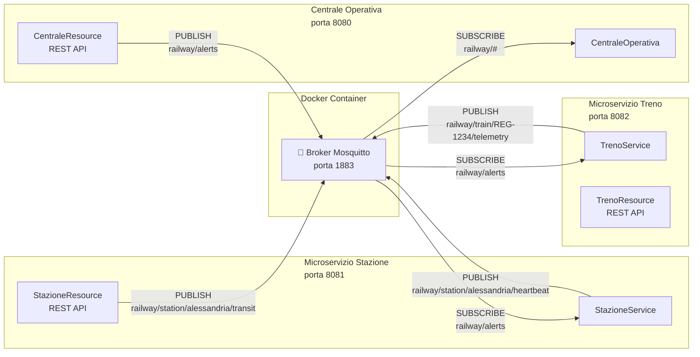
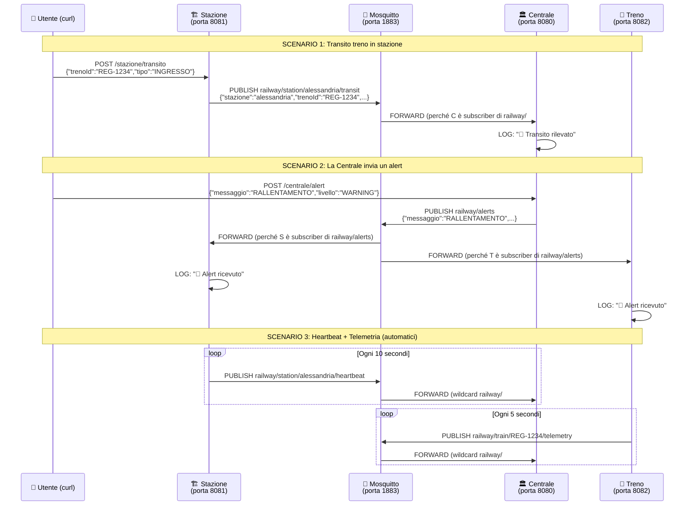

# Marco IMPORTATE
Per i messaggi che i sensori mandano alla stazione si usa rest api invece di mosquitto per le seguenti ragioni
Premessa si deve realizzare la chash 
è più semplice da scivere, assumi sta cosa come vera senza anadre nel profondo che non hai tempo lo fai con rest.
# 🚂 Demo Completa: Mosquitto + Quarkus MQTT

## Architettura del Sistema

Il sistema è composto da **4 componenti** che comunicano tramite il protocollo **MQTT** usando il broker **Mosquitto**:



---

## Come funziona MQTT con Mosquitto

### Cos'è MQTT?

MQTT è un protocollo di messaggistica **publish/subscribe** (pub/sub) leggero, progettato per dispositivi IoT. I concetti chiave sono:

| Concetto | Descrizione |
|----------|------------|
| **Broker** | Server centrale che riceve e smista i messaggi (nel nostro caso **Mosquitto**) |
| **Publisher** | Client che invia (pubblica) messaggi su un **topic** |
| **Subscriber** | Client che si iscrive a un **topic** per ricevere messaggi |
| **Topic** | Stringa gerarchica che identifica il "canale" (es. `railway/station/alessandria/heartbeat`) |
| **Wildcard `#`** | Cattura tutti i sotto-livelli (es. `railway/#` riceve tutto ciò che inizia con `railway/`) |
| **Wildcard `+`** | Cattura un singolo livello (es. `railway/station/+/heartbeat` riceve l'heartbeat di QUALSIASI stazione) |

### Come funziona Quarkus con MQTT?

Quarkus usa l'estensione **SmallRye Reactive Messaging** con il connector **smallrye-mqtt** per integrarsi con MQTT. La configurazione avviene in `application.properties` e il codice usa semplici annotazioni:

| Annotazione | Ruolo | Descrizione |
|------------|-------|-------------|
| `@Outgoing("canale")` | **PUBLISHER** | Il metodo produce messaggi che vengono pubblicati sul topic configurato per quel canale |
| `@Incoming("canale")` | **SUBSCRIBER** | Il metodo consuma messaggi ricevuti dal topic configurato per quel canale |
| `@Channel("canale") + MutinyEmitter` | **PUBLISHER programmatico** | Permette di pubblicare messaggi da qualsiasi punto del codice (es. da un endpoint REST) |

---

## I 3 Microservizi nel Dettaglio

### 1. 🏛️ Centrale Operativa (porta 8080)

> **Ruolo**: Il "cervello" del sistema. Ascolta TUTTO e può inviare comandi a tutti.

#### File principali:

- [CentraleOperativa.java](file:///home/marco/Marco/Uni/Anno_3/reti2/progetto/corretto/codice/MonitoraggioEGestioneDelTrafficoFerroviario/ServeCentraleOperativa/src/main/java/it/uni/reti2/CentraleOperativa.java) — **Subscriber** su `railway/#`
- [CentraleResource.java](file:///home/marco/Marco/Uni/Anno_3/reti2/progetto/corretto/codice/MonitoraggioEGestioneDelTrafficoFerroviario/ServeCentraleOperativa/src/main/java/it/uni/reti2/CentraleResource.java) — **REST + Publisher** su `railway/alerts`
- [application.properties](file:///home/marco/Marco/Uni/Anno_3/reti2/progetto/corretto/codice/MonitoraggioEGestioneDelTrafficoFerroviario/ServeCentraleOperativa/src/main/resources/application.properties) — Configurazione canali MQTT

#### Cosa fa:

```
SUBSCRIBE railway/#  ← riceve TUTTO (heartbeat, transiti, telemetria, alert)
PUBLISH  railway/alerts → invia comandi a tutte le stazioni e treni
```

#### Codice chiave — Subscriber con wildcard:

```java
// In application.properties:
mp.messaging.incoming.railway-in.topic=railway/#    // ← WILDCARD: cattura tutto!

// In CentraleOperativa.java:
@Incoming("railway-in")  // ← collegato al canale sopra
public CompletionStage<Void> processIncomingMessages(Message<byte[]> message) {
    // SmallRye MQTT riceve il messaggio dal broker e invoca questo metodo
    var metadata = message.getMetadata(MqttMessageMetadata.class);
    String topic = metadata.getTopic();   // ← topic esatto (es. railway/station/alessandria/heartbeat)
    String payload = new String(message.getPayload());  // ← contenuto JSON
    // ... smistamento in base al topic ...
    return message.ack();  // ← conferma ricezione al broker
}
```

#### Codice chiave — Publisher via REST:

```java
// In application.properties:
mp.messaging.outgoing.alerts-out.topic=railway/alerts

// In CentraleResource.java:
@Inject @Channel("alerts-out")
MutinyEmitter<String> emitterAlert;   // ← Emitter collegato al canale

@POST @Path("/alert")
public Response inviaAlert(AlertRequest request) {
    emitterAlert.send(json);  // ← pubblica su railway/alerts via Mosquitto
}
```

---

### 2. 🏗️ Stazione (porta 8081)

> **Ruolo**: Simula una stazione ferroviaria. Invia heartbeat periodici e notifiche di transito.

#### File principali:

- [StazioneService.java](file:///home/marco/Marco/Uni/Anno_3/reti2/progetto/corretto/codice/MonitoraggioEGestioneDelTrafficoFerroviario/Stazioni/src/main/java/it/uni/reti2/StazioneService.java) — **Publisher** heartbeat + **Subscriber** alert
- [StazioneResource.java](file:///home/marco/Marco/Uni/Anno_3/reti2/progetto/corretto/codice/MonitoraggioEGestioneDelTrafficoFerroviario/Stazioni/src/main/java/it/uni/reti2/StazioneResource.java) — **REST + Publisher** transito
- [application.properties](file:///home/marco/Marco/Uni/Anno_3/reti2/progetto/corretto/codice/MonitoraggioEGestioneDelTrafficoFerroviario/Stazioni/src/main/resources/application.properties) — Configurazione canali

#### Cosa fa:

```
PUBLISH  railway/station/alessandria/heartbeat  (ogni 10 sec, automatico)
PUBLISH  railway/station/alessandria/transit     (quando chiamato via REST)
SUBSCRIBE railway/alerts                         (riceve comandi dalla Centrale)
```

#### Codice chiave — Publisher periodico con Multi:

```java
@Outgoing("heartbeat-out")  // ← collegato al topic railway/station/alessandria/heartbeat
public Multi<String> generaHeartbeat() {
    return Multi.createFrom()
            .ticks()                              // genera tick crescenti: 0, 1, 2, ...
            .every(Duration.ofSeconds(10))        // ogni 10 secondi
            .map(tick -> {
                // Costruisce il JSON del heartbeat
                return "{\"stazione\":\"alessandria\", \"stato\":\"OPERATIVA\", ...}";
            });
    // SmallRye prende ogni elemento del Multi e lo pubblica su MQTT
}
```

> [!IMPORTANT]
> Il metodo `generaHeartbeat()` restituisce un `Multi<String>` (stream reattivo). Quarkus/SmallRye lo gestisce automaticamente: ogni elemento emesso dal Multi viene pubblicato come messaggio MQTT. Non serve nessun loop o timer manuale!

---

### 3. 🚄 Treno (porta 8082)

> **Ruolo**: Simula un treno in circolazione. Invia telemetria GPS periodica.

#### File principali:

- [TrenoService.java](file:///home/marco/Marco/Uni/Anno_3/reti2/progetto/corretto/codice/MonitoraggioEGestioneDelTrafficoFerroviario/Treni/src/main/java/it/uni/reti2/TrenoService.java) — **Publisher** telemetria + **Subscriber** alert
- [TrenoResource.java](file:///home/marco/Marco/Uni/Anno_3/reti2/progetto/corretto/codice/MonitoraggioEGestioneDelTrafficoFerroviario/Treni/src/main/java/it/uni/reti2/TrenoResource.java) — **REST + Publisher** emergenza
- [application.properties](file:///home/marco/Marco/Uni/Anno_3/reti2/progetto/corretto/codice/MonitoraggioEGestioneDelTrafficoFerroviario/Treni/src/main/resources/application.properties) — Configurazione canali

#### Cosa fa:

```
PUBLISH  railway/train/REG-1234/telemetry  (ogni 5 sec, automatico)
SUBSCRIBE railway/alerts                    (riceve comandi dalla Centrale)
```

---

## Il Broker Mosquitto (Docker)

#### File:
- [docker-compose.yml](file:///home/marco/Marco/Uni/Anno_3/reti2/progetto/corretto/codice/MonitoraggioEGestioneDelTrafficoFerroviario/BrokerMosquitto/docker-compose.yml)
- [mosquitto.conf](file:///home/marco/Marco/Uni/Anno_3/reti2/progetto/corretto/codice/MonitoraggioEGestioneDelTrafficoFerroviario/BrokerMosquitto/config/mosquitto.conf)

Il broker è un container Docker con:
- **Porta 1883**: protocollo MQTT standard (usato dai microservizi)
- **Porta 9001**: WebSocket (per client web/debug)
- **`allow_anonymous true`**: nessuna autenticazione (per la demo)
- **`persistence true`**: salva i messaggi su disco

---

## Flusso di Dati Completo (Esempio)

Ecco cosa succede quando fai una chiamata REST per notificare un transito:



---

## Topic MQTT Utilizzati

| Topic | Chi pubblica | Chi riceve | Contenuto |
|-------|-------------|------------|-----------|
| `railway/station/{id}/heartbeat` | Stazione (periodico) | Centrale (wildcard `#`) | Stato della stazione, timestamp |
| `railway/station/{id}/transit` | Stazione (via REST) | Centrale (wildcard `#`) | ID treno, tipo (INGRESSO/USCITA) |
| `railway/train/{id}/telemetry` | Treno (periodico) | Centrale (wildcard `#`) | GPS, velocità, stato |
| `railway/alerts` | Centrale (via REST) | Stazioni + Treni | Comandi, rallentamenti, emergenze |

---

## Come Eseguire la Demo

### Passo 1: Avvia Mosquitto

```bash
cd BrokerMosquitto
docker-compose up -d
```

### Passo 2: Avvia la Centrale Operativa (terminale 1)

```bash
cd ServeCentraleOperativa
./mvnw quarkus:dev
# → Parte sulla porta 8080
```

### Passo 3: Avvia la Stazione (terminale 2)

```bash
cd Stazioni
./mvnw quarkus:dev
# → Parte sulla porta 8081
# → Inizia subito a inviare heartbeat ogni 10 sec
```

### Passo 4: Avvia il Treno (terminale 3)

```bash
cd Treni
./mvnw quarkus:dev
# → Parte sulla porta 8082
# → Inizia subito a inviare telemetria ogni 5 sec
```

### Passo 5: Testa la comunicazione

```bash
# Vedi i log della Centrale: riceve heartbeat e telemetria automaticamente!

# Simula un transito treno:
curl -X POST http://localhost:8081/stazione/transito \
     -H "Content-Type: application/json" \
     -d '{"trenoId":"REG-1234","tipo":"INGRESSO"}'

# Invia un alert dalla Centrale a TUTTI:
curl -X POST http://localhost:8080/centrale/alert \
     -H "Content-Type: application/json" \
     -d '{"messaggio":"RALLENTAMENTO tratta AL-AT","livello":"WARNING"}'

# Simula un'emergenza treno:
curl -X POST http://localhost:8082/treno/emergenza
```

---

## Riepilogo della Mappatura Annotazioni → MQTT

```
┌──────────────────────────────────────────────────────────────────┐
│  application.properties                                          │
│                                                                  │
│  mp.messaging.outgoing.heartbeat-out.connector=smallrye-mqtt     │
│  mp.messaging.outgoing.heartbeat-out.topic=railway/station/...   │
│       ▲                                                          │
│       │ il nome "heartbeat-out" collega properties ↔ codice      │
│       ▼                                                          │
│  @Outgoing("heartbeat-out")        ← nel codice Java             │
│  public Multi<String> genera() {   ← ogni elemento = 1 msg MQTT │
│      return Multi.createFrom()...                                │
│  }                                                               │
│                                                                  │
│  ─────────────────────────────────────────────────────           │
│                                                                  │
│  mp.messaging.incoming.alerts-in.connector=smallrye-mqtt         │
│  mp.messaging.incoming.alerts-in.topic=railway/alerts            │
│       ▲                                                          │
│       │ il nome "alerts-in" collega properties ↔ codice          │
└──────────────────────────────────────────────────────────────────┘
```

---

## Struttura Finale dei File Creati

```
MonitoraggioEGestioneDelTrafficoFerroviario/
├── BrokerMosquitto/
│   ├── docker-compose.yml              ← Container Mosquitto
│   └── config/mosquitto.conf           ← Configurazione broker
│
├── ServeCentraleOperativa/             ← Microservizio Centrale
│   ├── pom.xml
│   └── src/main/
│       ├── java/it/uni/reti2/
│       │   ├── mqtt/CentraleMqttConsumer.java  ← @Incoming subscriber
│       │   ├── spark/SparkProcessorService.java
│       │   └── entity/
│       │       ├── EventoStazione.java
│       │       └── TelemetriaTreno.java
│       └── resources/
│           └── application.properties  ← Configurazione canali MQTT
│
├── Stazioni/                            ← Microservizio Stazione
│   ├── pom.xml
│   ├── mvnw
│   └── src/main/
│       ├── java/it/uni/reti2/
│       │   ├── StazioneService.java    ← @Outgoing heartbeat + @Incoming alerts
│       │   └── StazioneResource.java   ← REST + @Channel("transit-out") = publisher
│       └── resources/
│           └── application.properties  ← Configurazione canali MQTT
│
└── Treni/                               ← Microservizio Treno
    ├── pom.xml
    ├── mvnw
    └── src/main/
        ├── java/it/uni/reti2/
        │   ├── TrenoService.java       ← @Outgoing telemetria + @Incoming alerts
        │   └── TrenoResource.java      ← REST + emergenza via MQTT
        └── resources/
            └── application.properties  ← Configurazione canali MQTT
```
